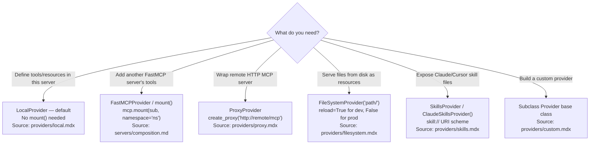
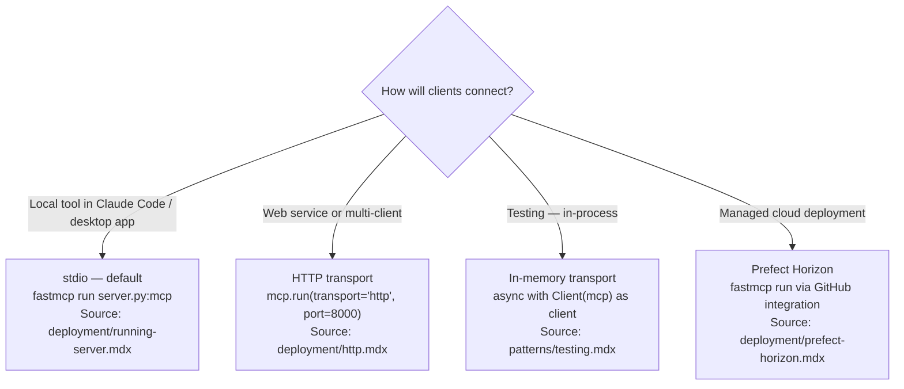
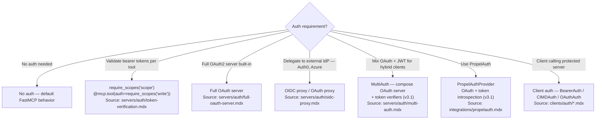

## Current Environment

**Python version:**

!`python3 --version 2>/dev/null || python --version 2>/dev/null || echo "Python not found in PATH"`

**Installed FastMCP version:**

!`uv run python -c "import fastmcp; print(f'FastMCP {fastmcp.__version__}')" 2>/dev/null || echo "FastMCP not installed — run: uv add 'fastmcp>=3.0' before scaffolding"`

---

## Trigger Matrix

When user intent matches, load the reference file listed — do not rely on training data for v3 API facts.

| User intent | v3 feature | Reference file |
|---|---|---|
| Build a new FastMCP server | `FastMCP()`, `@mcp.tool`, `@mcp.resource` | [./references/server-core.md](./references/server-core.md) |
| Compose multiple servers | `mount()`, namespace, providers | [./references/providers.md](./references/providers.md) |
| Bridge remote HTTP server to stdio | `ProxyProvider`, `create_proxy()` | [./references/providers.md](./references/providers.md) |
| Serve files or skills as resources | `FileSystemProvider`, `SkillsProvider` | [./references/providers.md](./references/providers.md) |
| Rename or filter tools from sub-server | `ToolTransform`, `Namespace` | [./references/transforms.md](./references/transforms.md) |
| Expose resources as tools | `ResourcesAsTools` | [./references/transforms.md](./references/transforms.md) |
| Search/discover tools in large catalogs | `BM25SearchTransform`, `RegexSearchTransform` | [./references/transforms.md](./references/transforms.md) |
| Sandbox tool execution via Python scripts | `CodeMode` (experimental) | [./references/transforms.md](./references/transforms.md) |
| Add authentication to a server | `require_scopes`, OAuth variants | [./references/auth.md](./references/auth.md) |
| Mix OAuth + JWT token verifiers | `MultiAuth` | [./references/auth.md](./references/auth.md) |
| Use PropelAuth for auth | `PropelAuthProvider` | [./references/auth.md](./references/auth.md) |
| Write a FastMCP client | `Client`, transports, `BearerAuth` | [./references/client-sdk.md](./references/client-sdk.md) |
| Run long tasks without blocking | `@mcp.tool(task=True)` | [./references/advanced.md](./references/advanced.md) |
| Add multi-turn user input to a tool | Elicitation API | [./references/advanced.md](./references/advanced.md) |
| Deploy to production | Prefect Horizon, HTTP, stdio, nginx | [./references/deployment.md](./references/deployment.md) |
| Deploy behind nginx reverse proxy | SSE config, TLS, subpath mounting | [./references/deployment.md](./references/deployment.md) |
| Write tests for a FastMCP server | In-memory Client, pytest patterns | [./references/testing.md](./references/testing.md) |
| Integrate with Anthropic/OpenAI/FastAPI | Integration patterns | [./references/integrations.md](./references/integrations.md) |
| Migrate from FastMCP v2 | Breaking changes, syntax fixes | [./references/migration.md](./references/migration.md) |
| Add web UI to a server | Apps HTML API, Prefab Apps | [./references/apps.md](./references/apps.md) |
| Return interactive UI from tools | `@mcp.tool(app=True)`, `PrefabApp` | [./references/advanced.md](./references/advanced.md) |
| Add request/response middleware | `Middleware`, built-in middleware | [./references/middleware.md](./references/middleware.md) |
| Find real-world usage patterns | ProxyProvider, mount(), showcase | [./references/real-world-patterns.md](./references/real-world-patterns.md) |
| Evaluate MCP server quality | Evaluation harness, QA pairs | [./references/evaluation-guide.md](./references/evaluation-guide.md) |
| Build interactive app server with UI tools | FastMCPApp, @app.ui(), @app.tool() | [./references/apps.md](./references/apps.md) |
| LLM writes custom UI at runtime | Generative UI | [./references/apps.md](./references/apps.md) |
| Use Keycloak for enterprise auth | KeycloakProvider | [./references/auth.md](./references/auth.md) |
| Install client-only, no server deps | fastmcp-slim | [./references/client-sdk.md](./references/client-sdk.md) |
| Preview app tools in browser without MCP host | fastmcp dev apps | [./references/deployment.md](./references/deployment.md) |
| Add OTEL tracing to a server | OTEL instrumentation | [./references/observability.md](./references/observability.md) |
| Configure persistent cache or OAuth state storage | storage backends | [./references/middleware.md](./references/middleware.md) |

---

## Choose Provider Type



---

## Choose Transport



---

## Choose Auth Approach



---

## Quick-Start Examples [1] [2] [3]

### Minimal server

```python
from fastmcp import FastMCP

mcp = FastMCP("my-server")

@mcp.tool  # RULE: no parentheses — v3 canonical syntax
def greet(name: str) -> str:
    """Return a greeting."""
    return f"Hello, {name}!"

if __name__ == "__main__":
    mcp.run()
```

### Server composition

```python
from fastmcp import FastMCP

weather = FastMCP("weather")
main = FastMCP("main")

main.mount(weather, namespace="weather")
# Tools from weather become weather_<tool-name> on main
```

### Background task

```python
from fastmcp import FastMCP

mcp = FastMCP("task-server")

@mcp.tool(task=True)  # RULE: task=True, NOT task=TaskConfig(...)
async def long_running(data: str) -> str:
    """Process data in background."""
    return "done"
```

**Before deploying**: run in-process pytest using the in-memory `Client` transport ([references/testing.md](./references/testing.md)) before switching to HTTP transport. In-process tests are the fastest signal that tools behave as expected.

---

## v3 API Corrections

CONSTRAINT: These v2 patterns are deprecated or removed. Generate only the v3 form.

| v2 / wrong pattern | v3 correct pattern | Source | Why |
|---|---|---|---|
| `@mcp.tool()` with parentheses | `@mcp.tool` without parentheses | `quickstart.mdx` | v3 unified tool config into constructor kwargs — per-decorator arguments removed |
| `task=TaskConfig(mode="required")` | `task=True` | `servers/tasks.mdx` | TaskConfig replaced by runtime extra dependency |
| `require_auth` | `require_scopes("scope")` | `servers/authorization.mdx` | v3 replaced binary auth flags with granular scope-based access control — `require_scopes()` specifies which scopes are required rather than just checking authentication |
| `.mcpb` packaging | Prefect Horizon or stdio deploy | `deployment/running-server.mdx` | — |
| `ctx.get_state()` / `ctx.set_state()` (synchronous) | `await ctx.get_state()` / `await ctx.set_state()` | `getting-started/upgrading/from-fastmcp-2.md` | State is now session-scoped and backed by a pluggable storage backend — calls must be awaited; the methods exist in v3 but are async |

---

## Version Gating

### FastMCP 3.0 — Available

All core features (tools, resources, prompts, providers, transforms, auth, tasks, elicitation,
client SDK, deployment) are available in FastMCP 3.0.

### FastMCP 3.1 — Available (baseline for this skill's original content)

The following features were added in FastMCP 3.1.0 and require `fastmcp>=3.1.0`:

- **Tool Search transforms** — `BM25SearchTransform`, `RegexSearchTransform` for large tool catalogs
- **CodeMode transform** (experimental) — sandboxed Python execution for tool invocation (`fastmcp[code-mode]`)
- **`transforms=` kwarg** — server-level `FastMCP("name", transforms=[...])` constructor parameter
- **MultiAuth** — compose OAuth server + multiple token verifiers
- **PropelAuth provider** — `PropelAuthProvider` for PropelAuth OAuth + token introspection
- **Prefab Apps** (experimental) — `@mcp.tool(app=True)` with declarative UI components (`fastmcp[apps]`)
- **Google GenAI sampling handler** — alternative to Anthropic/OpenAI sampling
- **`-m/--module` flag** — `fastmcp run -m my_package.server` for module mode
- **`FASTMCP_TRANSPORT`** env var — default transport selection without CLI flag
- **`http_client` parameter** — connection pooling for token verifiers
- **`include_unversioned`** option in VersionFilter
- **`Tool.from_tool()`** — immediate transformation at registration time [4]

### FastMCP 3.2 — Available (released 2026-03-30)

The following features were added in FastMCP 3.2 and require `fastmcp>=3.2.0`:

- **FastMCPApp** — provider class for building interactive applications inside MCP; separates LLM-visible UI entry points (`@app.ui()`) from backend tools (`@app.tool()`)
- **Generative UI** — LLM writes Prefab Python code at runtime instead of calling a pre-built tool with a fixed shape
- **`fastmcp dev apps`** — browser preview for app tools without an MCP host
- **KeycloakAuthProvider** — secure a FastMCP server with Keycloak OAuth; Docker-based local setup with pre-configured `fastmcp` realm
- **`run_in_thread=False`** on `@mcp.tool()` — opt sync tools out of the default threadpool dispatch for thread-affine libraries
- **`ssl verify` parameter** on `Client` — SSL certificate configuration for development with self-signed certs
- **`client_log_level` parameter** on `Client` — control client-side log verbosity
- **`ResponseCachingMiddleware` token-partitioning security fix** (v3.2.2) — cache now partitioned by access token; upgrade required for deployments with multiple users [5]

### FastMCP 3.3 — Available (released 2026-05-15)

The following features were added in FastMCP 3.3 and require `fastmcp>=3.3.0`:

- **fastmcp-slim** — client-only distribution; install `fastmcp-slim[client]` for consumers who only need the FastMCP client without the full server framework; import namespace is identical (`from fastmcp import Client`)
- **Storage backends** — persistent cache and OAuth state storage backends [6]

---

## Reference Files

All v3 reference files sourced from <https://gofastmcp.com> (published docs) and <https://github.com/jlowin/fastmcp> (source code):

- [./references/server-core.md](./references/server-core.md) — `FastMCP()`, tools, resources, prompts, context, lifespan, `transforms=` kwarg
- [./references/providers.md](./references/providers.md) — LocalProvider, FastMCPProvider, ProxyProvider, FileSystemProvider, SkillsProvider
- [./references/transforms.md](./references/transforms.md) — Namespace, ToolTransform, Enabled, ResourcesAsTools, PromptsAsTools, BM25SearchTransform, RegexSearchTransform, CodeMode
- [./references/auth.md](./references/auth.md) — `require_scopes`, OAuth variants, token verification, MultiAuth, PropelAuth, `http_client` pooling
- [./references/client-sdk.md](./references/client-sdk.md) — `Client`, transports, BearerAuth, CIMD, OAuth, sampling, elicitation, `fastmcp discover`, fuzzy matching
- [./references/apps.md](./references/apps.md) — FastMCPApp provider class, Generative UI, low-level HTML API, Prefab Apps
- [./references/advanced.md](./references/advanced.md) — tasks, elicitation, storage backends, dependency injection, versioning, visibility, Prefab Apps, Google GenAI sampling
- [./references/middleware.md](./references/middleware.md) — Middleware base class, hook hierarchy, 11 built-in middleware, tag-based access control
- [./references/deployment.md](./references/deployment.md) — stdio, HTTP, server config, Prefect Horizon, nginx reverse proxy, module mode, `FASTMCP_TRANSPORT`
- [./references/testing.md](./references/testing.md) — in-memory Client, FastMCPTransport, pytest patterns, inline-snapshot
- [./references/integrations.md](./references/integrations.md) — Anthropic, OpenAI, Gemini, Google GenAI, FastAPI, GitHub, Auth0, Azure, PropelAuth, Claude Code
- [./references/migration.md](./references/migration.md) — v2 → v3 breaking changes, from MCP SDK
- [./references/observability.md](./references/observability.md) — OTEL instrumentation, automatic spans, OTLP exporters, environment variable configuration
- [./references/real-world-patterns.md](./references/real-world-patterns.md) — ProxyProvider, mount(), SkillsProvider, showcase

Preserved references (not overwritten):

- [./references/evaluation-guide.md](./references/evaluation-guide.md) — evaluating server quality
- [./references/typescript-mcp-server.md](./references/typescript-mcp-server.md) — TypeScript MCP SDK (out of v3 overhaul scope)
- [./references/claude-code-mcp-integration.md](./references/claude-code-mcp-integration.md) — `.mcp.json` config, Claude Code deployment

---

## Related Skills

- For pytest patterns and in-memory testing fixtures:
  `Skill(skill: "fastmcp-creator:fastmcp-python-tests")`
- For `fastmcp list` / `fastmcp call` / `fastmcp discover` CLI usage:
  `Skill(skill: "fastmcp-creator:fastmcp-client-cli")`
- For Python project setup (pyproject.toml, uv, src layout):
  `Skill(skill: "python3-development:python3-development")`
- For evaluating MCP server quality: [./references/evaluation-guide.md](./references/evaluation-guide.md)
- For Claude Code MCP config (`.mcp.json`): [./references/claude-code-mcp-integration.md](./references/claude-code-mcp-integration.md)

## References

1. servers/server.mdx + servers/tools.mdx (accessed 2026-03-05)
2. servers/providers/mounting.mdx (accessed 2026-03-05)
3. servers/tasks.mdx — requires fastmcp[tasks] extra (accessed 2026-03-05)
4. [Fastmcp](https://github.com/jlowin/fastmcp) releases v3.1.0, v3.1.1 (accessed 2026-05-23)
5. [Fastmcp](https://github.com/jlowin/fastmcp) releases v3.2.x (accessed 2026-05-23)
6. [Fastmcp](https://github.com/jlowin/fastmcp) releases v3.3.x (accessed 2026-05-23)
