# Frontend Knowledge Tree Proposal Plan (Kế hoạch Cây Tri thức Frontend)

- **Source Roadmap:** https://roadmap.sh/frontend
- **Target Subject:** `WEB_DEV` (Web Development)
- **Target Field:** `ASE` (Algorithms & Software Engineering) & `HCC` (Human-Centered Computing)

---

## 🏛️ Cấu trúc Phân cấp 5 Tầng (5-Level Hierarchy Structure)

```mermaid
graph TD
    F1["Field: ASE / HCC"] --> S1["Subject: WEB_DEV (Web Development)"]
    
    S1 --> C1["Category: WEB_FUNDAMENTALS<br/><i>(Nền tảng Web & Mạng)</i>"]
    S1 --> C2["Category: WEB_STYLING<br/><i>(Thiết kế & Bố cục Giao diện UI)</i>"]
    S1 --> C3["Category: WEB_PROGRAMMING<br/><i>(Lập trình Frontend & Thao tác DOM)</i>"]
    S1 --> C4["Category: WEB_TOOLING<br/><i>(Công cụ & Quản lý Phụ thuộc)</i>"]
    S1 --> C5["Category: WEB_FRAMEWORKS<br/><i>(Mô hình Component & Frameworks)</i>"]
    S1 --> C6["Category: WEB_TESTING<br/><i>(Kiểm thử & Chất lượng Phần mềm)</i>"]
    S1 --> C7["Category: WEB_SECURITY<br/><i>(Bảo mật Web & Mã hóa)</i>"]

    C1 --> T1["Topic: NETWORKING_BASICS"]
    T1 --> CON1["Concept: INTERNET_FUNDAMENTALS"]
    T1 --> CON2["Concept: HTTP_PROTOCOL"]
    T1 --> CON3["Concept: DOMAIN_NAME_SYSTEM"]
    T1 --> CON4["Concept: WEB_HOSTING"]
    T1 --> CON5["Concept: WEB_BROWSER_ENGINES"]

    C2 --> T2["Topic: UI_LAYOUT_MODELS"]
    T2 --> CON6["Concept: UI_BOX_MODEL_LAYOUT"]
    T2 --> CON7["Concept: FLEXBOX_GRID_LAYOUT"]
    T2 --> CON8["Concept: RESPONSIVE_DESIGN"]

    C3 --> T3["Topic: JAVASCRIPT_CORE"]
    T3 --> CON9["Concept: DOM_MANIPULATION"]
    T3 --> CON10["Concept: ASYNC_JAVASCRIPT"]
    T3 --> CON11["Concept: EVENT_LOOP"]

    C4 --> T4["Topic: FRONTEND_TOOLING"]
    T4 --> CON12["Concept: PACKAGE_MANAGEMENT<br/><i>Keywords: npm, yarn, pnpm</i>"]
    T4 --> CON13["Concept: MODULE_BUNDLERS<br/><i>Keywords: Vite, Webpack, Rollup</i>"]
    T4 --> CON14["Concept: CODE_LINTING_FORMATTING<br/><i>Keywords: ESLint, Prettier</i>"]

    C5 --> T5["Topic: COMPONENT_ARCHITECTURE"]
    T5 --> CON15["Concept: FRONTEND_FRAMEWORKS<br/><i>Keywords: React, Vue, Angular, Svelte</i>"]
    T5 --> CON16["Concept: STATE_MANAGEMENT_PATTERNS"]

    C6 --> T6["Topic: SOFTWARE_TESTING"]
    T6 --> CON17["Concept: AUTOMATED_TESTING_TOOLS<br/><i>Keywords: Jest, Vitest, Cypress, Playwright</i>"]

    C7 --> T7["Topic: WEB_SECURITY_PRINCIPLES"]
    T7 --> CON18["Concept: CROSS_ORIGIN_SECURITY<br/><i>Keywords: CORS</i>"]
    T7 --> CON19["Concept: WEB_AUTHENTICATION_STRATEGIES<br/><i>Keywords: JWT, OAuth, Cookies</i>"]
```

---

## 📐 Danh mục Các Nút Khái niệm Trừu tượng (Proposed Abstract Concepts)

| Cấp 3: Category | Cấp 4: Topic | Cấp 5: Abstract Concept Code | Tên Khái niệm (Danh từ) | Keywords / Công cụ cụ thể (Dành cho SIO) |
|---|---|---|---|---|
| `WEB_FUNDAMENTALS` | `NETWORKING_BASICS` | `INTERNET_FUNDAMENTALS` | Internet Architecture & Protocols | Client-Server Model, IP, Packet Routing |
| `WEB_FUNDAMENTALS` | `NETWORKING_BASICS` | `HTTP_PROTOCOL` | HTTP Protocol & Specification | HTTP/1.1, HTTP/2, HTTP/3, Headers, Verbs |
| `WEB_FUNDAMENTALS` | `NETWORKING_BASICS` | `DOMAIN_NAME_SYSTEM` | Domain Name System (DNS) | A Record, CNAME, Nameserver |
| `WEB_FUNDAMENTALS` | `NETWORKING_BASICS` | `WEB_HOSTING` | Web Hosting & Infrastructure | Server, CDN, Edge Computing |
| `WEB_FUNDAMENTALS` | `NETWORKING_BASICS` | `WEB_BROWSER_ENGINES` | Browser Architecture & Rendering Engines | DOM Tree, CSSOM, Render Tree, Reflow, Repaint |
| `WEB_STYLING` | `UI_LAYOUT_MODELS` | `UI_BOX_MODEL_LAYOUT` | UI Box Model Layout System | Margin, Border, Padding, Content, `box-sizing` |
| `WEB_STYLING` | `UI_LAYOUT_MODELS` | `FLEXBOX_GRID_LAYOUT` | Flexible & Grid Layout Systems | Flexbox, CSS Grid, Alignment |
| `WEB_STYLING` | `UI_LAYOUT_MODELS` | `RESPONSIVE_DESIGN` | Responsive Web Design Principles | Media Queries, Breakpoints, Fluid Layouts |
| `WEB_PROGRAMMING` | `JAVASCRIPT_CORE` | `DOM_MANIPULATION` | Document Object Model Manipulation | DOM Nodes, Event Listeners, Query Selectors |
| `WEB_PROGRAMMING` | `JAVASCRIPT_CORE` | `ASYNC_JAVASCRIPT` | Asynchronous Programming Patterns | Promises, async/await, Fetch API |
| `WEB_PROGRAMMING` | `JAVASCRIPT_CORE` | `EVENT_LOOP` | JavaScript Event Loop & Task Queue | Microtasks, Macrotasks, Call Stack |
| `WEB_TOOLING` | `FRONTEND_TOOLING` | `PACKAGE_MANAGEMENT` | Package & Dependency Management | **npm, yarn, pnpm, pip, conda, uv** |
| `WEB_TOOLING` | `FRONTEND_TOOLING` | `MODULE_BUNDLERS` | Module Bundlers & Build Tools | **Vite, Webpack, Rollup, Parcel, esbuild** |
| `WEB_TOOLING` | `FRONTEND_TOOLING` | `CODE_LINTING_FORMATTING` | Code Formatting & Static Analysis | **ESLint, Prettier** |
| `WEB_TOOLING` | `FRONTEND_TOOLING` | `VCS_HOSTING` | Version Control Hosting Platforms | **GitHub, GitLab, Bitbucket** |
| `WEB_FRAMEWORKS` | `COMPONENT_ARCHITECTURE` | `FRONTEND_FRAMEWORKS` | UI Component Frameworks & Libraries | **React, Vue.js, Angular, Svelte, Solid JS** |
| `WEB_FRAMEWORKS` | `COMPONENT_ARCHITECTURE` | `STATE_MANAGEMENT_PATTERNS` | State Management Patterns | Redux, Zustand, Vuex, Pinia, Context API |
| `WEB_TESTING` | `SOFTWARE_TESTING` | `AUTOMATED_TESTING_TOOLS` | Automated Testing Frameworks & Tools | **Jest, Vitest, Cypress, Playwright** |
| `WEB_SECURITY` | `WEB_SECURITY_PRINCIPLES` | `CROSS_ORIGIN_SECURITY` | Cross-Origin Security & Policies | **CORS**, Same-Origin Policy |
| `WEB_SECURITY` | `WEB_SECURITY_PRINCIPLES` | `WEB_AUTHENTICATION_STRATEGIES` | Web Authentication & Authorization | **JWT, OAuth2, Session Cookies, WebAuthn** |

---

## 🛠️ Phân định Công cụ Cụ thể (Concrete Tool Disambiguation)

Theo đúng quy tắc kiến trúc, các công cụ cụ thể dưới đây **KHÔNG ĐƯỢC ĐƯA LÀM CONCEPT ĐỘC LẬP**, mà được lưu vào cột **`keywords` / `metadata`** của Concept mẹ để dành cho việc sinh **SIO (Specific Implementation Objectives)**:

1. **Package Managers:** `npm`, `yarn`, `pnpm` $\rightarrow$ Nằm dưới Concept `PACKAGE_MANAGEMENT`
2. **Build Tools:** `Vite`, `Webpack`, `Rollup`, `Parcel`, `esbuild` $\rightarrow$ Nằm dưới Concept `MODULE_BUNDLERS`
3. **Frontend Frameworks:** `React`, `Vue.js`, `Angular`, `Svelte`, `Solid JS` $\rightarrow$ Nằm dưới Concept `FRONTEND_FRAMEWORKS`
4. **Testing Tools:** `Jest`, `Vitest`, `Cypress`, `Playwright` $\rightarrow$ Nằm dưới Concept `AUTOMATED_TESTING_TOOLS`
5. **Code Formatters:** `ESLint`, `Prettier` $\rightarrow$ Nằm dưới Concept `CODE_LINTING_FORMATTING`
6. **VCS Hostings:** `GitHub`, `GitLab`, `Bitbucket` $\rightarrow$ Nằm dưới Concept `VCS_HOSTING`
