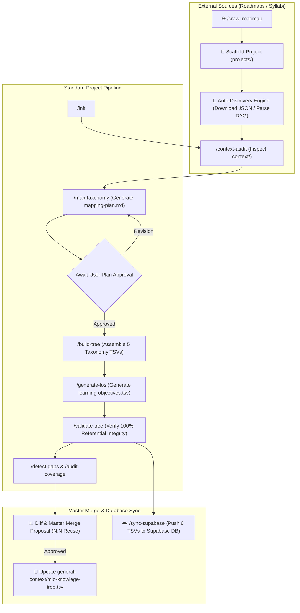

# Universal Agentic Knowledge Tree Pipeline

🌐 **Language / Ngôn ngữ:** **[English](README.md)** | [Tiếng Việt](README.vi.md)

[](LICENSE)
[](https://www.python.org/downloads/)
[](CODE_OF_CONDUCT.md)
[](CONTRIBUTING.md)

An agentic automation framework for constructing, validating, and managing educational **Knowledge Trees** across certifications, courses, and technology roadmaps. Driven by **Agentic Workflows (slash commands)**, the system combines LLM intelligence for syllabus mapping with deterministic Python scripts for data integrity, validation, and database synchronization.

---

## 🏛️ Core Architecture & Design Principles

- **R1 (Final-Only Output):** The `projects/<project-slug>/output/` directory strictly contains 6 validated TSV artifacts that pass 100% referential integrity checks:
  `fields.tsv`, `subjects.tsv`, `categories.tsv`, `topics.tsv`, `concepts.tsv`, `learning-objectives.tsv`.
- **R2 (Project-First Paradigm for Roadmap Crawling):** External roadmaps (e.g., `roadmap.sh`) automatically scaffold an independent project under `projects/`, utilize an **Auto-Discovery Engine** to parse raw graph JSON, and run standard validation before proposing a merge into the Master Knowledge Tree (`general-context/mlo-knowlege-tree.tsv`).
- **R3 (N:N Reuse Topology First):** Maximize reuse of existing Categories/Topics/Subjects in the Master Tree via Many-to-Many comma-separated relationships (`,`), avoiding redundant node creation.
- **R4 (LLM Boundary):** LLMs perform domain research (`context-audit`), objective extraction (`generate-los`), and taxonomy mapping (`map-taxonomy`). File scaffolding, TSV assembly, and error validation are 100% deterministic Python scripts.
- **R5 (File is State):** All intermediate state is stored in `.work/`. Active project state (`active_project`) is tracked in `status.yaml`.

---

## 📂 Repository Directory Structure

```text
knowledge-tree/
├── .github/                                # GitHub issue templates & PR guidelines
│   ├── ISSUE_TEMPLATE/                     # Templates for Bug Reports & Taxonomy Proposals
│   └── PULL_REQUEST_TEMPLATE.md
├── .agents/                                # Agent definitions, rules, and skills
│   ├── RULES.md
│   ├── AGENTS.md
│   ├── workflows/                          # Slash command markdown contracts
│   │   ├── init.md
│   │   ├── set-project.md
│   │   ├── crawl-roadmap.md
│   │   ├── context-audit.md
│   │   ├── map-taxonomy.md
│   │   ├── build-tree.md
│   │   ├── generate-los.md
│   │   ├── detect-gaps.md
│   │   ├── validate-tree.md
│   │   ├── validate-master-tree.md
│   │   ├── audit-coverage.md
│   │   └── sync-supabase.md
│   └── skills/
│       ├── project-context-loader/
│       ├── taxonomy-mapper/
│       │   ├── scripts/parse_master_tree.py
│       │   ├── scripts/query_master_tree.py
│       │   └── resources/master_tree.json
│       ├── roadmap-aligner/                # Auto-Discovery Engine & Master Merge
│       │   ├── scripts/crawl_roadmap_align.py
│       │   ├── scripts/tree_diff.py
│       │   └── scripts/apply_plan_to_staging.py
│       ├── tree-assembler/
│       │   └── scripts/assemble_project.py
│       ├── learning-objective-generator/
│       │   └── scripts/llm_extract_lo.py
│       ├── tree-validator/
│       │   ├── scripts/scaffold_tree.py
│       │   ├── scripts/validate_tree.py
│       │   ├── scripts/validate_master_tree.py
│       │   ├── scripts/detect_gaps.py
│       │   └── scripts/audit_coverage.py
│       └── supabase-sync/
│           └── scripts/sync_to_supabase.py
│
├── general-context/                        # Master Knowledge Tree Staging Copy
│   ├── mlo-knowlege-tree.tsv              # Global Master Knowledge Tree TSV
│   └── version_history.json               # Release & version history
│
├── projects/                               # Independent project knowledge trees
│   └── <project-slug>/                     # E.g. roadmap_sh_python, swift-associate
│       ├── context/                        # Source context (syllabus.md, raw_roadmap.json, etc.)
│       ├── .work/                          # Intermediate working files (mapping-plan.md, etc.)
│       ├── .tree-validator/                # Validation reports and fix logs
│       └── output/                         # 6 final TSV artifacts (R1)
│
├── CODE_OF_CONDUCT.md                      # Contributor Covenant Code of Conduct
├── CONTRIBUTING.md                         # Contribution guidelines & validation steps
├── LICENSE                                 # MIT Open Source License
├── SECURITY.md                             # Security policy & vulnerability reporting
└── status.yaml                             # Active project tracking & validation status
```

---

## 🔄 Agent Workflows & Pipeline Flowchart



---

## 📋 Slash Commands Reference Table

| Command | Skill Owner | Uses LLM? | Primary Function / Result |
|---|---|---|---|
| `/init <project>` | `scaffolder` | ❌ | Scaffold project structure under `projects/<slug>/` and 6 TSV headers |
| `/set-project` | `coordinator` | ❌ | Update `active_project` in `status.yaml` |
| `/crawl-roadmap <url>` | `@roadmap-aligner` | ✅ | Scaffold project, crawl graph JSON, run standard pipeline & propose master merge |
| `/context-audit` | `@context-analyzer` | ✅ | Inspect syllabus in `context/` $\rightarrow$ `.work/context-audit.md` |
| `/map-taxonomy` | `@taxonomy-mapper` | ✅ | Cross-reference syllabus with Master Tree $\rightarrow$ `.work/mapping-plan.md` |
| `/build-tree` | `@tree-assembler` | ❌ | Assemble 5 taxonomy TSV files (`fields` $\rightarrow$ `concepts`) from mapping plan |
| `/generate-los` | `@tree-assembler` | ✅ | Generate grounded `learning-objectives.tsv` (ULO, CIO, SIO) |
| `/detect-gaps` | `@tree-validator` | ❌ | Detect Missing LOs, Shallow CIOs, and Master Candidates |
| `/validate-tree` | `@tree-validator` | ❌ | Enforce 100% Referential Integrity PASS $\rightarrow$ `.tree-validator/reports/` |
| `/validate-master-tree` | `@tree-validator` | ❌ | Enforce Referential Integrity & Collision checks for Master Tree TSVs |
| `/audit-coverage` | `@tree-validator` | ❌ | Perform Reverse Coverage Audit against source syllabus |
| `/sync-supabase` | `@tree-assembler` | ❌ | Synchronize 6 validated TSV files to Supabase Cloud DB |

---

## 🛠️ Developer CLI Reference

```bash
# 1. Scaffold a new project
python3 .agents/skills/tree-validator/scripts/scaffold_tree.py <project-slug>

# 2. Crawl & analyze JSON graph from roadmap.sh
python3 .agents/skills/roadmap-aligner/scripts/crawl_roadmap_align.py https://roadmap.sh/backend --project roadmap_sh_backend

# 3. Assemble 5 taxonomy TSVs from mapping plan
python3 .agents/skills/tree-assembler/scripts/assemble_project.py --project <project-slug> --source mapping-plan

# 4. Validate project referential integrity
python3 .agents/skills/tree-validator/scripts/validate_tree.py --project <project-slug>

# 5. Validate Master Tree referential integrity & collisions
python3 .agents/skills/tree-validator/scripts/validate_master_tree.py --tsv general-context/mlo-knowlege-tree.tsv

# 6. Generate Master Tree diff report
python3 .agents/skills/roadmap-aligner/scripts/tree_diff.py

# 7. Apply staging changes to Master Tree
python3 .agents/skills/roadmap-aligner/scripts/apply_plan_to_staging.py

# 8. Sync 6 TSV artifacts to Supabase Database
python3 .agents/skills/supabase-sync/scripts/sync_to_supabase.py --project <project-slug>
```

---

## 🤝 Community & Contributing

We welcome contributions from the community! Whether you want to propose new taxonomy nodes, refine validation scripts, or submit new course roadmaps:

- **Contribution Guidelines:** Read [CONTRIBUTING.md](CONTRIBUTING.md).
- **Code of Conduct:** Read [CODE_OF_CONDUCT.md](CODE_OF_CONDUCT.md).
- **Security Policy:** Read [SECURITY.md](SECURITY.md).

## 📜 License

Distributed under the open-source [MIT License](LICENSE).
