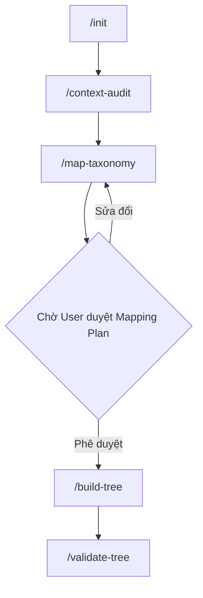

# Universal Agentic Knowledge Tree Pipeline

Hệ thống xây dựng và tự động hóa Khung tri thức (Knowledge Tree) cho các chứng chỉ và môn học, vận hành thông qua **Agentic Workflows (slash commands)**. Hệ thống kết hợp sự linh hoạt của LLM trong việc đối chiếu syllabus và tính chính xác (deterministic) của script Python trong việc quản lý dữ liệu.

## Kiến trúc cốt lõi

- **R1 (Final-only output):** Thư mục `output/` của mỗi dự án chỉ chứa đúng 6 file TSV artifact (`fields.tsv`, `subjects.tsv`, `categories.tsv`, `topics.tsv`, `concepts.tsv`, `learning-objectives.tsv`) đã vượt qua vòng kiểm định.
- **R2 (LLM boundary):** LLM chỉ được dùng cho quá trình research (đọc tài liệu nguồn) + đối chiếu (map với Master Tree). Quá trình ghi TSV và kiểm tra lỗi (validate) do script Python đảm nhiệm 100%.
- **R3 (File is state):** Mọi trạng thái trung gian (như kế hoạch đối chiếu) được lưu tại `.work/`. Trạng thái dự án đang active được quản lý tại `status.yaml`.
- **Canonical agents:** Thư mục `.agents/` là bộ não của pipeline, chứa các quy tắc (`RULES.md`), hợp đồng workflow và công cụ (skills) cho từng Agent.

## Cấu trúc thư mục

```text
knowledge-tree/
├── .agents/
│   ├── RULES.md
│   ├── agents.md
│   ├── workflows/
│   │   ├── set-project.md
│   │   ├── context-audit.md
│   │   ├── map-taxonomy.md
│   │   ├── build-tree.md
│   │   └── validate-tree.md
│   ├── resources/
│   └── skills/
│       ├── project-context-loader/
│       ├── taxonomy-mapper/
│       │   ├── scripts/parse_master_tree.py
│       │   └── resources/mlo-knowlege-tree.tsv  # Master Truth Data
│       ├── tree-assembler/
│       └── tree-validator/
│           ├── scripts/scaffold_tree.py
│           └── scripts/validate_tree.py
│
├── projects/
│   └── <project-slug>/
│       ├── context/             # Syllabus, PDF tài liệu nguồn
│       ├── .work/               # Nơi chứa context-audit.md, mapping-plan.md
│       ├── .tree-validator/     # Log kiểm định, backup TSV
│       └── output/              # 6 file TSV thành phẩm (R1)
│
└── status.yaml                  # Chứa active_project và status
```

## Luồng slash commands (Workflows)



### Bảng lệnh chi tiết

| Command | Trách nhiệm | LLM? | File sinh ra / cập nhật |
|---|---|---|---|
| `/init <project>` | `scaffolder` | ❌ | Tạo cấu trúc thư mục, cập nhật `status.yaml` |
| `/set-project` | `coordinator` | ❌ | Cập nhật `active_project` |
| `/context-audit` | `@context-analyzer` | ✅ | Đọc `context/` -> `.work/context-audit.md` |
| `/map-taxonomy` | `@taxonomy-mapper` | ✅ | Đối chiếu Master Tree -> `.work/mapping-plan.md` |
| `/build-tree` | `@tree-assembler` | ❌ | Ghi dữ liệu vào `output/*.tsv` |
| `/validate-tree` | `@tree-validator` | ❌ | Chạy script kiểm định -> `.tree-validator/` |

## Helper dành cho phát triển

```bash
# Scaffold dự án mới
python3 .agents/skills/tree-validator/scripts/scaffold_tree.py <project-slug>

# Parse Master Tree TSV sang JSON để LLM đọc dễ hơn (tuỳ chọn)
python3 .agents/skills/taxonomy-mapper/scripts/parse_master_tree.py

# Validate & Tự động sửa lỗi
python3 .agents/skills/tree-validator/scripts/validate_tree.py --project <project-slug> --fix
```
