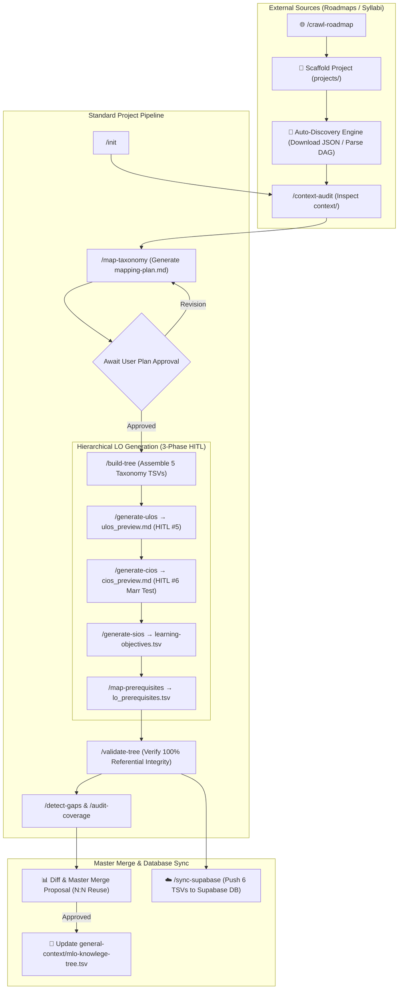

# Universal Agentic Knowledge Tree Pipeline

🌐 **Language / Ngôn ngữ:** **[English](README.md)** | [Tiếng Việt](README.vi.md)

[](LICENSE)
[](https://www.python.org/downloads/)
[](CODE_OF_CONDUCT.md)
[](CONTRIBUTING.md)

An agentic automation framework for constructing, validating, and managing educational **Knowledge Trees** across certifications, courses, and technology roadmaps. Driven by **Agentic Workflows (slash commands)**, the system combines LLM intelligence for syllabus mapping with deterministic Python scripts for data integrity, validation, and database synchronization.

---

## 🏛️ Core Architecture & Design Principles

- **R1 (Final-Only Output):** The `projects/<project-slug>/output/` directory strictly contains 6 validated TSV artifacts that pass 100% referential integrity checks:
  `fields.tsv`, `subjects.tsv`, `categories.tsv`, `topics.tsv`, `concepts.tsv`, `learning-objectives.tsv`.
- **R2 (Project-First Paradigm for Roadmap Crawling):** External roadmaps (e.g., `roadmap.sh`) automatically scaffold an independent project under `projects/`, utilize an **Auto-Discovery Engine** to parse raw graph JSON, and run standard validation before proposing a merge into the Master Knowledge Tree (`general-context/mlo-knowlege-tree.tsv`).
- **R3 (N:N Reuse Topology First):** Maximize reuse of existing Categories/Topics/Subjects in the Master Tree via Many-to-Many comma-separated relationships (`,`), avoiding redundant node creation.
- **R4 (LLM Boundary):** LLMs perform domain research (`context-audit`), objective extraction (`generate-los`), and taxonomy mapping (`map-taxonomy`). File scaffolding, TSV assembly, and error validation are 100% deterministic Python scripts.
- **R5 (File is State):** All intermediate state is stored in `.work/`. Active project state (`active_project`) is tracked in `status.yaml`.

---

## 📂 Repository Directory Structure

```text
knowledge-tree/
├── .github/                                # GitHub issue templates & PR guidelines
│   ├── ISSUE_TEMPLATE/                     # Templates for Bug Reports & Taxonomy Proposals
│   └── PULL_REQUEST_TEMPLATE.md
├── .agents/                                # Agent definitions, rules, and skills
│   ├── RULES.md
│   ├── AGENTS.md
│   ├── workflows/                          # Slash command markdown contracts (22 files)
│   │   ├── init.md
│   │   ├── set-project.md
│   │   ├── crawl-roadmap.md
│   │   ├── context-audit.md
│   │   ├── map-taxonomy.md
│   │   ├── build-tree.md
│   │   ├── generate-ulos.md                # Phase A: ULO generation
│   │   ├── generate-cios.md                # Phase B: CIO generation + Marr Test
│   │   ├── generate-sios.md                # Phase C: SIO generation + merge
│   │   ├── generate-los.md                 # Legacy 1-shot (deprecated)
│   │   ├── map-prerequisites.md            # Phase E: ADR-0005 prerequisite DAG
│   │   ├── detect-gaps.md
│   │   ├── validate-tree.md
│   │   ├── validate-master-tree.md
│   │   ├── audit-coverage.md
│   │   ├── sync-supabase.md
│   │   ├── scaffold-keywords.md            # ATE Pipeline
│   │   ├── extract-terms.md
│   │   ├── verify-terms.md
│   │   ├── finalize-keywords.md
│   │   ├── escalate-concepts.md
│   │   └── run-pipeline.md                 # Full HITL pipeline (7 checkpoints)
│   └── skills/
│       ├── project-context-loader/
│       ├── taxonomy-mapper/
│       │   ├── scripts/parse_master_tree.py
│       │   ├── scripts/query_master_tree.py
│       │   └── resources/master_tree.json
│       ├── roadmap-aligner/                # Auto-Discovery Engine & Master Merge
│       │   ├── scripts/crawl_roadmap_align.py
│       │   ├── scripts/tree_diff.py
│       │   └── scripts/apply_plan_to_staging.py
│       ├── tree-assembler/
│       │   └── scripts/assemble_project.py
│       ├── learning-objective-generator/
│       │   ├── scripts/llm_generate_hierarchical_lo.py
│       │   └── scripts/llm_map_prerequisites.py
│       ├── tree-validator/
│       │   ├── scripts/scaffold_tree.py
│       │   ├── scripts/validate_tree.py
│       │   ├── scripts/validate_master_tree.py
│       │   ├── scripts/detect_gaps.py
│       │   └── scripts/audit_coverage.py
│       ├── keyword-extractor/
│       │   ├── scripts/chunk_source.py
│       │   ├── scripts/gen_statistical_candidates.py
│       │   ├── scripts/llm_gen_candidates.py
│       │   ├── scripts/filter_by_relevance.py
│       │   ├── scripts/llm_verify_and_dedup.py
│       │   ├── scripts/export_keywords.py
│       │   └── scripts/llm_escalate_concepts.py
│       └── supabase-sync/
│           └── scripts/sync_to_supabase.py
│
├── kt_mcp/                                 # FastMCP v3 Multi-Server Hub (actual path)
│   ├── main.py                             # FastMCP Hub entrypoint (mounts all sub-servers)
│   ├── README.md                           # FastMCP Server & Tools documentation
│   ├── server.py                           # Unified server
│   └── servers/                            # Sub-MCP Servers
│       ├── kt_server.py                    # Knowledge Tree Tools (kt_*)
│       └── system_server.py                # System Ops & Resources (sys_*)
│
├── docs/                                   # Documentation & Instructions
│   ├── adr/                                # Architecture Decision Records
│   │   ├── adr-0005-domain-partitioned-concept-dag-prerequisite-mapping.md
│   │   └── ...
│   ├── instructions/                       # Step-by-step developer guides
│   │   ├── how-to-add-new-mcp-server.md
│   │   └── ci-cd-deployment.md
│   └── reports/                            # Audit & integration reports
│       ├── 2026-07-29-audit-report-agents.md
│       └── 2026-07-29-mcp-agents-integration-audit.md
│
├── .github/
│   └── workflows/
│       └── deploy.yml                      # CI/CD pipeline (Deploys to Oracle VM on stable branch)
│
├── general-context/                        # Master Knowledge Tree Staging Copy
│   ├── mlo-knowlege-tree.tsv              # Global Master Knowledge Tree TSV
│   └── version_history.json               # Release & version history
│
├── projects/                               # Independent project knowledge trees
│   └── <project-slug>/                     # E.g. roadmap_sh_python, swift-associate
│       ├── context/                        # Source context (syllabus.md, raw_roadmap.json, etc.)
│       ├── .work/                          # Intermediate working files (mapping-plan.md, etc.)
│       ├── .tree-validator/                # Validation reports and fix logs
│       └── output/                         # 6 final TSV artifacts (R1)
│
├── Dockerfile                              # Container definition for FastMCP Hub
├── docker-compose.yml                      # Docker compose service definition (port 8888:8000)
├── pyproject.toml                          # Python project dependencies
├── .mcp.json                               # MCP client configuration for AI IDEs / Agents
├── CODE_OF_CONDUCT.md                      # Contributor Covenant Code of Conduct
├── CONTRIBUTING.md                         # Contribution guidelines & validation steps
├── LICENSE                                 # MIT Open Source License
├── SECURITY.md                             # Security policy & vulnerability reporting
└── status.yaml                             # Active project tracking & validation status
```

---

## 📊 Project Status (Current)

**Active Project**: `swift-associate` (Swift Associate Certification / SwiftUI Fundamentals)
- **Status**: ✅ Pipeline complete through validation & coverage audit
- **Output TSVs**: 6/6 files in `projects/swift-associate/output/` (all PASS validation)
- **Learning Objectives**: 49 LOs (11 ULO + 14 CIO + 24 SIO) — hierarchical, technology-agnostic ULO/CIO, Swift-specific SIO
- **Concepts**: 44 concepts (9 with LOs, 35 from Master Tree reuse)
- **Validation**: ✅ PASS (0 errors, 93 orphan warnings from Master Tree reuse - expected)
- **Coverage Audit**: ⚠️ 2.33% syllabus coverage (9/43 syllabus items covered by LOs — gap: syllabus concepts not in this project's scope)
- **MCP Integration**: ✅ Complete (27 tools + 9 HITL resources + 1 workflow prompt)
- **Pipeline Phase**: Complete through Phase 4 (Validation & Release) — ready for `/sync-supabase` with HITL approval

**Master Tree Status**: ✅ Validated (v2.2, collision-free, referential integrity PASS)

---

## 🔄 Agent Workflows & Pipeline Flowchart


```mermaid
flowchart TD
    subgraph "External Sources (Roadmaps / Syllabi)"
        URL["🌐 /crawl-roadmap <URL>"] --> InitProj["📁 Scaffold Project (projects/<slug>)"]
        InitProj --> Discovery["🔎 Auto-Discovery Engine (Download JSON / Parse DAG)"]
        Discovery --> Audit
    end

    subgraph "Standard Project Pipeline"
        Init["/init <project>"] --> Audit["/context-audit (Inspect context/)"]
        Audit --> Map["/map-taxonomy (Generate mapping-plan.md)"]
        Map --> UserReview{"Await User Plan Approval"}
        UserReview -- Revision --> Map
        UserReview -- Approved --> Build["/build-tree (Assemble 5 Taxonomy TSVs)"]
        
        subgraph "Hierarchical LO Generation (3-Phase HITL)"
            Build --> ULO["/generate-ulos → ulos_preview.md (HITL #5)"]
            ULO --> CIO["/generate-cios → cios_preview.md (HITL #6 Marr Test)"]
            CIO --> SIO["/generate-sios → learning-objectives.tsv"]
            SIO --> Preq["/map-prerequisites → lo_prerequisites.tsv"]
        end
        
        Preq --> Validate["/validate-tree (Verify 100% Referential Integrity)"]
        Validate --> GapCheck["/detect-gaps & /audit-coverage"]
    end

    subgraph "Master Merge & Database Sync"
        GapCheck --> MergeProp["📊 Diff & Master Merge Proposal (N:N Reuse)"]
        MergeProp -- Approved --> SyncMaster["🚀 Update general-context/mlo-knowlege-tree.tsv"]
        Validate --> SyncDB["☁️ /sync-supabase (Push 6 TSVs to Supabase DB)"]
    end
```

---

## 📋 Slash Commands Reference Table

### Pipeline Commands (Human-in-the-loop)
| Command | Skill Owner | Uses LLM? | Primary Function / Result |
|---|---|---|---|
| `/init <project>` | `scaffolder` | ❌ | Scaffold project structure under `projects/<slug>/` and 6 TSV headers |
| `/set-project` | `coordinator` | ❌ | Update `active_project` in `status.yaml` |
| `/crawl-roadmap <url>` | `@roadmap-aligner` | ✅ | Scaffold project, crawl graph JSON, run standard pipeline & propose master merge |
| `/scaffold-keywords <topic> --source <path>` | `scaffolder` | ❌ | Scaffold ATE keyword extraction workspace |
| `/extract-terms` | `@keyword-extractor` | ✅ | YAKE + LLM candidate generation → embedding filter → candidates |
| `/verify-terms` | `@keyword-extractor` | ✅ | LLM dedup + omission check loop → `verify-report.md` (HITL checkpoint) |
| `/finalize-keywords` | `@keyword-extractor` | ❌ | Export `keywords.tsv` + inject into context audit |
| `/escalate-concepts` | `@keyword-extractor` | ✅ | Keywords → neutral concepts + Master Tree match → concept candidates (Gap D) |
| `/context-audit` | `@context-analyzer` | ✅ | Inspect syllabus in `context/` + `keywords.tsv` → `.work/context-audit.md` |
| `/map-taxonomy` | `@taxonomy-mapper` | ✅ | Cross-reference syllabus with Master Tree → `.work/mapping-plan.md` (HITL checkpoint) |
| `/build-tree` | `@tree-assembler` | ❌ | Assemble 5 taxonomy TSV files (`fields` → `concepts`) from mapping plan |
| `/generate-ulos` | `@tree-assembler` | ✅ | **Phase A**: Generate ULOs (Bloom Evaluate/Create, tech-agnostic) → `ulos_preview.md` (HITL) |
| `/generate-cios` | `@tree-assembler` | ✅ | **Phase B**: Generate CIOs + Marr 2-Language Test → `cios_preview.md` (HITL) |
| `/generate-sios` | `@tree-assembler` | ✅ | **Phase C**: Generate SIOs (tech-specific) + merge → `learning-objectives.tsv` |
| `/map-prerequisites` | `@tree-assembler` | ✅ | **Phase E**: ADR-0005 4-step prerequisite mapping → `lo_prerequisites.tsv` |
| `/detect-gaps` | `@tree-validator` | ❌ | Detect Missing LOs, Shallow CIOs, and Master Candidates |
| `/validate-tree` | `@tree-validator` | ❌ | Enforce 100% Referential Integrity PASS → `.tree-validator/reports/` |
| `/validate-master-tree` | `@tree-validator` | ❌ | Enforce Referential Integrity & Collision checks for Master Tree TSVs |
| `/audit-coverage` | `@tree-validator` | ❌ | Perform Reverse Coverage Audit against source syllabus |
| `/sync-supabase` | `@tree-assembler` | ❌ | Synchronize 6 validated TSV files to Supabase Cloud DB (Gate §8: HITL required) |

### MCP Tools (27 tools, 9 HITL resources, 1 prompt)
| Tool / Resource | Server | Description |
|---|---|---|
| `kt_validate_tree`, `kt_detect_gaps`, `kt_audit_coverage`, `kt_sync_supabase`, `kt_scaffold_project` | `kt` | Project validation, gap detection, coverage audit, DB sync |
| `kt_build_taxonomy`, `kt_generate_ulos`, `kt_generate_cios`, `kt_generate_sios`, `kt_merge_los`, `kt_map_prerequisites` | `kt` | Hierarchical LO generation pipeline (4 tools + merge + prerequisites) |
| `kt_context_audit`, `kt_map_taxonomy` | `kt` | Context analysis & taxonomy mapping |
| `kt_scaffold_keywords`, `kt_extract_terms`, `kt_verify_terms`, `kt_finalize_keywords`, `kt_escalate_concepts` | `kt` | ATE Pipeline (5 tools) |
| `kt_crawl_roadmap`, `kt_init_staging_tree`, `kt_apply_staging_plan`, `kt_diff_staging`, `kt_sync_master_back` | `kt` | Roadmap Aligner (5 tools, `kt_sync_master_back` Gate §8 protected) |
| `kt_run_pipeline_step`, `kt_get_pipeline_status` | `kt` | Workflow orchestration |
| `sys_get_system_status`, `sys_get_skill_metadata` | `sys` | System & skill introspection |
| `project://sys/{project}/work/{artifact}` (9 templates) | `sys` | HITL artifact resources (context-audit, mapping-plan, ulos_preview, cios_preview, etc.) |
| `guide_workflow` | `sys` | Workflow guidance prompt |

---

## 🚀 Multi-MCP Server & Container Deployment

The project includes a **FastMCP v3 Multi-Server Hub** located in [`kt_mcp/`](file:///Users/tonypham/MEGA/WebApp/content-gen/knowledge-tree/kt_mcp), exposing project operations, validation, gap detection, and database sync as standard MCP tools for any AI Agent (Pi, Cursor, Claude Desktop, Antigravity).

### FastMCP Hub Architecture
- **Entrypoint**: [`kt_mcp/main.py`](file:///Users/tonypham/MEGA/WebApp/content-gen/knowledge-tree/kt_mcp/main.py)
- **Sub-Servers**:
  - `kt`: Knowledge Tree tools (`kt_validate_tree`, `kt_detect_gaps`, `kt_audit_coverage`, `kt_sync_supabase`, `kt_scaffold_project`, `kt_build_taxonomy`, `kt_generate_ulos`, `kt_generate_cios`, `kt_generate_sios`, `kt_merge_los`, `kt_map_prerequisites`, `kt_context_audit`, `kt_map_taxonomy`, `kt_scaffold_keywords`, `kt_extract_terms`, `kt_verify_terms`, `kt_finalize_keywords`, `kt_escalate_concepts`, `kt_crawl_roadmap`, `kt_init_staging_tree`, `kt_apply_staging_plan`, `kt_diff_staging`, `kt_sync_master_back`, `kt_run_pipeline_step`, `kt_get_pipeline_status`)
  - `sys`: System tools & resources (`sys_get_system_status`, `sys_get_skill_metadata`, `project://sys/{project}/work/{artifact}` (9 HITL resource templates), `guide_workflow` prompt)

### Quick Run
```bash
# Run locally with FastMCP
uv run python kt_mcp/main.py

# Health check
curl http://localhost:8000/health
```

### Docker & Remote Oracle VM Deployment
- **Public Domain Endpoint**: `https://kt-mcp.orchable.xyz/mcp`
- **Public Health Check**: `https://kt-mcp.orchable.xyz/health`

```bash
# Run via Docker Compose on remote VM
docker compose up -d --build

# Health check via Domain
curl https://kt-mcp.orchable.xyz/health
```

### CI/CD Deployment via GitHub Actions
- **Workflow**: [`.github/workflows/deploy.yml`](file://.github/workflows/deploy.yml)
- **Trigger**: Automatic deployment on `git push` to `stable` branch (or manual `workflow_dispatch`).
- **Guide**: See [`docs/instructions/ci-cd-deployment.md`](file://docs/instructions/ci-cd-deployment.md).

### MCP Client Configuration (`.mcp.json`)
```json
{
  "mcpServers": {
    "knowledge-tree": {
      "command": "uv",
      "args": [
        "run",
        "--with", "fastmcp>=3.0.0",
        "--with", "supabase>=2.0.0",
        "--with", "pandas>=2.0.0",
        "kt_mcp/main.py"
      ],
      "cwd": "${workspaceFolder}"
    }
  }
}
```

---

## 🛠️ Developer CLI Reference

### Core Pipeline Scripts
```bash
# 1. Scaffold a new project
python3 .agents/skills/tree-validator/scripts/scaffold_tree.py <project-slug>

# 2. Crawl & analyze JSON graph from roadmap.sh
python3 .agents/skills/roadmap-aligner/scripts/crawl_roadmap_align.py https://roadmap.sh/backend --project roadmap_sh_backend

# 3. Assemble 5 taxonomy TSVs from mapping plan
python3 .agents/skills/tree-assembler/scripts/assemble_project.py --project <project-slug> --source mapping-plan

# 4. Validate project referential integrity
python3 .agents/skills/tree-validator/scripts/validate_tree.py --project <project-slug>

# 5. Validate Master Tree referential integrity & collisions
python3 .agents/skills/tree-validator/scripts/validate_master_tree.py --tsv general-context/mlo-knowlege-tree.tsv

# 6. Generate Master Tree diff report
python3 .agents/skills/roadmap-aligner/scripts/tree_diff.py

# 7. Apply staging changes to Master Tree
python3 .agents/skills/roadmap-aligner/scripts/apply_plan_to_staging.py

# 8. Sync 6 TSV artifacts to Supabase Database
python3 .agents/skills/supabase-sync/scripts/sync_to_supabase.py --project <project-slug>
```

### ATE Pipeline Scripts
```bash
# Scaffold keyword extraction workspace
python3 .agents/skills/keyword-extractor/scripts/scaffold_keywords.py --topic "<topic>" --source projects/<project>/context/

# Extract terms (YAKE + LLM + embedding filter)
python3 .agents/skills/keyword-extractor/scripts/extract_terms.py --project <project-slug>

# Verify terms (LLM dedup + omission check - HITL)
python3 .agents/skills/keyword-extractor/scripts/verify_terms.py --project <project-slug>

# Finalize keywords
python3 .agents/skills/keyword-extractor/scripts/finalize_keywords.py --project <project-slug>

# Escalate keywords → neutral concepts + Master Tree match
python3 .agents/skills/keyword-extractor/scripts/escalate_concepts.py --project <project-slug>
```

### Hierarchical LO Generation Scripts
```bash
# Phase A: Generate ULOs (tech-agnostic, Bloom Evaluate/Create)
python3 .agents/skills/learning-objective-generator/scripts/llm_generate_hierarchical_lo.py --phase ulos --project <project-slug>

# Phase B: Generate CIOs (Marr 2-Language Test)
python3 .agents/skills/learning-objective-generator/scripts/llm_generate_hierarchical_lo.py --phase cios --project <project-slug>

# Phase C: Generate SIOs (tech-specific) + Merge to TSV
python3 .agents/skills/learning-objective-generator/scripts/llm_generate_hierarchical_lo.py --phase sios --project <project-slug>
python3 .agents/skills/learning-objective-generator/scripts/llm_generate_hierarchical_lo.py --phase merge --project <project-slug>

# Phase E: Map prerequisites (ADR-0005)
python3 .agents/skills/learning-objective-generator/scripts/llm_generate_hierarchical_lo.py --phase prerequisites --project <project-slug>

# All phases at once (no HITL checkpoints)
python3 .agents/skills/learning-objective-generator/scripts/llm_generate_hierarchical_lo.py --phase all --project <project-slug>
```

### Validation & Audit Scripts
```bash
# Detect gaps (missing LOs, shallow CIOs, master candidates)
python3 .agents/skills/tree-validator/scripts/detect_gaps.py --project <project-slug>

# Reverse coverage audit against source syllabus
python3 .agents/skills/tree-validator/scripts/audit_coverage.py --project <project-slug>
```

---

## 🤝 Community & Contributing

We welcome contributions from the community! Whether you want to propose new taxonomy nodes, refine validation scripts, or submit new course roadmaps:

- **Contribution Guidelines:** Read [CONTRIBUTING.md](CONTRIBUTING.md).
- **Code of Conduct:** Read [CODE_OF_CONDUCT.md](CODE_OF_CONDUCT.md).
- **Security Policy:** Read [SECURITY.md](SECURITY.md).

## 📜 License

Distributed under the open-source [MIT License](LICENSE).
