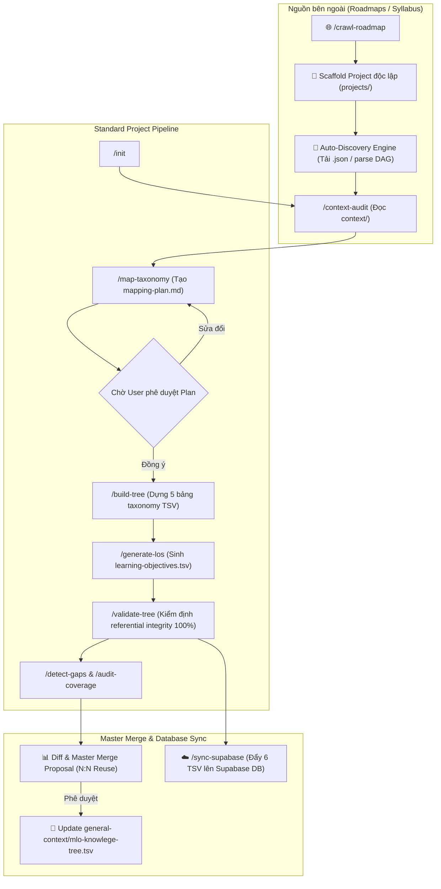

# Universal Agentic Knowledge Tree Pipeline

🌐 **Ngôn ngữ / Language:** [English](README.md) | **[Tiếng Việt](README.vi.md)**

[](LICENSE)
[](https://www.python.org/downloads/)
[](CODE_OF_CONDUCT.md)
[](CONTRIBUTING.md)

Hệ thống xây dựng và tự động hóa Khung tri thức (Knowledge Tree) cho các chứng chỉ, môn học và lộ trình công nghệ (Roadmaps), vận hành thông qua **Agentic Workflows (slash commands)**. Hệ thống kết hợp sự linh hoạt của LLM trong việc đối chiếu syllabus/đồ thị tri thức và tính chính xác (deterministic) của các script Python trong việc quản lý, kiểm định dữ liệu.

---

## 🏛️ Kiến trúc Cốt lõi & Nguyên tắc Thiết kế

- **R1 (Final-only output):** Thư mục `projects/<project-slug>/output/` chỉ chứa đúng 6 file TSV artifact đã vượt qua 100% vòng kiểm định referential integrity:
  `fields.tsv`, `subjects.tsv`, `categories.tsv`, `topics.tsv`, `concepts.tsv`, `learning-objectives.tsv`.
- **R2 (Project-First Paradigm cho Roadmap Crawling):** Khi cào dữ liệu từ các nguồn bên ngoài (như `roadmap.sh`), hệ thống **tự động khởi tạo một project độc lập** trong `projects/`, tự động dò tìm file đồ thị JSON gốc (`Auto-Discovery Engine`), và triển khai đầy đủ quy trình chuẩn hóa của project trước khi đề xuất hợp nhất (Merge Proposal) vào Cây tri thức Master chung (`general-context/mlo-knowlege-tree.tsv`).
- **R3 (N:N Reuse Topology First):** Tái sử dụng tối đa các Category/Topic/Subject đã có sẵn trong Master Tree thông qua liên kết Many-to-Many (dấu phẩy `,`), tránh tạo ra các node trùng lặp gây phình to cây tri thức.
- **R4 (LLM boundary):** LLM chỉ đảm nhiệm khâu nghiên cứu tài liệu nguồn (`context-audit`), trích xuất mục tiêu học tập (`generate-los`) và đối chiếu phân tầng (`map-taxonomy`). Khâu khởi tạo, lắp ráp TSV và kiểm tra lỗi (validate) do script Python đảm nhiệm 100%.
- **R5 (File is state):** Mọi trạng thái trung gian được lưu tại `.work/`. Trạng thái dự án đang làm việc (`active_project`) được quản lý tại `status.yaml`.

---

## 📂 Cấu trúc Thư mục Dự án

```text
knowledge-tree/
├── .github/                                # GitHub templates & community workflows
│   ├── ISSUE_TEMPLATE/                     # Templates cho Bug reports & Taxonomy proposals
│   └── PULL_REQUEST_TEMPLATE.md
├── .agents/                                # Bộ não pipeline & định nghĩa agents/skills
│   ├── RULES.md
│   ├── AGENTS.md
│   ├── workflows/                          # Hợp đồng slash commands (.md)
│   │   ├── init.md
│   │   ├── set-project.md
│   │   ├── crawl-roadmap.md
│   │   ├── context-audit.md
│   │   ├── map-taxonomy.md
│   │   ├── build-tree.md
│   │   ├── generate-los.md
│   │   ├── detect-gaps.md
│   │   ├── validate-tree.md
│   │   ├── validate-master-tree.md
│   │   ├── audit-coverage.md
│   │   └── sync-supabase.md
│   └── skills/
│       ├── project-context-loader/
│       ├── taxonomy-mapper/
│       │   ├── scripts/parse_master_tree.py
│       │   ├── scripts/query_master_tree.py
│       │   └── resources/master_tree.json
│       ├── roadmap-aligner/                # Auto-Discovery Engine & Master Merge
│       │   ├── scripts/crawl_roadmap_align.py
│       │   ├── scripts/tree_diff.py
│       │   └── scripts/apply_plan_to_staging.py
│       ├── tree-assembler/
│       │   └── scripts/assemble_project.py
│       ├── learning-objective-generator/
│       │   └── scripts/llm_extract_lo.py
│       ├── tree-validator/
│       │   ├── scripts/scaffold_tree.py
│       │   ├── scripts/validate_tree.py
│       │   ├── scripts/validate_master_tree.py
│       │   ├── scripts/detect_gaps.py
│       │   └── scripts/audit_coverage.py
│       └── supabase-sync/
│           └── scripts/sync_to_supabase.py
│
├── mcp/                                    # Multi-Server Hub FastMCP v3
│   ├── main.py                             # FastMCP Hub entrypoint (mount toàn bộ sub-servers)
│   ├── README.md                           # Tài liệu hướng dẫn công cụ & cấu hình MCP
│   └── servers/                            # Các Sub-MCP Servers (kt_server, system_server, v.v.)
│       ├── kt_server.py                    # Công cụ Knowledge Tree Operations (kt_*)
│       └── system_server.py                # Công cụ System Ops & Resources (sys_*)
│
├── docs/                                   # Tài liệu & Hướng dẫn kỹ thuật
│   └── instructions/                       # Hướng dẫn chi tiết cho Developer
│       ├── how-to-add-new-mcp-server.md    # Hướng dẫn bổ sung Sub-MCP Server mới
│       └── ci-cd-deployment.md             # Hướng dẫn cấu hình CI/CD GitHub Actions
│
├── general-context/                        # Master Knowledge Tree Staging Copy
│   ├── mlo-knowlege-tree.tsv              # Cây tri thức Master chung
│   └── version_history.json               # Lịch sử nâng cấp phiên bản
│
├── projects/                               # Các dự án tri thức độc lập
│   └── <project-slug>/                     # Ví dụ: roadmap_sh_frontend, swift-associate
│       ├── context/                        # Tài liệu nguồn (syllabus.md, raw_roadmap.json, <slug>.json)
│       ├── .work/                          # Trạng thái xử lý trung gian (mapping-plan.md, gap_report.md)
│       ├── .tree-validator/                # Log báo cáo kiểm định integrity
│       └── output/                         # 6 file TSV thành phẩm (R1)
│
├── Dockerfile                              # Cấu hình Container Docker cho FastMCP Hub
├── docker-compose.yml                      # Cấu hình Docker Compose service (port 8888:8000)
├── pyproject.toml                          # Khai báo thư viện phụ thuộc Python
├── .mcp.json                               # Cấu hình MCP Client cho AI IDEs / Agents
├── CODE_OF_CONDUCT.md                      # Quy tắc ứng xử cộng đồng
├── CONTRIBUTING.md                         # Hướng dẫn đóng góp cho cộng đồng
├── LICENSE                                 # Giấy phép mở MIT
├── SECURITY.md                             # Chính sách báo cáo lỗ hổng bảo mật
└── status.yaml                             # Quản lý active_project và trạng thái kiểm định
```

---

## 🔄 Luồng Slash Commands (Agent Workflows)



---

## 📋 Bảng Lệnh Slash Commands Chi tiết

| Command | Chủ sở hữu | Dùng LLM? | Chức năng / Kết quả chính |
|---|---|---|---|
| `/init <project>` | `scaffolder` | ❌ | Khởi tạo cấu trúc dự án `projects/<project>/` và 6 header TSV |
| `/set-project` | `coordinator` | ❌ | Thay đổi `active_project` trong `status.yaml` |
| `/crawl-roadmap <url>` | `@roadmap-aligner` | ✅ | Khởi tạo project, tự động cào JSON đồ thị, chạy pipeline chuẩn và đề xuất merge vào Master |
| `/context-audit` | `@context-analyzer` | ✅ | Đọc nội dung trong `context/` $\rightarrow$ `.work/context-audit.md` |
| `/map-taxonomy` | `@taxonomy-mapper` | ✅ | Đối chiếu syllabus với Master Tree $\rightarrow$ `projects/<project>/.work/mapping-plan.md` |
| `/build-tree` | `@tree-assembler` | ❌ | Lắp ráp 5 file taxonomy TSV (`fields` $\rightarrow$ `concepts`) từ `mapping-plan.md` |
| `/generate-los` | `@tree-assembler` | ✅ | Trích xuất & sinh `learning-objectives.tsv` chuẩn ULO, CIO, SIO grounded theo concept code |
| `/detect-gaps` | `@tree-validator` | ❌ | Phát hiện 3 loại gap (Missing LO, Shallow CIO, Master Candidates) |
| `/validate-tree` | `@tree-validator` | ❌ | Kiểm tra Referential Integrity 100% PASS $\rightarrow$ `.tree-validator/reports/` |
| `/validate-master-tree` | `@tree-validator` | ❌ | Kiểm tra referential integrity & collision cho Cây tri thức Master |
| `/audit-coverage` | `@tree-validator` | ❌ | Kiểm tra đối chiếu ngược độ phủ syllabus từ `learning-objectives.tsv` |
| `/sync-supabase` | `@tree-assembler` | ❌ | Đồng bộ 6 file TSV thành phẩm của project lên cơ sở dữ liệu Supabase Cloud |

---

## 🚀 Multi-MCP Server & Triển Khai Container

Dự án tích hợp sẵn một **FastMCP v3 Multi-Server Hub** tại thư mục [`mcp/`](file:///Users/tonypham/MEGA/WebApp/content-gen/knowledge-tree/mcp), cung cấp toàn bộ công cụ tự động hóa kiểm định, phát hiện lỗ hổng và đồng bộ dữ liệu dưới dạng các MCP Tools chuẩn cho bất kỳ AI Agent nào (Pi, Cursor, Claude Desktop, Antigravity).

### Kiến Trúc FastMCP Hub
- **Entrypoint**: [`mcp/main.py`](file:///Users/tonypham/MEGA/WebApp/content-gen/knowledge-tree/mcp/main.py)
- **Danh sách Sub-Servers**:
  - `kt`: Công cụ Knowledge Tree (`kt_validate_tree`, `kt_detect_gaps`, `kt_audit_coverage`, `kt_sync_supabase`, `kt_scaffold_project`)
  - `sys`: Công cụ hệ thống & tài nguyên (`sys_get_system_status`, `skills://{name}`, `guide_workflow`)

### Khởi Chạy Nhanh (Local)
```bash
# Khởi chạy FastMCP Hub ở local
uv run python mcp/main.py

# Health check
curl http://localhost:8000/health
```

### Triển Khai Docker & Remote Oracle Cloud VM
```bash
# Chạy container qua Docker Compose
docker compose up -d --build

# Container mở cổng HTTP transport tại port 8888
curl http://localhost:8888/health
```

### CI/CD Tự Động Deploy Với GitHub Actions
- **Workflow**: [`.github/workflows/deploy.yml`](file://.github/workflows/deploy.yml)
- **Cơ chế**: Tự động deploy khi push/merge code vào nhánh `stable` (hoặc bấm chạy thủ công `workflow_dispatch`).
- **Hướng dẫn chi tiết**: Xem [`docs/instructions/ci-cd-deployment.md`](file://docs/instructions/ci-cd-deployment.md).

---

## 🛠️ Trợ lý Lệnh cho Lập trình viên (Developer Helpers)

```bash
# 1. Khởi tạo dự án mới
python3 .agents/skills/tree-validator/scripts/scaffold_tree.py <project-slug>

# 2. Cào & Phân tích Đồ thị JSON tự động từ roadmap.sh
python3 .agents/skills/roadmap-aligner/scripts/crawl_roadmap_align.py https://roadmap.sh/backend --project roadmap_sh_backend

# 3. Lắp ráp 5 bảng Taxonomy từ mapping-plan
python3 .agents/skills/tree-assembler/scripts/assemble_project.py --project <project-slug> --source mapping-plan

# 4. Kiểm định toàn vẹn dữ liệu dự án (Referential Integrity)
python3 .agents/skills/tree-validator/scripts/validate_tree.py --project <project-slug>

# 5. Kiểm định toàn vẹn Cây tri thức Master (Master Tree Integrity)
python3 .agents/skills/tree-validator/scripts/validate_master_tree.py --tsv general-context/mlo-knowlege-tree.tsv

# 6. So sánh Diff giữa Staging và Master Tree
python3 .agents/skills/roadmap-aligner/scripts/tree_diff.py

# 7. Hợp nhất thay đổi Staging vào General Context Master Tree
python3 .agents/skills/roadmap-aligner/scripts/apply_plan_to_staging.py

# 8. Đồng bộ 6 file TSV của dự án lên Supabase Database
python3 .agents/skills/supabase-sync/scripts/sync_to_supabase.py --project <project-slug>
```

---

## 🤝 Cộng đồng & Đóng góp (Community & Contributing)

Chúng tôi hoan nghênh mọi đóng góp từ cộng đồng! Dù bạn muốn đề xuất node tri thức mới, nâng cấp các script kiểm định, hay đóng góp lộ trình môn học mới:

- **Hướng dẫn Đóng góp:** Đọc thêm tại [CONTRIBUTING.md](CONTRIBUTING.md).
- **Quy tắc Ứng xử:** Tham khảo [CODE_OF_CONDUCT.md](CODE_OF_CONDUCT.md).
- **Báo cáo Lỗ hổng Bảo mật:** Xem chính sách bảo mật tại [SECURITY.md](SECURITY.md).

## 📜 Giấy phép (License)

Dự án được phát hành theo giấy phép open-source [MIT License](LICENSE).
