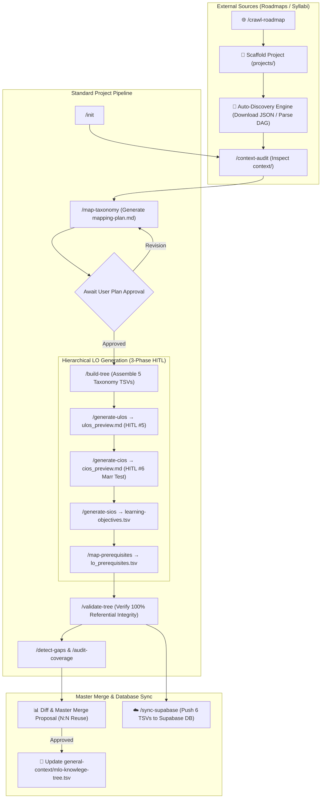

# Universal Agentic Knowledge Tree Pipeline

🌐 **Ngôn ngữ / Language:** [English](README.md) | **[Tiếng Việt](README.vi.md)**

[](LICENSE)
[](https://www.python.org/downloads/)
[](CODE_OF_CONDUCT.md)
[](CONTRIBUTING.md)

Hệ thống xây dựng và tự động hóa Khung tri thức (Knowledge Tree) cho các chứng chỉ, môn học và lộ trình công nghệ (Roadmaps), vận hành thông qua **Agentic Workflows (slash commands)**. Hệ thống kết hợp sự linh hoạt của LLM trong việc đối chiếu syllabus/đồ thị tri thức và tính chính xác (deterministic) của các script Python trong việc quản lý, kiểm định dữ liệu.

---

## 📊 Trạng Thái Dự Án (Hiện Tại)

**Dự án đang hoạt động**: `swift-associate` (Swift Associate Certification / SwiftUI Fundamentals)
- **Trạng thái**: ✅ Pipeline hoàn tất qua validation & coverage audit
- **Output TSVs**: 6/6 files tại `projects/swift-associate/output/` (đều PASS validation)
- **Learning Objectives**: 49 LOs (11 ULO + 14 CIO + 24 SIO) — phân cấp, ULO/CIO technology-agnostic, SIO Swift-specific
- **Concepts**: 44 concepts (9 có LOs, 35 tái dùng từ Master Tree)
- **Validation**: ✅ PASS (0 errors, 93 orphan warnings từ Master Tree reuse — dự kiến)
- **Coverage Audit**: ⚠️ 2.33% syllabus coverage (9/43 syllabus items có LO phủ — gap: các concept syllabus không nằm trong scope project này)
- **MCP Integration**: ✅ Hoàn tất (27 tools + 9 HITL resources + 1 workflow prompt)
- **Pipeline Phase**: Hoàn tất Phase 4 (Validation & Release) — sẵn sàng `/sync-supabase` với phê duyệt HITL

**Trạng Thái Master Tree**: ✅ Đã validated (v2.2, collision-free, referential integrity PASS)

---

## 🏛️ Kiến trúc Cốt lõi & Nguyên tắc Thiết kế

- **R1 (Final-only output):** Thư mục `projects/<project-slug>/output/` chỉ chứa đúng 6 file TSV artifact đã vượt qua 100% vòng kiểm định referential integrity:
  `fields.tsv`, `subjects.tsv`, `categories.tsv`, `topics.tsv`, `concepts.tsv`, `learning-objectives.tsv`.
- **R2 (Project-First Paradigm cho Roadmap Crawling):** Khi cào dữ liệu từ các nguồn bên ngoài (như `roadmap.sh`), hệ thống **tự động khởi tạo một project độc lập** trong `projects/`, tự động dò tìm file đồ thị JSON gốc (`Auto-Discovery Engine`), và triển khai đầy đủ quy trình chuẩn hóa của project trước khi đề xuất hợp nhất (Merge Proposal) vào Cây tri thức Master chung (`general-context/mlo-knowlege-tree.tsv`).
- **R3 (N:N Reuse Topology First):** Tái sử dụng tối đa các Category/Topic/Subject đã có sẵn trong Master Tree thông qua liên kết Many-to-Many (dấu phẩy `,`), tránh tạo ra các node trùng lặp gây phình to cây tri thức.
- **R4 (LLM boundary):** LLM chỉ đảm nhiệm khâu nghiên cứu tài liệu nguồn (`context-audit`), trích xuất mục tiêu học tập (`generate-ulos/cios/sios`) và đối chiếu phân tầng (`map-taxonomy`). Khâu khởi tạo, lắp ráp TSV và kiểm tra lỗi (validate) do script Python đảm nhiệm 100%.
- **R5 (File is state):** Mọi trạng thái trung gian được lưu tại `.work/`. Trạng thái dự án đang làm việc (`active_project`) được quản lý tại `status.yaml`.

---

## 📂 Cấu trúc Thư mục Dự án

```text
knowledge-tree/
├── .github/                                # GitHub issue templates & PR guidelines
│   ├── ISSUE_TEMPLATE/                     # Templates cho Bug Reports & Taxonomy Proposals
│   └── PULL_REQUEST_TEMPLATE.md
├── .agents/                                # Agent definitions, rules, and skills
│   ├── RULES.md
│   ├── AGENTS.md
│   ├── workflows/                          # Slash command markdown contracts (22 files)
│   │   ├── init.md
│   │   ├── set-project.md
│   │   ├── crawl-roadmap.md
│   │   ├── context-audit.md
│   │   ├── map-taxonomy.md
│   │   ├── build-tree.md
│   │   ├── generate-ulos.md                # Phase A: ULO generation
│   │   ├── generate-cios.md                # Phase B: CIO generation + Marr Test
│   │   ├── generate-sios.md                # Phase C: SIO generation + merge
│   │   ├── generate-los.md                 # Legacy 1-shot (deprecated)
│   │   ├── map-prerequisites.md            # Phase E: ADR-0005 prerequisite DAG
│   │   ├── detect-gaps.md
│   │   ├── validate-tree.md
│   │   ├── validate-master-tree.md
│   │   ├── audit-coverage.md
│   │   ├── sync-supabase.md
│   │   ├── scaffold-keywords.md            # ATE Pipeline
│   │   ├── extract-terms.md
│   │   ├── verify-terms.md
│   │   ├── finalize-keywords.md
│   │   ├── escalate-concepts.md
│   │   └── run-pipeline.md                 # Full HITL pipeline (7 checkpoints)
│   └── skills/
│       ├── project-context-loader/
│       ├── taxonomy-mapper/
│       │   ├── scripts/parse_master_tree.py
│       │   ├── scripts/query_master_tree.py
│       │   └── resources/master_tree.json
│       ├── roadmap-aligner/                # Auto-Discovery Engine & Master Merge
│       │   ├── scripts/crawl_roadmap_align.py
│       │   ├── scripts/tree_diff.py
│       │   └── scripts/apply_plan_to_staging.py
│       ├── tree-assembler/
│       │   └── scripts/assemble_project.py
│       ├── learning-objective-generator/
│       │   ├── scripts/llm_generate_hierarchical_lo.py
│       │   └── scripts/llm_map_prerequisites.py
│       ├── tree-validator/
│       │   ├── scripts/scaffold_tree.py
│       │   ├── scripts/validate_tree.py
│       │   ├── scripts/validate_master_tree.py
│       │   ├── scripts/detect_gaps.py
│       │   └── scripts/audit_coverage.py
│       ├── keyword-extractor/
│       │   ├── scripts/chunk_source.py
│       │   ├── scripts/gen_statistical_candidates.py
│       │   ├── scripts/llm_gen_candidates.py
│       │   ├── scripts/filter_by_relevance.py
│       │   ├── scripts/llm_verify_and_dedup.py
│       │   ├── scripts/export_keywords.py
│       │   └── scripts/llm_escalate_concepts.py
│       └── supabase-sync/
│           └── scripts/sync_to_supabase.py
│
├── kt_mcp/                                 # FastMCP v3 Multi-Server Hub (đường dẫn thực tế)
│   ├── main.py                             # FastMCP Hub entrypoint (mount tất cả sub-servers)
│   ├── README.md                           # Tài liệu FastMCP Server & Tools
│   ├── server.py                           # Unified server
│   └── servers/                            # Sub-MCP Servers
│       ├── kt_server.py                    # Knowledge Tree Tools (kt_*)
│       └── system_server.py                # System Ops & Resources (sys_*)
│
├── docs/                                   # Documentation & Instructions
│   ├── adr/                                # Architecture Decision Records
│   │   ├── adr-0005-domain-partitioned-concept-dag-prerequisite-mapping.md
│   │   └── ...
│   ├── instructions/                       # Step-by-step developer guides
│   │   ├── how-to-add-new-mcp-server.md
│   │   └── ci-cd-deployment.md
│   └── reports/                            # Audit & integration reports
│       ├── 2026-07-29-audit-report-agents.md
│       └── 2026-07-29-mcp-agents-integration-audit.md
│
├── .github/
│   └── workflows/
│       └── deploy.yml                      # CI/CD pipeline (Deploys to Oracle VM on stable branch)
│
├── general-context/                        # Master Knowledge Tree Staging Copy
│   ├── mlo-knowlege-tree.tsv              # Global Master Knowledge Tree TSV
│   └── version_history.json               # Release & version history
│
├── projects/                               # Independent project knowledge trees
│   └── <project-slug>/                     # E.g. roadmap_sh_python, swift-associate
│       ├── context/                        # Source context (syllabus.md, raw_roadmap.json, etc.)
│       ├── .work/                          # Intermediate working files (mapping-plan.md, etc.)
│       ├── .tree-validator/                # Validation reports and fix logs
│       └── output/                         # 6 final TSV artifacts (R1)
│
├── Dockerfile                              # Container definition for FastMCP Hub
├── docker-compose.yml                      # Docker compose service definition (port 8888:8000)
├── pyproject.toml                          # Python project dependencies
├── .mcp.json                               # MCP client configuration for AI IDEs / Agents
├── CODE_OF_CONDUCT.md                      # Contributor Covenant Code of Conduct
├── CONTRIBUTING.md                         # Contribution guidelines & validation steps
├── LICENSE                                 # MIT Open Source License
├── SECURITY.md                             # Security policy & vulnerability reporting
└── status.yaml                             # Active project tracking & validation status
```

---

## 🔄 Luồng Slash Commands (Agent Workflows) & Flowchart


```mermaid
flowchart TD
    subgraph "External Sources (Roadmaps / Syllabi)"
        URL["🌐 /crawl-roadmap <URL>"] --> InitProj["📁 Scaffold Project (projects/<slug>)"]
        InitProj --> Discovery["🔎 Auto-Discovery Engine (Download JSON / Parse DAG)"]
        Discovery --> Audit
    end

    subgraph "Standard Project Pipeline"
        Init["/init <project>"] --> Audit["/context-audit (Inspect context/)"]
        Audit --> Map["/map-taxonomy (Generate mapping-plan.md)"]
        Map --> UserReview{"Await User Plan Approval"}
        UserReview -- Revision --> Map
        UserReview -- Approved --> Build["/build-tree (Assemble 5 Taxonomy TSVs)"]
        
        subgraph "Hierarchical LO Generation (3-Phase HITL)"
            Build --> ULO["/generate-ulos → ulos_preview.md (HITL #5)"]
            ULO --> CIO["/generate-cios → cios_preview.md (HITL #6 Marr Test)"]
            CIO --> SIO["/generate-sios → learning-objectives.tsv"]
            SIO --> Preq["/map-prerequisites → lo_prerequisites.tsv"]
        end
        
        Preq --> Validate["/validate-tree (Verify 100% Referential Integrity)"]
        Validate --> GapCheck["/detect-gaps & /audit-coverage"]
    end

    subgraph "Master Merge & Database Sync"
        GapCheck --> MergeProp["📊 Diff & Master Merge Proposal (N:N Reuse)"]
        MergeProp -- Approved --> SyncMaster["🚀 Update general-context/mlo-knowlege-tree.tsv"]
        Validate --> SyncDB["☁️ /sync-supabase (Push 6 TSVs to Supabase DB)"]
    end
```

---

## 📋 Bảng Lệnh Slash Commands Chi tiết

### Pipeline Commands (Human-in-the-loop)
| Command | Skill Owner | Uses LLM? | Chức năng / Kết quả chính |
|---|---|---|---|
| `/init <project>` | `scaffolder` | ❌ | Scaffold project structure under `projects/<slug>/` and 6 TSV headers |
| `/set-project` | `coordinator` | ❌ | Update `active_project` in `status.yaml` |
| `/crawl-roadmap <url>` | `@roadmap-aligner` | ✅ | Scaffold project, crawl graph JSON, run standard pipeline & propose master merge |
| `/scaffold-keywords <topic> --source <path>` | `scaffolder` | ❌ | Scaffold ATE keyword extraction workspace |
| `/extract-terms` | `@keyword-extractor` | ✅ | YAKE + LLM candidate generation → embedding filter → candidates |
| `/verify-terms` | `@keyword-extractor` | ✅ | LLM dedup + omission check loop → `verify-report.md` (HITL checkpoint) |
| `/finalize-keywords` | `@keyword-extractor` | ❌ | Export `keywords.tsv` + inject into context audit |
| `/escalate-concepts` | `@keyword-extractor` | ✅ | Keywords → neutral concepts + Master Tree match → concept candidates (Gap D) |
| `/context-audit` | `@context-analyzer` | ✅ | Inspect syllabus in `context/` + `keywords.tsv` → `.work/context-audit.md` |
| `/map-taxonomy` | `@taxonomy-mapper` | ✅ | Cross-reference syllabus with Master Tree → `.work/mapping-plan.md` (HITL checkpoint) |
| `/build-tree` | `@tree-assembler` | ❌ | Assemble 5 taxonomy TSV files (`fields` → `concepts`) from mapping plan |
| `/generate-ulos` | `@tree-assembler` | ✅ | **Phase A**: Generate ULOs (Bloom Evaluate/Create, tech-agnostic) → `ulos_preview.md` (HITL) |
| `/generate-cios` | `@tree-assembler` | ✅ | **Phase B**: Generate CIOs + Marr 2-Language Test → `cios_preview.md` (HITL) |
| `/generate-sios` | `@tree-assembler` | ✅ | **Phase C**: Generate SIOs (tech-specific) + merge → `learning-objectives.tsv` |
| `/map-prerequisites` | `@tree-assembler` | ✅ | **Phase E**: ADR-0005 4-step prerequisite mapping → `lo_prerequisites.tsv` |
| `/detect-gaps` | `@tree-validator` | ❌ | Detect Missing LOs, Shallow CIOs, and Master Candidates |
| `/validate-tree` | `@tree-validator` | ❌ | Enforce 100% Referential Integrity PASS → `.tree-validator/reports/` |
| `/validate-master-tree` | `@tree-validator` | ❌ | Enforce Referential Integrity & Collision checks for Master Tree TSVs |
| `/audit-coverage` | `@tree-validator` | ❌ | Perform Reverse Coverage Audit against source syllabus |
| `/sync-supabase` | `@tree-assembler` | ❌ | Synchronize 6 validated TSV files to Supabase Cloud DB (Gate §8: HITL required) |

> **Legacy:** `/generate-los` (1-shot, no Marr Test, no HITL) — deprecated, use 3-phase pipeline above.

### MCP Tools (27 tools, 9 HITL resources, 1 prompt)
| Tool / Resource | Server | Description |
|---|---|---|
| `kt_validate_tree`, `kt_detect_gaps`, `kt_audit_coverage`, `kt_sync_supabase`, `kt_scaffold_project` | `kt` | Project validation, gap detection, coverage audit, DB sync |
| `kt_build_taxonomy`, `kt_generate_ulos`, `kt_generate_cios`, `kt_generate_sios`, `kt_merge_los`, `kt_map_prerequisites` | `kt` | Hierarchical LO generation pipeline (4 tools + merge + prerequisites) |
| `kt_context_audit`, `kt_map_taxonomy` | `kt` | Context analysis & taxonomy mapping |
| `kt_scaffold_keywords`, `kt_extract_terms`, `kt_verify_terms`, `kt_finalize_keywords`, `kt_escalate_concepts` | `kt` | ATE Pipeline (5 tools) |
| `kt_crawl_roadmap`, `kt_init_staging_tree`, `kt_apply_staging_plan`, `kt_diff_staging`, `kt_sync_master_back` | `kt` | Roadmap Aligner (5 tools, `kt_sync_master_back` Gate §8 protected) |
| `kt_run_pipeline_step`, `kt_get_pipeline_status` | `kt` | Workflow orchestration |
| `sys_get_system_status`, `sys_get_skill_metadata` | `sys` | System & skill introspection |
| `project://sys/{project}/work/{artifact}` (9 templates) | `sys` | HITL artifact resources (context-audit, mapping-plan, ulos_preview, cios_preview, etc.) |
| `guide_workflow` | `sys` | Workflow guidance prompt |

---

## 🚀 Multi-MCP Server & Triển Khai Container

Dự án tích hợp sẵn một **FastMCP v3 Multi-Server Hub** tại thư mục [`kt_mcp/`](file:///Users/tonypham/MEGA/WebApp/content-gen/knowledge-tree/kt_mcp), cung cấp toàn bộ công cụ tự động hóa kiểm định, phát hiện lỗ hổng và đồng bộ dữ liệu dưới dạng các MCP Tools chuẩn cho bất kỳ AI Agent nào (Pi, Cursor, Claude Desktop, Antigravity).

### Kiến Trúc FastMCP Hub
- **Entrypoint**: [`kt_mcp/main.py`](file:///Users/tonypham/MEGA/WebApp/content-gen/knowledge-tree/kt_mcp/main.py)
- **Danh sách Sub-Servers**:
  - `kt`: Công cụ Knowledge Tree (`kt_validate_tree`, `kt_detect_gaps`, `kt_audit_coverage`, `kt_sync_supabase`, `kt_scaffold_project`, `kt_build_taxonomy`, `kt_generate_ulos`, `kt_generate_cios`, `kt_generate_sios`, `kt_merge_los`, `kt_map_prerequisites`, `kt_context_audit`, `kt_map_taxonomy`, `kt_scaffold_keywords`, `kt_extract_terms`, `kt_verify_terms`, `kt_finalize_keywords`, `kt_escalate_concepts`, `kt_crawl_roadmap`, `kt_init_staging_tree`, `kt_apply_staging_plan`, `kt_diff_staging`, `kt_sync_master_back`, `kt_run_pipeline_step`, `kt_get_pipeline_status`)
  - `sys`: Công cụ hệ thống & tài nguyên (`sys_get_system_status`, `sys_get_skill_metadata`, `guide_workflow`, 9 HITL resource templates)

### Khởi Chạy Nhanh (Local)
```bash
# Khởi chạy FastMCP Hub ở local
uv run python kt_mcp/main.py

# Health check
curl http://localhost:8000/health
```

### Triển Khai Docker & Remote Oracle Cloud VM
- **Public Domain Endpoint**: `https://kt-mcp.orchable.xyz/mcp`
- **Public Health Check**: `https://kt-mcp.orchable.xyz/health`

```bash
# Chạy container qua Docker Compose trên máy chủ
docker compose up -d --build

# Kiểm tra sức khỏe qua tên miền chính thức
curl https://kt-mcp.orchable.xyz/health
```

### CI/CD Tự Động Deploy Với GitHub Actions
- **Workflow**: [`.github/workflows/deploy.yml`](file://.github/workflows/deploy.yml)
- **Trigger**: Tự động deploy khi push/merge code vào nhánh `stable` (hoặc bấm chạy thủ công `workflow_dispatch`).
- **Hướng dẫn chi tiết**: Xem [`docs/instructions/ci-cd-deployment.md`](file://docs/instructions/ci-cd-deployment.md).

---

## 🛠️ Trợ lý Lệnh cho Lập trình viên (Developer CLI Reference)

### Core Pipeline Scripts
```bash
# 1. Scaffold a new project
python3 .agents/skills/tree-validator/scripts/scaffold_tree.py <project-slug>

# 2. Crawl & analyze JSON graph from roadmap.sh
python3 .agents/skills/roadmap-aligner/scripts/crawl_roadmap_align.py https://roadmap.sh/backend --project roadmap_sh_backend

# 3. Assemble 5 taxonomy TSVs from mapping plan
python3 .agents/skills/tree-assembler/scripts/assemble_project.py --project <project-slug> --source mapping-plan

# 4. Validate project referential integrity
python3 .agents/skills/tree-validator/scripts/validate_tree.py --project <project-slug>

# 5. Validate Master Tree referential integrity & collisions
python3 .agents/skills/tree-validator/scripts/validate_master_tree.py --tsv general-context/mlo-knowlege-tree.tsv

# 6. Generate Master Tree diff report
python3 .agents/skills/roadmap-aligner/scripts/tree_diff.py

# 7. Apply staging changes to Master Tree
python3 .agents/skills/roadmap-aligner/scripts/apply_plan_to_staging.py

# 8. Sync 6 TSV artifacts to Supabase Database
python3 .agents/skills/supabase-sync/scripts/sync_to_supabase.py --project <project-slug>
```

### ATE Pipeline Scripts
```bash
# Scaffold keyword extraction workspace
python3 .agents/skills/keyword-extractor/scripts/scaffold_keywords.py --topic "<topic>" --source projects/<project>/context/

# Extract terms (YAKE + LLM + embedding filter)
python3 .agents/skills/keyword-extractor/scripts/extract_terms.py --project <project-slug>

# Verify terms (LLM dedup + omission check - HITL)
python3 .agents/skills/keyword-extractor/scripts/verify_terms.py --project <project-slug>

# Finalize keywords
python3 .agents/skills/keyword-extractor/scripts/finalize_keywords.py --project <project-slug>

# Escalate keywords → neutral concepts + Master Tree match
python3 .agents/skills/keyword-extractor/scripts/escalate_concepts.py --project <project-slug>
```

### Hierarchical LO Generation Scripts
```bash
# Phase A: Generate ULOs (tech-agnostic, Bloom Evaluate/Create)
python3 .agents/skills/learning-objective-generator/scripts/llm_generate_hierarchical_lo.py --phase ulos --project <project-slug>

# Phase B: Generate CIOs (Marr 2-Language Test)
python3 .agents/skills/learning-objective-generator/scripts/llm_generate_hierarchical_lo.py --phase cios --project <project-slug>

# Phase C: Generate SIOs (tech-specific) + Merge to TSV
python3 .agents/skills/learning-objective-generator/scripts/llm_generate_hierarchical_lo.py --phase sios --project <project-slug>
python3 .agents/skills/learning-objective-generator/scripts/llm_generate_hierarchical_lo.py --phase merge --project <project-slug>

# Phase E: Map prerequisites (ADR-0005)
python3 .agents/skills/learning-objective-generator/scripts/llm_generate_hierarchical_lo.py --phase prerequisites --project <project-slug>

# All phases at once (no HITL checkpoints)
python3 .agents/skills/learning-objective-generator/scripts/llm_generate_hierarchical_lo.py --phase all --project <project-slug>
```

### Validation & Audit Scripts
```bash
# Detect gaps (missing LOs, shallow CIOs, master candidates)
python3 .agents/skills/tree-validator/scripts/detect_gaps.py --project <project-slug>

# Reverse coverage audit against source syllabus
python3 .agents/skills/tree-validator/scripts/audit_coverage.py --project <project-slug>
```

---

## 🤝 Cộng đồng & Đóng góp (Community & Contributing)

Chúng tôi hoan nghênh mọi đóng góp từ cộng đồng! Dù bạn muốn đề xuất node tri thức mới, tinh chỉnh các script kiểm định, hay đóng góp lộ trình môn học mới:

- **Contribution Guidelines:** Đọc [CONTRIBUTING.md](CONTRIBUTING.md).
- **Code of Conduct:** Đọc [CODE_OF_CONDUCT.md](CODE_OF_CONDUCT.md).
- **Security Policy:** Đọc [SECURITY.md](SECURITY.md).

## 📜 Giấy phép (License)

Dự án được phát hành theo giấy phép open-source [MIT License](LICENSE).