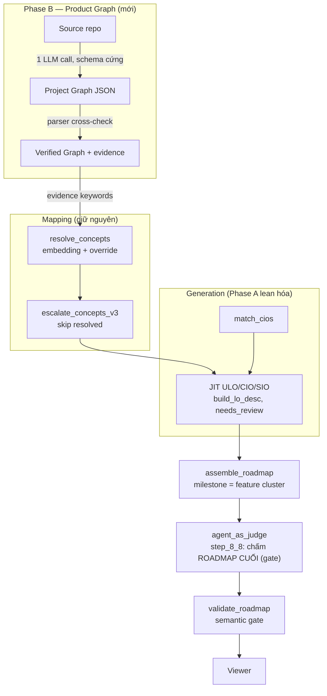

# Lean Pipeline Refactor (Phase A) + Product Graph Layer (Phase B) — Thiết kế chi tiết

> **Ngày:** 2026-08-07
> **Vai trò:** Kiến trúc sư (Main agent) vẽ thiết kế → Worker triển khai → Kiến trúc sư verify
> **Phạm vi đã chốt với Human:** A trước rồi B · KHÔNG làm Mastery/Adaptive đợt này · Dọn dẹp (A) trước
> **Liên kết:** [`2026-08-07-vertical-slicing-roadmap.md`](./2026-08-07-vertical-slicing-roadmap.md) · [`2026-08-07-sio-generate-first-roadmap-content.md`](./2026-08-07-sio-generate-first-roadmap-content.md) · [`2026-08-07-keyword-to-concept-escalation.md`](./2026-08-07-keyword-to-concept-escalation.md) · [`../progress/2026-08-06-pipeline-v3-implementation.md`](../progress/2026-08-06-pipeline-v3-implementation.md) · Curriculum Compiler v2 (Human cung cấp)

---

## 0. Chẩn đoán (evidence-based, khảo sát 2026-08-07)

### 0.1 Bằng chứng vá chồng vá ở tầng generation

| # | Bằng chứng | Đo lường |
|---|---|---|
| E1 | Commit pattern: 20 commit gần nhất chỉ 3 `feat`, còn lại `fix:` chồng fix — FOR_LOOP bị sửa 3 lần liên tiếp (`2f3d906`, `8b3ea10`, `cd19c62`) | git log |
| E2 | Cùng danh sách template-signals copy vào **3 file**: `assemble_roadmap._TEMPLATE_DESC_SIGNALS` (18 signals), `generate_jit_los.ULO/CIO_TEMPLATE_SIGNALS`, `agent_as_judge.TEMPLATE_SIGNALS` | grep |
| E3 | **9 nhánh fallback** trong generate_jit_los (3 hàm × llm/description/generic) — fallback generic sinh template mới, lại phải thêm signal để bắt → vòng tròn vá | code reading |
| E4 | Session smart-bulb chạy **6 vòng JIT** (~81k tokens) mới ra bản chấp nhận được; ~46% token đốt vào lỗi | run log |
| E5 | `_GENERIC_SIO_KEYWORDS` — blacklist 15 từ, mở rộng bằng tay mỗi lần gặp keyword mới | code reading |

### 0.2 Bằng chứng lỗi kiến trúc orchestrator

| # | Bằng chứng | Hệ quả |
|---|---|---|
| E6 | Thứ tự flow: `step_5_5 (JIT) → step_6 (judge) → step_8_7 (assemble) → step_9 (validate)` | **Judge tự động chấm artifact trung gian, không bao giờ thấy roadmap cuối.** `evaluate_roadmap` chỉ chạy khi gọi tay |
| E7 | `step_3_5_escalate_concepts` định nghĩa 2 lần (dòng 220 + 244) — cái đầu dead code | Nhầm lẫn khi bảo trì |
| E8 | `generate_jit_graph.py` (1405 dòng, Feature Graph/call-graph thời AI Quiz) chạy song song pipeline v3, không được v3 kế thừa | 2 hệ thống roadmap; ý tưởng Feature Graph trong vertical-slicing doc §5.2 đã có code nhưng bị bỏ quên |
| E9 | Không có test infrastructure (không tests dir, không test file) | Mọi "verification" là chạy pipeline + soi bằng mắt |

### 0.3 Nguyên nhân gốc

Generation đang **chống entropy**: 48 LLM calls rời rạc sinh 48 câu không kiểm soát được tại nguồn → vá ở hạ nguồn bằng detection + fallback. Phòng thủ sau khi sinh, thay vì đúng ngay khi sinh.

### 0.4 Phần LEAN thật (giữ nguyên, không đụng)

- `resolve_concepts.py` — embedding + `KEYWORD_CONCEPT_OVERRIDE`, 0 LLM call, deterministic
- Semantic gate trong `validate_roadmap.py` — grep code thật kiểm keyword tồn tại + platform khớp file
- GENERATE-first ADR — quyết định có doc, đã xóa dead code REUSE/ADAPT
- Interface JSON giữa các pha — mỗi script standalone, test độc lập được

---

## 1. Kiến trúc mục tiêu



### Nguyên tắc thiết kế (ràng buộc mọi task)

| # | Nguyên tắc | Cụ thể |
|---|---|---|
| P1 | **Chất lượng tại nguồn** | Không fallback generic bịa nội dung. Thiếu nguyên liệu → đánh dấu `needs_review: true` + câu tối thiểu nêu tên concept. Judge flag gap trung thực thay vì che bằng văn mẫu |
| P2 | **Một module chất lượng duy nhất** | 3 bảng signals/fallback gom về `scripts/lo_quality.py`; mọi consumer import |
| P3 | **Judge gate artifact CUỐI** | Roadmap chỉ PASS khi `evaluate_roadmap` chấm bản đã assemble |
| P4 | **Ground-truth trước LLM** | Mọi thứ LLM sinh về code phải được parser đối chiếu (symbol/file tồn tại thật) |
| P5 | **Không phá interface đang chạy** | Shape `roadmap.json` giữ nguyên → renderer không đổi trong cả Phase A lẫn B |

---

## 2. Phase A — Lean Generation (dọn dẹp, ~3-4h triển khai)

### A1. Module `scripts/lo_quality.py` — single source of truth cho quality rules

**Mục tiêu:** Xóa E2/E5 — 3 bảng copy thành 1 module, mọi consumer import.

**Contract (bất động — task khác lập trình theo đúng interface này):**

```python
# scripts/lo_quality.py
TEMPLATE_CIO_VERBS: set[str]      # 12 verbs (từ assemble_roadmap._TEMPLATE_CIO_VERBS)
TEMPLATE_DESC_SIGNALS: list[str]  # UNION dedupe của 3 bản copy hiện tại
GENERIC_KEYWORDS: set[str]        # 15 từ (từ assemble_roadmap._GENERIC_SIO_KEYWORDS)

def is_template_cio_code(code: str) -> bool: ...
def is_template_description(desc: str, layer: str = '') -> bool: ...
    # layer: 'ULO' | 'CIO' | '' (both)
def is_generic_keyword(kw: str) -> bool: ...
def clean_llm_description(desc: str, concept_name: str) -> str: ...
    # bỏ 'Tên: ' prefix trùng, dedupe 'hiểu ... hiểu', strip markdown
def build_lo_desc(layer: str, concept_code: str, concept_name: str,
                  source_desc: str, keyword: str = '', platform: str = '') -> tuple[str, bool]: ...
    # → (description, needs_review)
    # needs_review=True khi source_desc rỗng VÀ không suy ra được nội dung thật
    # KHÔNG BAO GIỜ trả về 'nguyên lý phổ quát' / 'và cách vận dụng nó'
```

**Triển khai:**
- Union signals: giữ mọi signal hợp lệ từ 3 nguồn, dedupe exact-match; KHÔNG thêm signal mới (không invent)
- `build_lo_desc` khi `needs_review`: trả câu tối thiểu trung thực theo layer:
  - ULO: `"Người học có khả năng hiểu <concept_name> trong ngữ cảnh dự án."`
  - CIO: `"Người học có khả năng vận dụng <concept_name> ở mức mô hình trong dự án."`
  - SIO: `"Người học có khả năng triển khai <concept_name>< dùng 'keyword'> trong <tech>."`

**Test (acceptance):**
- `scripts/tests/test_lo_quality.py` chạy bằng `python scripts/tests/test_lo_quality.py` (assert thuần, KHÔNG phụ thuộc pytest)
- ≥ 15 assertions: mỗi verb trong 12 verbs là template; sample tín hiệu ULO/CIO; `clean_llm_description` với 3 ca ("hiểu X: Hiểu...", markdown fence, desc sạch giữ nguyên); `build_lo_desc` needs_review cho desc rỗng; không output nào chứa chuỗi cấm
- Fixture: inline trong test file (không cần file ngoài)

---

### A2. Refactor `generate_jit_los.py` — 9 fallback → `build_lo_desc`

**Mục tiêu:** Xóa E3 — vòng tròn vá fallback. Đây là thay đổi hành vi duy nhất của Phase A.

**Target:** `generate_ulo` / `generate_cio` / `generate_sio` — mỗi hàm giữ cấu trúc LLM-first, nhưng:
1. LLM result → qua `clean_llm_description(desc, concept_name)` trước khi dùng
2. Fallback → `build_lo_desc(layer, ...)` duy nhất; xóa cả 3 generic template hiện tại
3. Khi `needs_review=True` → thêm field `lo['needs_review'] = True` vào LO dict
4. Xóa `ULO_TEMPLATE_SIGNALS` / `CIO_TEMPLATE_SIGNALS` local trong detection loop (dòng ~413-425) → import từ `lo_quality`

**Không đụng:** signature hàm, cấu trúc LO dict hiện có (code/name/lo_type/parent_lo_code/concept_codes/bloom_level/...), logic platform/keyword, `collect_resolved_concepts`, `collect_covered_concepts`.

**Test (acceptance):**
- `python scripts/tests/test_generate_jit_los_fallback.py`: mock `_llm_generate` trả None → gọi 3 generate_* với (a) source_desc có thật, (b) source_desc rỗng → assert: (a) desc chứa nội dung source, (b) `needs_review=True` + không chuỗi cấm
- Regression cấu trúc: chạy assemble với fixture bulb9 (mục 4) → đúng 12 milestones, 3 phases
- `grep -c "nguyên lý phổ quát\|và cách vận dụng nó" scripts/generate_jit_los.py` → 0 (ngoài comment giải thích)

---

### A3. Orchestrator — dedupe + judge gate roadmap cuối

**Mục tiêu:** Xóa E6/E7.

**Thay đổi trong `scripts/generate_roadmap_v3.py`:**
1. Xóa định nghĩa `step_3_5_escalate_concepts` trùng (giữ 1 bản duy nhất)
2. Thêm `step_8_8_judge_final_roadmap` **ngay sau `step_8_7` (assemble), trước `step_9`**:
   - Gọi `agent_as_judge.py --roadmap <roadmap_final.json> --output judgment_final.json`
   - Đọc `overall_status`: FAIL → `_fail()` pipeline (không chạy step_9, không kết luận PASS)
   - Checkpoint state: `step_8_8` trong `steps` list
3. `step_6` (judge trung gian) giữ nguyên — vẫn có giá trị catch-early

**Thay đổi trong `scripts/agent_as_judge.py`:**
- Xóa `TEMPLATE_SIGNALS` local trong `evaluate_roadmap` → import từ `lo_quality`
- Thêm: LO có `needs_review=True` → **WARN** (không FAIL) kèm danh sách — gap trung thực
- Exit code: giữ semantics hiện tại (1 khi FAIL)

**Test (acceptance):**
- Orchestrator chạy dry trên fixture bulb9 (mọi input có sẵn, `--skip-steps step_7`) → `judgment_final.json` tồn tại, pipeline overall phản ánh đúng judge verdict
- Test unit: feed `evaluate_roadmap` (a) roadmap sạch → PASS, (b) roadmap chứa ULO needs_review → WARN, (c) roadmap chứa "nguyên lý phổ quát" → FAIL
- KHÔNG chạy LLM thật trong test (fixture có sẵn jit_los)

---

### A4. Audit `generate_jit_graph.py` (read-only, scout)

**Mục tiêu:** Trả lời trước Phase B: hệ thống cũ còn ai dùng, Feature Graph của nó tái chế được gì.

**Deliverable:** báo cáo ≤1 trang:
- Ai consume output của nó? (`jit-bulb.json`, `jit-quiz.json` trong viewer? scripts nào import?)
- Phần Feature Graph (call-graph → cluster → phase) tách ra tái sử dụng cho B1/B4 được không? Hàm nào, coupling gì?
- Khuyến nghị: legacy-hóa (giữ, ngừng phát triển) hay khai thác tiếp — kèm rủi ro
- **KHÔNG sửa/xóa gì** — quyết định thuộc Human

---

## 3. Phase B — Product Graph Layer (Curriculum Compiler v2: Bước 1-2-3, thích ứng)

> Chỉ bắt đầu sau khi Phase A verified. Không làm Mastery (Bước 8), Transfer (13-14), Coverage Matrix (15) đợt này.

### B1. Schema + `scripts/extract_project_graph.py`

**Mục tiêu:** LLM phân tích repo thành Product/Architecture Graph **thuần** — không biết Knowledge Tree (đúng tinh thần Human đề xuất: phân tích trước, mapping sau).

**Schema (versioned, `scripts/schemas/project_graph.schema.json`):**

```json
{
  "schema_version": 1,
  "project": {
    "name": "smart-bulb-controller",
    "project_type": "app|cli|library|api_service|firmware|multi_target",
    "platforms": ["app", "esp32"]
  },
  "product": {
    "purpose": "...",
    "features": [
      {"id": "F1", "name": "...", "description": "...", "files": ["SmartBulb/ContentView.swift"], "platform": "app"}
    ],
    "user_journeys": [{"name": "...", "feature_ids": ["F1", "F2"]}]
  },
  "architecture": {
    "layers": [{"name": "presentation|domain|data|infra", "component_names": ["..."]}],
    "services": [{"name": "...", "file": "...", "responsibility": "..."}],
    "state_management": "@State (SwiftUI)|null",
    "communication": [{"from": "app", "to": "esp32", "protocol": "HTTP|MQTT|WiFi"}]
  },
  "decomposition": {
    "milestones": [
      {"id": "M1", "phase": "MVP|EXTEND|POLISH", "name": "...", "goal": "...",
       "feature_ids": ["F1"], "files": [], "acceptance": "app bật/tắt đèn qua mock",
       "depends_on": []}
    ]
  }
}
```

**Ràng buộc implementation:**
- **1 LLM call duy nhất** (JSON mode), input = cây thư mục + nội dung file chính (≤ 8 file lớn nhất, cap 20k chars); KHÔNG truyền Knowledge Tree
- Prompt cấm: bịa file/symbol không có trong input; suy diễn tính năng không thấy code
- Retry 1 lần khi parse fail; fail nữa → exit code ≠ 0, không fallback bịa

### B2. `scripts/verify_project_graph.py` — ground-truth layer (P4)

**Mục tiêu:** Không tin LLM — đối chiếu parser. Đây là tầng chống hallucination của Product Graph.

**Luật verify:**
1. Mọi `files[]` phải tồn tại trong repo
2. Mọi symbol LLM nhắc (service name, property wrapper) phải tìm thấy bằng parser thật (tái sử dụng parser của `extract_project_keywords.py`: Swift regex / C++ / Python AST)
3. `platform` tính từ **file gốc** (`.swift`→app, `.ino/.cpp/.h`→esp32), KHÔNG lấy claim của LLM
4. Gắn **evidence** per feature từ parser (không từ LLM): `{imports, api_calls, property_wrappers, type_usages}` — đây là cầu nối sang Knowledge Graph
5. Node vi phạm → `hallucinations.json` + loại khỏi graph verified

**Output:** `project_graph_verified.json` (cùng schema + `evidence` per feature) + `hallucinations.json`

### B3. Mapping layer — tái sử dụng `resolve_concepts` (không viết mới)

- Evidence keywords từ B2 → `resolve_concepts.py` (embedding + override) → `escalate_concepts_v3.py` (skip resolved)
- Output mới: `concept_map.json`: `{feature_id → concept_codes[]}` (N:N)
- Thay đổi duy nhất cần có: `resolve_concepts` nhận thêm input keywords có sẵn evidence (interface đã hỗ trợ qua `keywords.json`)

### B4. Assembly — milestone = feature cluster

**Mục tiêu:** Roadmap product-driven thay vì concept-list (đúng P0 gap đã chẩn đoán).

- `assemble_roadmap.py` thêm mode `--project-graph <verified.json>`:
  - Milestone = feature cluster (từ decomposition của graph), KHÔNG phải concept đơn lẻ
  - Trong 1 milestone: mọi concept của feature gom đủ ULO+CIO+SIO (giữ nguyên tắc 1-concept-1-milestone của vertical-slicing doc §9 — giờ là "1 concept = 1 card trong milestone của feature")
  - Phase từ graph (`MVP/EXTEND/POLISH`), giữ tên hiển thị hiện tại (NỀN TẢNG/MVP/MỞ RỘNG/HOÀN THIỆN)
- **Shape `roadmap.json` đầu ra KHÔNG đổi** (phases→milestones→learning_objectives) → renderer không đụng
- Không có `--project-graph` → hành vi cũ (concept-centric) — fallback an toàn

### B5. Đánh giá song song (gate trước khi chuyển hẳn)

- Chạy cả 2 mode trên smart-bulb: cũ (concept-centric) vs mới (product-driven)
- Cả 2 qua semantic gate + judge; báo cáo diff: milestones, concepts phủ, keywords
- Chỉ chuyển default sang mode mới khi: judge PASS + semantic gate PASS + Human duyệt output

---

## 4. Test strategy (xuyên suốt)

### 4.1 Golden fixtures — persist hóa (bắt buộc trước mọi test)

Artifact `/tmp` là **volatile** — copy bộ bulb9 vào repo trước khi viết test:

```
scripts/tests/fixtures/bulb9/
├── keywords.json, resolved_concepts.json, escalated_concepts.json
├── matched_cios.json, resolved_sios.json, prerequisites.json
├── jit_los.json, roadmap_final.json
└── README.md  (xuất xứ: pipeline run 2026-08-07, 12 concepts/36 LOs)
```

Repo thật: `/tmp/smart-bulb-controller` (2 Swift + 1 .ino) — nhỏ, ground truth đã biết. Copy vào `scripts/tests/fixtures/smart-bulb-repo/` (chỉ 3 file code cần thiết).

### 4.2 Quy tắc test

| Loại | Quy tắc |
|---|---|
| Unit | Assert thuần, chạy bằng `python <file>`, KHÔNG phụ thuộc pytest/framework |
| LLM | Mock trong test; LLM thật chỉ trong smoke run (B1, B5) |
| Regression | Cùng input fixture → bất biến cấu trúc (số milestones, phases, LO types) |
| Acceptance mỗi task | Ghi trong spec task; worker tự chạy TRƯỚC khi báo xong; architect verify ĐỘC LẬP lại (không tin report) |

### 4.3 Definition of Done per phase

- **Phase A:** mọi test A1-A3 xanh + smoke assemble bulb9 giữ 12 milestones + grep 0 chuỗi cấm + commit
- **Phase B:** B5 PASS cả 2 gate + so sánh diff trình Human + commit

---

## 5. Delegation & Verification Protocol

```
Kiến trúc sư (Main)                    Worker (deepseek-v4-flash)
───────────────────                    ──────────────────────────
1. Vẽ spec task (Target/Change/        2. Triển khai ĐÚNG contract
   Acceptance + contract bất động)        - không chạy full pipeline
3. Verify ĐỘC LẬP:                      - không lint/format repo
   - chạy lại acceptance                - không sửa ngoài Target
   - đọc diff (đúng contract?)          - báo cáo: files + 1 dòng/file
   - regression fixture                 - test xanh trước khi báo xong
4. Chấp nhận hoặc trả về (lý do cụ thể)
```

**Chống vá chồng vá trong chính quy trình:** worker chỉ làm đúng Target; phát hiện vấn đề ngoài Target → báo lại, KHÔNG tự fix (fix ngoài spec = nguồn nợ mới).

---

## 6. Decisions log

| # | Decision | Lý do |
|---|---|---|
| D1 | Không fallback generic — `needs_review` thay văn mẫu | Cắt vòng tròn vá E3; gap hiển thị trung thực |
| D2 | Judge gate roadmap CUỐI (step_8_8), judge trung gian giữ | E6 — artifact cuối chưa từng được chấm tự động |
| D3 | 1 module `lo_quality.py`, 3 consumers import | E2 — xóa 3 bản copy |
| D4 | Product Graph: 1 LLM call + parser verify, evidence từ parser không từ LLM | P4 — ground-truth trước LLM |
| D5 | Phase B: milestone = feature cluster; fallback concept-centric giữ nguyên | An toàn, so sánh được trước khi chuyển |
| D6 | KHÔNG làm Mastery/Transfer/Coverage Matrix đợt này | Human quyết định |
| D7 | `generate_jit_graph.py`: audit trước (A4), không tự xóa | Code chưa viết; cần phê duyệt Human |
| D8 | Fixture persist vào repo, không tin /tmp | /tmp volatile — test phải tái lập được |

## 7. Rủi ro & Non-goals

**Non-goals (đợt này):** Mastery/Adaptive, sync Supabase (AGENTS §8 — cần phê duyệt), re-leveling Master Tree (Concept=KU — đang thảo luận riêng), thay đổi renderer, thêm signal heuristic mới.

**Rủi ro:**

| Rủi ro | Giảm thiểu |
|---|---|
| LLM rate-limit khi B1 chạy | 1 call duy nhất + retry 1; chạy qua hub process (không bash timeout) |
| Worker sửa ngoài contract | Spec ghi rõ non-goals; verify diff từng file |
| B4 đổi shape roadmap ngoài ý muốn | Regression test so shape với fixture bulb9 |
| A2 đổi hành vi fallback → roadmap khác | Golden fixture: số milestones/phases bất biến; chỉ desc thay đổi theo hướng trung thực hơn |

## 8. Thứ tự thực thi

```
A1 (module + test) ─┬─► A2 (generation refactor) ─► A3 (orchestrator + judge gate) ─► verify Phase A ─► commit
A4 (audit, song song)┘
                                                                                          │
B1 (schema + extractor) ─► B2 (verifier) ─► B3 (mapping) ─► B4 (assembly) ─► B5 (eval) ──┘
```

Ước lượng: Phase A ~3-4h worker-time · Phase B ~1-1.5 ngày worker-time (B1/B2 là phần nặng).
