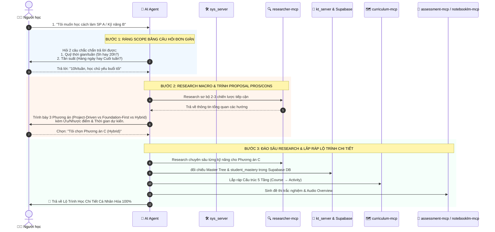

# 🚀 Quy Trình Đề Xuất Lộ Trình Học Thích Ứng (2-Phase Progressive Proposal Workflow)

Tài liệu này mô tả chi tiết trải nghiệm người dùng (UX) và quy trình vận hành 3 bước của AI Agent khi nhận yêu cầu lập lộ trình học tập từ người dùng.

---

## 🎯 1. Triết Lý Thiết Kế Trải Nghiệm (UX Design Principles)

1. **Giảm Tải Nhận Thức (Cognitive Load Reduction)**: Không bắt người học phải trả lời các câu hỏi kỹ thuật phức tạp ban đầu. Chỉ hỏi các câu hỏi phạm vi thực tế mà người học **chắc chắn trả lời được ngay** (quỹ thời gian, tần suất).
2. **Quyền Chủ Động Cho Người Học (User Agency via Proposal)**: AI Agent không lập tức sinh một lộ trình cứng nhắc, mà nghiên cứu sơ bộ và đưa ra **2-3 Phương Án Đề Xuất (Proposals) kèm Pros / Cons** để người học chủ động chọn hướng đi.
3. **Tiết Kiệm Tài Nguyên System (Lazy Deep-Research)**: Chỉ kích hoạt các tác vụ research chuyên sâu (quét chi tiết từng SIO, tạo bài tập quiz, sinh Audio Overview) sau khi người học đã chốt phương án tiếp cận.

---

## 🔄 2. Sơ Đồ Quy Trình 3 Bước Tương Tác

---

## 📝 3. Chi Tiết Các Bước Vận Hành

### 🔹 Bước 1: Ràng Phạm Vi Bằng Câu Hỏi Dễ (Scope Constraint Check)
Khi người dùng đưa ra mong muốn tự nhiên, Agent **chỉ hỏi tối đa 2-3 câu hỏi thực tế**:
- ⏱️ **Quỹ thời gian khả dụng**: *"Bạn có thể dành khoảng bao nhiêu giờ mỗi tuần cho lộ trình này?"* (VD: 3-5h/tuần hay 15-20h/tuần).
- 📅 **Tần suất học tập**: *"Bạn muốn học dàn trải mỗi ngày 45 phút hay học tập trung vào 2 ngày cuối tuần?"*
- 🎯 **Đầu ra kỳ vọng**: *"Bạn cần một sản phẩm chạy được ngay (MVP) hay cần nắm vững bản chất để đi phỏng vấn?"*

---

### 🔹 Bước 2: Research Sơ Bộ Macro & Trình Đề Xuất Pros / Cons (Proposal Grid)
Agent gọi `researcher_source(operation='search')` ở mức vĩ mô để xây dựng **3 Chiến Lược Đề Xuất**:

| Phương Án | Mô Tả Hướng Tiếp Cận | Ưu Điểm (Pros) | Nhược Điểm (Cons) | Thời Gian Dự Kiến |
| :--- | :--- | :--- | :--- | :---: |
| **Option A: Cấp Tốc (Project-Driven)** | Nhảy thẳng vào code sản phẩm thực tế, chỉ học các SIOs cú pháp cần thiết. | 🚀 Ra sản phẩm chạy được rất nhanh (MVP). | ⚠️ Dễ hổng kiến thức nền tảng & nguyên lý sâu. | 3 Tuần (30h) |
| **Option B: Bài Bản (Foundation-First)** | Học từ nguyên lý mạng, kiến trúc CSDL trước rồi mới xây dựng ứng dụng. | 🧠 Nắm vững bản chất, tư duy hệ thống vững chắc. | ⏳ Tốn nhiều thời gian hơn trước khi thấy kết quả. | 8 Tuần (80h) |
| **Option C: Thích Ung (Hybrid - Khuyên dùng)** | Làm dự án thực tế, hệ thống tự phát hiện & bù đắp các lỗ hổng tri thức nền. | ⚖️ Cân bằng giữa tốc độ tạo sản phẩm và độ sâu tri thức. | 🔄 Cần thực hiện các bài kiểm tra chẩn đoán ngắn. | 5 Tuần (50h) |

👉 *Agent dừng lại và mời Người học chọn 1 trong 3 phương án.*

---

### 🔹 Bước 3: Đào Sâu Research & Lắp Ráp Lộ Trình Chi Tiết (Deep Assembly)
Sau khi người học đã bấm chọn phương án (ví dụ: **Option C**):

1. **`researcher-mcp`**: Thực hiện deep research chi tiết từng Concept/LOs cho Option C.
2. **`kt_server` & Supabase DB**: Đối chiếu Master Knowledge Tree, kiểm tra `student_mastery` để loại bỏ LOs đã PASS, truy vấn `learning_objective_prerequisites` để tìm Shortest Path DAG.
3. **`curriculum-mcp`**: Lắp ráp cấu trúc 5 Tầng (`Course` $\rightarrow$ `Unit` $\rightarrow$ `Module` $\rightarrow$ `Lesson` $\rightarrow$ `Activity`).
4. **`assessment-mcp` & `notebooklm-mcp`**: Sinh bài tập trắc nghiệm, coding labs và Audio Overview Podcast.
