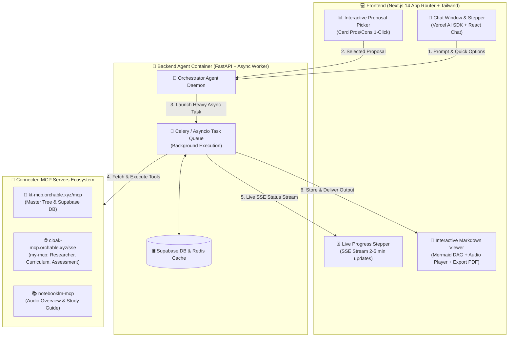

# 🏗️ Bản Thiết Kế Kiến Trúc Full-Stack & Triển Khai Hệ Thống (Full-Stack Implementation Architecture)

Tài liệu này mô tả chi tiết kiến trúc kỹ thuật Frontend, Backend, Agent Container và luồng giao tiếp 5 tầng để triển khai hệ thống **Adaptive Curriculum Generator**.

---

## 📐 1. Sơ Đồ Kiến Trúc Tổng Quan (System Architecture)

---

## 🎨 2. Frontend Implementation (Next.js 14 App Router)

### 🔹 Component 1: Chat Panel & Quick Option Buttons
- Trình bày câu hỏi từ Agent kèm các nút chọn sẵn `A`, `B`, `C` và ô gõ `D. Khác...`.
- Cho phép bấm chọn 1-click để gửi câu trả lời về Backend.

### 🔹 Component 2: Interactive Proposal Card (Bảng So Sánh Bước 2)
- Render 3 Card phương án (Cấp tốc vs Bài bản vs Thích ứng) hiển thị rõ:
  - Pros / Cons / Thời gian dự kiến.
  - Nút "Chọn Phương Án Này".

### 🔹 Component 3: Live Progress Stepper (Xử lý chờ 2-5 phút)
- Sử dụng Server-Sent Events (SSE) đẩy log tiến độ theo thời gian thực để người dùng không cảm thấy ứng dụng bị đơ:
  - `[0:15s]` 🔍 Agent đang cào dữ liệu từ 5 nguồn Web & Official Specs...
  - `[0:45s]` 🌿 Đang đối chiếu với Master Knowledge Tree & kiểm tra lỗ hổng tri thức...
  - `[1:30s]` 🗺️ Đang lắp ráp Cấu trúc 5 Tầng & sắp xếp Topological Sort...
  - `[2:30s]` 📝 Đang tạo bài tập trắc nghiệm & sinh Audio Overview...
  - `[3:00s]` ✅ Hoàn tất! Đang hiển thị bản thiết kế Curriculum.

### 🔹 Component 4: Interactive Curriculum Viewer
- Trực quan hóa file Markdown trả về:
  - **Sơ đồ Mermaid DAG**: Vẽ nhánh đồ thị tri thức tiền đề.
  - **Audio Player**: Nhúng Player nghe Audio Podcast tóm tắt từ `notebooklm-mcp`.
  - **Interactive Quiz**: Bài tập chọn đáp án trực tiếp.
  - **Export Options**: Xuất ra PDF / Notion / Markdown file.

---

## 🐳 3. Backend Agent Container Implementation

- **Công nghệ**: Python 3.11 + FastAPI + `fastmcp` client / Vercel AI SDK.
- **Container**: `adaptive-agent-service` chạy trên Docker Cloud VM.

### 🔄 Luồng xử lý chi tiết trong Agent:

1. **Phase 1 (Scope Constraint)**: Đọc Prompt, lấy `sys_get_prompt(name='grill_me')`, trả về câu hỏi chọn sẵn.
2. **Phase 2 (Macro Research & Proposal)**: Gọi `research_source(operation='search')` mức vĩ mô, tạo 3 Card proposal.
3. **Phase 3 (Deep Task Execution)**:
   - Đưa task vào Background Async Queue.
   - Gọi `research_evidence` & `research_synthesis` (Dựng Candidate DAG).
   - Gọi `kt_detect_gaps` & `kt_mine_prerequisites` (Đối chiếu Supabase Master Tree & `student_mastery`).
   - Gọi `curriculum_assemble` (Tạo cấu trúc 5 Tầng Course $\rightarrow$ Activity).
   - Gọi `assessment_generate_quiz` & `notebooklm_generate`.
   - Đóng gói file Markdown cuối cùng và lưu vào Supabase DB / Redis Cache.

---

## 💡 4. Các Gợi Ý Bổ Sung Hoàn Thiện

1. **Cơ chế Redis Result Caching**: Nếu 2 người dùng có cùng nhu cầu học và quỹ thời gian tương đồng, trả về kết quả cache chất lượng cao trong 2 giây thay vì chạy lại 5 phút.
2. **Lưu Vết Năng Lực (Student Mastery Tracking)**: Khi học viên bấm nút *"Đã hoàn thành bài này"*, hệ thống cập nhật vào bảng `student_mastery` trong Supabase để lần sau tạo lộ trình mới tự động bỏ qua.
3. **Chế độ Chỉnh Sửa Lộ Trình (Curriculum Fine-tuning)**: Cho phép người học chat thêm để điều chỉnh (*"Thêm cho tôi 1 bài về Redis Invalidation vào Unit 2"*).
