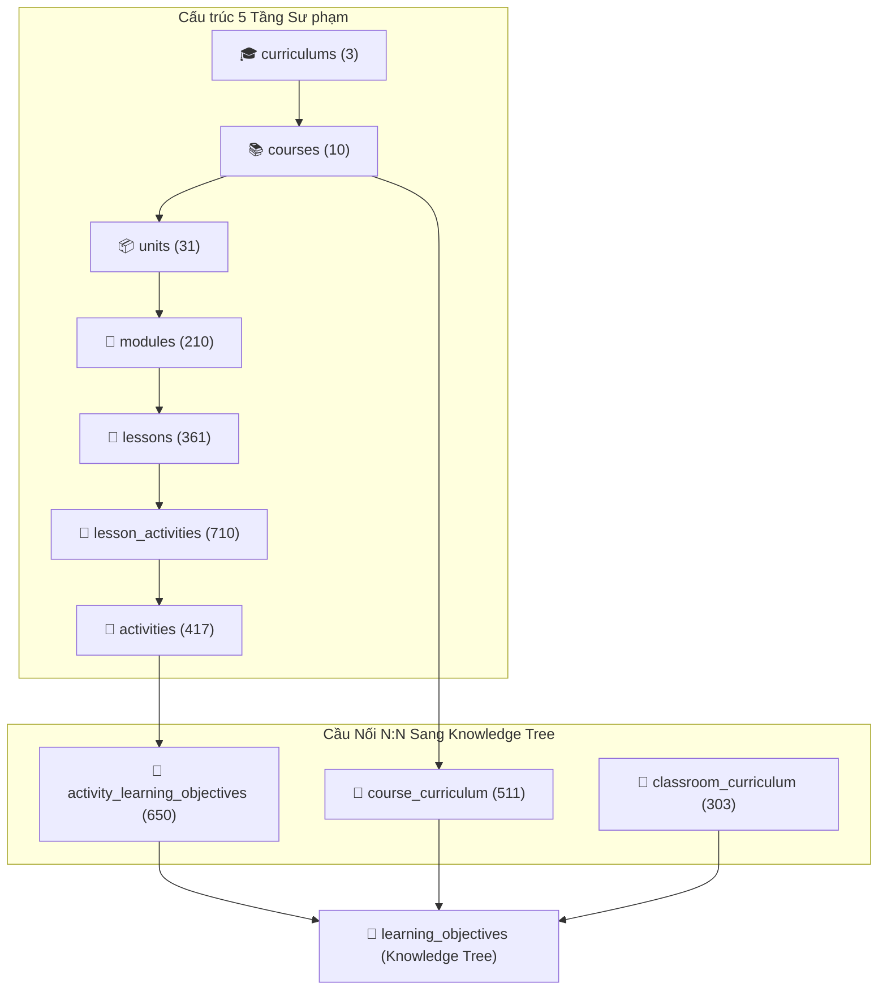
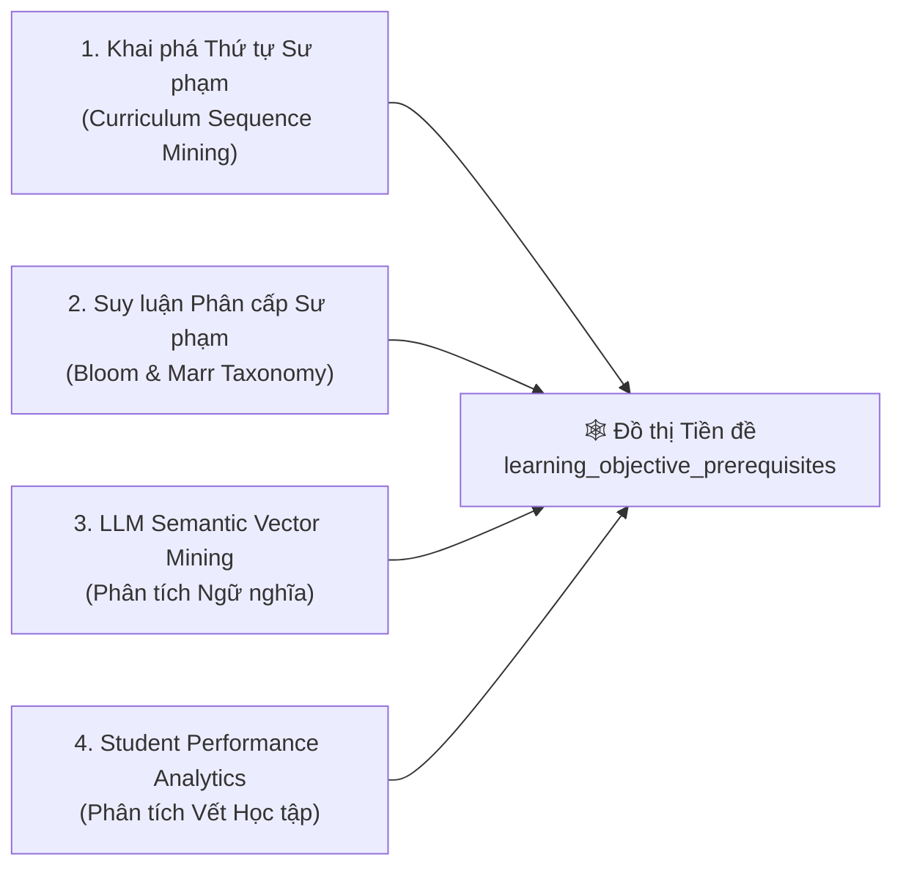

# 🗺️ Phân Tích Chuyên Sâu: Hệ Bảng Curriculum & Phương Pháp Xác Định Tiền Đề (Prerequisite Mining)

Tài liệu này nghiên cứu chuyên sâu cấu trúc **13 Bảng Curriculum** thực tế trong Supabase Cloud và **4 Phương pháp Khai phá Quan hệ Tiền đề (`prerequisite_lo_code`)**.

---

## 🏛️ 1. Hệ Thống 13 Bảng Curriculum Trong Supabase Cloud

Qua rà soát trực tiếp dữ liệu Supabase DB của dự án, hệ thống CSDL chứa **13 bảng Curriculum** hoạt động song song với 6 bảng Đồ thị Tri thức (Knowledge Tree):

### 📋 Bảng Thống Kê Số Lượng Bản Ghi & Vai Trò

| Tên Bảng | Số Bản Ghi | Các Cột Chính & Vai Trò |
| :--- | :---: | :--- |
| **`curriculums`** | 3 | Chương trình tổng thể (`id`, `code`, `name`, `description`). |
| **`courses`** | 10 | Khóa học (`id`, `code`, `name`, `curriculum_id`, `sequence_order`). |
| **`units`** | 31 | Học phần lớn (`id`, `course_id`, `name`, `sequence_order`). |
| **`modules`** | 210 | Mô-đun giảng dạy (`id`, `unit_id`, `name`, `sequence_order`). |
| **`lessons`** | 361 | Bài học cụ thể (`id`, `module_id`, `name`, `sequence_order`). |
| **`activities`** | 417 | Hoạt động học tập thực tế: Quiz, Reading, Video, Code Lab (`id`, `activity_type`, `sequence_order`). |
| **`lesson_activities`** | 710 | Junction N:N giữa `lessons` ↔ `activities` có `sequence_order`. |
| **`activity_default_resources`**| 1 | Tài nguyên mặc định gắn với activity. |
| **`activity_types`** | 22 | Phân loại hoạt động (Quiz, Video, Code Lab,...). |
| **`activity_learning_objectives`**| **650** | **Cầu nối N:N Cốt lõi**: Nối `activities` ↔ `learning_objectives`. |
| **`course_curriculum`** | **511** | Nối `courses` ↔ `learning_objectives` theo tuần (`week`) & `sequence_order`. |
| **`classroom_curriculum`** | 303 | Nối Lớp học ảo ↔ `learning_objectives`. |
| **`lesson_resources`** | 0 | Junction nối bài học với file/video tài nguyên. |

---

## 🔍 2. Bốn Phương Pháp Xác Định Quan Hệ Tiền Đề (`prerequisite_lo_code`)

Để biết một `LO_A` có phải là tiền đề bắt buộc của `LO_B` hay không, hệ thống áp dụng **4 kỹ thuật khai phá (Mining Techniques)** từ cứng đến mềm:

---

### 🟢 2.1 Khai phá Thứ tự Sư phạm (Curriculum Sequence Mining)
* **Nguyên lý**: Trong một khóa học (`Course`), bài học tuần trước diễn ra trước bài học tuần sau. Nếu `Activity_1` (gắn `LO_A`) xuất hiện ở `Week 1` và `Activity_2` (gắn `LO_B`) xuất hiện ở `Week 2`:
  $$\text{SequenceOrder}(\text{LO}_A) < \text{SequenceOrder}(\text{LO}_B) \implies \text{LO}_A \text{ là Ứng viên Tiền đề của } \text{LO}_B$$
* **Cách thực thi bằng SQL**:
  TRUY VẤN từ 511 bản ghi `course_curriculum` và 650 bản ghi `activity_learning_objectives` để tìm các cặp LO xuất hiện trước-sau trong cùng lộ trình.

---

### 🔵 2.2 Suy luận Phân cấp Sư phạm (Bloom & Marr Taxonomy Inferences)
* **Quy tắc Marr (ULO $\rightarrow$ CIO $\rightarrow$ SIO)**:
  - `parent_lo_code` tự động thiết lập: Để học `SIO` (Cú pháp Python/Swift cụ thể), người học **BẮT BUỘC** phải hiểu `CIO` (Mô hình thủ tục trung tính) và `ULO` (Khái niệm phổ quát).
  - $\implies$ `ULO` & `CIO` **tự động là tiền đề cứng (Hard Prerequisite)** của `SIO`.
* **Quy tắc Thang đo Bloom (Remember $\rightarrow$ Create)**:
  - Cùng trong một Concept, LO ở mức `Remember` / `Understand` **luôn luôn là tiền đề** cho LO ở mức `Apply` / `Analyze` / `Create`.

---

### 🟡 2.3 Phân Tích Ngữ Nghĩa Bằng LLM (Semantic LLM Dependency Mining)
* **Nguyên lý**: Sử dụng LLM đọc 2 mệnh đề câu mô tả (`"Người học có khả năng..."`):
  - **LO_A**: *"Người học có khả năng giải thích cấu trúc gói tin HTTP Headers."*
  - **LO_B**: *"Người học có khả năng thực hiện Caching với GraphQL DataLoader."*
* **LLM Prompt Evaluation**:
  LLM đánh giá mức độ phụ thuộc logic và trả về cặp: `(LO_A, LO_B, confidence_score: 0.95, dependency_type: "HARD")`.

---

### 🟣 2.4 Khai Phá Vết Học Tập Thực Tế (Statistical Mastery Analytics)
* **Nguyên lý**: Phân tích dữ liệu lịch sử nộp bài từ `student_mastery` và `submissions`:
  - Nếu **92% học sinh thất bại ở LO_B** khi chưa đạt **LO_A**, nhưng tỷ lệ thành công tăng lên **88% khi đã pass LO_A**:
  - $\rightarrow$ Thuật toán **Bayesian Knowledge Tracing (BKT)** xác nhận `LO_A` chính là **Tiền đề Thực chứng (Empirical Prerequisite)** của `LO_B`!

---

## 🛠️ 3. Kế Hoạch Đóng Gói Tool `kt_mine_prerequisites`

Tích hợp một MCP Tool mới vào Sub-server `kt`:
* **`kt_mine_prerequisites(course_code)`**: Tự động chạy thuật toán quét dữ liệu 511 dòng `course_curriculum` + 650 dòng `activity_learning_objectives` để đề xuất và chèn tự động các cặp tiền đề vào bảng `learning_objective_prerequisites` trong Supabase!
