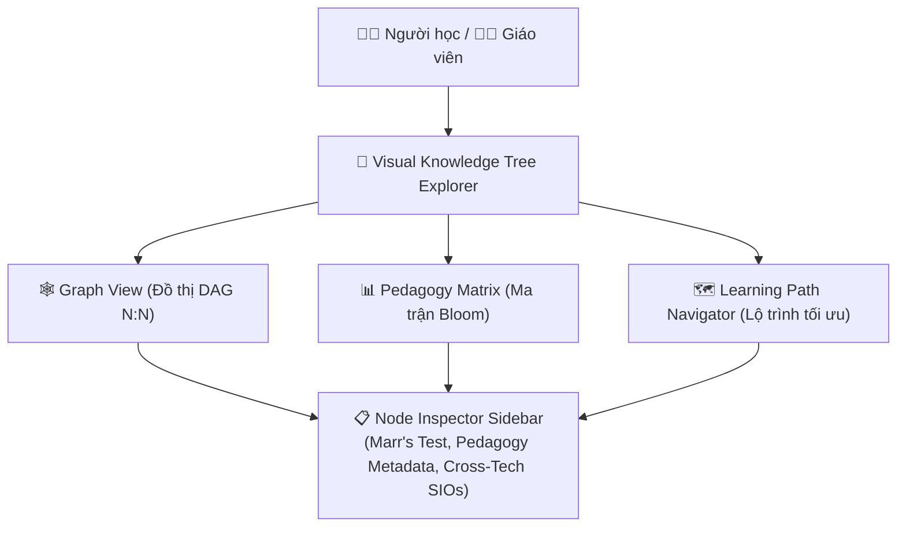
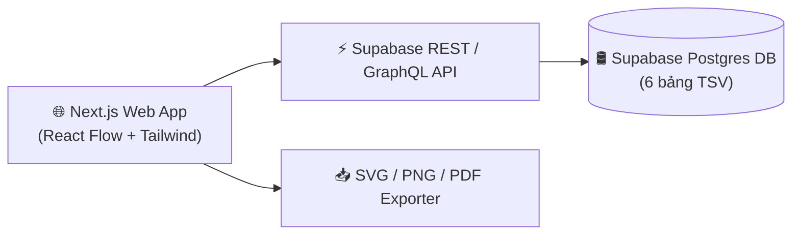

# 🎨 Đào Sâu Thiết Kế: Giao Diện Trực Quan Truy Vấn Cây Tri Thức (Visual Knowledge Tree Explorer)

Tài liệu này phân tích chuyên sâu kiến trúc, giao diện người dùng (UI/UX) và giải pháp kỹ thuật để xây dựng **Visual Knowledge Tree Explorer** — Giao diện trực quan hóa và truy vấn Đồ thị Tri thức đa chiều cho người học và giáo viên.

---

## 🎯 1. Mục Tiêu & Trải Nghiệm Người Dùng (UI/UX Concept)

Hệ thống cung cấp **3 chế độ xem đa chiều (Multi-View System)** giúp biến các file TSV/Cơ sở dữ liệu thô thành Đồ thị tương tác trực quan:

---

### 🎨 1.1 Chế Độ Xem Đồ Thị Tương Tác (Interactive Graph View)
* **Visual Nodes & Mã Màu**:
  - `Fields` (Màu Tím Hub) $\rightarrow$ `Subjects` (Màu Xanh Dương) $\rightarrow$ `Categories` (Màu Cyan) $\rightarrow$ `Topics` (Màu Xanh Lá) $\rightarrow$ `Concepts` (Màu Vàng) $\rightarrow$ `ULO/CIO/SIO` (Màu Cam / Đỏ).
  - Phân biệt rõ ràng: **ULO/CIO 100% Trung tính** (Icon chiếc khiên trung tính) và **SIO Công nghệ cụ thể** (Icon Logo Python, Swift, GraphQL,...).
* **Tương tác Đồ thị (Graph Interactions)**:
  - **Prerequisite Focus**: Click chọn 1 Node $\rightarrow$ Đồ thị tự động highlight chuỗi tri thức tiền đề (Prerequisite Nodes) và chuỗi phụ thuộc (Dependent Nodes), mờ đi các nhánh không liên quan.
  - **Dynamic Drill-Down**: Cho phép mở rộng / thu gọn (Expand / Collapse) cây từ cấp Field xuống tận SIO.
  - **Cross-Referencing Lines**: Đường nối N:N giữa các Concept dùng chung hoặc ULO/CIO dùng chung được vẽ dạng nét đứt có màu phân biệt.

---

### 📊 1.2 Chế Độ Ma Trận Sư Phạm (Pedagogy Matrix View)
Xếp toàn bộ `learning-objectives` của dự án vào ma trận 2 trục chuẩn Anderson & Krathwohl:

| Knowledge Dimension \ Cognitive Process | 1. Remember | 2. Understand | 3. Apply | 4. Analyze | 5. Evaluate | 6. Create |
| :--- | :---: | :---: | :---: | :---: | :---: | :---: |
| **FACTUAL** | 🟢 LO-01 | 🟢 LO-02 | — | — | — | — |
| **CONCEPTUAL** | — | 🔵 ULO-05 | 🔵 ULO-08 | 🔵 ULO-12 | — | — |
| **PROCEDURAL** | — | — | 🟡 CIO-03 | 🟡 CIO-09 | 🟡 CIO-15 | — |
| **METACOGNITIVE** | — | — | — | — | 🟣 ULO-20 | 🟣 ULO-22 |

* **Heatmap Cảnh Báo**: Các ô quá ít LOs sẽ bị tô màu đỏ/vàng để cảnh báo Giáo viên rằng cây tri thức đang bị "hút tự nhiên" về các mức Bloom thấp (Remember/Understand).

---

### 🗺️ 1.3 Lộ Trình Học Tối Ưu (Learning Path Navigator)
* Người học tick chọn 1 hoặc nhiều mục tiêu mong muốn (ví dụ: *"Tôi muốn làm chủ GraphQL Caching"*).
* Thuật toán **Shortest Path DAG** tự động tìm và vẽ ra **Con đường ngắn nhất** chứa chính xác các Node tiền đề cần học, bỏ qua các tri thức dư thừa.

---

### 📋 1.4 Bảng Chi Tiết Node (Node Inspector Sidebar)
Khi click chọn bất kỳ Node nào trên Đồ thị, một Bảng Side Panel trượt ra hiển thị:
1. **Thông tin chuẩn hóa**: Mã, Tên, Câu mô tả bắt đầu bằng `"Người học có khả năng..."`.
2. **Marr's 2-Language Test**: Đối với CIO, hiển thị bảng kiểm tra độc lập cú pháp (Mô tả khớp tự nhiên $\ge 2$ ngôn ngữ khác nhau).
3. **Cross-Tech SIO Mapping**: Hiển thị danh sách các SIO tương đương trên nhiều cây công nghệ khác nhau (Ví dụ: CIO "Xử lý bất đồng bộ" $\rightarrow$ SIO `async/await` Python, `async/await` Swift, `Promise` JS).
4. **Direct Assessment Coverage**: Danh sách các câu hỏi/quiz kiểm traRelational Understanding trực tiếp.

---

## ⚡ 2. Kế Hoạch Triển Khai Kỹ Thuật (Tech Stack & Architecture)

### 🔹 Phương Án A: Standalone Web App (Next.js + React Flow + Supabase)
Đây là giải pháp chuyên nghiệp nhất cho trải nghiệm người dùng Web App full-featured.

* **Frontend**: Next.js 14 (App Router), React Flow / Cytoscape.js (Dựng đồ thị DAG), Tailwind CSS, Lucide Icons, Zustand (State Management).
* **Backend / Database**: Supabase Postgres API + PostgREST (Truy vấn dữ liệu từ 6 bảng TSV đã sync).
* **Search Engine**: Fuse.js (Fuzzy Client-Side Search) hoặc Supabase Full-Text Search / pgvector (Search ngữ nghĩa).

#### Sơ đồ Kiến trúc Standalone Web App:

---

### 🔹 Phương Án B: Embedded FastMCP v3 Generative UI / Prefab App
Đây là giải pháp nhúng trực tiếp giao diện đồ thị vào **cửa sổ Chat của AI Agent** (Cursor, Claude Desktop, Antigravity) mà không cần mở trình duyệt ngoài.

* **FastMCP v3 Feature**: `@mcp.tool(app=True)` hoặc `PrefabApp`.
* **Cách hoạt động**:
  1. Người dùng chat với AI: *"Hãy vẽ đồ thị tri thức của dự án swift-associate"*.
  2. Agent gọi MCP Tool: `kt_visualize_tree(project_name="swift-associate")`.
  3. MCP Server trả về một HTML/React Prefab Component render SVG/D3.js Đồ thị tương tác ngay trong giao diện chat.

---

## 🚀 3. Lộ Trình Triển Khai (Implementation Roadmap)

### Giai đoạn 1: Dựng Core API & Graph Parser (Tuần 1)
- Viết API trích xuất Đồ thị DAG từ 6 bảng Supabase (Nodes & Edges JSON).
- Thêm thuộc tính phân loại màu sắc và danh sách tiền đề (`prerequisites`).

### Giai đoạn 2: Phát triển Component React Flow (Tuần 2)
- Khởi tạo dự án Next.js tại `apps/visualizer/` hoặc `web/`.
- Tích hợp `ReactFlow` với Custom Node components đại diện cho 6 cấp tri thức.
- Cài đặt tính năng Zoom, Pan, Search Bar & Node Inspector Sidebar.

### Giai đoạn 3: Tích hợp Pedagogy Matrix & Path Navigator (Tuần 3)
- Dựng giao diện Ma trận Bloom 2 chiều với Heatmap màu.
- Cài đặt thuật toán tìm đường đi ngắn nhất (Dijkstra / DAG Topological Sort) cho Learning Path Navigator.

### Giai đoạn 4: Đóng gói FastMCP Prefab App (Tuần 4)
- Triển khai `@kt_mcp.tool(app=True)` để phục vụ giao diện đồ thị trực tiếp cho AI Agent qua MCP.
