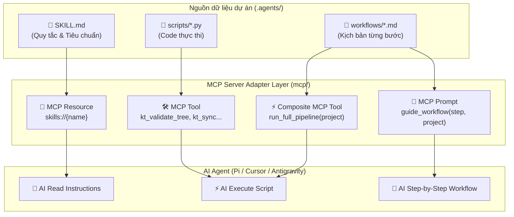

# 📖 Hướng Dẫn Kiến Trúc Multi-MCP Hub & Cách Serve Skills/Workflows

Tài liệu này hướng dẫn chi tiết về:
1. Cách bổ sung một **MCP Sub-Server mới** (ví dụ: `analytics`, `crawler`, `git_manager`,...) vào **Multi-MCP Hub**.
2. Cơ chế MCP Server **"Serve" các Skills & Workflows** sẵn có trong thư mục `.agents/` cho các AI Agent (Pi, Cursor, Claude Desktop, Antigravity,...).

---

## 🏗️ 1. Tổng Quan Kiến Trúc Multi-MCP Hub

Hệ thống sử dụng mô hình **FastMCP Server Composition (`mount()`)**:

```tree
knowledge-tree/
├── mcp/
│   ├── main.py                  # Entrypoint chính (Hub gom tất cả sub-servers)
│   └── servers/                 # Thư mục chứa các Sub-MCP Servers độc lập
│       ├── kt_server.py         # Sub-Server #1: Knowledge Tree Tools (kt_*)
│       ├── system_server.py     # Sub-Server #2: System Tools & Resources (sys_*)
│       └── <domain>_server.py   # Sub-Server Mới Của Bạn (<namespace>_*)
├── .agents/
│   ├── skills/                  # Nguồn chứa Skills (SKILL.md & scripts/*.py)
│   └── workflows/               # Nguồn chứa Workflows (*.md)
```

- **Tất cả các Sub-Server** đều chạy chung trong **1 container Docker duy nhất** tại cổng `8888` (endpoint `/mcp`).
- Mỗi Sub-Server được gán 1 **`namespace`** riêng để tự động tiền tố hoá tên Tool (tránh đụng độ tên giữa các server).

---

## 🧠 2. Cơ Chế MCP Server Serve Skills & Workflows Như Thế Nào?

MCP Server đóng vai trò là **Bộ chuyển đổi (Adapter Layer)**. Nó lấy dữ liệu từ `.agents/skills/` và `.agents/workflows/` rồi đóng gói thành 3 primitive chuẩn của MCP Protocol: **Resources**, **Tools**, và **Prompts**.



---

### A. Cách MCP Server Serve **Skills**

Mỗi Skill trong `.agents/skills/` gồm 2 thành phần và được MCP Server chuyển đổi như sau:

| Thành phần trong Skill | Định dạng gốc | Được MCP Server Serve thành | Cách thức hoạt động |
| :--- | :--- | :--- | :--- |
| **Phần Hướng dẫn tư duy** | `SKILL.md` | **MCP Resource** (`skills://{name}`) | Agent gọi URI `skills://tree-validator`. MCP Server đọc file [SKILL.md](file:///Users/tonypham/MEGA/WebApp/content-gen/knowledge-tree/.agents/skills/tree-validator/SKILL.md) nạp vào bộ nhớ Context của Agent. |
| **Phần Mã nguồn thực thi** | `scripts/*.py` | **MCP Tool** (`kt_validate_tree`,...) | Agent phát lệnh gọi Tool `kt_validate_tree`. MCP Server khởi chạy subprocess chạy file `validate_tree.py` và trả kết quả về cho Agent. |

#### Minh họa Code trong MCP Server (`mcp/servers/system_server.py` & `kt_server.py`):
```python
# 1. Serve phần Hướng dẫn SKILL.md dưới dạng MCP Resource
@sys_mcp.resource("skills://{skill_name}")
def get_skill_doc(skill_name: str) -> str:
    skill_file = SKILLS_DIR / skill_name / "SKILL.md"
    return skill_file.read_text(encoding="utf-8")

# 2. Serve phần Script thực thi dưới dạng MCP Tool
@kt_mcp.tool
def validate_tree(project_name: str, fix: bool = False) -> str:
    script_path = SKILLS_DIR / "tree-validator" / "scripts" / "validate_tree.py"
    res = subprocess.run([sys.executable, str(script_path), "--project", project_name, ...])
    return res.stdout
```

---

### B. Cách MCP Server Serve **Workflows**

Các kịch bản làm việc nhiều bước trong `.agents/workflows/*.md` (như `init.md`, `map-taxonomy.md`, `build-tree.md`) được MCP Server phục vụ theo 2 chế độ:

1. **MCP Prompts (`guide_workflow`)**: Render file `workflows/<step>.md` thành System Prompt hướng dẫn kịch bản từng bước cho Agent làm theo.
2. **Composite MCP Tools (`run_full_pipeline`)**: Tự động hóa liên hoàn 1-Click. MCP Server tự gọi chuỗi 4-5 bước công việc và trả về báo cáo tổng hợp.

#### Minh họa Code trong MCP Server (`mcp/servers/system_server.py`):
```python
@sys_mcp.prompt
def guide_workflow(step_name: str, project_name: str) -> str:
    """Render file workflow .md thành kịch bản hướng dẫn cho Agent."""
    wf_file = ROOT_DIR / ".agents" / "workflows" / f"{step_name}.md"
    if wf_file.exists():
        return wf_file.read_text(encoding="utf-8").replace("<project>", project_name)
    return "Workflow không tồn tại."
```

---

## 🚀 3. Quy Trình 3 Bước Thêm MCP Sub-Server Mới

### Bước 1: Tạo File Sub-Server Mới
Tạo một file Python mới trong thư mục [mcp/servers/](file:///Users/tonypham/MEGA/WebApp/content-gen/knowledge-tree/mcp/servers/), ví dụ: `mcp/servers/analytics_server.py`:

```python
#!/usr/bin/env python3
"""
Sub-MCP Server: Analytics & Metrics (analytics)
"""
from fastmcp import FastMCP

analytics_mcp = FastMCP("AnalyticsOps")

# 1. Định nghĩa Tool thực thi
@analytics_mcp.tool
def get_project_stats(project_name: str) -> str:
    """Trả về thống kê số lượng LOs, Concepts, Topics của dự án."""
    return f"Stats for {project_name}: 120 LOs, 45 Concepts."

# 2. Định nghĩa Resource đọc tài nguyên
@analytics_mcp.resource("analytics://summary")
def get_global_analytics_summary() -> str:
    """Tài nguyên thống kê tổng quan toàn hệ thống."""
    return "Global Summary: 15 Active Projects."

# 3. Định nghĩa Prompt kịch bản mẫu
@analytics_mcp.prompt
def suggest_analytics_queries() -> str:
    """Prompt mẫu gợi ý truy vấn phân tích."""
    return "Hãy phân tích độ phủ tri thức của dự án roadmap_sh_graphql."
```

---

### Bước 2: Đăng Ký (Mount) Vào Hub Chính (`mcp/main.py`)
Mở file [mcp/main.py](file:///Users/tonypham/MEGA/WebApp/content-gen/knowledge-tree/mcp/main.py) và thêm 2 dòng để import & mount sub-server mới:

```python
# 1. Import sub-server mới từ mcp/servers/
from servers.analytics_server import analytics_mcp

# 2. Mount vào Hub với namespace tương ứng (ví dụ: 'analytics')
hub.mount(analytics_mcp, namespace="analytics")
```

*(Sau bước này, các Tool của `analytics_mcp` sẽ tự động mang tiền tố `analytics_`, ví dụ: `analytics_get_project_stats`)*.

---

### Bước 3: Deploy & Kiểm Trụ

#### A. Chạy thử nghiệm Local:
```bash
uv run python mcp/main.py --help
```

#### B. Synchronize & Deploy lên Oracle Cloud VM:
1. Sync mã nguồn mới lên máy chủ từ máy local:
   ```bash
   rsync -avz -e "ssh -i /path/to/ssh-key.key" --exclude='.git' --exclude='.venv' /path/to/knowledge-tree/ ubuntu@140.245.127.64:/home/ubuntu/knowledge-tree/
   ```

2. Khởi chạy lại Docker Container trên VM:
   ```bash
   ssh -i /path/to/ssh-key.key ubuntu@140.245.127.64 "cd /home/ubuntu/knowledge-tree && docker compose up -d --build"
   ```

3. Kiểm tra thông tin Health Endpoint:
   ```bash
   curl http://localhost:8888/health
   ```
   **Kết quả mong đợi**:
   ```json
   {
     "status": "healthy",
     "service": "Multi-MCP Hub Server",
     "version": "0.2.0",
     "mounted_servers": ["kt", "sys", "analytics"]
   }
   ```

---

## 🤖 4. Sử Dụng Phía Agent / Client (Cursor, Pi, Claude Desktop)

File `.mcp.json` trên Client giữ nguyên không cần đổi URL:

```json
{
  "mcpServers": {
    "knowledge-tree-hub": {
      "url": "http://localhost:8888/mcp"
    }
  }
}
```

Agent sẽ tự động nhận diện và liệt kê bộ công cụ `analytics_*` bên cạnh `kt_*` và `sys_*`.

---

## 📌 Các Quy Tắc Cần Nhớ (Best Practices)
1. **Đặt tên Namespace ngắn gọn**: Nên dùng tên ngắn gọn, rõ nghĩa (`kt`, `db`, `sys`, `git`, `ai`).
2. **Pydantic / Type Hints**: Luôn chỉ định kiểu dữ liệu (`project_name: str`, `fix: bool = False`) và viết docstring đầy đủ cho từng `@mcp.tool`. AI Agent sẽ đọc docstring này làm chỉ dẫn sử dụng tool.
3. **Thư viện phụ**: Nếu sub-server mới cần thêm thư viện Python bên ngoài, hãy nhớ thêm vào file [pyproject.toml](file:///Users/tonypham/MEGA/WebApp/content-gen/knowledge-tree/pyproject.toml) trước khi deploy Docker.
