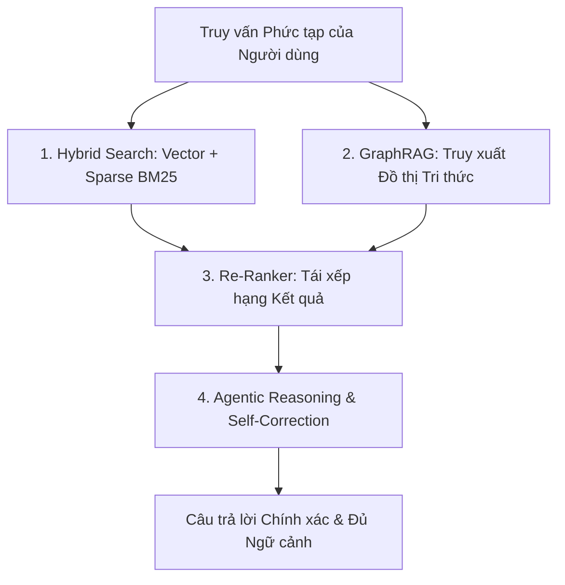

# Thế Hệ RAG Mới: Sự Trỗi Dậy Của GraphRAG, Hybrid Search Và Retrieval Engineering (2026)

*Tác giả: Antigravity AI & Knowledge Tree Tech Research*  
*Ngày đăng: 02/08/2026*  
*Chủ đề: Advanced RAG, GraphRAG, Hybrid Search, Vector Databases, Retrieval Engineering*

---

> **Tóm tắt Kỹ thuật:**  
> Đã qua rồi thời kỳ của "Naive RAG" — nơi người ta chỉ đơn thuần cắt đoạn văn bản (chunking), nhúng vector (embedding) và tìm kiếm độ tương tự Cosine đơn giản. Bước sang năm 2026, kiến trúc RAG doanh nghiệp đã lột xác thành **Modular & Agentic RAG**, kết hợp **Đồ thị Tri thức (GraphRAG)** và **Tìm kiếm Lai (Hybrid Search)** để giải quyết dứt điểm bài toán suy luận ngữ cảnh phức tạp.

---

---

## 1. Từ "Naive RAG" Đến Kiến Trúc Modular & Agentic RAG

Các hệ thống RAG thế hệ thứ nhất (2023–2024) bộc lộ nhiều điểm yếu khi đối mặt với dữ liệu doanh nghiệp: mất ngữ cảnh toàn cục, không giải quyết được các câu hỏi đa bước (multi-hop) và dễ bị hiện tượng bịa đặt (hallucination).

### So sánh Sự Tiến hóa Kiến trúc RAG:

| Tiêu chí | Naive RAG (2023–2024) | Advanced & Agentic RAG (2026) |
| :--- | :--- | :--- |
| **Quy trình Truy xuất** | Đơn bước tuyến tính (Single-step) | Đa bước, Tuần hoàn & Tự điều chỉnh (Agentic Loop) |
| **Phương pháp Tìm kiếm** | Thuần Vector Search (Cosine Similarity) | Tìm kiếm Lai (Hybrid: Vector + Sparse BM25) + GraphRAG |
| **Lớp Hạ tầng** | Cơ sở dữ liệu Vector chuyên biệt lập dị | Vector Extension trực tiếp trong SQL RDBMS (PostgreSQL) |
| **Đánh giá Hiệu năng** | Đánh giá cảm tính (Vibes-based) | Đánh giá định lượng chuẩn hóa (RAGAS, Recall@K, nDCG) |
| **Trọng tâm Kỹ thuật** | Chọn lựa Model LLM | **Retrieval Engineering** (Chất lượng Truy xuất) |

---

## 2. GraphRAG: Giải Quyết Bài Toán Suy Luận Đa Bước (Multi-Hop Reasoning)

Tìm kiếm vector truyền thống hoạt động dựa trên sự tương đồng ngữ nghĩa giữa các đoạn văn bản độc lập. Tuy nhiên, nó thất bại khi cần kết nối các thực thể nằm ở các tài liệu khác nhau.

**GraphRAG (Knowledge Graph-Augmented Generation)** giải quyết triệt để vấn đề này:
* **Xây dựng Đồ thị Thực thể (Entity-Relation Graph):** Trích xuất các thực thể (Entities), mối quan hệ (Relationships) và cụm chủ đề (Communities) từ toàn bộ kho tài liệu.
* **Tổng hợp Ngữ cảnh Toàn cục (Global Context Summarization):** Khi nhận được truy vấn tổng quan (ví dụ: *"Tóm tắt toàn bộ tác động của chính sách X đối với dự án Y"*), GraphRAG truy vấn trên đồ thị tri thức để cung cấp góc nhìn toàn cảnh mà vector search thông thường bỏ sót.

---

## 3. Hybrid Search: Sự Kết Hợp Giữa Dense Vector & Sparse Keyword (BM25)

Năm 2026 khẳng định rằng **không một phương pháp tìm kiếm đơn lẻ nào là hoàn hảo**:
* **Dense Vector Search:** Giỏi bắt cú pháp tương đồng ngữ nghĩa, nhưng dở khi tìm kiếm từ khóa chính xác (mã sản phẩm, tên riêng, thuật ngữ kỹ thuật đặc thù).
* **Sparse Keyword Search (BM25):** Giỏi khớp chính xác từ khóa, nhưng không hiểu được ngữ cảnh đồng nghĩa.

**Giải pháp 2026: Hybrid Search + Re-Ranking**
1. Thực hiện song song Dense Vector Search và Sparse BM25 Search.
2. Kết hợp kết quả bằng thuật toán **Reciprocal Rank Fusion (RRF)**.
3. Chạy qua mô hình **Re-Ranker (Cross-Encoder)** để chọn ra Top-K kết quả có độ liên quan cao nhất trước khi đưa vào LLM.

---

## 4. Vector Như Một Kiểu Dữ Liệu (Vector as a Data Type) Trong RDBMS

Một xu hướng hạ tầng rõ rệt năm 2026 là sự hội tụ của Cơ sở dữ liệu:

* Các doanh nghiệp không còn duy trì một Vector DB riêng biệt độc lập bên cạnh SQL DB truyền thống để tránh rủi ro đồng bộ dữ liệu.
* **Vector Extensions trong RDBMS (như `pgvector` trên PostgreSQL)** đã trở thành chuẩn mặc định. Kiểu dữ liệu `VECTOR` được xử lý như một cột dữ liệu thông thường bên cạnh các bảng quan hệ, cho phép thực hiện các câu lệnh `JOIN` và truy vấn kết hợp SQL + Vector vô cùng mạnh mẽ.

---

## 5. Đánh Giá Định Lượng RAG (Retrieval Engineering & RAGAS)

Chất lượng của hệ thống AI Sinh năm 2026 không còn được đo bằng cảm tính. Khái niệm **Retrieval Engineering** yêu cầu đo lường chi tiết 4 chỉ số cốt lõi (Khung RAGAS):

1. **Faithfulness (Tính Trung thực):** Câu trả lời có căn cứ hoàn toàn vào ngữ cảnh được truy xuất hay không?
2. **Answer Relevance (Độ Liên quan của Câu trả lời):** Câu trả lời có giải quyết đúng trọng tâm câu hỏi của người dùng không?
3. **Context Recall (Độ Phủ Ngữ cảnh):** Khâu truy xuất có lấy đủ thông tin cần thiết từ cơ sở tri thức không?
4. **Context Precision (Độ Chính xác Ngữ cảnh):** Các đoạn văn bản được truy xuất có chứa nhiều nhiễu hay không?

---

## 🎯 Lộ Trình Triển Khai Cho Kiến Trúc Sư Phần Mềm

1. **Chuyển sang Hybrid Search ngay lập tức:** Kết hợp BM25 + Vector Search + Re-Ranker để tăng 30-40% độ chính xác truy xuất.
2. **Áp dụng GraphRAG cho dữ liệu phức tạp:** Xây dựng Đồ thị Tri thức bổ trợ cho các bài toán phân tích tài liệu tài chính, pháp lý và kỹ thuật.
3. **Thiết lập Pipeline Đánh giá RAGAS:** Tự động hóa kiểm thử đo lường `Recall@K` và `Context Precision` trong quy trình CI/CD.

---

## 📚 Tài Liệu Tham Chiếu & Link Dẫn Chứng (Citations & Primary Sources)

1. **Microsoft GraphRAG Project**:  
   - Mã nguồn mở & Dự án Nghiên cứu GraphRAG của Microsoft: [Microsoft GraphRAG GitHub Repository](https://github.com/microsoft/graphrag)  
   - Báo cáo khoa học về Knowledge Graph-Augmented Generation: [GraphRAG Research Paper](https://arxiv.org/abs/2404.16130)
2. **RAGAS Evaluation Framework**:  
   - Khung kiểm thử & Đo lường chất lượng RAG (Retrieval-Augmented Generation Assessment): [RAGAS Framework GitHub](https://github.com/explodinggradients/ragas)
3. **PostgreSQL pgvector Extension**:  
   - Dự án tích hợp Vector as a Data Type vào RDBMS: [pgvector Extension GitHub](https://github.com/pgvector/pgvector)
4. **TuringPost & Medium State of RAG 2026**:  
   - Phân tích xu hướng từ Naive RAG sang Agentic & Hybrid RAG: [TuringPost AI Research](https://www.turingpost.com/)
