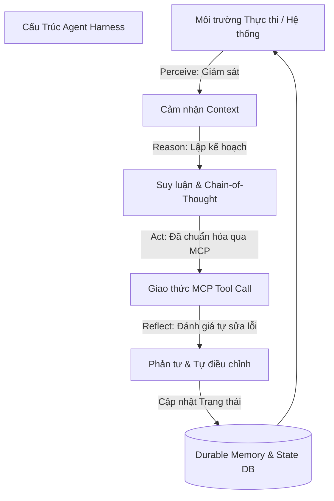

# Kỷ Nguyên Agent Harness Engineering: Từ Model-Centric Đến State & Multi-Agent Orchestration (2026)

*Tác giả: Antigravity AI & Knowledge Tree Tech Research*  
*Ngày đăng: 02/08/2026*  
*Chủ đề: Agentic AI, Model Context Protocol (MCP), Agent Harness, State Management*

---

> **Tóm tắt Kỹ thuật:**  
> Trong năm 2024–2025, ngành công nghiệp tập trung vào việc "babysitting" từng mô hình đơn lẻ thông qua kỹ thuật Prompt Engineering. Bước sang giữa năm 2026, trọng tâm kỹ thuật đã chuyển dịch hoàn toàn sang **Agent Harness Engineering** — hạ tầng phần mềm quản lý trạng thái bền vững (Durable State), điều khiển đa tác nhân (Multi-Agent Orchestration) và chuẩn hóa giao thức gọi công cụ qua **Model Context Protocol (MCP)**.

---

---

## 1. Sự Thoái Trào Của Model-Centric & Sự Trỗi Dậy Của Agent Harness

Năm 2026 ghi nhận bước ngoặt trong tư duy thiết kế phần mềm AI: **Mô hình AI (LLM) chỉ là động cơ tính toán, còn Agent Harness mới là khung gầm tạo nên sự tin cậy.**

### Sự khác biệt giữa 2025 và 2026:
| Tiêu chí | 2025 Focus (Model-Centric) | 2026 Focus (Harness Engineering) |
| :--- | :--- | :--- |
| **Trọng tâm** | Context Engineering (Nhồi nhét prompt vào 1 model) | Harness Engineering (Điều phối hệ thống đa tác nhân) |
| **Giao tiếp Công cụ** | Gọi API ad-hoc / Custom Tool parsers | Giao thức Chuẩn hóa **Model Context Protocol (MCP)** |
| **Trạng thái (State)** | Ephemeral / Tạm thời trong phiên chat | Bền vững (Durable State / Persistent Storage) |
| **Mục tiêu** | Thực thi bài toán đơn lẻ | Tự chủ dài hạn trên các bài toán quy mô lớn |

---

## 2. Vòng Lập Tự Chủ Cốt Lõi: Chu Kỳ PRAR (Perceive, Reason, Act, Reflect)

Kiến trúc các Agent thế hệ 2026 vận hành theo chu kỳ tự chủ khép kín **PRAR**:

1. **Perceive (Cảm nhận):** Thu thập bối cảnh từ môi trường, trạng thái nhiệm vụ hiện tại và log hệ thống.
2. **Reason (Suy luận & Lập kế hoạch):** Phân rã bài toán lớn thành chuỗi bài toán con (Sub-task Planning) sử dụng Chain-of-Thought.
3. **Act (Hành động qua MCP):** Kích hoạt công cụ ngoại vi (CLI, Database, API) thông qua giao thức chuẩn **MCP**.
4. **Reflect (Phản tư & Tự kiểm định):** Đánh giá kết quả trả về từ công cụ. Nếu phát hiện lỗi hoặc không đạt tiêu chí chấp nhận, Agent tự động thay đổi chiến thuật và thực hiện lại.

---

## 3. Chuẩn Hóa Giao Thức Kế Thừa: Model Context Protocol (MCP)

Một trong những cột mốc quan trọng nhất của năm 2026 là việc **Model Context Protocol (MCP)** trở thành chuẩn công nghiệp mặc định.

### Tại sao MCP lại quan trọng?
* **Xóa bỏ các tích hợp Ad-hoc:** Trước đây, mỗi framework AI phải tự viết connector riêng cho PostgreSQL, GitHub hay Jira. Với MCP, nhà phát triển chỉ cần viết **MCP Server** một lần duy nhất, và mọi Agent/IDE (Cursor, Cline, Custom Agents) đều có thể kết nối an toàn.
* **Bảo mật & Phân quyền (Governance-by-Design):** MCP định nghĩa rõ ràng ranh giới truy cập tài nguyên (Resources), công cụ (Tools) và câu lệnh (Prompts), ngăn chặn nguy cơ rò rỉ dữ liệu trong hệ thống đa tác nhân.

---

## 4. Quản Lý Trạng Thái Bền Vững (Durable State) & Bộ Nhớ Đa Tầng

Các Agent đời đầu hoàn toàn "mất trí nhớ" khi phiên làm việc bị ngắt kết nối. Trong năm 2026, **State Management** được nâng cấp lên chuẩn doanh nghiệp:

* **Phân tách Trạng thái (Separation of State):**
  * *Trạng thái có cấu trúc (Structured State):* Lưu trữ tiến độ bài toán, danh sách sub-tasks dưới dạng JSON/YAML trong PostgreSQL/Cassandra.
  * *Trạng thái phi cấu trúc (Unstructured State):* Lưu trữ nhật ký suy luận, ghi chú trung gian và ngữ cảnh lịch sử.
* **Bộ nhớ Đa tầng (Multi-Layered Memory):**
  * *Short-Term Memory:* Ngữ cảnh phiên làm việc hiện tại.
  * *Long-Term Memory:* Tri thức tích lũy qua các lần chạy trước, được tối ưu bằng cơ chế **Suy hao Bộ nhớ (Memory Decay)** và **Truy xuất Trọng số (Weighted Memory Retrieval)**.

---

## 5. Mô Hình Điều Phối: Orchestrator-Worker & Graph Workflows

Để giải quyết các bài toán phức tạp vượt quá cửa sổ ngữ cảnh của một model đơn lẻ, kiến trúc Agent 2026 ưu tiên 2 mô hình:

1. **Mô hình Orchestrator-Worker:** Một Agent trung tâm (Orchestrator) giữ vai trò quản lý, phân rã công việc và giao cho các Worker Agent chuyên biệt (Scout, Coder, Reviewer), sau đó tổng hợp kết quả cuối cùng.
2. **Luồng Công Việc Dạng Đồ Thị (Graph-Based Workflows):** Thay vì các chuỗi tuyến tính cứng nhắc (Linear Chains), các hệ thống sử dụng đồ thị có hướng (như LangGraph) cho phép Agent quay lại các node trước đó để tái lập kế hoạch khi gặp sự cố.

---

## 🎯 Kết Luận & Hướng Đi Cho Nhà Phát Triển

* **Ngừng phụ thuộc vào 1 Model duy nhất:** Hãy tập trung xây dựng **Agent Harness** vững chắc với khả năng lưu trữ trạng thái bền vững và tự sửa lỗi.
* **Đầu tư vào chuẩn MCP:** Chuẩn hóa toàn bộ công cụ nội bộ thành **MCP Servers** để sẵn sàng tích hợp với bất kỳ Agentic Framework nào.

---

## 📚 Tài Liệu Tham Chiếu & Link Dẫn Chứng (Citations & Primary Sources)

1. **Model Context Protocol (MCP) Specification**:  
   - Trang chủ chính thức & Tài liệu kỹ thuật MCP: [Model Context Protocol Specification](https://modelcontextprotocol.io/)  
   - Mã nguồn mở & MCP SDKs trên GitHub: [Model Context Protocol GitHub Repository](https://github.com/modelcontextprotocol)
2. **Hệ thống Đa tác nhân & Agentic Orchestration**:  
   - LangChain Multi-Agent Architecture & Graph Workflows: [LangGraph & Agentic Systems Documentation](https://www.langchain.com/)  
   - JetBrains Research on Agentic AI Engineering (2026): [JetBrains AI Agent Research](https://www.jetbrains.com/)
3. **Nghiên cứu về State Management & Persistent Memory**:  
   - Firecrawl & Stack AI Infrastructure Reports: [Firecrawl Agentic Infrastructure](https://www.firecrawl.dev/) | [Stack AI Multi-Agent Workflows](https://www.stackai.com/)
