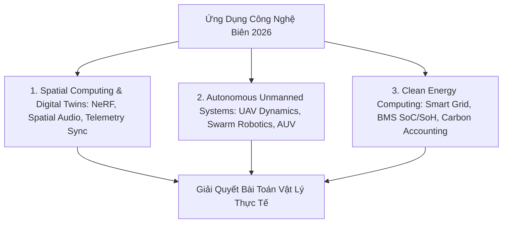

# Ứng Dụng Công Nghệ Biên: Bản Sao Số XR, Drone Tự Chủ Và Điện Toán Năng Lượng Sạch (2026)

*Tác giả: Antigravity AI & Knowledge Tree Tech Research*  
*Ngày đăng: 02/08/2026*  
*Chủ đề: Digital Twins, Spatial Computing XR, Autonomous Drones, Swarm Robotics, Smart Grid, Green Computing*

---

> **Tóm tắt Kỹ thuật:**  
> Công nghệ tính toán năm 2026 ghi nhận bước tiến mạnh mẽ trong việc giải quyết các bài toán vật lý thực tế: từ **Bản sao Số (Digital Twins)** đồng bộ dữ liệu cảm biến thời gian thực, **Phương tiện Tự chủ (Drones/UAVs & AUVs)** điều hướng tự động, đến **Điện toán Năng lượng Sạch (Smart Grid & BMS)** tối ưu hóa lưới điện thông minh. Bài viết này trình bày cấu trúc kỹ thuật và định hướng tích hợp giáo dục liên môn.

---

---

## 1. Thực Tế Mở Rộng (XR/Spatial Computing) & Bản Sao Số (Digital Twins)

Điện toán không gian đã vượt khỏi phạm vi giải trí đơn thuần để trở thành công cụ mô phỏng công nghiệp:

* **Bản sao Số (Digital Twin Simulation & Telemetry Sync):** Tạo lập mô hình ảo 3D mô phỏng tài sản vật lý (nhà máy, tòa nhà, động cơ) và đồng bộ dữ liệu cảm biến thời gian thực qua giao thức IoT để dự báo hỏng hóc (Predictive Maintenance).
* **Tái tạo Không gian 3D & Photogrammetry:** Kỹ thuật quét đám mây điểm (LiDAR Point Cloud) và photogrammetry tái tạo lại môi trường vật lý với độ chính xác cao.
* **Âm thanh Không gian & Phản hồi Lực (Spatial Audio & Haptics):** Nâng cao trải nghiệm đắm chìm trong VR/AR bằng âm thanh hướng 3D và phản hồi xúc giác.

---

## 2. Thiết Bị Bay Không Người Lái (Drone/UAVs) & Robot Thủy Tự Chủ (AUV)

Tự chủ di chuyển trên không và dưới nước là một trong những thách thức kỹ thuật phức tạp nhất:

* **Động lực học Bay UAV (UAV Flight Dynamics & Control):** Thuật toán ước lượng góc nghiêng, hướng bay (AHRS) và điều khiển lực đẩy thời gian thực cho máy bay 4 cánh (Quadcopter) và cánh bằng.
* **Điều khiển Đội hình Quần thể (Swarm Robotics Formation Control):** Giải thuật phân tán định tuyến tránh va chạm cho hàng chục đến hàng trăm drone hợp tác thực hiện nhiệm vụ tìm kiếm cứu hộ hoặc trình diễn.
* **Robot Thủy Tự chủ (Autonomous Underwater Vehicles - AUV):** Định vị và điều hướng dưới nước bằng sóng âm thanh (Acoustic Sensing) trong môi trường không có sóng GPS.

---

## 3. Điện Toán Năng Lượng Sạch (Smart Grid, BMS & Carbon Accounting)

Tối ưu hóa năng lượng là trung tâm của chiến lược phát triển bền vững năm 2026:

* **Tối ưu hóa Lưới điện Thông minh (Smart Grid & Microgrid Balancing):** Thuật toán cân bằng tải điện năng thời gian thực, đáp ứng nhu cầu tiêu thụ (Demand Response) và quản lý nguồn điện tái tạo phân tán.
* **Dự báo Sản lượng Năng lượng Tái tạo (Renewable Energy Forecasting):** Sử dụng các mô hình chuỗi thời gian dự báo sản lượng điện mặt trời và điện gió dựa trên dữ liệu thời tiết.
* **Thuật toán Quản lý Pin (Battery Management System - BMS):** Ước lượng chính xác Trạng thái Nạp (State of Charge - SoC) và Độ thoái hóa (State of Health - SoH) của các khối pin lưu trữ.
* **Phần mềm Tính toán Dấu chân Carbon (Carbon Footprint Accounting & LCA):** Phương pháp đánh giá vòng đời sản phẩm (Life-Cycle Assessment - LCA) và lập lịch tính toán ưu tiên năng lượng xanh.

---

## 🎯 Định Hướng Tích Hợp Giáo Dục STEM & Khung Chuẩn CS2023

1. **Dự án STEM Thực tế cho Học sinh THPT:** Thiết kế các bài tập dự án liên môn như *"Thiết bị đo chất lượng không khí bằng Drone"* (IoT + UAV) hoặc *"Trạm sạc năng lượng mặt trời thông minh"* (Công nghệ + Vật lý + BMS).
2. **Khung chuẩn CS2023:** Ánh xạ các chủ đề này vào Knowledge Areas `SF` (Systems Fundamentals), `SPD` (Specialized Platform Development) và `SEP` (Society, Ethics, and Profession).

---

## 📚 Tài Liệu Tham Chiếu & Link Dẫn Chứng (Citations & Primary Sources)

1. **IEEE Systems, Man, and Cybernetics Society (Digital Twins & Smart Grid)**:  
   - Nghiên cứu mô phỏng Digital Twins & Smart Grid Optimization: [IEEE Systems Council](https://ieeesystemsouncil.org/)
2. **UAV Flight Dynamics & Swarm Robotics Research**:  
   - IEEE Transactions on Robotics & Autonomous Systems: [IEEE Robotics and Automation Society](https://www.ieee-ras.org/)
3. **NIST & Clean Energy Computing Frameworks**:  
   - Báo cáo Tiêu chuẩn Lưới điện Thông minh NIST Smart Grid Interoperability: [NIST Smart Grid Program](https://www.nist.gov/engineering-laboratory/smart-grid)
4. **W3C Spatial Data on the Web Interest Group**:  
   - Chuẩn Dữ liệu Không gian & Photogrammetry Web: [W3C Spatial Data Group](https://www.w3.org/2015/spatial/)
