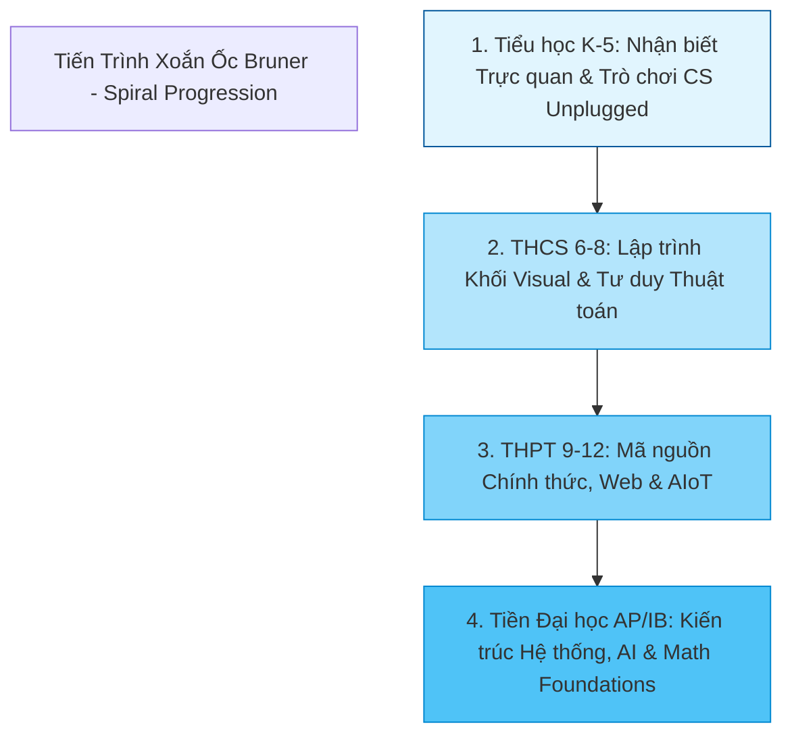

# Mô Hình Tiến Trình Xoắn Ốc (Bruner's Spiral Curriculum) Trong Thiết Kế Chương Trình Tin Học Từ Phổ Thông Đến Tiền Đại Học

*Tác giả: Antigravity AI & Knowledge Tree Academic Research*  
*Ngày đăng: 02/08/2026*  
*Chủ đề: Bruner Spiral Curriculum, CSTA K-12 CS Standards, AP CSP, IB CS, Educational Pedagogy*

---

> **Tóm tắt Sư phạm:**  
> Một sai lầm phổ biến trong thiết kế chương trình tin học là việc gán cứng một khái niệm (như *Hệ nhị phân* hay *Tư duy Thuật toán*) vào một độ tuổi cố định. Dựa trên **Mô hình Tiến trình Xoắn ốc của Jerome Bruner (Spiral Curriculum)** và các khung chuẩn quốc tế (**CSTA K-12, AP CSP, IB CS**), bài viết này trình bày phương pháp thiết kế chương trình tin học linh hoạt, cho phép học sinh tiếp cận một khái niệm cốt lõi ở nhiều cấp độ nhận thức tăng dần theo độ tuổi.

---



---

## 1. Nguyên Lý Xoắn ỐC Jerome Bruner: Không Khái Niệm Nào Bị "Khóa Tuổi"

Jerome Bruner — nhà tâm lý học giáo dục vĩ đại — đã khẳng định: *"Bất kỳ chủ đề nào cũng có thể được giảng dạy hiệu quả ở hình thức trung thực về mặt trí tuệ cho bất kỳ trẻ em nào ở bất kỳ giai đoạn phát triển nào."*

### Ví dụ về Tiến trình Xoắn ốc của Khái niệm `BINARY_SYSTEM` (Hệ Nhị phân):
* **Cấp độ K-5 (Tiểu học - CSTA 1B):** Học sinh chơi trò chơi thẻ bài lật mặt đen/trắng (CS Unplugged) để hiểu biểu diễn thông tin bằng 2 trạng thái bật/tắt (Cấp độ Bloom: *Remember $\rightarrow$ Understand*).
* **Cấp độ 6-8 (THCS - CSTA 2):** Học sinh sử dụng câu lệnh chuyển đổi số nhị phân sang thập phân trong Scratch hoặc MakeCode để điều khiển đèn LED (Cấp độ Bloom: *Apply*).
* **Cấp độ 9-12 & Pre-Univ (THPT/AP CSP - CSTA 3A/3B):** Học sinh thực hành các phép toán bit (Bitwise Operations), mã hóa ký tự Unicode và biểu diễn số thực dấu phẩy động IEEE 754 trong C/Python (Cấp độ Bloom: *Analyze $\rightarrow$ Create*).

---

## 2. Đối Chiếu Các Khung Chuẩn Quốc Tế (CSTA K-12, AP CSP, IB CS, Cambridge)

Để chương trình học đạt chuẩn quốc tế mà vẫn phù hợp với thực tiễn, việc thiết kế Cây Tri thức cần đối chiếu với các khung chuẩn giáo dục uy tín:

1. **CSTA K-12 CS Standards (Hiệp hội Giáo viên CS Hoa Kỳ):**
   * Phân chia thành 5 tuyến nội dung (Strands): *Algorithms & Programming (AP)*, *Computing Systems (CS)*, *Data & Analysis (DA)*, *Impact of Computing (IC)*, *Networks & the Internet (NI)*.
   * Phân tầng độ tuổi: Level 1A (K-2), Level 1B (3-5), Level 2 (6-8), Level 3A (9-10), Level 3B (11-12).
2. **College Board AP Computer Science (AP CSP & AP CS A):**
   * Đặt trọng tâm vào các Big Ideas: *Creative Development (CRD)*, *Algorithms & Programming (AAP)*, *Data (DAT)*, *Impact of Computing (IOC)*.
3. **IB Computer Science & Cambridge IGCSE / A-Levels:**
   * Kết hợp giữa lý thuyết khoa học máy tính sâu sắc và các dự án kỹ thuật thực tế.

---

## 3. Tiến Trình Chuyển Đổi: CS Unplugged $\rightarrow$ Visual Block $\rightarrow$ Text Code

Một chương trình tin học thành công là chương trình hạ thấp rào cản ban đầu nhưng không giới hạn trần phát triển của học sinh:

```
[CS Unplugged: Trò chơi Vật lý] ──> [Visual Block: Lập trình Khối] ──> [Text-Based Code: Mã nguồn Thật]
```

* **Giai đoạn 1 (CS Unplugged):** Xây dựng tư duy thuật toán thông qua trò chơi vận động, xếp hình, tháo lắp mô hình mà không cần dùng máy tính.
* **Giai đoạn 2 (Visual Block):** Loại bỏ nỗi sợ lỗi cú pháp (Syntax Error) bằng các khối lệnh kéo thả, giúp học sinh tập trung 100% vào logic luồng điều khiển (Control Flow).
* **Giai đoạn 3 (Text-Based Code Transition):** Cầu nối chuyển đổi sang mã nguồn chính thức (Python, JavaScript, Swift) khi tư duy logic của học sinh đã vững chắc.

---

## 4. Ánh Xạ Metadata Khung Quốc Tế Vào Master Knowledge Tree

Để hỗ trợ thầy cô và nhà quản lý giáo dục dễ dàng xuất giáo án và xây dựng lộ trình học tập, Master Tree đưa thông tin ánh xạ chuẩn vào trường `metadata` JSON của từng Concept:

```json
{
  "csta_strand": "AP-1",
  "csta_level": "1B,2,3A,3B",
  "ap_csp": "CRD-2",
  "spiral_bloom": "Remember->Create"
}
```

* **`csta_level`**: Chỉ ra các cấp độ học sinh có thể tiếp cận khái niệm này.
* **`spiral_bloom`**: Thể hiện tiến trình phát triển nhận thức từ Ghi nhớ đến Sáng tạo.

---

## 🎯 Khuyến Nghị Cho Các Nhà Thiết Kế Chương Trình (Curriculum Designers)

1. **Tránh bẫy "Khóa Tuổi":** Đừng gạch tên một khái niệm khỏi chương trình tiểu học/THCS chỉ vì nó "nghe có vẻ khó". Hãy thay đổi phương pháp tiếp cận sang dạng Unplugged hoặc Visual Block.
2. **Xây dựng Lộ trình Xoắn ốc:** Đảm bảo các khái niệm cốt lõi (như *Dữ liệu, Thuật toán, An toàn mạng*) được quay trở lại ở các cấp học cao hơn với bài tập dự án phức tạp hơn.

---

## 📚 Tài Liệu Tham Chiếu & Link Dẫn Chứng (Citations & Primary Sources)

1. **CSTA K-12 Computer Science Standards**:  
   - Khung chuẩn Giáo dục CS K-12 của Hiệp hội Giáo viên Khoa học Máy tính Hoa Kỳ: [CSTA K-12 Standards Portal](https://csta.acm.org/K-12Standards/DevelopersStand/)
2. **College Board AP Computer Science Principles (AP CSP)**:  
   - Khung chương trình & Tiêu chí Đánh giá AP CSP: [College Board AP CSP Course Details](https://apcentral.collegeboard.org/courses/ap-computer-science-principles)
3. **Jerome Bruner's Educational Pedagogy**:  
   - Lý thuyết Chương trình Xoắn ốc (The Process of Education, Jerome Bruner): [Harvard University Press Educational Classics](https://www.hup.harvard.edu/)
4. **CS Unplugged Framework**:  
   - Dự án Giáo dục Tin học Không dùng Máy tính (University of Canterbury): [CS Unplugged Official Portal](https://csunplugged.org/)
