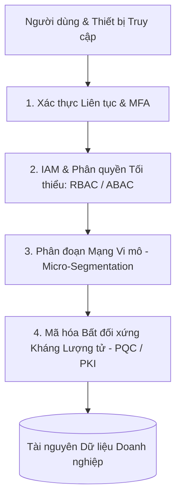

# Kiến Trúc An Ninh Mạng Zero Trust Và Sự Chuẩn Bị Cho Kỷ Nguyên Điện Toán Lượng Tử (2026)

*Tác giả: Antigravity AI & Knowledge Tree Tech Research*  
*Ngày đăng: 02/08/2026*  
*Chủ đề: Cybersecurity, Zero Trust Architecture, IAM, PKI, Threat Modeling, Post-Quantum Cryptography (PQC)*

---

> **Tóm tắt Kỹ thuật:**  
> Sự suy sụp của mô hình an ninh bức tường lửa truyền thống (Perimeter-Based Security) cùng với sự phát triển nhanh chóng của Điện toán Lượng tử (Quantum Computing) đặt nền an ninh mạng năm 2026 trước hai yêu cầu bắt buộc: Chuyển đổi sang kiến trúc **Zero Trust ("Không bao giờ tin tưởng, luôn xác thực")** và chuẩn bị hạ tầng **Mã hóa Kháng Lượng tử (Post-Quantum Cryptography - PQC)**.

---

---

## 1. Nguyên Tắc Cốt Lõi Của Kiến Trúc Zero Trust

Mô hình bảo vệ vùng biên cũ giả định rằng mọi thứ bên trong mạng nội bộ đều an toàn. Trong kỷ nguyên Cloud và Làm việc Từ xa, giả định này là mối đe dọa nguy hiểm nhất.

**Zero Trust Architecture (ZTA)** dựa trên 3 nguyên tắc bất biến:
1. **Xác thực và Cấp quyền Liên tục (Explicit Verification):** Đánh giá mọi yêu cầu truy cập dựa trên toàn bộ ngữ cảnh khả dụng (định danh, vị trí, thiết bị, loại dữ liệu).
2. **Sử dụng Quyền Tối thiểu (Least Privilege Access):** Giới hạn quyền hạn của người dùng/tác nhân AI đúng mức cần thiết để hoàn thành công việc (Just-In-Time & Just-Enough Access).
3. **Giả định Hệ thống đã bị Bẻ khóa (Assume Breach):** Phân đoạn mạng vi mô (Micro-segmentation), mã hóa toàn bộ dữ liệu khi lưu trữ (At-Rest) và khi truyền tải (In-Transit), đồng thời theo dõi log thời gian thực.

---

## 2. Quản Lý Định Danh (IAM) & Phân Quyền Theo Vai Trò / Thuộc Tính (RBAC / ABAC)

Quản lý Định danh và Truy cập (**IAM - Identity and Access Management**) đã trở thành lớp phòng thủ đầu tiên của hệ thống hiện đại:

* **Xác thực Đa yếu tố (MFA) & FIDO2/Passkeys:** Loại bỏ hoàn toàn mật khẩu văn bản thuần, thay thế bằng xác thực sinh trắc học và khóa FIDO2 kháng phishing.
* **RBAC (Role-Based) & ABAC (Attribute-Based):** Phân quyền không chỉ dựa trên chức danh mà kết hợp các thuộc tính ngữ cảnh thời gian thực (thời gian truy cập, độ tin cậy của thiết bị, mức độ nhạy cảm của dữ liệu).

---

## 3. Hạ Tầng Mã Hóa PKI & Mô Hình Hóa Mối Đe Dọa (Threat Modeling)

### Hạ tầng Khóa Công khai (PKI):
* Đảm bảo tính bảo mật, toàn vẹn và chống chối bỏ thông qua cặp khóa bất đối xứng và Chứng thư Số (Digital Certificates) do Cơ quan Xác thực (CA) tin cậy cấp phát.

### Quy trình Mô hình hóa Mối đe dọa (STRIDE Framework):
Mọi kiến trúc phần mềm năm 2026 đều phải thực hiện đánh giá mối đe dọa ngay từ giai đoạn thiết kế:
* **Spoofing (Giả mạo):** Vi phạm định danh.
* **Tampering (Can thiệp):** Vi phạm tính toàn vẹn dữ liệu.
* **Repudiation (Chối bỏ):** Thiếu nhật ký theo dõi.
* **Information Disclosure (Rò rỉ thông tin):** Vi phạm tính bảo mật.
* **Denial of Service (Từ chối dịch vụ):** Can thiệp tính sẵn sàng.
* **Elevation of Privilege (Leo quyền):** Vi phạm ranh giới phân quyền.

---

## 4. Thách Thức Lượng Tử & Mã Hóa Kháng Lượng Tử (Post-Quantum Cryptography - PQC)

Sự phát triển của máy tính lượng tử đe dọa phá vỡ các thuật toán mã hóa bất đối xứng hiện tại (RSA, ECC) thông qua Thuật toán Shor.

Năm 2026 chứng kiến làn sóng chuyển đổi sang **Post-Quantum Cryptography (PQC)**:
* **Thuật toán Mã hóa Dựa trên Lưới (Lattice-Based Cryptography):** Chuẩn hóa các thuật toán mã hóa kháng lượng tử mới do NIST ban hành (ML-KEM, ML-DSA).
* **Tính Linh hoạt Mã hóa (Crypto-Agility):** Thiết kế kiến trúc phần mềm cho phép thay đổi thuật toán mã hóa cốt lõi mà không cần đập đi xây lại toàn bộ hệ thống.

---

## 🎯 Tích Hợp An Ninh Mạng Vào Giáo Dục Khoa Học Máy Tính

* **Giáo dục An toàn Mạng từ Phổ thông:** Giảng dạy kiến thức Vệ sinh An toàn Số (Cyber Hygiene), bảo vệ thông tin cá nhân (PII) và nhận diện lừa đảo ngay từ bậc THCS/THPT.
* **Đưa Security vào Mọi Môn học CS:** An ninh mạng không phải là môn phụ; mọi khóa học Lập trình, Cơ sở Dữ liệu và Mạng máy tính đều phải tích hợp quy trình viết code an toàn (Secure Coding) và Zero Trust.

---

## 📚 Tài Liệu Tham Chiếu & Link Dẫn Chứng (Citations & Primary Sources)

1. **NIST Zero Trust Architecture (SP 800-207)**:  
   - Báo cáo Tiêu chuẩn Quốc gia Hoa Kỳ về Kiến trúc Zero Trust: [NIST SP 800-207 Zero Trust Publication](https://csrc.nist.gov/publications/detail/sp/800-207/final)
2. **NIST Post-Quantum Cryptography (PQC) Standards**:  
   - Chuẩn hóa Thuật toán Mã hóa Kháng Lượng tử (ML-KEM, ML-DSA): [NIST Post-Quantum Cryptography Project](https://csrc.nist.gov/projects/post-quantum-cryptography)
3. **OWASP Top 10 cho LLM & AI Systems**:  
   - Danh mục 10 Rủi ro An ninh Mạng hàng đầu cho Hệ thống AI: [OWASP Top 10 for LLM Applications](https://owasp.org/www-project-top-10-for-large-language-model-applications/)
4. **FIDO Alliance & Passkeys Standards**:  
   - Chuẩn xác thực Không mật khẩu & Chống Phishing: [FIDO Alliance Specifications](https://fidoalliance.org/)
