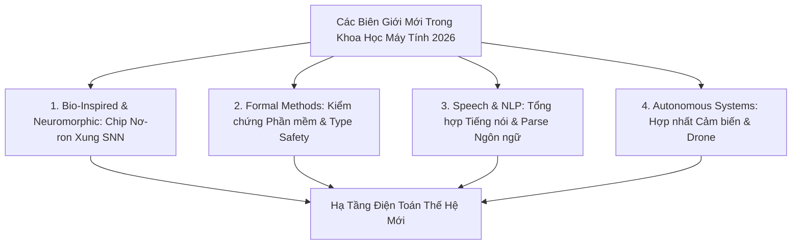

# Các Biên Giới Mới Trong Khoa Học Máy Tính: Điện Toán Mô Phỏng Sinh Học, Kiểm Chứng Hình Thức Và Hệ Thống Tự Chủ (2026)

*Tác giả: Antigravity AI & Knowledge Tree Tech Research*  
*Ngày đăng: 02/08/2026*  
*Chủ đề: Bio-Inspired Computing, Neuromorphic Chips, Formal Verification, Speech & NLP, Autonomous Drones, Sensor Fusion*

---

> **Tóm tắt Kỹ thuật:**  
> Bên cạnh AI Sinh và Điện toán Đám mây, Khoa học Máy tính năm 2026 ghi nhận bước tiến mạnh mẽ ở 4 **Biên giới Mới (Frontier Domains)**: Điện toán Mô phỏng Sinh học (Neuromorphic & Bio-Inspired), Kiểm chứng Phần mềm Hình thức (Formal Verification), Phân tích Tiếng nói/Ngôn ngữ tự nhiên sâu và Hệ thống Tự chủ Vật lý Hợp nhất Đa Cảm biến. Bài viết này trình bày cấu trúc và tiềm năng ứng dụng của các lĩnh vực này.

---

---

## 1. Điện Toán Mô Phỏng Sinh Học & Chip Nơ-Ron Vi Mạch (Neuromorphic & Bio-Inspired)

Kiến trúc máy tính Von Neumann truyền thống gặp giới hạn tiêu thụ điện năng khi chạy các mạng nơ-ron sâu. **Neuromorphic Computing** giải quyết vấn đề này bằng cách mô phỏng trực tiếp bộ não sinh học:

* **Mạng Nơ-ron Xung (Spiking Neural Networks - SNNs):** Xử lý dữ liệu dựa trên các xung thần kinh theo sự kiện (Event-Driven Processing), chỉ tiêu tốn điện năng khi có sự thay đổi tín hiệu.
* **Giải thuật Trí tuệ Bầy đàn (Swarm Intelligence):** Mô phỏng hành vi tập thể tự nhiên (Particle Swarm Optimization, Ant Colony) áp dụng cho tối ưu hóa luồng giao thông và điều khiển đội hình Robot/Drone.

---

## 2. Phương Pháp Hình Thức & Kiểm Chứng Phần Mềm (Formal Verification & Type Safety)

Trong các hệ thống quan yếu (nhân ngân hàng, hàng không vũ trụ, thiết bị y tế), kiểm thử phần mềm thông thường (Unit Test) không đủ để đảm bảo 100% không có lỗi.

* **Kiểm chứng Chương trình Hình thức (Formal Program Verification & Model Checking):** Chứng minh tính đúng đắn toán học của phần mềm bằng lý thuyết hình thức, kiểm tra mọi trạng thái khả dĩ (Model Checking) và chứng minh định lý tự động.
* **Lý thuyết Kiểu & An toàn Kiểu (Type Systems & Type Safety):** Xây dựng các hệ thống kiểu dữ liệu tĩnh mạnh (Static Type Inference) ngăn chặn rò rỉ bộ nhớ và lỗi thực thi ngay tại thời điểm biên dịch.
* **Phân tích Tĩnh Mã nguồn (Static Program Analysis):** Sử dụng Trừu tượng hóa (Abstract Interpretation) và Phân tích Cây Cú pháp (AST) để rà soát lỗ hổng bảo mật mà không cần chạy code.

---

## 3. Phân Tích Ngôn Ngữ & Tiếng Nói Dựa Trên Mô Hình Ngữ Nghĩa Deep Learning

Sự kết hợp giữa Xử lý Tín hiệu Số (DSP) và Học máy tạo nên những bước tiến trong nhận dạng và tổng hợp giọng nói:

* **Nhận dạng & Tổng hợp Tiếng nói (Speech-to-Text & Text-to-Speech):** Chuyển đổi hai chiều giữa sóng âm thanh và văn bản dựa trên phân tích Phổ âm thanh Mel-Spectrogram.
* **Phân tích Cú pháp Ngôn ngữ Tự nhiên (Natural Language Parsing):** Xây dựng cây cú pháp (Syntax Tree), gán nhãn từ loại (POS Tagging) và phân tích cấu trúc ngữ nghĩa làm nền tảng cho dịch máy tự động.

---

## 4. Hệ Thống Tự Chủ & Hợp Nhất Đa Cảm Biến (Multi-Sensor Fusion & Autonomous Drones)

Tự chủ di chuyển yêu cầu máy tính hiểu và phản ứng với môi trường vật lý thời gian thực:

* **Giải thuật Hợp nhất Cảm biến (Multi-Sensor Fusion & Kalman Filter):** Kết hợp dữ liệu từ LiDAR, Radar, Camera và IMU để loại bỏ nhiễu và ước lượng trạng thái di chuyển chính xác của thiết bị.
* **Tự Điều hướng cho Phương tiện Tự lái & Drone (Autonomous Drone Navigation):** Hoạch định quỹ đạo di chuyển (Path Planning) và né tránh chướng ngại vật thời gian thực trong môi trường 3D phức tạp.

---

## 🎯 Khuyến Nghị Cho Các Nhà Nghiên Cứu & Thiết Kế Chương Trình

1. **Đưa Kiểm chứng Hình thức vào Chương trình CS Tiền Đại học / Đại học:** Giúp sinh viên tiếp cận tư duy toán học chứng minh phần mềm thay vì chỉ dựa vào kiểm thử thủ công.
2. **Nghiên cứu Chip Nơ-ron Vi mạch (Neuromorphic Hardware):** Chuẩn bị cho làn sóng phần cứng AI tiêu thụ điện năng cực thấp tiếp theo.

---

## 📚 Tài Liệu Tham Chiếu & Link Dẫn Chứng (Citations & Primary Sources)

1. **ACM/IEEE CS2023 Advanced Knowledge Areas**:  
   - Khung kiến thức về Formal Methods & Systems Fundamentals: [ACM CS2023 Advanced KAs](https://www.acm.org/education/curricula-recommendations)
2. **Neuromorphic Computing & Spiking Neural Networks Research**:  
   - Intel Neuromorphic Lab & IEEE Transactions on Neural Networks: [IEEE Transactions on Neural Networks and Learning Systems](https://cis.ieee.org/publications/t-neural-networks-and-learning-systems)
3. **Formal Program Verification & Model Checking**:  
   - Formal Methods in Software Engineering & Coq/Z3 Theorem Provers: [Formal Methods Europe Association](https://www.fmeurope.org/)
4. **Autonomous Systems & Sensor Fusion Research**:  
   - IEEE Robotics and Automation Society (RAS) & Kalman Filter Tutorials: [IEEE Robotics and Automation Society](https://www.ieee-ras.org/)
