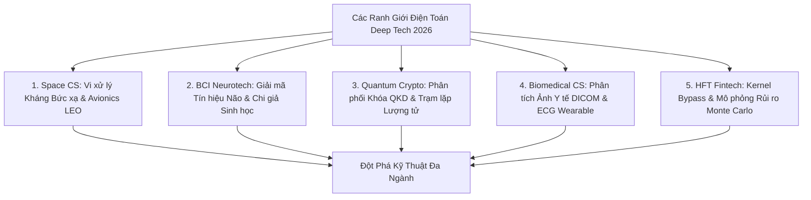

# Điện Toán Deep Tech Biên Giới: Điện Toán Vũ Trụ, BCI Não-Máy Tính, Mạng Lượng Tử QKD Và HFT Fintech (2026)

*Tác giả: Antigravity AI & Knowledge Tree Tech Research*  
*Ngày đăng: 02/08/2026*  
*Chủ đề: Space Systems Computing, Brain-Computer Interface (BCI), Quantum Key Distribution (QKD), Biomedical AI, High-Frequency Trading (HFT)*

---

> **Tóm tắt Kỹ thuật:**  
> Bên cạnh phần mềm ứng dụng thông thường, năm 2026 chứng kiến những đột phá sâu sắc nhất của Khoa học Máy tính tại các ranh giới **Deep Tech Biên giới**: Vi xử lý kháng bức xạ vũ trụ cho tàu không gian, Giao diện Não - Máy tính (BCI) điều khiển bằng tín hiệu nơ-ron, Bảo mật mạng lượng tử QKD, Điện toán Y sinh và Kiến trúc giao dịch tài chính tần số cao độ trễ dưới vi giây (Sub-microsecond HFT).

---

---

## 1. Điện Toán Vũ Trụ & Avionics Chòm Vệ Tinh (Space Computing)

Môi trường ngoài không gian đặt các hệ thống máy tính trước những thử thách vật lý vô cùng khắc nghiệt:

* **Vi xử lý & Phần mềm Kháng Bức xạ (Radiation-Hardened Space Computing):** Thiết kế vi mạch chịu tác động của tia vũ trụ và các hạt mang năng lượng cao, áp dụng kiến trúc dự phòng lỗi **Triple Modular Redundancy (TMR)** để ngăn chặn lỗi lật bit (Bit Flip / Single Event Upset).
* **Mạng Lưới Vệ Tinh & Định Tuyến Liên Kết Laser (Inter-Satellite Mesh Networks):** Thuật toán xác định quỹ đạo (Orbital Mechanics) và định tuyến dữ liệu qua liên kết laser không gian giữa hàng ngàn vệ tinh tầm thấp (LEO Constellations).

---

## 2. Giao Diện Não - Máy Tính & Công Nghệ Thần Kinh (BCI & Neurotechnology)

Cầu nối trực tiếp giữa tín hiệu sinh học của bộ não người và thiết bị máy tính:

* **Giải mã Tín hiệu Thần kinh (Neural Signal Decoding):** Xử lý tín hiệu điện não đồ (EEG) hoặc xung nơ-ron xâm nhập thời gian thực bằng mô hình học máy để trích xuất ý định cử động hoặc nhận thức.
* **Kích thích Thần kinh Vòng Kín & Chi giả Sinh học (Closed-Loop Neurostimulation):** Hệ thống phản hồi thời gian thực điều khiển các thiết bị trợ năng, chi giả sinh học và phục hồi chức năng vận động cho bệnh nhân.

---

## 3. Mạng Lượng Tử & Phân Phối Khóa Lượng Tử (Quantum Key Distribution - QKD)

Giải pháp bảo mật tuyệt đối dựa trên các nguyên lý vật lý lượng tử:

* **Phân phối Khóa Lượng tử QKD & Giao thức BB84:** Sử dụng trạng thái phân cực của Photon để tạo và chia sẻ khóa mã hóa bảo mật. Mọi hành vi nghe lén đều bị phát hiện ngay lập tức do hiện tượng sụp đổ trạng thái lượng tử.
* **Trạm Lặp Lượng tử & Truyền tải Trạng thái (Quantum Repeater & Teleportation):** Xây dựng hạ tầng Internet Lượng tử truyền tải trạng thái rối vướng (Entanglement) trên khoảng cách xa mà không làm mất thông tin lượng tử.

---

## 4. Điện Toán Y Sinh & Phân Tích Dữ Liệu Y Tế (Biomedical Computing)

Trí tuệ nhân tạo và xử lý tín hiệu số trong chẩn đoán và chăm sóc sức khỏe:

* **Phân đoạn Hình ảnh Y tế Chuẩn DICOM (Medical Image Segmentation):** Thuật toán tự động nhận diện và phân đoạn tổn thương trên ảnh chụp CT/MRI theo chuẩn y khoa quốc tế DICOM.
* **Giám sát Chỉ số Sinh lý Thời gian thực (Wearable Health Signal Analytics):** Phân tích thời gian thực sóng điện tâm đồ (ECG), độ bão hòa oxy (SpO2) từ thiết bị đeo để cảnh báo sớm nguy cơ tim mạch.

---

## 5. Kỹ Thuật Tài Chính & Giao Dịch Tần Số Cao Độ Trễ Cực Thấp (Sub-Microsecond HFT)

Đỉnh cao của tối ưu hóa phần mềm và phần cứng trong thị trường tài chính:

* **Kiến trúc Giao dịch Sub-Microsecond (Ultra-Low Latency HFT):** Loại bỏ hoàn toàn độ trễ hệ điều hành bằng công nghệ **Kernel Bypass** và lập trình trực tiếp trên phần cứng **FPGA** để đạt tốc độ phản hồi dưới 1 microgiây ($< 10^{-6} \text{ giây}$).
* **Mô hình hóa Rủi ro Tài chính Định lượng (Quantitative Financial Risk Modeling):** Sử dụng mô phỏng Monte Carlo trên hạ tầng tính toán hiệu năng cao để định giá công cụ phái sinh và quản trị rủi ro danh mục đầu tư.

---

## 🎯 Thông Điệp Cho Các Nhà Nghiên Cứu & Kiến Trúc Sư Hệ Thống

Các ranh giới Deep Tech cho thấy **Khoa học Máy tính chính là chất xúc tác mạnh mẽ nhất** biến các lý thuyết vật lý, sinh học, toán học và y khoa trừu tượng thành các hệ thống phần cứng/phần mềm vận hành thực tế.

---

## 📚 Tài Liệu Tham Chiếu & Link Dẫn Chứng (Citations & Primary Sources)

1. **NASA & ESA Space Computing & Avionics Standards**:  
   - Tiêu chuẩn Điện toán Vũ trụ Kháng Bức xạ NASA: [NASA Electronic Parts and Packaging (NEPP) Program](https://nepp.nasa.gov/)
2. **IEEE Transactions on Neural Systems and Rehabilitation Engineering (BCI)**:  
   - Nghiên cứu Giao diện Não-Máy tính & Giải mã Tín hiệu Nơ-ron: [IEEE TNSRE Journal](https://embs.ieee.org/tnsre/)
3. **NIST Quantum Cryptography & QKD Frameworks**:  
   - Báo cáo Tiêu chuẩn Phân phối Khóa Lượng tử QKD & BB84: [NIST Quantum Information Program](https://csrc.nist.gov/projects/quantum-information-science)
4. **DICOM (Digital Imaging and Communications in Medicine) Standards**:  
   - Khung tiêu chuẩn Quốc tế về Hình ảnh Y tế DICOM: [DICOM Standard Official Portal](https://www.dicomstandard.org/)
5. **STAC (Securities Technology Analysis Center) HFT Benchmarks**:  
   - Chuẩn kiểm thử Độ trễ Giao dịch Tài chính Tần số Cao Sub-Microsecond: [STAC Benchmark Council](https://www.stacresearch.com/)
