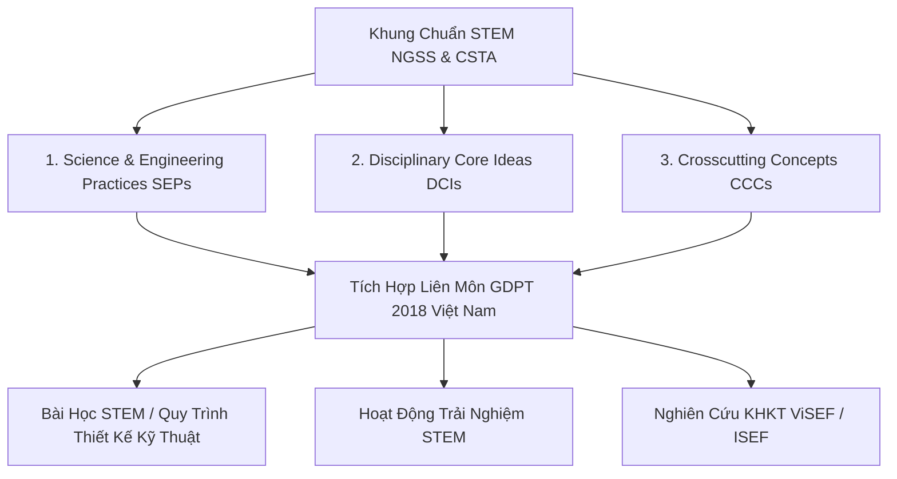

# Khung Giáo Dục STEM K-12 Quốc Tế Và Chương Trình GDPT 2018: Sự Tích Hợp Giữa NGSS, CSTA Và Thiết Kế Kỹ Thuật

*Tác giả: Antigravity AI & Knowledge Tree Tech Research*  
*Ngày đăng: 02/08/2026*  
*Chủ đề: K-12 STEM Education, NGSS, CSTA Standards, GDPT 2018 Việt Nam, Engineering Design Cycle*

---

> **Tóm tắt Kỹ thuật & Sư phạm:**  
> Giáo dục STEM trong kỷ nguyên số không còn là việc ghép các môn học một cách cơ học, mà là sự tích hợp theo **Mô hình Học tập 3 Chiều (3D Learning)** của Khung chuẩn **NGSS (Next Generation Science Standards)**, **CSTA K-12 CS Standards** và **Chương trình Giáo dục Phổ thông 2018 (GDPT 2018 Việt Nam)**. Bài viết này phân tích cấu trúc các chuẩn STEM quốc tế và cách ánh xạ chúng vào Cây Tri thức (Master Knowledge Tree).

---



---

## 1. Khung Chuẩn Thế Hệ Mới NGSS: Mô Hình Học Tập 3 Chiều (3D Learning)

Khung chuẩn **NGSS (Next Generation Science Standards)** của Hoa Kỳ định hình lại toàn bộ giáo dục khoa học và kỹ thuật phổ thông thông qua 3 chiều tích hợp:

1. **Thực Hành Khoa Học & Kỹ Thuật (Science & Engineering Practices - SEPs):** Học sinh trực tiếp đóng vai nhà khoa học/kỹ sư: Đặt câu hỏi, Xây dựng mô hình, Thu thập dữ liệu, **Sử dụng Tư duy Máy tính (Computational Thinking)** và Đề xuất giải pháp kỹ thuật.
2. **Ý Tưởng Cốt Lõi Ngành (Disciplinary Core Ideas - DCIs):** Kiến thức nền tảng thuộc Vật lý, Hóa học, Sinh học, Trái đất & Khoa học Vũ trụ, cùng với Ứng dụng Kỹ thuật & Công nghệ.
3. **Khái Niệm Xuyên Suốt (Crosscutting Concepts - CCCs):** Các tư duy kết nối liên môn như *Mẫu hình (Patterns)*, *Nguyên nhân - Kết quả (Cause & Effect)*, *Quy mô & Tỷ lệ (Scale)*, *Năng lượng & Vật chất*, *Hệ thống & Mô hình hệ thống*.

---

## 2. Sự Tích Hợp Giữa NGSS SEPs Và CSTA K-12 CS Standards

Một điểm giao thoa quan trọng giữa NGSS và **CSTA K-12 CS Standards** là vị trí của **Tư duy Máy tính (Computational Thinking)**:

* Trong NGSS, *Computational Thinking* được xếp chính thức là **Thực hành Kỹ thuật số 5 (SEP-5)**.
* Học sinh phổ thông sử dụng mô phỏng tính toán, phân tích dữ liệu cảm biến và viết thuật toán điều khiển để giải quyết các bài toán vật lý/sinh học thực tế.

---

## 3. Hai Quy Trình Cốt Lõi Trong Học Tập STEM

```
[Khám Phá Khoa Học]  Đặt Câu Hỏi ──> Giả Thuyết ──> Thử Nghiệm ──> Kết Luận
[Thiết Kế Kỹ Thuật]  Xác Định Bài Toán ──> Đề Xuất ──> Mẫu Thử (Prototype) ──> Thử Nghiệm & Cải Tiến
```

1. **Quy Trình Khám Phá Khoa Học (Scientific Inquiry Method):** Dành cho các bài học tìm hiểu tự nhiên: Đặt câu hỏi $\rightarrow$ Xây dựng giả thuyết $\rightarrow$ Thiết kế thử nghiệm $\rightarrow$ Thu thập dữ liệu $\rightarrow$ Phân tích & Kết luận.
2. **Quy Trình Thiết Kế Kỹ Thuật (Engineering Design Cycle):** Dành cho các bài học chế tạo sản phẩm: Xác định bài toán/ràng buộc $\rightarrow$ Nghiên cứu giải pháp $\rightarrow$ Chế tạo mẫu thử (Prototype) $\rightarrow$ Thử nghiệm & Cải tiến tuần hoàn.

---

## 4. Đối Chiếu Với Chương Trình Giáo Dục Phổ Thông 2018 (GDPT 2018 Việt Nam)

Chương trình GDPT 2018 của Bộ Giáo dục và Đào tạo Việt Nam định hướng giáo dục STEM theo 3 hình thức tổ chức linh hoạt:

| Hình Thức Tổ Chức | Mục Tiêu & Phương Pháp | Quy Trình Chuẩn |
| :--- | :--- | :--- |
| **1. Bài Học STEM** | Tích hợp trong giờ học chính khóa (Toán, KHTN, Tin học, Công nghệ). | Sử dụng Quy trình Thiết kế Kỹ thuật hoặc Khám phá Khoa học. |
| **2. Trải Nghiệm STEM** | Hoạt động ngoại khóa, CLB STEM, Ngày hội STEM. | Khám phá thực tế, chế tạo mô hình ứng dụng tự do. |
| **3. Nghiên Cứu KHKT** | Dành cho học sinh trung học có đam mê nghiên cứu chuyên sâu (ViSEF / ISEF). | Quy trình nghiên cứu khoa học chuẩn mực với bài báo & poster. |

---

## 5. Ánh Xạ Khái Niệm STEM K-12 Vào Master Knowledge Tree

Để hỗ trợ xây dựng giáo án và bài học STEM theo khung chuẩn quốc tế và GDPT 2018, Master Tree lưu trữ metadata chi tiết cho từng Concept:

```json
{
  "ngss_dimension": "SEP-6",
  "csta_strand": "AP-3",
  "csta_level": "1B,2,3A,3B",
  "gdpt2018": "CongNghe-KHTN",
  "spiral_bloom": "Apply->Create"
}
```

* **`SCIENTIFIC_INQUIRY_METHOD`**: Ánh xạ NGSS SEP-1, GDPT 2018 KHTN.
* **`ENGINEERING_DESIGN_CYCLE`**: Ánh xạ NGSS SEP-6, GDPT 2018 Công nghệ.
* **`CROSSCUTTING_SCIENCE_CONCEPTS`**: Ánh xạ NGSS CCC, GDPT 2018 Toán-KHTN.

---

## 🎯 Khuyến Nghị Cho Các Nhà Giáo Dục & Trường Phổ Thông

1. **Áp dụng Quy trình Thiết kế Kỹ thuật chuẩn:** Đảm bảo các bài học STEM không dừng lại ở việc làm mô hình thủ công mà có bước thử nghiệm, đo lường dữ liệu và cải tiến.
2. **Khai thác thuộc tính metadata trong Master Tree:** Sử dụng các trường `ngss_dimension`, `csta_strand` và `gdpt2018` để tạo ma trận độ phủ bài học STEM chuẩn hóa.

---

## 📚 Tài Liệu Tham Chiếu & Link Dẫn Chứng (Citations & Primary Sources)

1. **Next Generation Science Standards (NGSS)**:  
   - Khung chuẩn Giáo dục Khoa học Thế hệ Mới (Next Gen Science): [NGSS Official Portal](https://www.nextgenscience.org/)  
   - Sổ tay 3 Chiều Học tập (3D Learning: SEPs, DCIs, CCCs): [NGSS 3D Learning Framework](https://www.nextgenscience.org/three-dimensions)
2. **CSTA K-12 Computer Science Standards**:  
   - Khung chuẩn Khoa học Máy tính Phổ thông: [CSTA K-12 Standards Portal](https://csta.acm.org/K-12Standards/DevelopersStand/)
3. **Bộ Giáo dục và Đào tạo Việt Nam — Chương trình GDPT 2018**:  
   - Công văn 3089/BGDĐT-GDTrH về Hướng dẫn Thực hiện Giáo dục STEM trong Giáo dục Phổ thông: [Cổng thông tin Bộ GD&ĐT Việt Nam](https://moet.gov.vn/)
4. **International Science and Engineering Fair (ISEF / ViSEF)**:  
   - Khung chuẩn Nghiên cứu Khoa học Kỹ thuật dành cho Học sinh Trung học: [Society for Science ISEF Portal](https://www.societyforscience.org/isef/)
