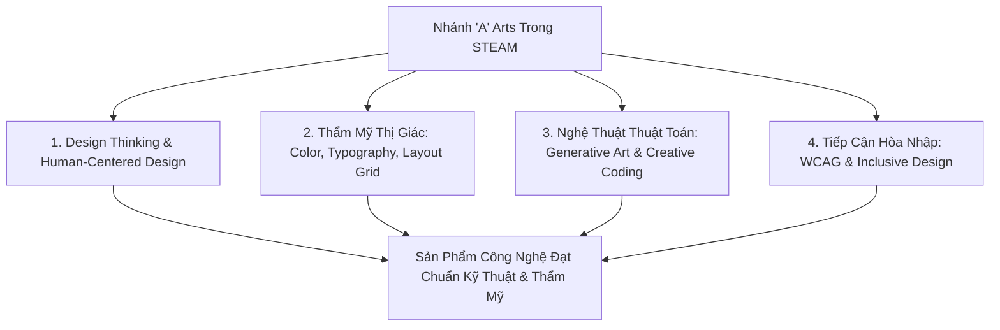

# Giao Thoa STEAM: Chữ 'A' (Arts) Trong Đồ Họa, Tư Duy Thiết Kế Và Nghệ Thuật Thuật Toán (2026)

*Tác giả: Antigravity AI & Knowledge Tree Tech Research*  
*Ngày đăng: 02/08/2026*  
*Chủ đề: STEAM Education, Arts in STEM, Design Thinking, Generative Art, Creative Coding, Accessibility WCAG*

---

> **Tóm tắt Kỹ thuật & Thiết kế:**  
> Trong mô hình **STEAM (Science, Technology, Engineering, Arts, Mathematics)**, chữ **"A" (Arts)** không đơn thuần là vẽ tay nghệ thuật tự do, mà đại diện cho **Tư duy Thiết kế (Design Thinking)**, **Thẩm mỹ Thị giác Kỹ thuật số (Visual Aesthetics)**, **Nghệ thuật Thuật toán (Generative/Algorithmic Art)** và **Thiết kế Tiếp cận Hòa nhập (Inclusive UX/WCAG)**. Bài viết này phân tích vị trí cốt lõi của nhánh Arts và cách tích hợp chuẩn hóa vào Cây Tri thức.

---



---

## 1. Tại Sao Chữ "A" (Arts) Là Mảnh Ghép Bắt Buộc Trong STEAM?

Nếu như Science, Technology, Engineering và Math cung cấp **sức mạnh kỹ thuật và hạ tầng logic**, thì nhánh **Arts** chính là yếu tố biến công nghệ thành các sản phẩm hữu ích, thân thiện và có giá trị thẩm mỹ đối với con người.

* **Từ Tính năng sang Trải nghiệm:** Một ứng dụng phần mềm hay thiết bị phần cứng có thuật toán tối ưu nhưng giao diện rối rắm và khó sử dụng sẽ thất bại.
* **Tư duy Sáng tạo Liên ngành (Creative Coding):** Sự kết hợp giữa thuật toán máy tính (Noise Functions, Fractals, Geometry) và tư duy nghệ thuật tạo ra lĩnh vực **Nghệ thuật Thuật toán (Generative Art)** — ứng dụng mạnh mẽ trong thiết kế game, hiệu ứng điện ảnh và giao diện tương tác thế hệ mới.

---

## 2. Tư Duy Thiết Kế (Design Thinking & Human-Centered Innovation)

Tư duy Thiết kế là quy trình sáng tạo lấy con người làm trung tâm (Human-Centered Design - HCD) bao gồm 5 bước tuần hoàn:

1. **Thấu Cảm (Empathize):** Nghiên cứu hành vi, nhu cầu và nỗi đau (pain points) của người dùng thực tế.
2. **Xác Định Góc Nhìn (Define):** Phát biểu bài toán cốt lõi cần giải quyết dưới dạng câu hỏi thiết kế.
3. **Sáng Tạo Ý Tưởng (Ideate):** Đề xuất đa dạng giải pháp sáng tạo không rào cản.
4. **Dựng Mẫu Thử (Prototype):** Chế tạo các mẫu thử nhanh (Wireframe/Mockup/Prototype) với chi phí thấp để hình dung giải pháp.
5. **Kiểm Thử (Test):** Đưa mẫu thử cho người dùng trải nghiệm, thu thập phản hồi và cải tiến tuần hoàn.

---

## 3. Thẩm Mỹ Thị Giác & Hệ Thống Đồ Họa Kỹ Thuật Số

Nền tảng của đồ họa kỹ thuật số trong STEAM được xây dựng trên 3 nguyên tắc toán học và nghệ thuật:

* **Lý thuyết Màu sắc (Color Theory & Palette Systems):** Hiểu rõ các không gian màu ($RGB, CMYK, HSV$), độ tương phản (Contrast Ratio) và quy tắc phối màu hài hòa (Harmonious Palettes).
* **Nghệ thuật Kiểu chữ (Typography & Visual Hierarchy):** Lựa chọn font chữ, kiểm soát khoảng cách ký tự (*Kerning, Leading, Tracking*) và thiết lập hệ thống phân cấp thị giác dẫn dắt mắt người đọc.
* **Quy tắc Bố cục & Lưới Thị giác (Layout Grid & Composition):** Áp dụng Hệ thống Lưới (Grid System), Tỷ lệ Vàng (Golden Ratio), Quy tắc 1/3 (Rule of Thirds) và sự cân bằng thị giác (Visual Balance).

---

## 4. Nghệ Thuật Thuật Toán (Algorithmic & Generative Art / Creative Coding)

Nghệ thuật Thuật toán là nơi giao thoa tuyệt đẹp giữa **Lập trình (Programming)** và **Nghệ thuật (Arts)**:

```
[Hàm Toán học & Thuật toán] ──> [Hàm Nhiễu Perlin / Simplex] ──> [Tọa độ Fractals / Particles] ──> [Tác Phẩm Đồ Họa Động]
```

* **Lập trình Sáng tạo (Creative Coding):** Sử dụng vòng lặp, biến số và toán hình học để sinh ra các hình ảnh, hiệu ứng chuyển động và đồ họa tương tác thời gian thực.
* **Hàm Nhiễu & Thuật toán Tiến hóa (Procedural Generation):** Sử dụng các hàm nhiễu tự nhiên (*Perlin Noise, Simplex Noise*) để tạo địa hình 3D, họa tiết tự nhiên và hệ thống hạt (Particle Systems) trong game và điện ảnh.

---

## 5. Thiết Kế Tiếp Cận Hòa Nhập (Inclusive Design & WCAG Standards)

Một sản phẩm STEAM hoàn hảo phải đảm bảo **mọi người dùng** — bao gồm người khuyết thị, khiếm thính hay hạn chế vận động — đều có thể sử dụng được.

### Khung chuẩn Tiếp cận Web WCAG (POUR Principles):
1. **Perceivable (Có thể Nhận biết):** Cung cấp văn bản thay thế (Alt text) cho hình ảnh, đảm bảo độ tương phản màu sắc đủ cao.
2. **Operable (Có thể Vận hành):** Hỗ trợ điều hướng hoàn toàn bằng bàn phím và công cụ đọc màn hình (Screen Readers).
3. **Understandable (Dễ Hiểu):** Giao diện và thông báo lỗi rõ ràng, nhất quán.
4. **Robust (Bền vững):** Tương thích tốt với các công cụ trợ năng (Assistive Technologies).

---

## 🎯 Khuyến Nghị Cho Các Nhà Thiết Kế Chương Trình STEAM

1. **Đưa Design Thinking vào các bài học STEM:** Trước khi học sinh bắt tay vào code hoặc chế tạo phần cứng, hãy yêu cầu các em thực hiện bước Thấu cảm (Empathize) và Phỏng vấn người dùng.
2. **Giảng dạy Creative Coding như môn nhập môn Lập trình:** Sử dụng Nghệ thuật Thuật toán (Generative Art) để tạo cảm hứng lập trình cho học sinh thiên hướng nghệ thuật.

---

## 📚 Tài Liệu Tham Chiếu & Link Dẫn Chứng (Citations & Primary Sources)

1. **Stanford d.school — Design Thinking Framework**:  
   - Viện Thiết kế Hasso Plattner tại Stanford (d.school) về Tư duy Thiết kế 5 bước: [Stanford d.school Design Thinking Bootleg](https://dschool.stanford.edu/resources/design-thinking-bootleg)
2. **W3C Web Content Accessibility Guidelines (WCAG 2.2)**:  
   - Chuẩn Quốc tế về Thiết kế Tiếp cận Hòa nhập (POUR Principles): [W3C WCAG Accessibility Standards](https://www.w3.org/WAI/standards-guidelines/wcag/)
3. **Generative Art & Creative Coding Pedagogies**:  
   - Processing Foundation & Creative Coding in Computer Science Education: [Processing Foundation Official Portal](https://processingfoundation.org/)
4. **ACM SIGGRAPH (Special Interest Group on Computer Graphics and Interactive Techniques)**:  
   - Hội thảo Quốc tế về Đồ họa Máy tính, Nghệ thuật Kỹ thuật số & Tương tác: [ACM SIGGRAPH Education Committee](https://www.siggraph.org/)
