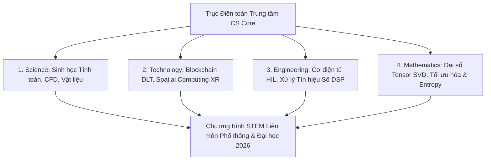

# Khoa Học Máy Tính Liên Môn: Nhánh S-T-E-M Tích Hợp Cho Kỷ Nguyên Tính Toán Đa Ngành (2026)

*Tác giả: Antigravity AI & Knowledge Tree Tech Research*  
*Ngày đăng: 02/08/2026*  
*Chủ đề: STEM Education, Computational Science, Mechatronics, Signal Processing, Information Theory, Post-Quantum DLT*

---

> **Tóm tắt Kỹ thuật:**  
> Khoa học Máy tính (Computer Science) không còn đứng độc lập mà đã trở thành **"Trục Điện toán Trung tâm" (Computational Core)** kết nối toàn bộ 4 nhánh S-T-E-M (Science, Technology, Engineering, Mathematics). Bài viết này mở rộng toàn diện các lĩnh vực tính toán liên môn — từ Sinh học Tính toán, Mô phỏng Vật lý Chất lưu, Cơ điện tử HIL, Xử lý Tín hiệu Số đến Lý thuyết Tối ưu hóa & Entropy Thông tin.

---

---

## 1. Nhánh Science (Khoa Học): Từ Mô Phỏng Sinh Học Đến Động Lực Học Chất Lưu

Khoa học máy tính giúp chuyển đổi các nghiên cứu thực nghiệm truyền thống sang **Mô phỏng Tính toán (Computational Science)**:

* **Sinh học Tính toán & Phân tích Bộ gen (Bioinformatics & Genomics):** Thuật toán xử lý chuỗi DNA/RNA quy mô Gigabyte và mô hình hóa cấu trúc nếp gấp Protein (như AlphaFold).
* **Vật lý Tính toán & Động lực học Chất lưu (CFD & FEA):** Mô phỏng máy tính các hiện tượng khí động học, phương trình Navier-Stokes và Phân tích Phần tử Hữu hạn (FEA) trong kỹ thuật hàng không/vũ trụ.
* **Hóa học Tính toán & Khoa học Vật liệu (Molecular Dynamics):** Mô hình hóa tương tác vi mô cấp nguyên tử/phân tử để dự đoán đặc tính vật liệu mới.

---

## 2. Nhánh Technology (Công Nghệ): Sổ Cái Phân Tán & Điện Toán Không Gian

Bên cạnh AI và Cloud, hai công nghệ hạ tầng số đang phát triển mạnh mẽ:

* **Sổ cái Phân tán & Đồng thuận Mã hóa (Decentralized Ledger Technology - DLT):** Nguyên lý đồng thuận phi tập trung (Proof of Stake, PBFT), cấu trúc Merkle Tree và Hợp đồng Thông minh (Smart Contracts) bảo đảm tính chống chối bỏ.
* **Điện toán Không gian & Thực tại Mở rộng (Spatial Computing & XR):** Kỹ thuật tái tạo không gian 3D thời gian thực (NeRF, 3D Gaussian Splatting), định vị không gian và giao tiếp người-máy qua kính thực tại tăng cường (AR/VR/MR).

---

## 3. Nhánh Engineering (Kỹ Thuật): Cơ Điện Tử HIL & Xử Lý Tín Hiệu Số

Cầu nối giữa thuật toán phần mềm và hệ thống cơ khí vật lý:

* **Kỹ thuật Cơ điện tử & Kiểm thử HIL (Mechatronics & Hardware-in-the-Loop):** Quy trình tích hợp mô phỏng phần cứng vòng kín (HIL Testing) để thử nghiệm hệ thống điều khiển tự động trước khi sản xuất hàng loạt.
* **Xử lý Tín hiệu Số & Biến đổi Fourier (Digital Signal Processing - DSP):** Thuật toán Biến đổi Fourier Nhanh (FFT/DFT) phân tích tần số tín hiệu và kỹ thuật thiết kế bộ lọc số (FIR/IIR) loại bỏ nhiễu trong thiết bị viễn thông và y tế.

---

## 4. Nhánh Mathematics (Toán Học): Đại Số Tensor, Tối Ưu Hóa & Lý Thuyết Thông Tin

Nền tảng toán học chuyên sâu vận hành các mô hình Trí tuệ Nhân tạo và Đồ họa:

* **Đại số Tensor & Phân tích SVD (Singular Value Decomposition):** Thuật toán nén dữ liệu, giảm chiều không gian và phép nhân Tensor mật độ cao trong mạng nơ-ron sâu.
* **Lý thuyết Tối ưu hóa Độ dốc (Gradient Descent & Convex Analysis):** Thuật toán lan truyền ngược (Backpropagation), phân tích bề mặt tổn thất (Loss Landscape) và tối ưu hóa lồi.
* **Lý thuyết Thông tin Shannon (Information Entropy):** Đo lường độ không chắc chắn thông qua Entropy Shannon, Mutual Information và độ lệch Kullback-Leibler (KL Divergence).

---

## 🎯 Khuyến Nghị Xây Dựng Chương Trình Giáo Dục STEM Liên Môn

1. **Giáo dục Phổ thông (K-12):** Lồng ghép dự án STEM liên môn — ví dụ: Dự án *"Mô phỏng Quỹ đạo Tên lửa"* (Toán + Vật lý + Lập trình) hoặc *"Máy đo Nhịp tim DSP"* (Sinh học + Điện tử + Tin học).
2. **Bậc Đại học:** Giảng dạy Khoa học Máy tính như một công cụ tính toán cốt lõi cho sinh viên tất cả các ngành Khoa học Tự nhiên và Kỹ thuật.

---

## 📚 Tài Liệu Tham Chiếu & Link Dẫn Chứng (Citations & Primary Sources)

1. **ACM/IEEE CS2023 Mathematical & Systems Foundations**:  
   - Khung kiến thức Toán học & Điện toán Bền vững: [ACM CS2023 Knowledge Areas](https://www.acm.org/education/curricula-recommendations)
2. **Computational Biology & Protein Folding Research**:  
   - Nghiên cứu Mô hình hóa Sinh học & AlphaFold (DeepMind/EMBL-EBI): [AlphaFold Protein Structure Database](https://alphafold.ebi.ac.uk/)
3. **NIST Cryptography & DLT Standards**:  
   - Báo cáo Tiêu chuẩn Sổ cái Phân tán & Mã hóa (NIST SP 800-162): [NIST Cryptographic Publications](https://csrc.nist.gov/)
4. **Digital Signal Processing & Information Theory Classics**:  
   - Claude Shannon Information Theory Foundation & IEEE Signal Processing Society: [IEEE Signal Processing Society](https://signalprocessingsociety.org/)
