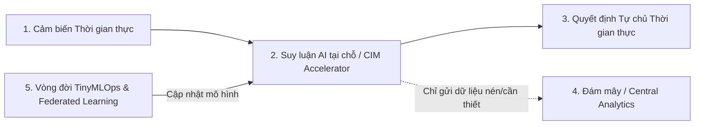

# AIoT Và TinyMLOps: Đưa Mô Hình Ngôn Ngữ Nhỏ (SLM) Lên Thiết Bị Biên (2026)

*Tác giả: Antigravity AI & Knowledge Tree Tech Research*  
*Ngày đăng: 02/08/2026*  
*Chủ đề: TinyML, Edge AI, AIoT, Small Language Models (SLMs), TinyMLOps, Compute-in-Memory*

---

> **Tóm tắt Kỹ thuật:**  
> Nếu như những năm trước, AI gắn liền với các Trung tâm Dữ liệu đám mây (Cloud Data Centers) tiêu tốn hàng Megawatt điện năng, thì năm 2026 chứng kiến bước trưởng thành vượt bậc của **Edge AI và TinyMLOps**. Việc thực thi các Mô hình Ngôn ngữ Thu nhỏ (Small Language Models - SLMs) trực tiếp trên vi điều khiển và thiết bị nhúng biên (Edge Devices) đã đạt đến độ chín về cả phần cứng lẫn quy trình vận hành.

---



---

## 1. Sự Chuyển Dịch Từ "Cloud-Only" Sang "Edge-First AI"

Chi phí băng thông tăng cao, độ trễ truyền dữ liệu và các yêu cầu nghiêm ngặt về quyền riêng tư đã thúc đẩy làn sóng **Edge-First AI**:

* **Tiết kiệm Chi phí & Băng thông:** Bằng cách xử lý và lọc dữ liệu ngay tại nguồn (On-Device Inference), các hệ thống Edge AI giảm tới **95% dung lượng băng thông truyền tải** và giảm **70% chi phí vận hành** so với việc đẩy toàn bộ dữ liệu thô lên Cloud.
* **Độ trễ Cực thấp (Sub-millisecond Latency):** Phù hợp cho các ứng dụng đòi hỏi phản hồi tức thì như Robot công nghiệp, xe tự lái, thiết bị y tế và hệ thống cảnh báo sự cố.

---

## 2. Đột Phá Phần Cứng: Compute-in-Memory (CIM) & SRAM/RRAM Accelerators

Nút thắt lớn nhất của TinyML là "bức tường bộ nhớ" (Memory Wall) — năng lượng tiêu tốn cho việc di chuyển dữ liệu giữa RAM và CPU lớn hơn nhiều so với năng lượng tính toán.

Năm 2026 đánh dấu sự thương mại hóa rộng rãi của kiến trúc **Compute-in-Memory (CIM)**:
* **Tính toán trực tiếp trên ô nhớ:** Thực hiện các phép nhân ma trận (GEMM) trực tiếp bên trong mảng ô nhớ SRAM/RRAM mà không cần truyền dữ liệu ra bus hệ thống.
* **Hiệu suất Năng lượng Kỷ lục:** Đạt chỉ số TOPS/Watt (Tera-Operations Per Second per Watt) cực cao, cho phép các vi điều khiển nhỏ chạy mô hình suy luận mạng nơ-ron liên tục bằng nguồn pin cúc áo hoặc năng lượng thu nhận từ môi trường (Energy Harvesting).

---

## 3. Lượng Hóa & Mô Hình Ngôn Ngữ Nhỏ (SLMs) Trên Thiết Bị Biên

Một phát triển quan trọng của năm 2026 là sự kết hợp giữa TinyML và các **Mô hình Ngôn ngữ Thu nhỏ (Small Language Models - SLMs)**:

* **Kỹ thuật Lượng hóa Sâu (Deep Quantization):** Nén trọng số mô hình từ 32-bit floating-point (FP32) xuống 8-bit (INT8), 4-bit (INT4), thậm chí 2-bit mà không làm suy giảm đáng kể năng lực suy luận.
* **Tác nhân Biên Tự chủ (Active Sensing Agents):** Các thiết bị nhúng không chỉ nhận diện mẫu tín hiệu đơn giản mà có thể hiểu lệnh ngôn ngữ tự nhiên thu gọn, thực hiện phân tích hành vi và tự điều chỉnh trạng thái vận hành tại chỗ (Active Sensing).

---

## 4. Vận Hành TinyMLOps: Quản Lý Vòng Đời Cho Hàng Triệu Thiết Bị Biên

Khi quy mô triển khai tăng từ vài thiết bị thử nghiệm lên hàng triệu thiết bị trong các nhà máy thông minh và thành phố thông minh, **TinyMLOps** trở thành yếu tố sống còn:

```
[Huấn luyện & Lượng hóa] ──> [Đánh giá EdgeMark] ──> [Deploy Fleet tự động] ──> [Giám sát & Federated Learning]
```

### Các trụ cột của TinyMLOps 2026:
1. **Quản lý Đội ngũ Thiết bị (Fleet Lifecycle Management):** Tự động phân phối, cập nhật phiên bản mô hình an toàn (OTA updates) trên hàng loạt phần cứng異构 (heterogeneous hardware).
2. **Học Tập Phân Tán (Federated Learning):** Cập nhật trọng số mô hình từ dữ liệu người dùng tại thiết bị biên mà không cần thu thập dữ liệu riêng tư về máy chủ trung tâm.
3. **Chuẩn Đánh giá EdgeMark:** Khung chỉ số chuẩn hóa đo lường độ chính xác, tốc độ suy luận và mức tiêu thụ năng lượng trên các chiplet biên.

---

## 🎯 Tác Động Giáo Dục & Khuyến Nghị Thực Tiễn

* **Đưa TinyML vào Giảng dạy:** Nối liền khoảng cách giữa Lập trình Phần mềm, Khoa học Dữ liệu và Kỹ thuật Phần cứng. Học sinh/Sinh viên cần được tiếp cận với lập trình vi điều khiển tích hợp AI ngay từ cấp phổ thông và đại học.
* **Xây dựng Kiến trúc Hybrid Edge-Cloud:** Thiết kế hệ thống theo mô hình xử lý suy luận tại Edge, chỉ sử dụng Cloud cho việc huấn luyện lại (Retraining) và phân tích tổng hợp dài hạn.

---

## 📚 Tài Liệu Tham Chiếu & Link Dẫn Chứng (Citations & Primary Sources)

1. **TinyML Foundation & Global Ecosystem**:  
   - Tổ chức Quốc tế về TinyML & Nghiên cứu Edge AI: [TinyML Foundation Official Portal](https://www.tinyml.org/)  
   - Đánh giá chỉ số hiệu năng Edge AI Hardware: [EdgeMark Benchmark Repository](https://github.com/tinyml)
2. **Nghiên cứu Phần cứng Compute-in-Memory (CIM)**:  
   - Stanford Tech Review & Hardware Efficiency Research: [Stanford Tech Review on CIM Accelerators](https://stanfordtechreview.com/)  
   - Shawn Hymel Edge AI & Microcontroller Tutorials: [Shawn Hymel TinyML Blog](https://shawnhymel.com/)
3. **Mô hình Ngôn ngữ Nhỏ (SLM) & Báo cáo Thị trường**:  
   - VilarTech & TechyGuide Reports on 2.5 Billion TinyML Devices Milestone (2026): [VilarTech Edge AI Report](https://vilartech.com/)
