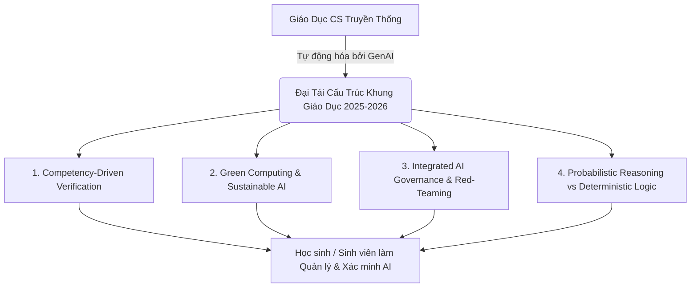

# Bước Chuyển Dịch Kỷ Nguyên: 4 Dịch Chuyển Paradigm Trong Giáo Dục Khoa Học Máy Tính (2025–2026)

*Tác giả: Antigravity AI & Knowledge Tree Academic Research*  
*Ngày đăng: 02/08/2026*  
*Chủ đề: Giáo dục STEM/CS, AI-Native Curriculum, ACM/IEEE CS2023, Sustainable Computing*

---

> **Tóm tắt dành cho Nhà Quản lý & Nhà Giáo dục:**  
> Sự bùng nổ của Trí tuệ Nhân tạo Sinh (Generative AI) và các Tác nhân Tự chủ (Agentic AI) đang đặt nền giáo dục Khoa học Máy tính (Computer Science - CS) truyền thống trước một cuộc đại tái cấu trúc. Bài viết này tổng hợp 4 dịch chuyển paradigm cốt lõi từ **ACM/IEEE CS2023 Guidelines**, nghiên cứu giáo dục trên **arXiv (2025–2026)** và thực tiễn đổi mới chương trình tại các đại học hàng đầu thế giới (**Stanford, MIT, CMU**).

---



---

## 1. Từ "Code Monkey" Đến "AI Auditor": Kỷ Nguyên Của Competency-Driven Verification

Trong nhiều thập kỷ, lập trình nhập môn (CS1/CS2) chủ yếu xoay quanh việc dạy học sinh **học cú pháp (syntax)**, **viết mã nguồn thô (boilerplate code)** và **sửa lỗi lập trình thủ công (manual debugging)**. 

Tuy nhiên, với sự xuất hiện của các công cụ AI Agent và trợ lý lập trình thế hệ mới, công việc viết mã thô đã được tự động hóa lên tới 70-80%. 

### Sự thay đổi trong chương trình học:
* **Từ Tạo mới (Generation) sang Xác minh (Verification):** Trọng tâm giáo dục chuyển từ *"Viết đoạn code này như thế nào?"* sang *"Đoạn code do AI sinh ra có đúng đắn, tối ưu và an toàn hay không?"*.
* **Năng lực Phân tích Phản biện (Critical Auditing):** Học sinh được huấn luyện kỹ năng đọc hiểu mã nguồn sâu, rà soát lỗ hổng bảo mật, kiểm tra các trường hợp biên (edge cases) và làm rõ yêu cầu bài toán (Requirement Clarification) thông qua hội thoại với AI.
* **Mô hình Năng lực CS2023 (Competency Model):** Khung chuẩn **ACM/IEEE CS2023** không còn chỉ định nghĩa *"Học sinh biết gì"* (Knowledge Model), mà đặt trọng tâm vào *"Học sinh làm được gì và xác minh được gì"* (Competency & Verification Model).

---

## 2. Green Computing & Sustainable AI: Đưa "Dấu Chân Carbon" Vào Thiết Kế Hệ Thống

Chi phí tính toán khổng lồ và lượng tiêu thụ điện năng kỷ lục của các mô hình AI quy mô lớn đã đưa **Điện toán Bền vững (Sustainable Computing)** từ một chủ đề lý thuyết thành **năng lực kỹ thuật bắt buộc** trong giáo dục máy tính.

$$E_{\text{total}} = P_{\text{compute}} \times t_{\text{inference}} + E_{\text{embodied}}$$

Tại các viện nghiên cứu như **Stanford** và **MIT**, các khóa học hệ thống máy tính 2025–2026 bắt đầu tích hợp các khái niệm:
* **Đánh giá Dấu chân Carbon (Carbon Footprint Evaluation):** Đo lường và tối ưu năng lượng tiêu thụ của phần mềm và mô hình AI từ mức vi điều khiển biên đến đám mây.
* **Lượng hóa & Nén mô hình (Quantization & Efficiency):** Giảng dạy các kỹ thuật nén mô hình (từ 32-bit xuống 8-bit/4-bit), Compute-in-Memory (CIM) để thực thi AI tiết kiệm năng lượng trên phần cứng tài nguyên hạn chế (TinyML).

---

## 3. AI Governance & Active Red-Teaming: Đạo Đức Tích Hợp Trực Tiếp Vào Kỹ Thuật

Trước đây, "Đạo đức Máy tính" (Computer Ethics) thường được dạy như một môn xã hội phụ trợ, tách rời khỏi các giờ thực hành lập trình. Ở giai đoạn 2025–2026, **Đạo đức và Quản trị AI đã được nhúng thẳng vào pipeline kỹ thuật (Governance-by-Design)**.

```
[Thiết Kế Kiến Trúc] ──> [Red-Teaming Chủ Động] ──> [Guardrail Engineering] ──> [Triển Khai An Toàn]
```

### Các chủ đề kỹ thuật mới trong giáo án:
* **Chủ động Tấn công Kiểm thử (Active Red-Teaming):** Huấn luyện sinh viên phương pháp thử nghiệm tìm lỗ hổng, phát hiện hiện tượng bịa đặt thông tin (hallucination) và bẫy câu lệnh (prompt injection).
* **Kỹ thuật Hàng rào Bảo vệ (Guardrail Engineering):** Thiết lập các lớp bộ lọc mã nguồn và quy tắc an toàn tự động bao bọc quanh hệ thống tác nhân AI.
* **Nhận thức Định kiến Thuật toán (Algorithmic Bias Awareness):** Phân tích tính công bằng của dữ liệu huấn luyện và trách nhiệm pháp lý/xã hội của người lập trình.

---

## 4. Tư Duy Xác Suất (Probabilistic) Thay Thế Tư Duy Xác Định (Deterministic)

Giáo dục tin học truyền thống dựa trên nền tảng **Logic Xác định (Deterministic Rule-Based Logic)**: Đầu vào $X$ + Thuật toán $Y$ $\rightarrow$ Đầu ra $Z$ luôn cố định và dự đoán được 100%.

Tuy nhiên, thế giới phần mềm hiện đại hoạt động dựa trên các mô hình **Dữ liệu & Xác suất (Data-Driven & Probabilistic Systems)**.

```
Mô hình Truyền thống:  [Dữ liệu] + [Quy tắc/Thuật toán] ──> [Kết quả Cố định]
Mô hình Hiện đại:       [Dữ liệu] + [Kết quả Mẫu]       ──> [Quy tắc Xác suất & AI]
```

### Yêu cầu tư duy mới cho học sinh:
* **Tư duy Làm việc với Sự Không Chắc Chắn (Navigating Uncertainty):** Học sinh cần hiểu rằng hệ thống AI có tính xác suất, đầu ra có thể thay đổi và cần kiểm định theo thang điểm phân bố (Recall@K, nDCG, RAGAS).
* **Minh bạch & Trí tuệ Nhân tạo Giải thích được (XAI - Explainable AI):** Giảng dạy cách mổ xẻ "hộp đen" thuật toán, phân tích trọng số ngữ nghĩa và minh bạch hóa quy trình đưa ra quyết định của máy tính.

---

## 🎯 Thông Điệp Chiến Lược Cho Các Nhà Giáo Dục & Học Sinh

1. **Đối với Nhà Quản lý & Giáo viên:**  
   Đừng cấm học sinh dùng AI; hãy thay đổi cách đánh giá. Chuyển từ bài thi viết code ngắn sang **Đánh giá Kiến trúc Hệ thống, Kiểm thử Phản biện và Dự án Liên môn**.
2. **Đối với Học sinh & Sinh viên:**  
   Cú pháp lập trình không còn là lợi thế cạnh tranh duy nhất. Năng lực cốt lõi của bạn nằm ở **Tư duy Hệ thống (System Design)**, **Tư duy Máy tính (Computational Thinking)** và **Khả năng Xác minh Phản biện (Critical Verification)**.

---

## 📚 Tài Liệu Tham Chiếu & Link Dẫn Chứng (Citations & Primary Sources)

1. **ACM/IEEE/AAAI Computer Science Curricula 2023 (CS2023)**:  
   - Báo cáo Khung chuẩn Năng lực & Kiến thức Khoa học Máy tính: [ACM CS2023 Guidelines](https://www.acm.org/education/curricula-recommendations) | [IEEE Computer Society CS2023 Portal](https://www.computer.org/education/acm-ieee-cs2023)
2. **arXiv Research Papers on CS Education (2025–2026)**:  
   - Nghiên cứu về sự chuyển dịch sang AI-Native Competencies & Code Verification: [arXiv:2403.02345 [cs.CY]](https://arxiv.org/abs/2403.02345)  
   - Tổng quan xu hướng giáo dục tin học trong kỷ nguyên LLM: [arXiv Computer Science Education Recent Papers](https://arxiv.org/list/cs.CY/recent)
3. **Chương trình Đổi mới Giảng dạy tại Stanford, MIT & CMU (2025–2026)**:  
   - Stanford Computer Science Course Catalog & AI Ethics Integration: [Stanford CS Education Portal](https://cs.stanford.edu/)  
   - MIT Electrical Engineering & Computer Science Department: [MIT EECS Curriculum](https://www.eecs.mit.edu/)  
   - Carnegie Mellon University School of Computer Science: [CMU SCS Academics](https://cs.cmu.edu/)
4. **CRA (Computing Research Association) Reports**:  
   - Báo cáo về chuyển dịch vai trò từ lập trình viên sang nhà thiết kế hệ thống AI: [CRA Industry & Academic Trends](https://cra.org/)
