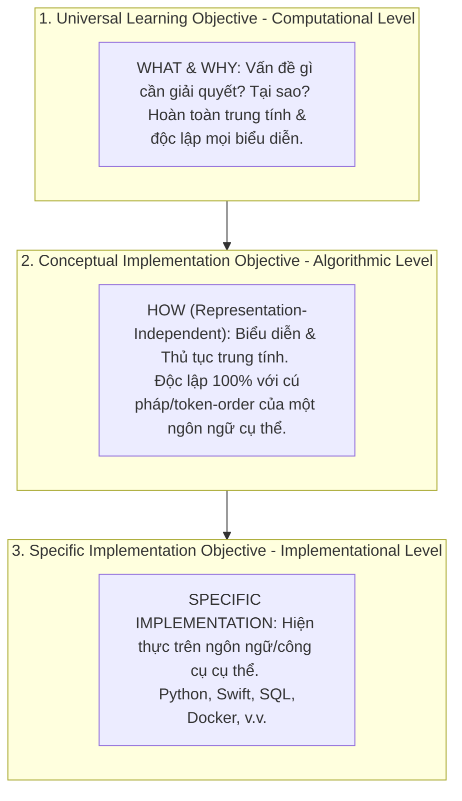
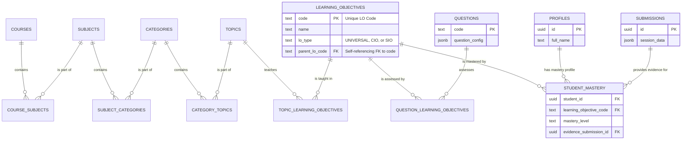

* **Phiên bản:** 2.2 (Bản Cập nhật Kiến trúc Đồ thị Tri thức)
* **Tác giả:** Phạm Minh Thành (Cập nhật bởi Antigravity System)
* **Ngày:** 23-07-2026

---

## **Phần A: Tổng quan & Triết lý**

### **Chương 1: Giới thiệu - Không chỉ là một LMS**

#### **1.1. Tầm nhìn: Xây dựng một Nền tảng Học tập Thích ứng**

**Tại sao chúng ta cần một tầm nhìn vượt trội?**
Hầu hết các nền tảng học tập trực tuyến (LMS) ngày nay hoạt động như một phiên bản số hóa của lớp học truyền thống. Chúng rất giỏi trong việc quản lý khóa học, phân phối tài liệu và chấm điểm bài kiểm tra. Tuy nhiên, mô hình này thường áp dụng một lộ trình học tập duy nhất cho tất cả mọi người, bất kể kiến thức nền tảng hay tốc độ tiếp thu của họ. Điều này dẫn đến hai vấn đề lớn: người học có kinh nghiệm cảm thấy nhàm chán khi phải học lại những điều đã biết, trong khi người học gặp khó khăn có thể bị bỏ lại phía sau. Tầm nhìn của chúng ta là phá vỡ mô hình "một kích cỡ cho tất cả" này. Chúng ta không chỉ xây dựng một công cụ quản lý, mà là một **Nền tảng Học tập Thích ứng (Adaptive Learning System)**—một người bạn đồng hành thông minh, có khả năng thấu hiểu và cá nhân hóa hành trình tri thức cho từng người học.

**Làm thế nào để đạt được điều đó?**
Để xây dựng một hệ thống như vậy, chúng ta phải thay đổi tư duy từ việc "quản lý nội dung" sang "thấu hiểu năng lực". Nền tảng của chúng ta sẽ được xây dựng trên một "bộ não" có khả năng:

1. **Mô hình hóa kiến thức:** Biểu diễn toàn bộ chương trình học dưới dạng một mạng lưới các kỹ năng và khái niệm được kết nối với nhau, gọi là **Đồ thị Tri thức (Knowledge Graph)**.
2. **Theo dõi năng lực:** Xây dựng một "hồ sơ năng lực" chi tiết cho mỗi người học, ghi lại những gì họ đã thực sự nắm vững, không chỉ là những bài học họ đã xem.
3. **Đưa ra quyết định thông minh:** Dựa trên hai yếu tố trên, hệ thống sẽ tự động điều chỉnh lộ trình, đề xuất nội dung phù hợp, và tạo ra các bài đánh giá được cá nhân hóa.

**Hệ thống của chúng ta sẽ là gì?**
Kết quả cuối cùng sẽ là một nền tảng nơi mỗi người học đều có một lộ trình riêng.

* **Ví dụ:** Một sinh viên IT năm thứ hai đã có kinh nghiệm về Python muốn học khóa "Phát triển iOS với Swift". Thay vì bắt đầu từ bài "Biến số là gì?", hệ thống sẽ nhận ra sinh viên này đã nắm vững khái niệm "biến số" (một năng lực phổ quát) và có thể đề xuất: *"Bạn đã quen thuộc với biến trong Python. Đây là cách Swift xử lý nó với `var` và `let`."*. Ngược lại, một học sinh mới hoàn toàn sẽ nhận được một lộ trình đầy đủ hơn với các video giải thích khái niệm cơ bản.

Tầm nhìn này đặt ra một tiêu chuẩn cao hơn, hướng tới một nền tảng không chỉ truyền đạt kiến thức mà còn tối ưu hóa quá trình học tập cho từng cá nhân, giúp họ đạt được mục tiêu nhanh hơn và hiệu quả hơn.

---

#### **1.2. Triết lý cốt lõi: Phân định Hai Cấu trúc - Knowledge Tree & Curriculum**

**Tại sao cần phân định rõ hai cấu trúc?**
Trong các nền tảng cũ, cấu trúc tri thức bị trói buộc chặt vào cấu trúc bài học của khóa học. Điều này khiến kiến thức không thể tái sử dụng và thuật toán thích ứng bị nhập nhằng. Trong phiên bản v2.2, chúng ta tách biệt hoàn toàn **2 Cấu trúc Độc lập**:

1. **Cấu trúc 1: Đồ thị Tri thức (Knowledge Tree - 6 Tầng 100% Trung tính)**
   - Phân cấp: **`Field` $\rightarrow$ `Subject` $\rightarrow$ `Category` $\rightarrow$ `Topic` $\rightarrow$ `Concept` $\rightarrow$ `Learning Objective (LO)`**.
   - Mục đích: Mô hình hóa mạng lưới năng lực nguyên tử và khái niệm chuyên môn.
   - **Quy chuẩn Trung tính (Technology-Agnostic):** 100% các nút từ `Field` đến `CIO` (Conceptual Implementation Objective) **bắt buộc trung tính**, không mang tên công nghệ hay ngôn ngữ lập trình cụ thể. Tầng **`SIO` (Specific Implementation Objective)** là tầng DUY NHẤT chứa chi tiết cú pháp/công nghệ.

2. **Cấu trúc 2: Chương trình Đào tạo (Curriculum - 5 Tầng Sư phạm/Phân phối)**
   - Phân cấp: **`Course` $\rightarrow$ `Unit` $\rightarrow$ `Module` $\rightarrow$ `Lesson` $\rightarrow$ `Activity`**.
   - Mục đích: Tổ chức các trải nghiệm sư phạm, tiến trình giảng dạy và phân phối bài học tới người học.

3. **Điểm nối N:N giữa LO $\leftrightarrow$ Activity**:
   - Mối quan hệ giữa Cây Tri thức và Curriculum được thiết lập thông qua mối quan hệ **Nhiều - Nhiều (N:N)** giữa **`Learning Objective (LO)`** và **`Activity`** (bài đọc, video, bài tập quiz, bài tập coding).
   - Một `Activity` có thể giảng dạy hoặc đánh giá một hoặc nhiều `LOs`.
   - Một `LO` có thể được củng cố bằng nhiều `Activities` khác nhau.

---

#### **1.3. Sơ đồ Kiến trúc Tổng quan (High-level Diagram v2.2)**

**Tại sao cần một sơ đồ tổng quan?**
Sơ đồ kiến trúc thể hiện sự phân tách giữa **Lớp Tri thức Trung tính (Knowledge Tree)** và **Lớp Sư phạm Phân phối (Curriculum)**, cùng cầu nối $N:N$ thông qua các Hoạt động Học tập (`Activities`).

```mermaid
graph TD
    subgraph A[Tương tác & Năng lực (Interaction Layer)]
        U1(Học sinh)
        U2(Giáo viên)
        S(Submissions)
        M(Student Mastery)

        U1 -- Nộp bài --> S
        S -- Cập nhật --> M
        M -- Cá nhân hóa --> U1
        U2 -- Báo cáo --> M
    end

    subgraph B[Chương trình Đào tạo - Curriculum Layer]
        CR(Course)
        UN(Unit)
        MO(Module)
        LE(Lesson)
        ACT(Activity <br/> Quiz, Code, Video, Reading)

        CR --- UN --- MO --- LE --- ACT
    end

    subgraph C[Đồ thị Tri thức - Knowledge Tree Layer 100% Neutral]
        FD(Field)
        SB(Subject)
        CG(Category)
        TP(Topic)
        CP(Concept)
        LO(Learning Objectives <br/> ULO → CIO → SIO)

        FD --- SB --- CG --- TP --- CP --- LO
    end

    %% Mối quan hệ N:N cốt lõi
    ACT -- "Đánh giá & Giảng dạy (N:N)" --> LO
    S -- Trả lời cho --> ACT

    %% Styling
    style A fill:#e3f2fd,stroke:#333,stroke-width:2px
    style B fill:#e8f5e9,stroke:#333,stroke-width:2px
    style C fill:#f3e5f5,stroke:#333,stroke-width:2px
```

* **Giải thích Sơ đồ:**
  * **Knowledge Tree Layer (Màu tím):** Cây 6 tầng hoàn toàn trung tính từ `Field` đến `CIO`. Đây là nguồn chân lý về năng lực.
  * **Curriculum Layer (Màu xanh lá):** Cấu trúc 5 tầng từ `Course` đến `Activity` đóng vai trò tổ chức lộ trình sư phạm.
  * **Cầu nối N:N (`Activity` $\leftrightarrow$ `LO`):** Các bài tập, video, câu hỏi trong `Activity` liên kết trực tiếp với các `LOs` để thu thập dữ liệu về `Student Mastery`.

---

#### **1.4. Cơ sở Lý thuyết Sư phạm & Khoa học Nhận thức Nền tảng (Pedagogical & Cognitive Science Foundations)**

**Tại sao nền tảng học tập thích ứng cần cơ sở khoa học nhận thức?**
Một hệ thống học tập thích ứng không thể chỉ dựa vào trực giác kỹ thuật hoặc các thuật toán heuristic cảm tính. Để đảm bảo mô hình mô phỏng đúng tiến trình tiếp thu tri thức của con người, Đồ thị Tri thức (Knowledge Tree v2.2) được xây dựng dựa trên **12 Lý thuyết và Khung sư phạm chuẩn quốc tế**:

| # | Lý thuyết / Framework | Tác giả, năm | Vai trò & Ứng dụng trong Hệ thống Adaptive |
|---|---|---|---|
| **T1** | **Revised Bloom's Taxonomy** (2 trục: Cognitive Process × Knowledge Dimension) | Anderson & Krathwohl, 2001 | Cơ sở phân định độc lập giữa trục động từ nhận thức (Remember $\rightarrow$ Create) và trục loại tri thức (Factual, Conceptual, Procedural, Metacognitive). |
| **T2** | **ACT-R Theory** (Continuum declarative $\rightarrow$ procedural qua *compilation*) | Anderson, J.R., 1982/1993 | Giải thích tiến trình chuyển hóa từ tri thức khai báo (ULO) sang tri thức thủ tục (CIO/SIO), chứng minh ranh giới ULO/CIO mang tính liên tục. |
| **T3** | **Conceptual vs Procedural Knowledge** trong Giáo dục | Hiebert & Lefevre, 1986 | Gốc lý thuyết của sự phân tầng giữa "khái niệm" (ULO) và "thủ tục/quy trình" (CIO/SIO) trong Đồ thị Tri thức. |
| **T4** | **Instrumental Understanding vs Relational Understanding** | Skemp, 1976 | Phân biệt rõ "biết cách làm" (SIO - Instrumental) và "hiểu tại sao" (ULO/CIO - Relational); chứng minh làm đúng SIO không tự động suy ra hiểu ULO. |
| **T5** | **Iterative Development of Conceptual & Procedural Knowledge** | Rittle-Johnson, Siegler & Alibali, 2001 | Bằng chứng thực nghiệm: hai loại tri thức phát triển song song và tương tác hai chiều, không phải quan hệ nhân-quả một chiều tuyệt đối. |
| **T6** | **Tri-Level Hypothesis** (Computational / Algorithmic / Implementational) | Marr, D., 1982 | Phép thử vận hành hóa cho ranh giới 3 tầng ULO–CIO–SIO; thiết lập tiêu chí *Representation-Independent* (độc lập cú pháp) cho CIO. |
| **T7** | **Mastery Learning** | Bloom, B.S., 1968 | Nền tảng lý thuyết cho việc theo dõi hồ sơ năng lực rời rạc trong bảng `student_mastery` (`not_started`, `in_progress`, `mastered`). |
| **T8** | **Transfer of Learning** (Near vs Far Transfer) | Perkins & Salomon, 1992 | Cơ sở cảnh báo rủi ro *Far Transfer* thấp nếu ngân hàng câu hỏi nghiêng quá lệch về SIO thay vì đánh giá trực tiếp ULO/CIO. |
| **T9** | **Self-Regulated Learning (SRL)** | Zimmerman, B.J., 2002 | Cơ sở lý luận cho việc tích hợp trục Metacognitive Knowledge Dimension để hỗ trợ người học tự điều phối lộ trình. |
| **T10** | **Forgetting Curve & Memory Decay** | Ebbinghaus, H., 1885 | Cơ sở khoa học để thiết kế chiều thời gian và hệ số suy giảm năng lực (decay factor) trong hồ sơ `student_mastery`. |
| **T11** | **Knowledge Space Theory / Q-matrix** | Doignon & Falmagne, 1985; Tatsuoka, 1983 | Nền tảng toán học-nhận thức cho thuật toán suy luận và lan truyền tín hiệu năng lực từ SIO $\rightarrow$ CIO $\rightarrow$ ULO. |
| **T12** | **Behavioral Objectives (Tiêu chuẩn S.M.A)** | Mager, R.F., 1962 | Tiền đề quy chuẩn hóa 100% câu mô tả LO BẮT BUỘC bắt đầu bằng tiền tố *"Người học có khả năng..."*. |

Việc tích hợp 12 cơ sở lý thuyết này giúp kiến trúc hệ thống đảm bảo cả tính **chính xác sư phạm (pedagogical soundness)** và **tính toàn vẹn dữ liệu (data integrity)**.

---

### **Chương 2: Đồ thị Tri thức - Trái tim của Hệ thống**

#### **2.1. Giới thiệu về Learning Objectives (LOs) - Đơn vị Năng lực Nguyên tử**

**Tại sao chúng ta cần một "đơn vị nguyên tử"?**
Trong một hệ thống phức tạp, việc xác định được "đơn vị nhỏ nhất, không thể phân chia được nữa" là cực kỳ quan trọng. Trong vật lý, đó là nguyên tử. Trong hệ thống của chúng ta, đó là **Mục tiêu Học tập (Learning Objective - LO)**. Thay vì xem một "bài học" (Topic) là đơn vị cơ bản, chúng ta coi nó là một "phân tử" được cấu thành từ nhiều "nguyên tử" LOs.

Việc định nghĩa một đơn vị nguyên tử như vậy cho phép chúng ta xây dựng mọi thứ khác xung quanh nó một cách nhất quán. Một câu hỏi không dùng để kiểm tra một "bài học", mà nó dùng để kiểm tra một "năng lực" (LO). Một video không dùng để dạy một "bài học", mà nó dùng để giảng về một "năng lực" (LO). Triết lý này giúp tách rời hoàn toàn logic sư phạm ra khỏi cấu trúc trình bày nội dung.

**Làm thế nào để xác định một LO tốt?**
Một LO được định nghĩa tốt phải đáp ứng 3 tiêu chí **S.M.A (Specific, Measurable, Action-oriented)**:

1. **Specific (Cụ thể):** Nó mô tả một kỹ năng hoặc một mẩu kiến thức duy nhất, rõ ràng.
    * *Tệ:* "Hiểu về vòng lặp." (Quá chung chung)
    * *Tốt:* "Phân biệt được trường hợp sử dụng giữa vòng lặp `for` và `while`."
2. **Measurable (Đo lường được):** Bạn có thể tạo ra một câu hỏi hoặc một bài tập để kiểm tra xem người học đã đạt được mục tiêu này hay chưa.
    * *Tệ:* "Cảm thấy tự tin hơn với lập trình." (Khó đo lường)
    * *Tốt:* "Viết được một hàm trả về giá trị tổng của một mảng số nguyên."
3. **Action-oriented (Hướng đến Hành động):** Nó thường bắt đầu bằng một động từ hành động mạnh mẽ (theo thang đo Bloom) như "Định nghĩa", "Phân biệt", "Áp dụng", "Phân tích", "Thiết kế".
    * *Ví dụ:* "**Áp dụng** cú pháp `if-else` để giải quyết một bài toán logic điều kiện đơn giản."

**Kết quả là gì?**
Bằng cách xây dựng toàn bộ hệ thống dựa trên các đơn vị năng lực nguyên tử này, chúng ta tạo ra một "ngôn ngữ chung" cho toàn bộ nền tảng.

* **Đối với Chuyên viên PTCT:** Bạn có một "bảng tuần hoàn các nguyên tố kiến thức". Bạn có thể kết hợp các "nguyên tử" LO này để tạo ra các "phân tử" `Topic` và các "hợp chất" `Course` một cách linh hoạt.
* **Đối với Hệ thống:** Nó có một bộ dữ liệu có cấu trúc sâu sắc. Thay vì chỉ thấy các khối nội dung mờ mịt, nó thấy được các mối liên kết năng lực rõ ràng, cho phép nó thực hiện các phân tích và đề xuất thông minh.

Mỗi LO trong bảng `learning_objectives` của chúng ta chính là một nguyên tử như vậy, là viên gạch nền tảng để xây dựng toàn bộ Đồ thị Tri thức.

---

#### **2.2. Mô hình LO Đa cấp: ULO, CIO, SIO - Chuẩn hóa theo Tri-Level Hypothesis của Marr (1982)**

**Tại sao kiến thức không phải là một danh sách phẳng?**
Nếu chúng ta chỉ coi tất cả các Learning Objectives (LOs) là một danh sách ngang hàng, hệ thống sẽ gặp khó khăn trong việc phân biệt giữa kiến thức khái niệm và kỹ năng thực hành. Một học sinh có thể hiểu rất rõ "Tính kế thừa là gì?" (lý thuyết) nhưng lại không thể viết đúng cú pháp để tạo một lớp con trong Python (thực hành). Một hệ thống thông minh cần phải nhận ra sự khác biệt tinh tế này để đưa ra gợi ý phù hợp.

Dựa trên **Tri-Level Hypothesis của David Marr (1982) [T6]**, chúng ta vận hành hóa 3 tầng kiến thức ULO - CIO - SIO dựa trên độ trừu tượng của biểu diễn:



---

#### **Cấu trúc Chi tiết 3 Cấp độ**

1. **Cấp 1: Universal Learning Objective (ULO) - Computational Level ("Cái GÌ & Tại SAO")**
    * **Mục đích:** Mô tả các **khái niệm, nguyên lý, hoặc ý tưởng cốt lõi** trong một lĩnh vực (Marr's Computational Level). Chúng là những kiến thức phổ quát, độc lập với bất kỳ ngôn ngữ hay công cụ nào.
    * **Cách nhận biết:** Trả lời câu hỏi "Vấn đề gì cần giải quyết?" hoặc "Tại sao nguyên lý này tồn tại?".
    * **Ví dụ:**
        * `ULO-OOP-INHERITANCE`: *"Hiểu về nguyên lý Kế thừa để tái sử dụng mã nguồn và thiết lập quan hệ phân cấp giữa các đối tượng."*
        * `ULO-DATATYPE-01`: *"Hiểu về sự cần thiết của các kiểu dữ liệu để biểu diễn thông tin có định dạng khác nhau trong bộ nhớ."*

2. **Cấp 2: Conceptual Implementation Objective (CIO) - Algorithmic Level ("NHƯ THẾ NÀO - Trung tính")**
    * **Mục đích:** Mô tả **mô hình thủ tục hoặc quy trình thuật toán** để hiện thực hóa ULO (Marr's Algorithmic Level). **CIO BẮT BUỘC Representation-Independent (Độc lập biểu diễn cú pháp)**.
    * **Phép thử Vận hành hóa 2-Ngôn-ngữ cho CIO (Marr's Operational Test):**
      > *"Hãy map mô tả CIO sang $\ge 2$ ngôn ngữ/công cụ khác nhau. Nếu câu mô tả chỉ khớp tự nhiên với 1 ngôn ngữ/công cụ (ví dụ: ép thứ tự từ khóa token-order của Python/Swift), CIO đó đã bị giáng cấp xuống Implementational trá hình và BẮT BUỘC phải viết lại hoặc chuyển xuống SIO."*
    * **Ví dụ Chuẩn hóa:**
        * `CIO-OOP-INHERIT-SYNTAX` (con của `ULO-OOP-INHERITANCE`): *"Sử dụng cú pháp khai báo lớp con có chỉ định lớp cha để thiết lập quan hệ kế thừa."* *(Đáp ứng phép thử Marr: Khớp tự nhiên cả Python `class Child(Parent)`, Swift `class Child: Parent`, và Java `class Child extends Parent`).*
        * **Ví dụ LỖI đã sửa:** `CIO-OOP-INHERIT-SYNTAX`: *"Sử dụng cú pháp `class Child(Parent)`..."* $\rightarrow$ **Vi phạm nghiêm trọng** vì ép token-order `(Parent)` của Python.

3. **Cấp 3: Specific Implementation Objective (SIO) - Implementational Level ("NHƯ THẾ NÀO - Cụ thể")**
    * **Mục đích:** Mô tả **cú pháp, hàm, hoặc khối lệnh chính xác** trong một ngôn ngữ hoặc công cụ cụ thể (Marr's Implementational Level). Đây là tầng DUY NHẤT chứa tên công nghệ/ngôn ngữ.
    * **Ví dụ:**
        * `SIO-OOP-INHERIT-PY` (con của `CIO-OOP-INHERIT-SYNTAX`): *"Khai báo lớp con kế thừa lớp cha trong Python bằng cú pháp `class Child(Parent):`."*
        * `SIO-OOP-INHERIT-SW` (con của `CIO-OOP-INHERIT-SYNTAX`): *"Khai báo lớp con kế thừa lớp cha trong Swift bằng cú pháp `class Child: Parent`."*

---

#### **2.2.1. Phân tích Tính Hợp lệ Suy luận (Inferential Validity) & Quy tắc Coverage Đánh giá Trực tiếp**

**Rủi ro Suy luận Gián tiếp SIO $\rightarrow$ CIO $\rightarrow$ ULO:**
Trong các phiên bản trước, hệ thống giả định rằng nếu học sinh trả lời đúng các câu hỏi SIO, hệ thống có thể suy luận trực tiếp rằng học sinh đã thành thạo CIO và ULO tương ứng.

Tuy nhiên, căn cứ vào **Skemp (1976) [T4]** (Instrumental vs Relational Understanding) và **Rittle-Johnson et al. (2001) [T5]** (Iterative Development):
- **Instrumental Understanding (SIO):** Học sinh có thể nhớ vẹt cú pháp `class Child(Parent):` trong Python (làm đúng SIO) nhưng hoàn toàn **không hiểu tại sao** cần kế thừa hoặc khi nào nên dùng Composition thay vì Inheritance (chưa đạt ULO/CIO).
- Hai loại tri thức này có tính **tách biệt một phần (partial dissociability)**.
- Ngoài ra, do SIO dễ biên soạn câu hỏi hơn, ngân hàng câu hỏi có xu hướng **"nghiêng lệch tự nhiên" (natural pull)** về SIO. Nếu không kiểm soát, hệ thống sẽ gặp rủi ro **"False Mastery"** và giảm khả năng chuyển giao tri thức xa (**Far Transfer - Perkins & Salomon 1992 [T8]**).

**Quy tắc Coverage Đánh giá Trực tiếp (Direct Assessment Mandatory Rule):**
1. **Ràng buộc Coverage:** Mỗi CIO và ULO BẮT BUỘC phải có **$\ge N$ câu hỏi / Hoạt động đánh giá trực tiếp** (gắn thẻ trực tiếp vào ULO/CIO đó, không chỉ đánh giá gián tiếp qua SIO con).
2. **Cảnh báo Coverage Gap:** RPC `get_content_performance_summary` và quy trình xuất bản nội dung (Publishing Pipeline) sẽ tự động quét và phát ra cảnh báo `Coverage Gap Warning` nếu một ULO/CIO không đạt đủ số lượng câu hỏi đánh giá trực tiếp.

---

#### **2.3. Sức mạnh của Mối quan hệ N-N: Cách chúng ta tái sử dụng kiến thức**

**Tại sao cấu trúc cây phân cấp là chưa đủ?**
Mô hình LO Đa cấp cho chúng ta một cấu trúc cây kiến thức rất mạnh mẽ. Tuy nhiên, nếu chúng ta chỉ đơn thuần đặt các cây này vào một cấu trúc nội dung cứng nhắc (ví dụ: một LO chỉ thuộc một Topic, một Topic chỉ thuộc một Category), chúng ta lại quay trở lại vấn đề "silo" kiến thức. Thực tế, kiến thức không phải là một cái cây đơn lẻ, mà là một **khu rừng các cây có cành lá đan xen vào nhau**. Một khái niệm được học trong môn này có thể là nền tảng cho một kỹ năng trong môn học khác.

Để mô hình hóa sự kết nối phức tạp này, chúng ta cần một cơ chế linh hoạt hơn là mối quan hệ cha-con đơn thuần. Đó chính là lúc **mối quan hệ Nhiều-Nhiều (N-N)** phát huy sức mạnh. Nó cho phép chúng ta tạo ra các liên kết ngang, giúp tái sử dụng kiến thức một cách triệt để.

**Làm thế nào chúng ta tạo ra một mạng lưới kết nối?**
Trong cơ sở dữ liệu của chúng ta, các mối quan hệ N-N được hiện thực hóa bằng các **bảng trung gian (junction tables)**. Thay vì đặt khóa ngoại trực tiếp, chúng ta tạo ra một bảng riêng chỉ để lưu trữ các cặp liên kết. Chúng ta áp dụng triệt để nguyên tắc này cho toàn bộ hệ thống phân cấp nội dung:

1. **Một `Topic` có thể thuộc nhiều `Categories`:**
    * *Ví dụ:* Topic "Làm việc với API REST" có thể được liên kết với cả Category "Phát triển Backend" và "Phát triển Frontend" trong cùng một môn học Lập trình Web.
2. **Một `Learning Objective` có thể được dùng trong nhiều `Topics`:**
    * *Ví dụ:* ULO "Hiểu về Giao thức HTTP" là một năng lực cốt lõi. Nó có thể được liên kết với:
        * Topic "Gọi API trong Swift".
        * Topic "Tương tác với Server trong Django".
        * Topic "Gửi Dữ liệu Cảm biến trong IoT".
    Chúng ta chỉ cần định nghĩa ULO này một lần và tái sử dụng nó ở khắp mọi nơi.
3. **Một `Question` có thể đánh giá nhiều `Learning Objectives`:**
    * *Ví dụ:* Một bài toán code phức tạp yêu cầu học sinh vừa phải định nghĩa một hàm, vừa phải sử dụng vòng lặp. Câu hỏi này sẽ được liên kết với cả hai LOs tương ứng, cho phép hệ thống đánh giá khả năng tổng hợp kiến thức của người học.

**Kết quả của kiến trúc kết nối này là gì?**
Bằng cách kết hợp cấu trúc cây phân cấp của các LOs (quan hệ dọc) với các mối quan hệ N-N (quan hệ ngang), chúng ta tạo ra một **Đồ thị Tri thức thực sự**. Kiến trúc này mang lại những lợi ích đột phá:

* **Tối đa hóa Tái sử dụng:** Chúng ta tuân thủ nguyên tắc **DRY (Don't Repeat Yourself)** ở cấp độ nội dung. Một LO, một câu hỏi, hay một video chỉ cần được tạo ra một lần duy nhất và có thể được "triệu tập" ở bất kỳ đâu trong hệ thống khi cần. Điều này tiết kiệm đáng kể thời gian và công sức cho đội ngũ biên soạn.
* **Tăng cường Tính nhất quán:** Khi cần cập nhật một khái niệm, bạn chỉ cần sửa đổi định nghĩa của một LO duy nhất, và thay đổi đó sẽ tự động được phản ánh ở mọi nơi mà LO đó được sử dụng.
* **Tạo ra các Lộ trình học Linh hoạt:** Giáo viên có thể tự do "mix-and-match" các LOs từ nhiều lĩnh vực khác nhau để tạo ra các khóa học liên ngành mà không cần phải sao chép nội dung.
* **Phân tích Thông minh hơn:** Hệ thống có thể phát hiện ra các mối liên hệ ẩn. Ví dụ, nó có thể nhận thấy rằng những học sinh yếu ở LO "Đại số tuyến tính" trong môn Toán thường sẽ gặp khó khăn với LO "Đồ họa 3D" trong môn Lập trình Game, và từ đó đưa ra các cảnh báo hoặc gợi ý ôn tập sớm.

Tóm lại, nếu mô hình LO đa cấp là các "nguyên tử" kiến thức, thì các mối quan hệ N-N chính là các "liên kết hóa học" cho phép chúng ta kết hợp các nguyên tử đó thành vô số "phân tử" và "hợp chất" tri thức một cách linh hoạt và mạnh mẽ.

---

### **Chương 3: Quy trình Xây dựng Nội dung trên Đồ thị Tri thức**

#### **3.1. Bước 1: Phân tích và Xây dựng Cây Năng lực (Cây LOs)**

**Tại sao phải bắt đầu từ Năng lực?**
Trong quy trình làm việc truyền thống, chúng ta thường bắt đầu bằng cách phác thảo mục lục cho một cuốn sách: các chương và các bài học. Tuy nhiên, với triết lý lấy năng lực làm trung tâm, chúng ta phải đảo ngược quy trình này. Bước đầu tiên và quan trọng nhất là phải trả lời câu hỏi: **"Sau khi hoàn thành một phần học (hoặc cả khóa học), chúng ta muốn người học có thể LÀM được những gì?"**. Câu trả lời cho câu hỏi này chính là danh sách các năng lực, hay các Learning Objectives (LOs), mà chúng ta cần xây dựng.

Việc bắt đầu từ LOs đảm bảo rằng mọi nội dung chúng ta tạo ra sau này—từ video, bài đọc đến câu hỏi kiểm tra—đều có mục đích rõ ràng và trực tiếp phục vụ cho việc hình thành năng lực cho người học. Nó giúp chúng ta tránh tạo ra những nội dung lan man, không có mục tiêu sư phạm cụ thể.

**Làm thế nào để xây dựng một Cây Năng lực?**
Quy trình này đòi hỏi tư duy phân tích và cấu trúc hóa kiến thức. Bạn sẽ làm việc với hệ thống quản lý LOs của chúng ta và thực hiện các bước sau:

1. **Brainstorm & Liệt kê (Top-down & Bottom-up):**
    * **Top-down:** Bắt đầu từ những khái niệm lớn nhất, trừu tượng nhất của một lĩnh vực. Đây chính là các **ULOs** của bạn. Ví dụ: "Lập trình Hướng đối tượng", "Cấu trúc Dữ liệu", "Giao tiếp Mạng".
    * **Bottom-up:** Liệt kê tất cả các kỹ năng, cú pháp, hàm cụ thể mà một người học cần biết. Đây là các **SIOs** tiềm năng. Ví dụ: "cú pháp `class` trong Python", "hàm `append` cho list", "sử dụng thư viện `requests`".

2. **Cấu trúc hóa thành Cây (Tạo mối quan hệ Cha-Con):**
    * Sau khi có danh sách các ý tưởng, hãy bắt đầu sắp xếp chúng thành một cây phân cấp 3 cấp.
    * Với mỗi ULO, hãy tự hỏi: "Có những mô hình hoặc ý tưởng chính nào để hiện thực hóa khái niệm này?". Câu trả lời sẽ là các **CIOs**.
    * Với mỗi CIO, hãy tự hỏi: "Trong từng ngôn ngữ/công cụ cụ thể, cú pháp hoặc hàm để triển khai ý tưởng này là gì?". Câu trả lời sẽ là các **SIOs**.
    * Sử dụng chức năng "chọn `parent_lo_code`" trong hệ thống để tạo các liên kết cha-con này.

3. **Kiểm tra và Tinh chỉnh:**
    * Sau khi xây dựng xong, hãy đọc lại toàn bộ cây. Liệu nó có logic không? Có thiếu sót ở đâu không? Có LO nào quá lớn và cần được tách nhỏ hơn không?

**Kết quả của bước này là gì?**
Kết quả của bước này không phải là một khóa học, mà là một **"bản đồ tri thức"** có cấu trúc cho một lĩnh vực cụ thể. Đây là một tài sản cực kỳ giá trị và có thể tái sử dụng.

* **Ví dụ về một nhánh cây năng lực cho "Lập trình Hướng đối tượng":**

  * **`ULO-OOP-01`**: Hiểu về nguyên lý Đóng gói.
    * **`CIO-OOP-PRIV-MOD`**: Sử dụng access modifiers để che giấu dữ liệu.
      * **`SIO-OOP-PRIV-PY`**: Sử dụng `__` trong Python.
      * **`SIO-OOP-PRIV-JV`**: Sử dụng từ khóa `private` trong Java.
    * **`CIO-OOP-GETSET`**: Sử dụng các phương thức getter/setter để truy cập dữ liệu một cách có kiểm soát.
      * **`SIO-OOP-GETSET-PY`**: Sử dụng `@property` decorator trong Python.
      * **`SIO-OOP-GETSET-JV`**: Viết các phương thức `getX()` và `setX()` trong Java.

Khi "bản đồ" này được xây dựng, nó đã sẵn sàng để các chuyên gia khác có thể tạo ra các học liệu và câu hỏi để "lấp đầy" nó, hoặc các giáo viên có thể lựa chọn các "địa danh" (LOs) trên bản đồ này để xây dựng "tour du lịch" (khóa học) của riêng họ.

---

#### **3.2. Bước 2: Tạo và Gắn thẻ Học liệu (Videos, Bài đọc)**

**Tại sao phải gắn thẻ cho học liệu?**
Một học liệu không được gắn thẻ năng lực (LO) giống như một trang web không có metadata—công cụ tìm kiếm sẽ không thể hiểu được nội dung của nó. Trong hệ thống của chúng ta, nếu một video không được gắn thẻ, nó sẽ trở nên "vô hình" đối với các tính năng thông minh. Hệ thống sẽ không thể đề xuất nó cho một học sinh đang gặp khó khăn, cũng không thể tự động đưa nó vào một lộ trình học được cá nhân hóa.

Việc gắn thẻ LOs cho học liệu chính là cách chúng ta nói với hệ thống: **"Học liệu này dùng để giảng dạy hoặc minh họa cho năng lực X"**. Điều này biến kho học liệu của chúng ta từ một thư viện thụ động thành một công cụ sư phạm chủ động, sẵn sàng được hệ thống điều phối đến đúng người, đúng thời điểm.

**Làm thế nào để tạo và gắn thẻ học liệu một cách hiệu quả?**
Quy trình này tập trung vào việc tạo ra các học liệu có mục đích rõ ràng và có khả năng tái sử dụng cao.

1. **Xác định Mục tiêu trước khi Tạo:**
    * Trước khi bắt đầu viết kịch bản cho một video hay soạn một bài đọc, hãy tự hỏi: "Học liệu này được tạo ra để phục vụ cho (những) LO nào?".
    * Hãy tham khảo Cây Năng lực mà bạn đã xây dựng ở Bước 1. Việc xác định trước mục tiêu sẽ giúp nội dung của bạn tập trung và đi thẳng vào vấn đề, tránh lan man.

2. **Tạo Học liệu theo từng Cấp độ LO:**
    * **Học liệu cho ULO (Khái niệm):** Tạo các video, bài viết giải thích các khái niệm trừu tượng. Hãy cố gắng giữ cho chúng độc lập với công nghệ nhất có thể để tối đa hóa khả năng tái sử dụng.
        * *Ví dụ:* Một video hoạt hình giải thích "API là gì?" mà không cần một dòng code nào.
    * **Học liệu cho CIO (Mô hình):** Tạo các nội dung so sánh, giải thích các phương pháp tiếp cận khác nhau để giải quyết một vấn đề.
        * *Ví dụ:* Một bài viết so sánh giữa REST API và GraphQL.
    * **Học liệu cho SIO (Cú pháp):** Tạo các video hướng dẫn (tutorials), tài liệu tham khảo (cheatsheets), hoặc các bài blog đi sâu vào cú pháp và cách sử dụng thư viện cụ thể.
        * *Ví dụ:* Một video hướng dẫn từng bước cách sử dụng thư viện `requests` trong Python để gọi một API.

3. **Thực hiện Gắn thẻ trong Hệ thống:**
    * Sau khi tạo xong học liệu, hãy upload nó lên hệ thống.
    * Sử dụng giao diện quản lý tài nguyên để tìm và liên kết nó với một hoặc nhiều LOs đã được định nghĩa.
    * Hãy tuân thủ các **Nguyên tắc Vàng** đã học ở Phần 3 của tài liệu này (Gắn vào LO cụ thể nhất, Gắn thẻ chéo cho nội dung tổng hợp).

**Kết quả của bước này là gì?**
Kết quả là chúng ta sẽ có một **kho học liệu được tổ chức theo năng lực**, chứ không phải theo khóa học.

* **Ví dụ về cách một Topic được "lắp ráp" tự động:**
  * Một giáo viên tạo một Topic mới tên là "Bắt đầu với API trong Python".
  * Giáo viên liên kết Topic này với 2 LOs: `ULO-NET-REQ` ("Hiểu về Request/Response") và `SIO-PY-REQUESTS-GET` ("Sử dụng thư viện `requests` để gửi lệnh GET").
  * Khi học sinh vào trang của Topic này, hệ thống sẽ tự động tìm kiếm và hiển thị:
        1. Video hoạt hình "API là gì?" (vì nó được gắn với `ULO-NET-REQ`).
        2. Video hướng dẫn code "Sử dụng thư viện `requests`" (vì nó được gắn với `SIO-PY-REQUESTS-GET`).
        3. Bài đọc tham khảo cú pháp cho thư viện `requests` (cũng được gắn với `SIO-PY-REQUESTS-GET`).

Như vậy, giáo viên không cần phải tự mình đi tìm và đính kèm từng học liệu. Họ chỉ cần xác định **những gì** cần dạy (các LOs), và hệ thống sẽ tự động tìm ra các tài nguyên **để dạy** những thứ đó.

---

#### **3.3. Bước 3: Tạo và Gắn thẻ Câu hỏi Đánh giá**

**Tại sao việc gắn thẻ cho câu hỏi lại cực kỳ quan trọng?**
Nếu `student_mastery` là bộ não của hệ thống học tập thích ứng, thì các câu hỏi được gắn thẻ chính là các **"cảm biến"** thu thập dữ liệu cho bộ não đó. Mỗi khi một học sinh trả lời một câu hỏi, hệ thống không chỉ ghi nhận "đúng" hay "sai". Nhờ vào các thẻ LO, nó biết được học sinh đó vừa thể hiện sự thành thạo (hoặc yếu kém) đối với một năng lực cụ thể.

Một câu hỏi không được gắn thẻ LO giống như một cảm biến không được kết nối. Nó có thể hoạt động, nhưng dữ liệu nó tạo ra không mang nhiều ý nghĩa cho hệ thống lớn. Việc gắn thẻ chính xác và chi tiết cho từng câu hỏi là yếu tố quyết định đến độ chính xác của hồ sơ năng lực học sinh, và do đó, ảnh hưởng trực tiếp đến chất lượng của các gợi ý cá nhân hóa.

**Làm thế nào để tạo và gắn thẻ câu hỏi một cách hiệu quả?**
Quy trình này đòi hỏi người biên soạn phải có ý định rõ ràng về năng lực cần kiểm tra trước khi viết câu hỏi.

1. **Thiết kế Câu hỏi Dựa trên LO (Assessment Design):**
    * Bắt đầu bằng cách chọn một LO từ Đồ thị Tri thức.
    * Hãy tự hỏi: "Loại câu hỏi nào (trắc nghiệm, code, tự luận...) là phù hợp nhất để đánh giá năng lực được mô tả trong LO này?". Tham khảo các `suggested_bloom_levels` trên LO để có thêm gợi ý.
    * Viết nội dung câu hỏi và các phương án trả lời (nếu có) nhắm thẳng vào việc đo lường năng lực đó.

2. **Tạo Câu hỏi trong Ngân hàng đề:**
    * Sử dụng công cụ tạo câu hỏi (`interactive-quiz-kit`) để soạn câu hỏi.
    * Điền đầy đủ các thông tin cần thiết: đề bài, đáp án, giải thích.

3. **Thực hiện Gắn thẻ trong Hệ thống:**
    * Sau khi tạo xong câu hỏi, sử dụng giao diện quản lý câu hỏi để liên kết nó với (các) LO mục tiêu.
    * Áp dụng nghiêm ngặt các **Nguyên tắc Vàng**:
        * **Gắn vào LO cụ thể nhất:** Một câu hỏi về cú pháp `let` của Swift phải được gắn vào `SIO-VAR-IMMUTABLE-SW`, không phải CIO hay ULO chung chung.
        * **Gắn thẻ chéo:** Một bài toán code yêu cầu cả kiến thức về hàm và vòng lặp phải được gắn vào cả hai SIOs tương ứng. Điều này cho phép hệ thống biết rằng việc trả lời đúng câu hỏi này là một bằng chứng mạnh mẽ cho cả hai năng lực.

**Kết quả của bước này là gì?**
Chúng ta sẽ xây dựng được một **Ngân hàng Câu hỏi Thông minh**, nơi mỗi câu hỏi đều mang trong mình "DNA" sư phạm của nó.

* **Ví dụ về cách hệ thống sử dụng ngân hàng câu hỏi này:**
  * **Tạo bài kiểm tra tự động:** Giáo viên muốn tạo một bài kiểm tra nhanh về chủ đề "Vòng lặp trong Python". Chủ đề này được liên kết với các LOs `ULO-LOOP-01`, `CIO-LOOP-FOR`, `SIO-LOOP-FOR-PY`. Hệ thống sẽ tự động quét ngân hàng đề, tìm tất cả các câu hỏi được gắn thẻ với ba LO này và các LO con của chúng để tạo ra một bài kiểm tra phù hợp.
  * **Phân tích lỗi sai chính xác:** Một học sinh trả lời sai 3 câu trong bài kiểm tra.
    * Câu 1 được gắn thẻ `SIO-LOOP-FOR-PY`.
    * Câu 2 được gắn thẻ `SIO-LOOP-FOR-PY`.
    * Câu 3 được gắn thẻ `ULO-LOOP-01`.
        Hệ thống sẽ cập nhật vào `student_mastery` rằng học sinh này đang **rất yếu** ở năng lực thực hành cú pháp `for` của Python, và cũng có một chút **lỗ hổng** về kiến thức khái niệm chung. Dựa vào đó, nó sẽ đề xuất các học liệu SIO trước, rồi mới đến ULO.

Bằng cách này, quy trình đánh giá không chỉ dừng lại ở việc cho điểm, mà trở thành một công cụ chẩn đoán mạnh mẽ, cung cấp dữ liệu đầu vào vô giá cho vòng lặp học tập thích ứng.

---

#### **3.4. Bước 4: Thiết kế Lộ trình học (Tổ chức Topics, Categories)**

**Tại sao chúng ta vẫn cần Topics và Categories?**
Nếu Đồ thị Tri thức là một bản đồ khổng lồ chứa tất cả các "địa danh" kiến thức, thì `Topics`, `Categories`, `Subjects`, và `Courses` chính là những **"tour du lịch"** được thiết kế sẵn để dẫn dắt người học khám phá bản đồ đó. Mặc dù một người học có kinh nghiệm có thể tự do khám phá, hầu hết mọi người, đặc biệt là người mới bắt đầu, đều cần một lộ trình được sắp xếp một cách logic và có tính sư phạm.

Vai trò của `Topics` và `Categories` không phải là để "chứa" kiến thức, mà là để **"tổ chức và trình bày"** các năng lực (LOs) theo một trật tự hợp lý. Chúng tạo ra bối cảnh và cấu trúc, giúp người học thấy được bức tranh toàn cảnh và biết họ cần học gì tiếp theo.

**Làm thế nào để thiết kế một Lộ trình học hiệu quả?**
Đây là bước mà chuyên môn về thiết kế chương trình học của bạn được phát huy tối đa. Thay vì phải tự mình tạo ra mọi thứ từ đầu, giờ đây bạn sẽ đóng vai trò như một người "nhạc trưởng", lựa chọn và sắp xếp các "nhạc cụ" (LOs và học liệu) đã có sẵn trong hệ thống.

1. **Xác định Cấu trúc Phân cấp:**
    * Bắt đầu bằng cách tạo ra cấu trúc `Course` → `Subject` → `Category` → `Topic` như bình thường. Đây là bộ khung cho lộ trình học của bạn.
    * *Ví dụ:* Tạo `Course`: "Lập trình Web Nâng cao", `Subject`: "Phát triển Backend", `Category`: "Bảo mật Ứng dụng Web".

2. **"Lắp ráp" các Topic bằng cách Liên kết đến LOs:**
    * Với mỗi `Topic` bạn tạo ra (ví dụ: "Phòng chống Tấn công SQL Injection"), hãy tự hỏi: "Để hoàn thành bài học này, học sinh cần đạt được những năng lực (LOs) nào?".
    * Sử dụng giao diện quản lý Topic, bạn sẽ **tìm kiếm và liên kết** đến các LOs đã tồn tại trong Đồ thị Tri thức.
    * *Ví dụ:* Topic "Phòng chống Tấn công SQL Injection" sẽ được liên kết với các LOs như:
        * `ULO-SEC-INJECTION`: "Hiểu về bản chất của tấn công Injection."
        * `CIO-SEC-SQLI-PARAM`: "Sử dụng truy vấn tham số hóa (Parameterized Queries) để ngăn chặn SQL Injection."
        * `SIO-DJANGO-ORM-QUERY`: "Viết truy vấn an toàn bằng Django ORM."

3. **Sắp xếp Thứ tự (nếu cần):**
    * Trong một Topic, bạn có thể sắp xếp thứ tự hiển thị của các LOs để dẫn dắt người học đi từ lý thuyết (ULO) đến thực hành (SIO).
    * Tương tự, trong một Category, bạn có thể sắp xếp thứ tự của các Topics.

**Kết quả của bước này là gì?**
Kết quả là một **Lộ trình học (Learning Path)** hoàn chỉnh, có cấu trúc rõ ràng, nhưng được xây dựng từ các thành phần có thể tái sử dụng.

* **Trải nghiệm của Người học:**
  * Khi một học sinh vào trang của Topic "Phòng chống Tấn công SQL Injection", họ sẽ thấy một danh sách các năng lực cần đạt.
  * Bên dưới mỗi năng lực, hệ thống sẽ **tự động hiển thị** tất cả các học liệu (videos, bài đọc) và các câu hỏi thực hành đã được gắn thẻ với LO tương ứng.

* **Lợi ích cho bạn:**
  * **Tạo khóa học nhanh hơn:** Bạn không cần phải upload lại video hay tạo lại câu hỏi. Bạn chỉ cần "kéo-thả" các LOs đã có vào lộ trình của mình.
  * **Dễ dàng bảo trì:** Nếu đội ngũ kỹ thuật cập nhật một video về SQL Injection, video đó sẽ tự động được làm mới trong Topic của bạn mà bạn không cần phải làm gì cả.
  * **Tạo ra nhiều phiên bản lộ trình:** Bạn có thể dễ dàng tạo ra một phiên bản "lộ trình cấp tốc" và một "lộ trình chuyên sâu" cho cùng một chủ đề, bằng cách chọn các bộ LOs khác nhau, nhưng vẫn sử dụng chung một kho tài nguyên học liệu.

Quy trình bốn bước này—**Xây dựng Cây Năng lực → Tạo và Gắn thẻ Học liệu → Tạo và Gắn thẻ Câu hỏi → Thiết kế Lộ trình học**—tạo thành một vòng lặp làm việc hoàn chỉnh, cho phép chúng ta xây dựng và mở rộng hệ sinh thái nội dung một cách khoa học, nhất quán và hiệu quả.

---

### **Chương 4: Hướng dẫn Chi tiết về Gắn thẻ Năng lực (Best Practices)**

#### **4.1. Các Nguyên tắc Vàng (The Golden Rules)**

**Tại sao cần các nguyên tắc này?**
Việc tuân thủ một bộ nguyên tắc chung là yếu tố sống còn để đảm bảo Đồ thị Tri thức phát triển lành mạnh, nhất quán và đúng cơ sở khoa học nhận thức.

1. **Nguyên tắc #1: Gắn vào LO Trực tiếp và Cụ thể nhất (Be Specific and Direct)**
    * **Hành động:** Luôn ưu tiên gắn thẻ vào LO ở cấp độ thấp nhất mô tả chính xác nhất mục đích của tài sản (SIO cho bài tập code/cú pháp cụ thể; CIO/ULO cho nội dung lý thuyết/mô hình).

2. **Nguyên tắc #2: Cho phép Gắn thẻ chéo cho các Nội dung Tổng hợp (Embrace Multi-tagging for Synthesis)**
    * **Hành động:** Đối với các bài tập tổng hợp, dự án mẫu, hoặc bài toán phức tạp, gắn thẻ với TẤT CẢ các LOs mà nó trực tiếp giảng dạy hoặc đánh giá.

3. **Nguyên tắc #3: Phân định Rõ 2 Trục Bloom (Cognitive Process vs Knowledge Dimension) [T1]**
    * **Hành động:** 
      - Trục **Cognitive Process** (động từ Bloom: Remember $\rightarrow$ Create) quy định cấp độ xử lý nhận thức.
      - Trục **Knowledge Dimension** (Factual, Conceptual, Procedural, Metacognitive) quy định loại đối tượng tri thức.
      - *Chú ý:* Động từ không tự động quyết định Knowledge Dimension. Ví dụ: *"Ghi nhớ quy trình cấp cứu CPR"* có verb là Remember (thấp nhất) nhưng thuộc loại Procedural Knowledge.

4. **Nguyên tắc #4: Khuyến khích Động từ Bloom Cấp cao ở ULO (Avoid Natural Pull Trap) [T1]**
    * **Hành động:** Khi nội dung cho phép, ưu tiên chủ động tìm các động từ ở cấp **Evaluate / Create** cho tầng ULO (ví dụ: *"Đánh giá hiệu năng...", "Thiết kế kiến trúc..."*). Tránh mặc định lặp pattern Understand/Apply ở mọi tầng do "lực hút tự nhiên" của tài liệu thực hành.

5. **Nguyên tắc #5: Kiểm định CIO bằng Phép thử Marr 2-Ngôn-ngữ (Representation-Independent) [T6]**
    * **Hành động:** Trước khi phê duyệt một CIO, người biên soạn phải thực hiện phép thử Marr: dịch mô tả CIO sang $\ge 2$ ngôn ngữ/công cụ khác nhau. Đảm bảo mô tả không chứa bất kỳ token-order hay từ khóa đặc thù nào của một ngôn ngữ đơn lẻ.

6. **Nguyên tắc #6: Đảm bảo Coverage Đánh giá Trực tiếp cho CIO/ULO [T4, T8]**
    * **Hành động:** Đảm bảo mỗi ULO/CIO đều có các câu hỏi đánh giá khái niệm/mô hình trực tiếp, không dựa 100% vào việc suy luận từ các bài tập SIO con.

---

#### **4.2. Walkthrough: Ví dụ thực tế từ A-Z**

Hãy xem lại ví dụ về việc xây dựng nội dung cho khái niệm "Biến số" trong Swift và Python để thấy các nguyên tắc này được áp dụng như thế nào trong thực tế.

* **Bối cảnh:** Chúng ta cần dạy về biến và hằng số.
* **Cây Năng lực (Cây LOs):**
  * `ULO-VAR-01` (Khái niệm chung)
    * `CIO-VAR-MUTABLE` (Ý tưởng về biến) → `SIO-VAR-MUTABLE-SW` & `SIO-VAR-MUTABLE-PY`
    * `CIO-VAR-IMMUTABLE` (Ý tưởng về hằng) → `SIO-VAR-IMMUTABLE-SW` & `SIO-VAR-IMMUTABLE-PY`

* **Hành động Gắn thẻ:**
    1. **Video hoạt hình "Biến là gì?":** Video này giải thích khái niệm trừu tượng.
        * *Áp dụng Nguyên tắc #3:* Đây là nội dung lý thuyết.
        * *Áp dụng Nguyên tắc #1:* Nó giải thích cả biến và hằng.
        * **→ Gắn thẻ:** `ULO-VAR-01`, `CIO-VAR-MUTABLE`, `CIO-VAR-IMMUTABLE`.
    2. **Bài đọc "Cú pháp var và let trong Swift":** Tập trung vào cách viết code.
        * *Áp dụng Nguyên tắc #3:* Đây là nội dung thực hành.
        * *Áp dụng Nguyên tắc #1:* Cụ thể cho Swift.
        * **→ Gắn thẻ:** `SIO-VAR-MUTABLE-SW` và `SIO-VAR-IMMUTABLE-SW`.
    3. **Câu hỏi "Khi nào nên dùng hằng số?":** Kiểm tra sự hiểu biết về mô hình, không phải cú pháp.
        * *Áp dụng Nguyên tắc #3:* Đây là câu hỏi lý thuyết.
        * *Áp dụng Nguyên tắc #1:* Cụ thể về việc lựa chọn giữa biến và hằng.
        * **→ Gắn thẻ:** `CIO-VAR-IMMUTABLE`.
    4. **Bài tập code "Khai báo biến `score` trong Python":** Yêu cầu cú pháp chính xác.
        * *Áp dụng Nguyên tắc #3:* Đây là bài tập thực hành.
        * *Áp dụng Nguyên tắc #1:* Cụ thể cho Python.
        * **→ Gắn thẻ:** `SIO-VAR-MUTABLE-PY`.

#### **4.3. Các Lỗi thường gặp và Cách tránh**

* **Lỗi #1: Gắn thẻ quá chung chung.**
  * **Biểu hiện:** Gắn một bài tập code cụ thể vào một ULO.
  * **Cách tránh:** Luôn tự hỏi: "Liệu một người biết ngôn ngữ khác nhưng không biết ngôn ngữ này có thể hoàn thành tài sản này không?". Nếu câu trả lời là "Không", bạn cần tìm một SIO cụ thể hơn.
* **Lỗi #2: Bỏ quên việc gắn thẻ chéo.**
  * **Biểu hiện:** Một dự án mẫu lớn chỉ có một thẻ LO duy nhất.
  * **Cách tránh:** Đối với các tài sản tổng hợp, hãy dành thời gian phân rã nó thành các năng lực thành phần. Hãy xem nó như một checklist: "Dự án này có sử dụng vòng lặp không? Có. Gắn thẻ LO vòng lặp. Có sử dụng hàm không? Có. Gắn thẻ LO hàm."
* **Lỗi #3: Không nhất quán.**
  * **Biểu hiện:** Hai câu hỏi tương tự được gắn thẻ ở hai cấp độ khác nhau.
  * **Cách tránh:** Khi phân vân, hãy thảo luận với các thành viên khác trong đội ngũ. Việc tạo ra một quy ước chung và thỉnh thoảng "hiệu chuẩn" (calibrate) lại cách hiểu của cả nhóm là rất quan trọng.

---

## **Phần C: Hướng dẫn dành cho Developers**

### **Chương 5: Sơ đồ và Mô tả CSDL Chi tiết**

#### **5.1. Sơ đồ Quan hệ Thực thể (ERD - Entity Relationship Diagram)**

**Tại sao cần một ERD?**
Đối với một developer, việc hiểu rõ cấu trúc dữ liệu là bước đầu tiên và quan trọng nhất. Một Sơ đồ Quan hệ Thực thể (ERD) cung cấp một "bản đồ kiến trúc" trực quan, cho thấy tất cả các "tòa nhà" (bảng), các "phòng" bên trong (cột), và các "hành lang" kết nối chúng (mối quan hệ). Sơ đồ này giúp bạn nhanh chóng nắm bắt được cách dữ liệu được tổ chức, các ràng buộc toàn vẹn, và luồng thông tin chính trong hệ thống, từ đó giúp việc viết các truy vấn và xây dựng các tính năng trở nên dễ dàng và chính xác hơn.

**Sơ đồ của chúng ta trông như thế nào?**
Sơ đồ dưới đây minh họa các mối quan hệ cốt lõi trong kiến trúc Đồ thị Tri thức mới của chúng ta. Nó tập trung vào các bảng chính và các bảng trung gian N-N.



#### **5.2. Mô tả chi tiết các Bảng Cốt lõi**

**Tại sao cần mô tả chi tiết?**
Trong khi ERD cho thấy "cái gì" được kết nối với "cái gì", phần mô tả này sẽ giải thích "tại sao" và "như thế nào". Hiểu rõ mục đích và vai trò của từng bảng và các cột quan trọng sẽ giúp bạn tránh được những sai lầm logic khi xây dựng tính năng.

**Các bảng chính và vai trò của chúng:**

1. **`learning_objectives`**
    * **Vai trò:** **Trái tim của Đồ thị Tri thức.** Bảng này không chỉ là một danh sách, mà là một cấu trúc cây tự tham chiếu, lưu trữ tất cả các đơn vị năng lực của hệ thống.
    * **Các cột quan trọng:**
        * `code`: Khóa logic chính, được sử dụng trong tất cả các bảng trung gian.
        * `lo_type`: Cột quyết định cấp độ của LO trong cây (`UNIVERSAL`, `CONCEPTUAL_IMPL`, `SPECIFIC_IMPL`).
        * `parent_lo_code`: Cột tự tham chiếu (trỏ đến `code` của một bản ghi khác trong cùng bảng), tạo ra mối quan hệ cha-con.
        * `topic_codes`, `category_codes`, `subject_codes`: Các cột mảng phi chuẩn hóa để tối ưu hóa hiệu năng truy vấn báo cáo.

2. **`student_mastery`**
    * **Vai trò:** **"Bộ não" của hệ thống học tập thích ứng.** Bảng này theo dõi hồ sơ năng lực của mỗi học sinh đối với từng LO. Mọi tính năng cá nhân hóa đều đọc dữ liệu từ đây.
    * **Các cột quan trọng:**
        * `student_id` & `learning_objective_code`: Cặp khóa chính, xác định một cách duy nhất một năng lực của một học sinh.
        * `mastery_level`: Trạng thái hiện tại ('not_started', 'in_progress', 'mastered'). Đây là dữ liệu cốt lõi cho các thuật toán đề xuất.
        * `evidence_submission_id`: Cột "bằng chứng", liên kết đến bản ghi `submissions` đã chứng minh sự thay đổi trạng thái của năng lực này.

3. **Các Bảng Trung gian N-N**
    * **Vai trò:** Đóng vai trò là "chất keo" kết nối các phần của hệ thống một cách linh hoạt.
    * **Danh sách:**
        * `course_subjects`
        * `subject_categories`
        * `category_topics`
        * `topic_learning_objectives`
        * `question_learning_objectives`
    * **Cách sử dụng:** Hầu hết các truy vấn phức tạp để lấy dữ liệu phân cấp hoặc liên quan đều phải thực hiện `JOIN` qua các bảng này.

4. **`questions`**
    * **Vai trò:** Một ngân hàng câu hỏi độc lập. Sự thay đổi quan trọng nhất là nó đã được **tách rời (decoupled)** khỏi cấu trúc nội dung.
    * **Cách hiểu mới:** Một câu hỏi không còn "thuộc về" một Topic. Thay vào đó, nó "đánh giá" một hoặc nhiều Learning Objectives. Mối liên kết này được định nghĩa hoàn toàn trong bảng `question_learning_objectives`. Tất cả các thông tin khác về câu hỏi (nội dung, loại, đáp án) được chứa trong cột `question_config`.

---

### **Chương 6: Tương tác với CSDL qua các RPCs Chính**

#### **6.1. Nguyên tắc: Tại sao chúng ta ưu tiên sử dụng RPCs?**

**Vấn đề:** Với một cấu trúc dữ liệu phức tạp dựa trên nhiều bảng trung gian và logic nghiệp vụ (như cập nhật các cột phi chuẩn hóa qua trigger), việc thực hiện các thao tác ghi (`INSERT`, `UPDATE`, `DELETE`) trực tiếp từ client-side có thể trở nên rất rủi ro và cồng kềnh. Client sẽ phải gửi nhiều lệnh SQL liên tiếp để đảm bảo tính toàn vẹn dữ liệu, ví dụ: `INSERT` vào bảng chính, sau đó `INSERT` vào bảng trung gian. Nếu một trong các lệnh này thất bại, dữ liệu sẽ ở trạng thái không nhất quán.

**Giải pháp (HOW):** Chúng ta áp dụng một nguyên tắc kiến trúc quan trọng: **Đóng gói logic nghiệp vụ phức tạp vào bên trong các Hàm PostgreSQL (RPCs - Remote Procedure Calls)**. Thay vì để client tự quản lý các thao tác phức tạp, chúng ta cung cấp cho nó một "API" an toàn và mạnh mẽ ở cấp độ cơ sở dữ liệu. Client chỉ cần gọi một hàm duy nhất và truyền vào các tham số cần thiết.

**Lợi ích (WHAT):**

1. **Tính toàn vẹn Dữ liệu:** Tất cả các thao tác liên quan được thực hiện trong một transaction duy nhất bên trong RPC. Nếu có bất kỳ lỗi nào xảy ra, toàn bộ giao dịch sẽ đượ### **Phụ lục A: Danh sách đầy đủ các Bảng và Mô tả (Architecture v2.2)**

Phụ lục này cung cấp một cái nhìn tổng quan chi tiết về các bảng chính trong cơ sở dữ liệu của hệ thống, được phân định rõ ràng giữa **Cấu trúc 1: Knowledge Tree** (Trung tính 100%) và **Cấu trúc 2: Curriculum** (Sư phạm & Phân phối).

---

#### **1. Nhóm Bảng Đồ thị Tri thức (Knowledge Tree - 100% Neutral)**

Đây là nhóm 6 bảng cốt lõi, định hình nên "bộ não" tri thức trung tính của hệ thống.

| Tên Bảng | Mô tả & Mục đích | Các Cột Chính & Vai trò |
| :--- | :--- | :--- |
| **`fields`** | Lĩnh vực tri thức tổng quan nhất (ví dụ: `SOFTWARE_ENGINEERING`, `DATA_SCIENCE`). | `code` (PK), `name`, `description`. |
| **`subjects`** | Môn học trung tính thuộc lĩnh vực (ví dụ: `PROGRAMMING_FUNDAMENTALS`, `DATABASE_SYSTEMS`). | `code` (PK), `name`, `description`, `field_codes` (text[]). |
| **`categories`** | Mô-đun / Chủ điểm kiến thức trung tính. | `code` (PK), `name`, `description`, `subject_codes` (text[]), `field_codes` (text[]). |
| **`topics`** | Chủ đề bài học trung tính. | `code` (PK), `name`, `description`, `category_codes` (text[]), `subject_codes` (text[])... |
| **`concepts`** | Khái niệm hạt nhân chuyên môn, gom nhóm các LOs liên quan. | `code` (PK), `name`, `description`, `topic_codes` (text[]), `keywords` (text[]). |
| **`learning_objectives`** | **Trái tim của Đồ thị Tri thức.** Bảng lưu trữ các "đơn vị năng lực nguyên tử" (ULO/CIO/SIO). | `code` (PK), `name`, `description` (100% bắt đầu bằng "Người học có khả năng..."), `lo_type` (`UNIVERSAL`, `CONCEPTUAL_IMPL`, `SPECIFIC_IMPL`), `knowledge_dimension_code` (FK `knowledge_dimensions`: `FACTUAL`, `CONCEPTUAL`, `PROCEDURAL`, `METACOGNITIVE`), `suggested_bloom_levels` (text[]), `parent_lo_code` (FK tự tham chiếu), `concept_codes` (text[]). |
| **`student_mastery`** | **Hồ sơ năng lực của người học.** Theo dõi mức độ thành thạo đối với từng LO. | `student_id`, `learning_objective_code` (PK), `mastery_level` (`not_started`, `in_progress`, `mastered`), `evidence_submission_id`, `last_evaluated_at` (timestamptz - hỗ trợ decay factor Ebbinghaus [T10]), `retention_score` (float), `misconception_codes` (text[] - hỗ trợ Cognitive Diagnostic Models [T11]). |

---

#### **2. Nhóm Bảng Chương trình Học & Hoạt động (Curriculum & Learning Activities)**

Các bảng này đóng vai trò tổ chức tiến trình sư phạm và phân phối trải nghiệm học tập tới người dùng.

| Tên Bảng | Mô tả & Mục đích | Các Cột Chính & Vai trò |
| :--- | :--- | :--- |
| **`courses`** | Cấp độ tổ chức khóa học (ví dụ: "Lập trình iOS với Swift"). | `code`, `name`, `description`. |
| **`units`** | Cấp độ Học phần trong khóa học. | `code`, `course_code`, `name`, `order_index`. |
| **`modules`** | Cấp độ Mô-đun giảng dạy trong Học phần. | `code`, `unit_code`, `name`, `order_index`. |
| **`lessons`** | Cấp độ Bài học cụ thể. | `code`, `module_code`, `name`, `order_index`. |
| **`activities`** | **Hoạt động học tập thực tế** (Videos, Bài đọc, Quiz, Coding Labs). | `id`, `lesson_code`, `activity_type`, `content_config` (JSONB). |

---

#### **3. Nhóm Bảng Nội dung & Đánh giá**

Các bảng chứa tài sản học tập và đề kiểm tra.

| Tên Bảng | Mô tả & Mục đích | Các Cột Chính & Vai trò |
| :--- | :--- | :--- |
| **`questions`** | **Ngân hàng câu hỏi độc lập.** Chứa cấu hình câu hỏi và tiêu chí đánh giá. | `code`, `text`, `question_config` (JSONB). |
| **`exams`** | Tập hợp các câu hỏi tạo thành đề kiểm tra. | `code`, `name`, `question_codes` (JSONB), `settings` (JSONB). |
| **`exam_blueprints`** | Khuôn mẫu tự động tạo đề kiểm tra dựa trên LOs và cấp độ Bloom. | `code`, `name`, `blueprint_data` (JSONB). |
| **`exam_types`** | Quy tắc cho các loại đề kiểm tra (giữa kỳ, cuối kỳ). | `code`, `name`, `question_range`, `duration_range`. |

---

#### **4. Nhóm Bảng Lớp học & Tương tác**

| Tên Bảng | Mô tả & Mục đích | Các Cột Chính & Vai trò |
| :--- | :--- | :--- |
| **`classrooms`** | Lớp học ảo do giáo viên tạo ra. | `id`, `teacher_id`, `name`, `class_code`. |
| **`classroom_members`** | Ghi nhận thành viên tham gia lớp học. | `classroom_id`, `student_id`, `status`. |
| **`assignments`** | Bài tập giao cho lớp học. | `id`, `classroom_id`, `exam_code`, `due_date`. |
| **`submissions`** | **Bản ghi nộp bài của học sinh.** Nguồn dữ liệu để cập nhật `student_mastery`. | `id`, `student_id`, `assignment_id`, `session_data` (JSONB). |

---

#### **5. Nhóm Bảng Trung gian (Junction Tables N:N)**

| Tên Bảng | Mục đích |
| :--- | :--- |
| **`activity_learning_objectives`** | **Cầu nối N:N Cốt lõi:** Nối `activities` ↔ `learning_objectives`. |
| **`question_learning_objectives`** | Nối `questions` ↔ `learning_objectives`. |
| **`concept_learning_objectives`** | Nối `concepts` ↔ `learning_objectives`. |
| **`topic_concepts`** | Nối `topics` ↔ `concepts`. |

---

### **Phụ lục B: Danh sách các RPCs chính, Tham số, và Kiểu trả về**

*(Giữ nguyên cấu trúc các RPCs quản lý nội dung, cập nhật mastery và báo cáo)*

---

### **Phụ lục C: Quy ước Đặt tên (Naming Conventions v2.2)**

#### **1. Quy ước Đặt tên Cây Tri thức (Knowledge Tree - 100% Neutral)**

Mọi mã định danh từ `Field` tới `CIO` **BẮT BUỘC TRUNG TÍNH 100%** (không chứa từ khóa ngôn ngữ hay công nghệ cụ thể như `PYTHON`, `SWIFT`, `DJANGO`...).

* **Field / Subject / Category / Topic / Concept:**
  * **Định dạng:** `[FEATURE_SLUG_IN_UPPER_SNAKE_CASE]`
  * **Ví dụ Đúng (Trung tính):**
    * Field: `SOFTWARE_ENGINEERING`
    * Subject: `PROGRAMMING_FUNDAMENTALS`
    * Category: `CONTROL_FLOW_ANALYSIS`
    * Topic: `LANGUAGE_SYNTAX_VARIABLES`
    * Concept: `DYNAMIC_INTERPRETED_VARIABLES`
  * **Ví dụ Sai (Vi phạm quy chuẩn trung tính):**
    * ❌ `PYTHON_SYNTAX_VARIABLES` (dính chữ `PYTHON`)
    * ❌ `SWIFT_DATA_TYPES` (dính chữ `SWIFT`)

* **Learning Objectives (LOs):**
  * **Định dạng:** `[LO_TYPE]-[CONCEPT_GROUP]-[FEATURE_SLUG]-[TECH_TAG]`
  * **Mô tả LO:** **100% BẮT BUỘC** bắt đầu bằng mệnh đề chuẩn hóa: **`"Người học có khả năng ..."`**.
  * **Thành phần:**
    * `[LO_TYPE]`: `ULO`, `CIO`, hoặc `SIO`.
    * `[CONCEPT_GROUP]`: Nhóm khái niệm (ví dụ: `VAR`, `LOOP`, `OOP`).
    * `[TECH_TAG]`: (Chỉ dành cho SIOs) Thẻ công nghệ cụ thể (ví dụ: `PY`, `SW`, `JV`, `TS`).
  * **Ví dụ:**
    * `ULO-VAR-DYNAMIC`: *"Người học có khả năng giải thích cơ chế khai báo biến động."* (Trung tính)
    * `CIO-VAR-TYPE-CASTING`: *"Người học có khả năng thực hiện ép kiểu giữa các dạng dữ liệu."* (Trung tính)
    * `SIO-PY-TYPE-CASTING-CONVERT`: *"Người học có khả năng chuyển đổi kiểu dữ liệu bằng hàm int(), float(), str() trong Python."* (Có tag công nghệ PY)
    * `SIO-SW-TYPE-CASTING-CONVERT`: *"Người học có khả năng chuyển đổi kiểu dữ liệu trong Swift bằng Int(), String()."* (Có tag công nghệ SW)

---

#### **2. Quy ước Đặt tên Chương trình Học (Curriculum)**

Các mã thuộc Curriculum phục vụ việc hiển thị lộ trình sư phạm:
* **Course:** `[COURSE_SLUG]` (ví dụ: `IOS_DEV_SWIFT`, `BACKEND_DEV_PYTHON`)
* **Unit:** `[COURSE_SLUG]-U[INDEX]` (ví dụ: `IOS_DEV_SWIFT-U01`)
* **Module:** `[UNIT_CODE]-M[INDEX]`
* **Lesson:** `[MODULE_CODE]-L[INDEX]`
* **Activity:** `ACT-[LESSON_CODE]-[TYPE]-[INDEX]` (ví dụ: `ACT-IOS-L01-QUIZ-01`, `ACT-IOS-L01-LAB-02`)

---

Việc tuân thủ quy ước đặt tên v2.2 giúp Cây Tri thức đạt khả năng tái sử dụng 100% xuyên suốt mọi công nghệ và lộ trình đào tạo của nền tảng.Mốii quan hệ cha-con.<br>`..._codes`: Các cột mảng (`topic_codes`, `category_codes`...) được phi chuẩn hóa để tối ưu hiệu năng truy vấn. |
| **`student_mastery`** | **Hồ sơ năng lực của người học.** Bảng này theo dõi mức độ thành thạo của mỗi học sinh đối với từng Learning Objective. Đây là nguồn dữ liệu chính cho mọi tính năng cá nhân hóa. | `student_id`, `learning_objective_code`: Cặp khóa chính, xác định một năng lực của một học sinh.<br>`mastery_level`: Trạng thái năng lực (`not_started`, `in_progress`, `mastered`).<br>`evidence_submission_id`: (Tùy chọn) Liên kết đến bài nộp (`submissions`) dùng làm bằng chứng cho việc đánh giá. |

---

#### **2. Nhóm Bảng Cấu trúc Nội dung**

Các bảng này đóng vai trò là "lớp vỏ", dùng để tổ chức các LOs thành các lộ trình học tập có cấu trúc cho người dùng.

| Tên Bảng | Mô tả & Mục đích | Các Cột Chính & Vai trò |
| :--- | :--- | :--- |
| **`courses`** | Cấp độ tổ chức cao nhất, đại diện cho một khóa học hoàn chỉnh (ví dụ: "Lập trình Web với Django"). | `code`, `name`, `description`. |
| **`subjects`** | Các môn học cụ thể. Một môn học có thể thuộc nhiều khóa học. | `code`, `name`, `description`. |
| **`categories`** | Các chương hoặc mô-đun học tập lớn trong một môn học. Một category có thể thuộc nhiều môn học. | `code`, `name`, `description`. |
| **`topics`** | Các bài học hoặc chủ đề cụ thể. Một topic có thể được tái sử dụng trong nhiều category khác nhau. | `code`, `name`, `description`. |

---

#### **3. Nhóm Bảng Nội dung & Đánh giá**

Các bảng này chứa các tài sản học tập và công cụ đánh giá thực tế.

| Tên Bảng | Mô tả & Mục đích | Các Cột Chính & Vai trò |
| :--- | :--- | :--- |
| **`questions`** | **Ngân hàng câu hỏi độc lập.** Bảng này chứa cấu hình của tất cả các câu hỏi. Nó đã được tách rời hoàn toàn khỏi cấu trúc nội dung và chỉ liên kết với `learning_objectives`. | `code`, `text` (để tìm kiếm), `question_config` (JSONB chứa toàn bộ cấu trúc câu hỏi, là nguồn chân lý để hiển thị và chấm điểm). |
| **`exams`** | Một đề kiểm tra, được định nghĩa là một tập hợp các mã câu hỏi (`question_codes`) và các thiết lập (ví dụ: thời gian làm bài). | `code`, `name`, `question_codes` (JSONB), `settings` (JSONB). |
| **`exam_blueprints`** | Các "khuôn mẫu" chi tiết để tự động tạo ra các `exams` dựa trên các tiêu chí về LOs, cấp độ Bloom, v.v. | `code`, `name`, `blueprint_data` (JSONB). |
| **`exam_types`** | Các quy tắc chung cho các loại đề kiểm tra (ví dụ: đề giữa kỳ phải có từ 15-20 câu). | `code`, `name`, `question_range`, `duration_range`. |

---

#### **4. Nhóm Bảng Lớp học & Tương tác**

Các bảng này quản lý môi trường học tập xã hội và ghi lại hoạt động của người học.

| Tên Bảng | Mô tả & Mục đích | Các Cột Chính & Vai trò |
| :--- | :--- | :--- |
| **`classrooms`** | Một lớp học ảo do giáo viên tạo ra. | `id`, `teacher_id`, `name`, `class_code`. |
| **`classroom_members`** | Ghi nhận các thành viên (học sinh) của một lớp học và trạng thái tham gia của họ. | `classroom_id`, `student_id`, `status` ('pending', 'approved'). |
| **`assignments`** | Một bài tập được giao, liên kết một `exam` với một `classroom`. | `id`, `classroom_id`, `exam_code`, `title`, `due_date`. |
| **`submissions`** | **Bản ghi hoạt động quan trọng nhất.** Mỗi dòng là một lần nộp bài của học sinh cho một bài tập hoặc một buổi luyện tập tự do. | `id`, `student_id`, `assignment_id`, `session_data` (JSONB chứa toàn bộ chi tiết bài làm, là nguồn dữ liệu thô để cập nhật `student_mastery`). |

---

#### **5. Nhóm Bảng Người dùng & Tổ chức**

Các bảng nền tảng cho việc quản lý định danh và kiến trúc đa khách hàng.

| Tên Bảng | Mô tả & Mục đích | Các Cột Chính & Vai trò |
| :--- | :--- | :--- |
| **`organizations`** | Lưu trữ thông tin về các tổ chức (trường học, công ty) sử dụng nền tảng. | `code`, `name`. |
| **`profiles`** | Mở rộng bảng `auth.users` của Supabase, lưu trữ thông tin người dùng như `role`, `full_name`, và `organization_code`. | `id` (FK tới `auth.users`), `role`, `organization_code`. |

---

#### **6. Nhóm Bảng Metadata Hỗ trợ**

Đây là các bảng "từ điển", cung cấp các danh mục được chuẩn hóa để gắn thẻ và phân loại nội dung.

| Tên Bảng | Mô tả & Mục đích |
| :--- | :--- |
| **`bloom_levels`** | Phân loại năng lực/câu hỏi theo 6 cấp độ tư duy của Bloom. |
| **`knowledge_dimension`** | Phân loại kiến thức (Factual, Conceptual...). |
| **`difficulties`** | Định nghĩa các mức độ khó chuẩn (Easy, Medium, Hard...). |
| **`contexts`** | Phân loại bối cảnh của câu hỏi (Lý thuyết, Thực tế...). |
| **`question_types`** | Định nghĩa các loại câu hỏi (Multiple Choice, Coding...). |
| **`approaches`** | Các "công thức" sư phạm kết hợp Bloom, Knowledge Dimension và Question Type. |

---

#### **7. Nhóm Bảng Trung gian (Junction Tables)**

Đây là các bảng "chất keo", hiện thực hóa các mối quan hệ Nhiều-Nhiều (N-N) trong toàn hệ thống.

| Tên Bảng | Mục đích |
| :--- | :--- |
| **`course_subjects`** | Nối `courses` ↔ `subjects`. |
| **`subject_categories`** | Nối `subjects` ↔ `categories`. |
| **`category_topics`** | Nối `categories` ↔ `topics`. |
| **`topic_learning_objectives`** | Nối `topics` ↔ `learning_objectives`. |
| **`question_learning_objectives`** | Nối `questions` ↔ `learning_objectives`. |
| **`learning_objective_glossaries`** | Nối `learning_objectives` ↔ `glossaries`. |

---

### **Phụ lục B: Danh sách các RPCs chính, Tham số, và Kiểu trả về**

Phụ lục này đóng vai trò là tài liệu tham khảo nhanh cho Developers, cung cấp thông tin chi tiết về các Hàm PostgreSQL (RPCs) quan trọng nhất trong hệ thống. Mỗi RPC được mô tả về mục đích, các tham số đầu vào, và cấu trúc dữ liệu trả về.

---

#### **1. Nhóm RPCs Quản lý Nội dung (CRUD)**

Các RPC này đóng gói logic nghiệp vụ phức tạp để tạo và cập nhật các thực thể có mối quan hệ N-N.

| Tên RPC | Mục đích & Mô tả | Tham số (Parameters) | Kiểu trả về |
| :--- | :--- | :--- | :--- |
| **`create_question_with_los`** | Tạo một câu hỏi mới và đồng thời liên kết nó với một danh sách các Learning Objectives. | `p_code` (text)<br>`p_question_config` (jsonb)<br>`p_text` (text)<br>`p_organization_code` (text)<br>`p_learning_objective_codes` (text[]) | `SETOF questions` (trả về bản ghi câu hỏi vừa tạo) |
| **`update_question_with_los`** | Cập nhật một câu hỏi hiện có và **ghi đè hoàn toàn** danh sách liên kết LOs của nó bằng một danh sách mới. | `p_question_id` (uuid)<br>`p_question_config` (jsonb)<br>`p_text` (text)<br>`p_learning_objective_codes` (text[]) | `SETOF questions` (trả về bản ghi câu hỏi vừa cập nhật) |
| **`upsert_topic_with_relations`** | Tạo mới hoặc cập nhật một Topic và quản lý các liên kết của nó với Categories. | `p_code` (text)<br>`p_name` (text)<br>`p_description` (text)<br>`p_organization_code` (text)<br>`p_category_codes` (text[]) | `void` |
| **`upsert_lo_with_relations`** | Tạo mới hoặc cập nhật một Learning Objective và quản lý các liên kết của nó với Topics. | `p_code` (text)<br>`p_name` (text)<br>... (các thuộc tính của LO)<br>`p_topic_codes` (text[]) | `void` |
| **`bulk_create_questions_with_los`** | Tạo hàng loạt các câu hỏi và các liên kết LO tương ứng của chúng một cách hiệu quả. | `questions_data` (jsonb[]) | `void` |

---

#### **2. Nhóm RPCs Xử lý Logic Cốt lõi**

RPC này là "động cơ" chính của hệ thống học tập thích ứng.

| Tên RPC | Mục đích & Mô tả | Tham số (Parameters) | Kiểu trả về |
| :--- | :--- | :--- | :--- |
| **`update_mastery_after_submission`** | **RPC quan trọng nhất.** Được gọi sau khi một bài nộp được hoàn thành. Nó phân tích kết quả bài làm, tìm các LOs liên quan, và cập nhật hồ sơ năng lực của học sinh trong bảng `student_mastery`. | `p_submission_id` (uuid) | `void` |

---

#### **3. Nhóm RPCs Báo cáo & Phân tích**

Các RPC này được tối ưu hóa để tổng hợp và trả về dữ liệu phức tạp cho các trang dashboard và báo cáo.

| Tên RPC | Mục đích & Mô tả | Tham số (Parameters) | Kiểu trả về |
| :--- | :--- | :--- | :--- |
| **`get_enriched_questions_by_codes`** | **RPC tiện ích.** Lấy một danh sách câu hỏi và "làm giàu" chúng bằng tất cả các metadata (subjects, topics, bloom levels...) được suy ra từ các LOs liên quan. | `p_question_codes` (text[]) | `TABLE(...)` (trả về một bảng các câu hỏi đã được làm giàu) |
| **`get_filtered_questions`** | Tìm kiếm và lọc câu hỏi dựa trên một loạt các tiêu chí, bao gồm cả các metadata được suy ra từ Đồ thị Tri thức. | `p_search_term` (text)<br>`p_subject_code` (text)<br>... (nhiều bộ lọc khác) | `TABLE(...)` (trả về một bảng các câu hỏi phù hợp) |
| **`get_content_performance_summary`** | Phân tích hiệu suất nội dung, danh sách LOs khó nhất, đồng thời tự động phát hiện và cảnh báo **Coverage Gap** cho các ULO/CIO thiếu câu hỏi đánh giá trực tiếp [T4, T8]. | `p_from_date` (date)<br>`p_to_date` (date)<br>`p_limit` (int) | `jsonb` |
| **`get_classroom_weakness_analysis`** | Phân tích dữ liệu `student_mastery` của cả một lớp học để tìm ra các điểm yếu chung về năng lực và chủ đề. | `p_classroom_id` (uuid)<br>`p_limit` (int) | `jsonb` |
| **`get_student_next_suggested_los`** | **RPC cá nhân hóa.** So sánh chương trình học của lớp với hồ sơ năng lực của học sinh để đề xuất các LOs nên học tiếp theo. | `p_student_id` (uuid)<br>`p_classroom_id` (uuid)<br>`p_limit` (int) | `TABLE(...)` (trả về một bảng các LOs được đề xuất) |
| **`get_student_performance_by_bloom`** | Tổng hợp hiệu suất của một học sinh theo từng cấp độ Bloom, dựa trên dữ liệu từ `student_mastery`. | `p_student_id` (uuid)<br>`p_from_date` (date)<br>`p_to_date` (date) | `TABLE(...)` (trả về bảng thống kê theo Bloom) |
| **`get_student_performance_by_knowledge_dimension`** | **RPC báo cáo song song.** Tổng hợp hiệu suất của học sinh theo 4 trục Knowledge Dimension (Factual, Conceptual, Procedural, Metacognitive) [T1]. | `p_student_id` (uuid)<br>`p_from_date` (date)<br>`p_to_date` (date) | `TABLE(...)` (trả về bảng thống kê theo Knowledge Dimension) |
| **`get_question_distributions`** | Tính toán sự phân bổ của ngân hàng câu hỏi theo các chiều khác nhau (Subject, Bloom, Type) cho trang tổng quan hệ thống. | `p_from_date` (timestamptz)<br>`p_to_date` (timestamptz) | `jsonb` |

---

### **Phụ lục C: Quy ước Đặt tên (Naming Conventions)**

#### **Tại sao cần Quy ước Đặt tên?**

Trong một hệ thống phức tạp như của chúng ta, các mã định danh (`code`) đóng vai trò là "chìa khóa" logic để liên kết dữ liệu giữa các bảng. Việc có một hệ thống đặt tên nhất quán và có thể dự đoán được sẽ mang lại những lợi ích to lớn:

* **Dễ đọc và Dễ hiểu:** Chỉ cần nhìn vào một mã, cả Developer và Chuyên viên PTCT đều có thể đoán được nó đại diện cho cái gì và thuộc về bối cảnh nào.
* **Tránh Xung đột:** Một hệ thống đặt tên có cấu trúc giúp giảm thiểu nguy cơ tạo ra các mã trùng lặp một cách vô tình.
* **Hỗ trợ Tự động hóa:** Các mã có cấu trúc cho phép chúng ta viết các script hoặc logic có thể phân tích và xử lý chúng một cách tự động.

---

#### **Quy ước Chung**

1. **Định dạng:** Sử dụng chữ **IN HOA**, các từ được nối với nhau bằng dấu gạch dưới (`_`) hoặc dấu gạch ngang (`-`).
2. **Tính duy nhất:** Mọi `code` trong một bảng phải là duy nhất. Đối với các thực thể thuộc về một tổ chức, `code` phải là duy nhất trong phạm vi tổ chức đó.
3. **Ngắn gọn nhưng có ý nghĩa:** Cố gắng giữ cho mã ngắn gọn nhưng vẫn đủ thông tin để nhận diện.

---

#### **Quy ước Cụ thể cho Từng Thực thể**

##### **1. Learning Objectives (LOs)**

Đây là quy ước quan trọng nhất. Cấu trúc mã LO sẽ phản ánh vị trí của nó trong cây phân cấp và bối cảnh của nó.

* **Định dạng:** `[LO_TYPE]-[CONCEPT_GROUP]-[ID]-[CONTEXT_TAGS]`

* **Thành phần:**
  * **`[LO_TYPE]`**: `ULO`, `CIO`, hoặc `SIO`.
  * **`[CONCEPT_GROUP]`**: Một mã viết tắt (2-4 ký tự) cho nhóm khái niệm lớn mà LO này thuộc về. Ví dụ: `OOP` (Object-Oriented Programming), `VAR` (Variables), `NET` (Networking).
  * **`[ID]`**: Một mã định danh duy nhất trong nhóm khái niệm đó, có thể là số hoặc một chuỗi ký tự ngắn gọn.
  * **`[CONTEXT_TAGS]`**: (Chỉ dành cho SIOs) Một mã viết tắt cho ngôn ngữ hoặc công cụ cụ thể. Ví dụ: `PY` (Python), `SW` (Swift), `DJ` (Django).

* **Ví dụ:**
  * `ULO-OOP-INHERITANCE`: ULO về khái niệm kế thừa trong OOP.
  * `CIO-OOP-INHERIT-SYNTAX`: CIO về ý tưởng cú pháp để tạo lớp con.
  * `SIO-OOP-INHERIT-PY`: SIO về cú pháp kế thừa cụ thể trong Python.
  * `SIO-OOP-INHERIT-SW`: SIO về cú pháp kế thừa cụ thể trong Swift.

##### **2. Courses, Subjects, Categories, Topics**

Cấu trúc phân cấp này nên có một hệ thống mã đơn giản, dễ nhớ.

* **Định dạng:** Sử dụng các từ viết tắt có ý nghĩa.
* **Ví dụ:**
  * **Course:** `WEB_DEV_DJANGO`
  * **Subject:** `BACKEND_WITH_DJANGO`
  * **Category:** `DJANGO_MODELS`
  * **Topic:** `DEFINING_MODELS`

##### **3. Questions**

Mã câu hỏi nên cung cấp thông tin về bối cảnh của nó.

* **Định dạng:** `[SUBJECT_ABBR]-[TOPIC_ABBR]-[ID]-[QTYPE_ABBR]`
* **Thành phần:**
  * `[SUBJECT_ABBR]`: Viết tắt của môn học (ví dụ: `PY` cho Python, `SW` cho Swift).
  * `[TOPIC_ABBR]`: Viết tắt của chủ đề (ví dụ: `LOOP`, `FUNC`).
  * `[ID]`: Một số thứ tự duy nhất (ví dụ: `01`, `02`).
  * `[QTYPE_ABBR]`: Viết tắt của loại câu hỏi (ví dụ: `MCQ` cho Multiple Choice, `CODE` cho Coding).
* **Ví dụ:**
  * `PY-LOOP-01-MCQ`: Câu hỏi trắc nghiệm số 1 về vòng lặp trong Python.
  * `SW-FUNC-03-CODE`: Câu hỏi code số 3 về hàm trong Swift.

##### **4. Các Metadata khác**

Đối với các bảng metadata hệ thống (Bloom Levels, Difficulties, etc.), mã nên đơn giản và phản ánh chính xác tên của nó.

* **Ví dụ:**
  * **Bloom Level:** `REMEMBER`, `UNDERSTAND`, `APPLY`...
  * **Difficulty:** `EASY`, `MEDIUM`, `HARD`...
  * **Question Type:** `MULTIPLE_CHOICE`, `SHORT_ANSWER`...

---

Việc tuân thủ các quy ước đặt tên này sẽ là một khoản đầu tư nhỏ mang lại lợi ích lớn về sự rõ ràng, nhất quán và khả năng bảo trì cho hệ thống của chúng ta trong dài hạn.
