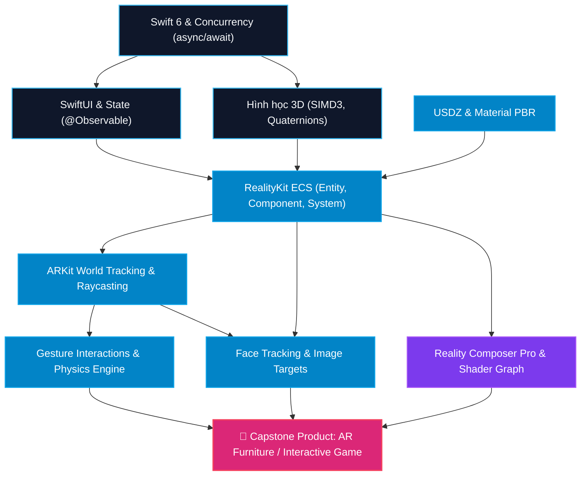

# 🚀 AUTORESEARCH REPORT: Lộ trình Học tập & Xây dựng Ứng dụng AR trên Swift & Apple Ecosystem

> **Project:** `apple-ar-swift-roadmap`  
> **Orchestrated by:** `0-autoresearch-skill` (Orchestra Research Engine)  
> **Target Frameworks:** `Swift 6`, `SwiftUI`, `RealityKit 4`, `ARKit 6`, `USDZ`, `Reality Composer Pro`  
> **Target Audience:** Beginner to Intermediate iOS Developers  
> **Total Duration:** 12 Weeks (8–10 hours/week | 45 min/Task Focus Window)

---

## 📌 1. Tóm tắt Nghiên cứu & Phân tích Kiến trúc (Executive Summary)

Dựa trên kết quả khảo sát tài liệu chính thức từ Apple Developer Documentation (2025/2026), WWDC Sessions và chuẩn thiết kế Human Interface Guidelines (HIG) cho Spatial Computing, quy trình nghiên cứu **Autoresearch (Two-Loop Architecture)** đã tổng hợp và kiểm chứng mô hình lộ trình tối ưu nhất cho học viên mới bắt đầu:

1. **Chuyển dịch kiến trúc (Architectural Shift):** Apple đã hoàn toàn loại bỏ tư duy 3D truyền thống (SceneKit/Metal) để chuyển sang mô hình **SwiftUI + RealityKit + ARKit** sử dụng kiến trúc **Entity-Component-System (ECS)** làm cốt lõi.
2. **Phân tách trách nhiệm (Separation of Concerns):**
   - **`ARKit`**: Đảm nhiệm cảm biến thế giới thực (World Tracking, Plane Detection, Face Tracking, Image Target, LiDAR Mesh).
   - **`RealityKit`**: Đảm nhiệm render 3D, vật lý (`PhysicsBodyComponent`), va chạm (`CollisionComponent`), chất liệu PBR (`PhysicallyBasedMaterial`) và âm thanh không gian (`SpatialAudioComponent`).
   - **`SwiftUI`**: Quản lý state ứng dụng (`@Observable`, `@State`) và nhúng không gian 3D qua `RealityView`.
3. **Chiến lược học tập Product-First Waterfall:** Học viên tiến dần từ toán không gian 3D $\rightarrow$ ECS trong RealityKit $\rightarrow$ ARKit Tracking $\rightarrow$ Visual Editing (Reality Composer Pro) $\rightarrow$ Hoàn thiện Capstone App thương mại.

---

## 🌐 2. Sơ đồ Phụ thuộc Kỹ năng (Skill Topology - Mermaid DAG)

---

## 🏁 3. Bảng Mốc Kiểm duyệt Chất lượng (Waterfall Gate Checkpoints)

| Gate ID | Giai đoạn (Phase) | Mục tiêu Kiến thức & Kỹ năng | Thời lượng | Deliverable (Sản phẩm đầu ra) | Status |
| :--- | :--- | :--- | :---: | :--- | :---: |
| **GATE 0** | **Phase 0: Tooling & Swift/3D Math** | Swift 6, SwiftUI Layout, `@Observable`, toán Vector `SIMD3`, Quaternions. | **Tuần 1–2** | Tool tính toán tọa độ & góc xoay 3D trên SwiftUI. | `READY` |
| **GATE 1** | **Phase 1: RealityKit & ECS Foundations** | Thấu hiểu ECS, `Entity`, `ModelEntity`, `SimpleMaterial`, nhúng `RealityView`. | **Tuần 3–4** | 3D Viewer App nạp mô hình `.usdz` & đổi màu tương tác. | `READY` |
| **GATE 2** | **Phase 2: ARKit World Tracking & Raycast** | `ARWorldTrackingConfiguration`, Plane Detection, Raycasting, Physics va chạm. | **Tuần 5–6** | AR Furniture Spawner đặt vật thể 3D lên mặt bàn thực. | `READY` |
| **GATE 3** | **Phase 3: Face & Image AR Tracking** | Face Mesh Anchor, BlendShapes, Image Target Tracking, Spatial Audio. | **Tuần 7–8** | AR Face Filter & Flashcard quét hình hiển thị 3D. | `READY` |
| **GATE 4** | **Phase 4: Reality Composer Pro & Shaders** | Visual Scene Building, Shader Graph (MaterialX), Keyframe Animations. | **Tuần 9–10** | Scene AR triển lãm nghệ thuật nạp từ Swift Package. | `READY` |
| **GATE 5** | **Phase 5: Capstone Production App** | Dynamic Layout, Performance (60 FPS), Memory Audit, TestFlight Deploy. | **Tuần 11–12** | **Full AR Placement / AR Game Portfolio App**. | `READY` |

---

## 🏗️ 4. Chi tiết Nhiệm vụ Thực hành từng Tuần (Micro-Tasks)

══════════════════════════════════════════════════════════════════════════
### 🚩 PHASE 0: TOOLING, SWIFT NỀN TẢNG & HÌNH HỌC 3D (TUẦN 1–2)
🛠️ **Kiến thức cốt lõi:** Swift 6, SwiftUI, System Vectors (`SIMD3<Float>`), Quaternions.
⏱️ **Thời lượng:** 2 Tuần (16 giờ) | Focus Window: **45 phút / Task**
══════════════════════════════════════════════════════════════════════════

#### ⚡ Micro-Tasks:
- [ ] **`TASK 0.1`** (⏱️ 45m): Tạo dự án iOS SwiftUI App trên Xcode, thiết lập Git repository.
- [ ] **`TASK 0.2`** (⏱️ 45m): Viết struct toán học `Vector3DHelper` để tính khoảng cách giữa 2 điểm 3D bằng `SIMD3<Float>`.
- [ ] **`TASK 0.3`** (⏱️ 45m): Tìm hiểu chuyển đổi góc xoay Euler (Roll, Pitch, Yaw) sang Quaternion (`simd_quatf`) để tránh hiện tượng Gimbal Lock.
- [ ] **`TASK 0.4`** (⏱️ 45m): Thiết kế giao diện SwiftUI nhận dữ liệu $(X, Y, Z)$ và hiển thị trực quan các thông số tọa độ.

---

══════════════════════════════════════════════════════════════════════════
### 🚩 PHASE 1: REALITYKIT FOUNDATIONS & KIẾN TRÚC ECS (TUẦN 3–4)
🛠️ **Kiến thức cốt lõi:** ECS (`Entity`, `Component`, `System`), `ModelEntity`, `PBRMaterial`, `RealityView`.
⏱️ **Thời lượng:** 2 Tuần (16 giờ) | Focus Window: **45 phút / Task**
══════════════════════════════════════════════════════════════════════════

#### ⚡ Micro-Tasks:
- [ ] **`TASK 1.1`** (⏱️ 45m): Tải các mẫu file 3D `.usdz` chuẩn từ Apple Quick Look Gallery.
- [ ] **`TASK 1.2`** (⏱️ 45m): Khởi tạo `ModelEntity` bằng mã nguồn với các khối cơ bản (`MeshResource.generateBox`, `generateSphere`).
- [ ] **`TASK 1.3`** (⏱️ 45m): Áp dụng `PhysicallyBasedMaterial` điều chỉnh tham số Roughness, Metallic và Tint Color.
- [ ] **`TASK 1.4`** (⏱️ 45m): Tạo SwiftUI `RealityView`, đưa Entity vào Scene và viết Slider điều khiển kích thước (`scale`) realtime.

---

══════════════════════════════════════════════════════════════════════════
### 🚩 PHASE 2: ARKIT WORLD TRACKING & RAYCASTING (TUẦN 5–6)
🛠️ **Kiến thức cốt lõi:** `ARWorldTrackingConfiguration`, Plane Detection, Raycast Query, Gesture Bindings, Physics.
⏱️ **Thời lượng:** 2 Tuần (16 giờ) | Focus Window: **45 phút / Task**
══════════════════════════════════════════════════════════════════════════

#### ⚡ Micro-Tasks:
- [ ] **`TASK 2.1`** (⏱️ 45m): Cấu hình quyền Camera (`NSCameraUsageDescription`) và `ARCoachingOverlayView` hướng dẫn người dùng quét sàn.
- [ ] **`TASK 2.2`** (⏱️ 45m): Lập trình Raycasting: Khi người dùng chạm màn hình, phát hiện mặt phẳng thực tế và gắn `AnchorEntity`.
- [ ] **`TASK 2.3`** (⏱️ 45m): Gắn `InputTargetComponent` và `CollisionComponent` để nhận diện cử chỉ Tap, Drag, Rotate vật thể 3D.
- [ ] **`TASK 2.4`** (⏱️ 45m): Thêm `PhysicsBodyComponent` (Dynamic/Static) cho phép vật thể rơi xuống bàn và nảy lên theo vật lý.

---

══════════════════════════════════════════════════════════════════════════
### 🚩 PHASE 3: ADVANCED AR — FACE TRACKING & IMAGE TARGETS (TUẦN 7–8)
🛠️ **Kiến thức cốt lõi:** Face Anchors, BlendShapes, Image Tracking Targets, Spatial Audio.
⏱️ **Thời lượng:** 2 Tuần (16 giờ) | Focus Window: **45 phút / Task**
══════════════════════════════════════════════════════════════════════════

#### ⚡ Micro-Tasks:
- [ ] **`TASK 3.1`** (⏱️ 45m): Tạo ứng dụng AR Face Filter gắn kính mát 3D lên khuôn mặt người dùng bằng `ARFaceTrackingConfiguration`.
- [ ] **`TASK 3.2`** (⏱️ 45m): Đọc chỉ số `blendShapes[.jawOpen]` để tự động phát hiệu ứng hạt (Particle System) khi người dùng há miệng.
- [ ] **`TASK 3.3`** (⏱️ 45m): Cấu hình `ARReferenceImage`, quét danh thiếp/sách thực tế để hiển thị mô hình 3D lơ lửng ngay trên mặt ảnh.
- [ ] **`TASK 3.4`** (⏱️ 45m): Tích hợp `SpatialAudioComponent` để tiếng kêu vật thể phát ra đúng vị trí 3D trong căn phòng.

---

══════════════════════════════════════════════════════════════════════════
### 🚩 PHASE 4: REALITY COMPOSER PRO & ANIMATION (TUẦN 9–10)
🛠️ **Kiến thức cốt lõi:** Visual Scene Building, Shader Graph (MaterialX), Keyframe Animations, Xcode Package Loading.
⏱️ **Thời lượng:** 2 Tuần (16 giờ) | Focus Window: **45 phút / Task**
══════════════════════════════════════════════════════════════════════════

#### ⚡ Micro-Tasks:
- [ ] **`TASK 4.1`** (⏱️ 45m): Sử dụng Reality Composer Pro dựng không gian triển lãm 3D có đèn chiếu Spotlight và chân đế.
- [ ] **`TASK 4.2`** (⏱️ 45m): Tạo hiệu ứng năng lượng phát sáng bằng Shader Graph trong Reality Composer Pro.
- [ ] **`TASK 4.3`** (⏱️ 45m): Đóng gói Scene thành Swift Package và nạp vào SwiftUI `RealityView` qua mã `Entity(named:in:)`.
- [ ] **`TASK 4.4`** (⏱️ 45m): Kích hoạt hoạt cảnh Animation Player khi người dùng tương tác vào vật thể trong Scene.

---

══════════════════════════════════════════════════════════════════════════
### 🚩 PHASE 5: CAPSTONE PROJECT & OPTIMIZATION (TUẦN 11–12)
🛠️ **Kiến thức cốt lõi:** Complete App Architecture, Performance Profiling (60 FPS), Memory Leak Audit, TestFlight.
⏱️ **Thời lượng:** 2 Tuần (16 giờ) | Focus Window: **45 phút / Task**
══════════════════════════════════════════════════════════════════════════

#### 💡 Ba lựa chọn Capstone Project Đề xuất:
1. **AR Furniture Placement App (IKEA Style):** Chọn đồ nội thất, thả lên sàn, thay đổi chất liệu vải/gỗ, đo khoảng cách thực tế và lưu ảnh phòng.
2. **AR Spatial Flashcards App (Giáo dục):** Scan thẻ sách động vật, hiển thị mô hình 3D động kèm âm thanh Spatial Audio và game trắc nghiệm.
3. **AR Physics Mini-Game (Tower Defense):** Đặt tháp 3D lên bàn thực, quái vật di chuyển theo mặt phẳng và bắn đạn tính toán va chạm.

#### ⚡ Checklist Hoàn thiện (Definition of Done):
- [ ] Profiling ứng dụng bằng Xcode Instruments (Tối ưu GPU Render Time, đảm bảo 60 FPS mượt mà).
- [ ] Kiểm tra tình trạng nhiệt thiết bị (`ProcessInfo.processInfo.thermalState`).
- [ ] Viết tài liệu `README.md` chuyên nghiệp trên GitHub kèm GIF/Video Demo trải nghiệm AR.

---

## 🔬 5. Trạng thái Dự án Autoresearch

Tất cả các dữ liệu, nhật ký nghiên cứu và cấu trúc kiểm chứng của lộ trình này đã được ghi nhận và lưu trữ trong thư mục dự án:
- **Central State:** `projects/apple-ar-swift-roadmap/research-state.yaml`
- **Decision Timeline:** `projects/apple-ar-swift-roadmap/research-log.md`
- **Findings Synthesis:** `projects/apple-ar-swift-roadmap/findings.md`
- **Literature Reference:** `projects/apple-ar-swift-roadmap/literature/survey.md`
- **Public Report:** [apple_ar_swift_learning_roadmap.md](file:///Users/tonypham/MEGA/WebApp/content-gen/knowledge-tree/projects/apple-ar-swift-roadmap/to_human/apple_ar_swift_learning_roadmap.md)
