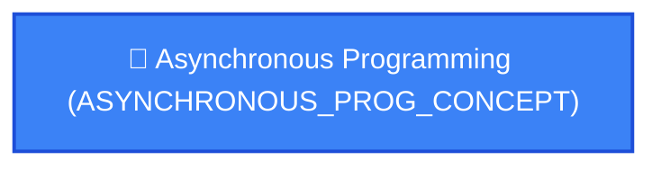

# 🗺️ Adaptive Personal Learning Roadmap: Asynchronous Programming (ASYNCHRONOUS_PROG_CONCEPT)

> **Generated by Knowledge Tree Adaptive Pipeline**

## 📊 Executive Summary & Constraints
- **Target Goal:** `Asynchronous Programming` (`ASYNCHRONOUS_PROG_CONCEPT`)
- **Estimated Timeframe:** **1 Weeks** (4 total hours @ 10h/week)
- **Target Cognitive Depth:** Apply
- **Baseline Pruned Concepts:** `FIRST_CLASS_FUNCTIONS_CONCEPT`
- **Pedagogical Coherence Audit:** Score **90/100** | Marr T6 Neutral: **PASS**

---

## 🌐 Prerequisite Graph Topology (DAG)

---

## 📚 Weekly Learning Milestones & Actionable Checklist

### 🗓️ Week 1
#### 1. [ASYNCHRONOUS_PROG_CONCEPT] Asynchronous Programming
**Pedagogical Rationale:** *Giới thiệu các kỹ thuật lập trình bất đồng bộ như callbacks, promises, hoặc async/await để xử lý các tác vụ tốn thời gian mà không chặn luồng chính.*
**Concept Description:** Giới thiệu các kỹ thuật lập trình bất đồng bộ như callbacks, promises, hoặc async/await để xử lý các tác vụ tốn thời gian mà không chặn luồng chính.
**Learning Objectives & Assessment Checkpoints:**
- [ ] **[UNIVERSAL]** `ULO-ASYNCHRONOUS_PROG_CONCEPT-01` (Understand): Người học có khả năng thiết kế luồng xử lý bất đồng bộ sử dụng async/await, callbacks, hoặc promises để thực hiện các tác vụ I/O mà không chặn luồng chính.
  - 📝 *Assessment Approach:* `concept-check`
- [ ] **[CONCEPTUAL_IMPL]** `CIO-ASYNCHRONOUS_PROG_CONCEPT-01` (Understand): Người học có khả năng thiết kế luồng điều khiển bất đồng bộ: callback-based (continuation passing), Promise/Future chaining (then/catch), async/await (synchronous syntax, implicit promise), structured concurrency (task groups, cancellation).
  - 📝 *Assessment Approach:* `concept-check`
- [ ] **[SPECIFIC_IMPL]** `SIO-SWIFT-ASYNCHRONOUS_PROG_CONCEPT-01` (Understand): Người học có khả năng viết async function, gọi URLSession.shared.data(from:) với await, xử lý CancellationError.
  - 📝 *Assessment Approach:* `concept-check`

---

## 🛡️ Pedagogical Audit & Evidence Grounding Log
- **Judge Status:** `PASS_DEFAULT`
- **Judge Notes:** Deterministic graph validation passed without LLM enhancement.
- **Evidence Source:** Grounded in ACM/IEEE CS2023 Master Tree & Active Project Context.