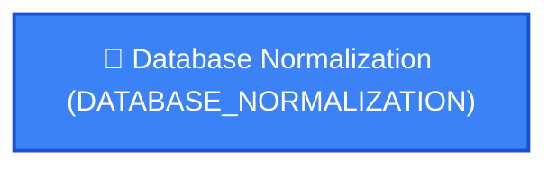

# 🗺️ Adaptive Personal Learning Roadmap: Database Normalization (DATABASE_NORMALIZATION)

> **Generated by Knowledge Tree Adaptive Pipeline**

## 📊 Executive Summary & Constraints
- **Target Goal:** `Database Normalization` (`DATABASE_NORMALIZATION`)
- **Estimated Timeframe:** **1 Weeks** (4 total hours @ 5h/week)
- **Target Cognitive Depth:** Apply
- **Baseline Pruned Concepts:** None (Starting from scratch)
- **Pedagogical Coherence Audit:** Score **90/100** | Marr T6 Neutral: **PASS**

---

## 🌐 Prerequisite Graph Topology (DAG)

---

## 📚 Weekly Learning Milestones & Actionable Checklist

### 🗓️ Week 1
#### 1. [DATABASE_NORMALIZATION] Database Normalization
**Pedagogical Rationale:** *Hiểu quá trình tổ chức các cột và bảng trong cơ sở dữ liệu quan hệ để giảm thiểu sự dư thừa dữ liệu và cải thiện tính toàn vẹn.*
**Concept Description:** Hiểu quá trình tổ chức các cột và bảng trong cơ sở dữ liệu quan hệ để giảm thiểu sự dư thừa dữ liệu và cải thiện tính toàn vẹn.
- [ ] **[ULO]** Master core principles & complete concept check quiz.

---

## 🛡️ Pedagogical Audit & Evidence Grounding Log
- **Judge Status:** `PASS_DEFAULT`
- **Judge Notes:** Deterministic graph validation passed without LLM enhancement.
- **Evidence Source:** Grounded in ACM/IEEE CS2023 Master Tree & Active Project Context.