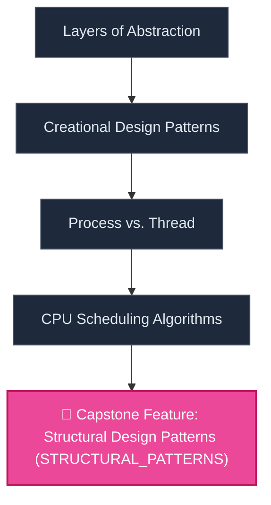

# 🛠️ Project-Driven Roadmap: Live Sports Scoreboard App

> **Destination-First Learning Roadmap — Backwards Engineered from Real-World Project Deliverables**

## 📌 1. Project Brief & End Destination
- **User Goal:** Realtime iOS App with Swift
- **Project Type:** `Single Large Capstone`
- **Project Deliverable:** Build a real-time iOS app that displays live scores for multiple sports (e.g., NBA, NFL) using WebSocket connections. The app will update scores, game events, and standings in real-time with smooth UI animations. Includes push notifications for key events and a history view.
- **Estimated Timeframe:** **6 Weeks** (60 total hours @ 10h/week)
- **Pruned Baseline Concepts:** None

### 🎯 Key Product Deliverables & Features:
- 🚀 **WebSocket client for live data streaming**
- 🚀 **Real-time UI updates with Combine or async/await**
- 🚀 **Background fetch and notification handling**
- 🚀 **MVVM architecture with dependency injection**
- 🚀 **Offline caching of recent scores**

---

## 🌐 2. Project Skill Prerequisites Topology (Mermaid DAG)

---

## 🏗️ 3. Project Build Milestones & Feature Implementation Checklist

### 🚩 Phase 1: Building 'WebSocket client for live data streaming'
#### ⚙️ [ABSTRACTION_LAYERS] Layers of Abstraction
*Hiểu cách các hệ thống phức tạp được xây dựng dựa trên nhiều lớp trừu tượng, mỗi lớp che giấu chi tiết của lớp dưới.*
- [ ] **[SIO]** Build & test this feature module.

### 🚩 Phase 2: Building 'Real-time UI updates with Combine or async/await'
#### ⚙️ [CREATIONAL_PATTERNS] Creational Design Patterns
*Hiểu mục đích của các mẫu thiết kế khởi tạo, như Singleton (đảm bảo một lớp chỉ có một thể hiện) và Factory (tạo đối tượng mà không cần chỉ rõ lớp cụ thể).*
- [ ] **[SIO]** Build & test this feature module.

### 🚩 Phase 3: Building 'Background fetch and notification handling'
#### ⚙️ [PROCESS_VS_THREAD] Process vs. Thread
*Phân biệt sự khác nhau giữa một tiến trình (một chương trình đang chạy với không gian bộ nhớ riêng) và một luồng (một luồng thực thi trong một tiến trình).*
- [ ] **[SIO]** Build & test this feature module.

### 🚩 Phase 4: Building 'MVVM architecture with dependency injection'
#### ⚙️ [SCHEDULING_ALGORITHMS] CPU Scheduling Algorithms
*Giới thiệu các thuật toán lập lịch CPU cơ bản như FCFS (First-Come, First-Served), SJF (Shortest Job First), và Round Robin.*
- [ ] **[SIO]** Build & test this feature module.

### 🚩 Phase 5: Building 'Offline caching of recent scores'
#### ⚙️ [STRUCTURAL_PATTERNS] Structural Design Patterns
*Hiểu mục đích của các mẫu thiết kế cấu trúc, như Adapter (cho phép các giao diện không tương thích làm việc với nhau) và Decorator (thêm chức năng cho đối tượng một cách linh hoạt).*
- [ ] **[SIO]** Build & test this feature module.

---

## 💡 4. Alternative Project Orientations (Other Proposed Options)
