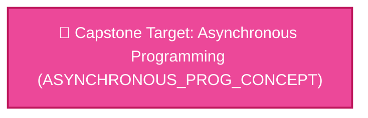

# 📋 PROJECT BRIEF & ROADMAP: Real-time Chat Application

> **Generated under Curriculum Agent OS Architecture & Alignment Rules**

## 1. Project Overview & Deliverables (Gate 1)
- **Project Code:** `PROJ-REALTIME-CHAT`
- **Project Type:** `Single Large Capstone System`
- **Target Learner:** Intermediate iOS Developer
- **Time Commitment:** **8 Weeks** (80 total hours @ 10h/week)
- **Tech Stack & Tooling:** `Swift`, `SwiftUI`, `Combine`, `WebSocket`, `Firebase Auth`, `Core Data`
- **Core Deliverable:** Build a full-featured real-time chat app with WebSocket communication, user authentication, and message persistence. The app will support one-on-one and group chats, typing indicators, and push notifications.

### 🎯 Key Product Deliverables & Features:
- 🚀 **User registration and login with Firebase Auth**
- 🚀 **Real-time messaging via WebSocket (Starscream or URLSessionWebSocketTask)**
- 🚀 **Typing indicators and online status**
- 🚀 **Message history with Core Data offline caching**
- 🚀 **Push notifications for new messages**

---

## 2. Backwards Skill Dependency Topology (Mermaid DAG - Gate 2)

---

## 3. Alignment Matrix (Definition of Done Tracking)

| Lesson ID | Feature / Module | Concept Code | LESSON | ACT | CODE_LAB | QUIZ | Status |
| :--- | :--- | :--- | :---: | :---: | :---: | :---: | :--- |
| **LES_ASYNCHRONOUS_PROG_CONCEPT** | User registration and login with Firebase Auth | `ASYNCHRONOUS_PROG_CONCEPT` | ✅ | ✅ | ✅ | ✅ | `APPROVED (GATE 2)` |
| **LES_ASYNCHRONOUS_PROG_CONCEPT** | Real-time messaging via WebSocket (Starscream or URLSessionWebSocketTask) | `ASYNCHRONOUS_PROG_CONCEPT` | ✅ | ✅ | ✅ | ✅ | `APPROVED (GATE 2)` |
| **LES_ASYNCHRONOUS_PROG_CONCEPT** | Typing indicators and online status | `ASYNCHRONOUS_PROG_CONCEPT` | ✅ | ✅ | ✅ | ✅ | `APPROVED (GATE 2)` |
| **LES_ASYNCHRONOUS_PROG_CONCEPT** | Message history with Core Data offline caching | `ASYNCHRONOUS_PROG_CONCEPT` | ✅ | ✅ | ✅ | ✅ | `APPROVED (GATE 2)` |
| **LES_ASYNCHRONOUS_PROG_CONCEPT** | Push notifications for new messages | `ASYNCHRONOUS_PROG_CONCEPT` | ✅ | ✅ | ✅ | ✅ | `APPROVED (GATE 2)` |

---

## 4. Phase-by-Phase Build Milestones & Satellite Artifact Contracts

### 🚩 Phase 1: Feature 'User registration and login with Firebase Auth'
#### ⚙️ [ASYNCHRONOUS_PROG_CONCEPT] Asynchronous Programming
*Giới thiệu các kỹ thuật lập trình bất đồng bộ như callbacks, promises, hoặc async/await để xử lý các tác vụ tốn thời gian mà không chặn luồng chính.*
**Canonical Learning Objectives & Satellite Contracts:**
- [ ] **[UNIVERSAL]** `ULO-ASYNCHRONOUS_PROG_CONCEPT-01`: Người học có khả năng thiết kế luồng xử lý bất đồng bộ sử dụng async/await, callbacks, hoặc promises để thực hiện các tác vụ I/O mà không chặn luồng chính.
  - 🧪 *Satellite Assessment Contract:* `code-lab` (Code Lab & Exit Ticket)
- [ ] **[CONCEPTUAL_IMPL]** `CIO-ASYNCHRONOUS_PROG_CONCEPT-01`: Người học có khả năng thiết kế luồng điều khiển bất đồng bộ: callback-based (continuation passing), Promise/Future chaining (then/catch), async/await (synchronous syntax, implicit promise), structured concurrency (task groups, cancellation).
  - 🧪 *Satellite Assessment Contract:* `code-lab` (Code Lab & Exit Ticket)
- [ ] **[SPECIFIC_IMPL]** `SIO-SWIFT-ASYNCHRONOUS_PROG_CONCEPT-01`: Người học có khả năng viết async function, gọi URLSession.shared.data(from:) với await, xử lý CancellationError.
  - 🧪 *Satellite Assessment Contract:* `code-lab` (Code Lab & Exit Ticket)

### 🚩 Phase 2: Feature 'Real-time messaging via WebSocket (Starscream or URLSessionWebSocketTask)'
#### ⚙️ [ASYNCHRONOUS_PROG_CONCEPT] Asynchronous Programming
*Giới thiệu các kỹ thuật lập trình bất đồng bộ như callbacks, promises, hoặc async/await để xử lý các tác vụ tốn thời gian mà không chặn luồng chính.*
**Canonical Learning Objectives & Satellite Contracts:**
- [ ] **[UNIVERSAL]** `ULO-ASYNCHRONOUS_PROG_CONCEPT-01`: Người học có khả năng thiết kế luồng xử lý bất đồng bộ sử dụng async/await, callbacks, hoặc promises để thực hiện các tác vụ I/O mà không chặn luồng chính.
  - 🧪 *Satellite Assessment Contract:* `code-lab` (Code Lab & Exit Ticket)
- [ ] **[CONCEPTUAL_IMPL]** `CIO-ASYNCHRONOUS_PROG_CONCEPT-01`: Người học có khả năng thiết kế luồng điều khiển bất đồng bộ: callback-based (continuation passing), Promise/Future chaining (then/catch), async/await (synchronous syntax, implicit promise), structured concurrency (task groups, cancellation).
  - 🧪 *Satellite Assessment Contract:* `code-lab` (Code Lab & Exit Ticket)
- [ ] **[SPECIFIC_IMPL]** `SIO-SWIFT-ASYNCHRONOUS_PROG_CONCEPT-01`: Người học có khả năng viết async function, gọi URLSession.shared.data(from:) với await, xử lý CancellationError.
  - 🧪 *Satellite Assessment Contract:* `code-lab` (Code Lab & Exit Ticket)

### 🚩 Phase 3: Feature 'Typing indicators and online status'
#### ⚙️ [ASYNCHRONOUS_PROG_CONCEPT] Asynchronous Programming
*Giới thiệu các kỹ thuật lập trình bất đồng bộ như callbacks, promises, hoặc async/await để xử lý các tác vụ tốn thời gian mà không chặn luồng chính.*
**Canonical Learning Objectives & Satellite Contracts:**
- [ ] **[UNIVERSAL]** `ULO-ASYNCHRONOUS_PROG_CONCEPT-01`: Người học có khả năng thiết kế luồng xử lý bất đồng bộ sử dụng async/await, callbacks, hoặc promises để thực hiện các tác vụ I/O mà không chặn luồng chính.
  - 🧪 *Satellite Assessment Contract:* `code-lab` (Code Lab & Exit Ticket)
- [ ] **[CONCEPTUAL_IMPL]** `CIO-ASYNCHRONOUS_PROG_CONCEPT-01`: Người học có khả năng thiết kế luồng điều khiển bất đồng bộ: callback-based (continuation passing), Promise/Future chaining (then/catch), async/await (synchronous syntax, implicit promise), structured concurrency (task groups, cancellation).
  - 🧪 *Satellite Assessment Contract:* `code-lab` (Code Lab & Exit Ticket)
- [ ] **[SPECIFIC_IMPL]** `SIO-SWIFT-ASYNCHRONOUS_PROG_CONCEPT-01`: Người học có khả năng viết async function, gọi URLSession.shared.data(from:) với await, xử lý CancellationError.
  - 🧪 *Satellite Assessment Contract:* `code-lab` (Code Lab & Exit Ticket)

### 🚩 Phase 4: Feature 'Message history with Core Data offline caching'
#### ⚙️ [ASYNCHRONOUS_PROG_CONCEPT] Asynchronous Programming
*Giới thiệu các kỹ thuật lập trình bất đồng bộ như callbacks, promises, hoặc async/await để xử lý các tác vụ tốn thời gian mà không chặn luồng chính.*
**Canonical Learning Objectives & Satellite Contracts:**
- [ ] **[UNIVERSAL]** `ULO-ASYNCHRONOUS_PROG_CONCEPT-01`: Người học có khả năng thiết kế luồng xử lý bất đồng bộ sử dụng async/await, callbacks, hoặc promises để thực hiện các tác vụ I/O mà không chặn luồng chính.
  - 🧪 *Satellite Assessment Contract:* `code-lab` (Code Lab & Exit Ticket)
- [ ] **[CONCEPTUAL_IMPL]** `CIO-ASYNCHRONOUS_PROG_CONCEPT-01`: Người học có khả năng thiết kế luồng điều khiển bất đồng bộ: callback-based (continuation passing), Promise/Future chaining (then/catch), async/await (synchronous syntax, implicit promise), structured concurrency (task groups, cancellation).
  - 🧪 *Satellite Assessment Contract:* `code-lab` (Code Lab & Exit Ticket)
- [ ] **[SPECIFIC_IMPL]** `SIO-SWIFT-ASYNCHRONOUS_PROG_CONCEPT-01`: Người học có khả năng viết async function, gọi URLSession.shared.data(from:) với await, xử lý CancellationError.
  - 🧪 *Satellite Assessment Contract:* `code-lab` (Code Lab & Exit Ticket)

### 🚩 Phase 5: Feature 'Push notifications for new messages'
#### ⚙️ [ASYNCHRONOUS_PROG_CONCEPT] Asynchronous Programming
*Giới thiệu các kỹ thuật lập trình bất đồng bộ như callbacks, promises, hoặc async/await để xử lý các tác vụ tốn thời gian mà không chặn luồng chính.*
**Canonical Learning Objectives & Satellite Contracts:**
- [ ] **[UNIVERSAL]** `ULO-ASYNCHRONOUS_PROG_CONCEPT-01`: Người học có khả năng thiết kế luồng xử lý bất đồng bộ sử dụng async/await, callbacks, hoặc promises để thực hiện các tác vụ I/O mà không chặn luồng chính.
  - 🧪 *Satellite Assessment Contract:* `code-lab` (Code Lab & Exit Ticket)
- [ ] **[CONCEPTUAL_IMPL]** `CIO-ASYNCHRONOUS_PROG_CONCEPT-01`: Người học có khả năng thiết kế luồng điều khiển bất đồng bộ: callback-based (continuation passing), Promise/Future chaining (then/catch), async/await (synchronous syntax, implicit promise), structured concurrency (task groups, cancellation).
  - 🧪 *Satellite Assessment Contract:* `code-lab` (Code Lab & Exit Ticket)
- [ ] **[SPECIFIC_IMPL]** `SIO-SWIFT-ASYNCHRONOUS_PROG_CONCEPT-01`: Người học có khả năng viết async function, gọi URLSession.shared.data(from:) với await, xử lý CancellationError.
  - 🧪 *Satellite Assessment Contract:* `code-lab` (Code Lab & Exit Ticket)

---

## 5. Alternative Project Proposals

- **Option 2: Live Sports Scoreboard** (Single Large Capstone System)
  - *Code:* `PROJ-SPORTS-SCOREBOARD` | *Description:* Build an app that displays live sports scores using a public WebSocket API (e.g., from TheSportsDB or similar). The app will show real-time updates for multiple sports, with offline caching and a clean, animated UI.
- **Option 3: Collaborative Whiteboard** (Single Large Capstone System)
  - *Code:* `PROJ-COLLAB-WHITEBOARD` | *Description:* Build a real-time collaborative whiteboard app where multiple users can draw simultaneously. Uses WebSocket for synchronization and PencilKit for drawing. Includes session management, undo/redo, and user presence.