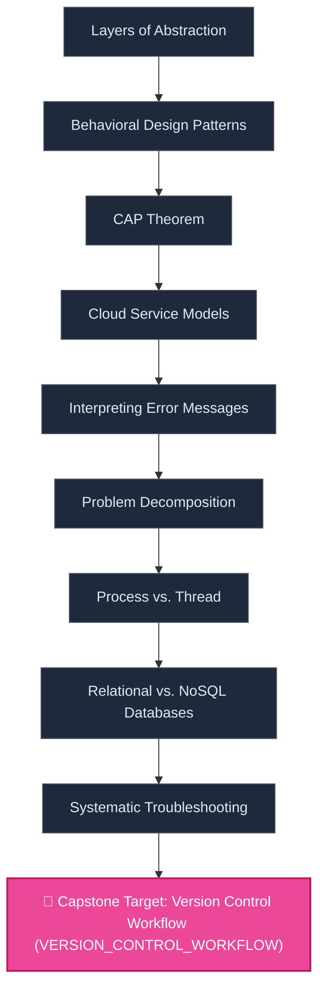

# 📋 PROJECT BRIEF & ROADMAP: Real-time Messaging App

> **Generated under Curriculum Agent OS Architecture & Alignment Rules**

## 1. Project Overview & Deliverables (Gate 1)
- **Project Code:** `PROJ-REALTIME-CHAT`
- **Project Type:** `Single Large Capstone System`
- **Target Learner:** Intermediate iOS Developer
- **Time Commitment:** **8 Weeks** (80 total hours @ 10h/week)
- **Tech Stack & Tooling:** `Swift`, `SwiftUI`, `Combine`, `WebSocket (URLSessionWebSocketTask)`, `Firebase Firestore`, `Firebase Auth`
- **Core Deliverable:** Build a full-stack real-time chat application with SwiftUI, using WebSockets for instant messaging, user authentication, and message persistence via Firebase.

### 🎯 Key Product Deliverables & Features:
- 🚀 **User registration and login**
- 🚀 **Real-time one-on-one and group messaging**
- 🚀 **Message history with offline caching**
- 🚀 **Typing indicators and read receipts**
- 🚀 **Push notifications**

---

## 2. Backwards Skill Dependency Topology (Mermaid DAG - Gate 2)

---

## 3. Alignment Matrix (Definition of Done Tracking)

| Lesson ID | Feature / Module | Concept Code | LESSON | ACT | CODE_LAB | QUIZ | Status |
| :--- | :--- | :--- | :---: | :---: | :---: | :---: | :--- |
| **LES_ABSTRACTION_LAYERS** | User registration and login | `ABSTRACTION_LAYERS` | ✅ | ✅ | ✅ | ✅ | `APPROVED (GATE 2)` |
| **LES_BEHAVIORAL_PATTERNS** | User registration and login | `BEHAVIORAL_PATTERNS` | ✅ | ✅ | ✅ | ✅ | `APPROVED (GATE 2)` |
| **LES_CAP_THEOREM** | Real-time one-on-one and group messaging | `CAP_THEOREM` | ✅ | ✅ | ✅ | ✅ | `APPROVED (GATE 2)` |
| **LES_CLOUD_MODELS_IAAS_PAAS_SAAS** | Real-time one-on-one and group messaging | `CLOUD_MODELS_IAAS_PAAS_SAAS` | ✅ | ✅ | ✅ | ✅ | `APPROVED (GATE 2)` |
| **LES_ERROR_MESSAGES_CONCEPT** | Message history with offline caching | `ERROR_MESSAGES_CONCEPT` | ✅ | ✅ | ✅ | ✅ | `APPROVED (GATE 2)` |
| **LES_PROBLEM_DECOMPOSITION** | Message history with offline caching | `PROBLEM_DECOMPOSITION` | ✅ | ✅ | ✅ | ✅ | `APPROVED (GATE 2)` |
| **LES_PROCESS_VS_THREAD** | Typing indicators and read receipts | `PROCESS_VS_THREAD` | ✅ | ✅ | ✅ | ✅ | `APPROVED (GATE 2)` |
| **LES_RELATIONAL_VS_NONRELATIONAL** | Typing indicators and read receipts | `RELATIONAL_VS_NONRELATIONAL` | ✅ | ✅ | ✅ | ✅ | `APPROVED (GATE 2)` |
| **LES_TROUBLESHOOTING_METHODOLOGY_CONCEPT** | Push notifications | `TROUBLESHOOTING_METHODOLOGY_CONCEPT` | ✅ | ✅ | ✅ | ✅ | `APPROVED (GATE 2)` |
| **LES_VERSION_CONTROL_WORKFLOW** | Push notifications | `VERSION_CONTROL_WORKFLOW` | ✅ | ✅ | ✅ | ✅ | `APPROVED (GATE 2)` |

---

## 4. Phase-by-Phase Build Milestones & Satellite Artifact Contracts

### 🚩 Phase 1: Feature 'User registration and login'
#### ⚙️ [ABSTRACTION_LAYERS] Layers of Abstraction
*Hiểu cách các hệ thống phức tạp được xây dựng dựa trên nhiều lớp trừu tượng, mỗi lớp che giấu chi tiết của lớp dưới.*
- [ ] **[SIO]** Build, test, and pass Code Lab for this module.

#### ⚙️ [BEHAVIORAL_PATTERNS] Behavioral Design Patterns
*Hiểu mục đích của các mẫu thiết kế hành vi, như Observer (định nghĩa sự phụ thuộc một-nhiều) và Strategy (cho phép chọn thuật toán lúc chạy).*
- [ ] **[SIO]** Build, test, and pass Code Lab for this module.

### 🚩 Phase 2: Feature 'Real-time one-on-one and group messaging'
#### ⚙️ [CAP_THEOREM] CAP Theorem
*Nắm vững định lý CAP (Consistency, Availability, Partition tolerance) và sự đánh đổi của nó trong các hệ thống phân tán.*
- [ ] **[SIO]** Build, test, and pass Code Lab for this module.

#### ⚙️ [CLOUD_MODELS_IAAS_PAAS_SAAS] Cloud Service Models
*Phân biệt ba mô hình dịch vụ điện toán đám mây chính: IaaS (Cơ sở hạ tầng), PaaS (Nền tảng), và SaaS (Phần mềm như một Dịch vụ).*
- [ ] **[SIO]** Build, test, and pass Code Lab for this module.

### 🚩 Phase 3: Feature 'Message history with offline caching'
#### ⚙️ [ERROR_MESSAGES_CONCEPT] Interpreting Error Messages
*Kỹ năng đọc và hiểu các thông báo lỗi do chương trình hoặc hệ điều hành cung cấp để xác định nguyên nhân sự cố.*
**Canonical Learning Objectives & Satellite Contracts:**
- [ ] **[UNIVERSAL]** `ULO-ERROR_MESSAGES_CONCEPT-01`: Người học có khả năng phân tích thông báo lỗi (stack trace, mã lỗi, mô tả) để xác định nguyên nhân gốc rễ và đề xuất phương án khắc phục.
  - 🧪 *Satellite Assessment Contract:* `code-lab` (Code Lab & Exit Ticket)
- [ ] **[CONCEPTUAL_IMPL]** `CIO-ERROR_MESSAGES_CONCEPT-01`: Người học có khả năng phân tích cấu trúc thông báo lỗi: error type, message, stack trace (file, line, call stack), context variables để truy vết nguyên nhân gốc rễ.
  - 🧪 *Satellite Assessment Contract:* `code-lab` (Code Lab & Exit Ticket)
- [ ] **[SPECIFIC_IMPL]** `SIO-SWIFT-ERROR_MESSAGES_CONCEPT-01`: Người học có khả năng đọc error navigator Xcode: "Consecutive statements on a line must be separated by ';'", "Type 'String' does not conform to protocol 'Numeric'", "Cannot find 'xxx' in scope".
  - 🧪 *Satellite Assessment Contract:* `code-lab` (Code Lab & Exit Ticket)

#### ⚙️ [PROBLEM_DECOMPOSITION] Problem Decomposition
*Kỹ thuật chia một vấn đề lớn và phức tạp thành các vấn đề con nhỏ hơn, dễ quản lý hơn, là một phần cốt lõi của tư duy tính toán.*
- [ ] **[SIO]** Build, test, and pass Code Lab for this module.

### 🚩 Phase 4: Feature 'Typing indicators and read receipts'
#### ⚙️ [PROCESS_VS_THREAD] Process vs. Thread
*Phân biệt sự khác nhau giữa một tiến trình (một chương trình đang chạy với không gian bộ nhớ riêng) và một luồng (một luồng thực thi trong một tiến trình).*
- [ ] **[SIO]** Build, test, and pass Code Lab for this module.

#### ⚙️ [RELATIONAL_VS_NONRELATIONAL] Relational vs. NoSQL Databases
*So sánh sự khác biệt cơ bản giữa cơ sở dữ liệu quan hệ (SQL) và không quan hệ (NoSQL) về mô hình dữ liệu, tính nhất quán và khả năng mở rộng.*
- [ ] **[SIO]** Build, test, and pass Code Lab for this module.

### 🚩 Phase 5: Feature 'Push notifications'
#### ⚙️ [TROUBLESHOOTING_METHODOLOGY_CONCEPT] Systematic Troubleshooting
*Áp dụng một quy trình có hệ thống (xác định vấn đề, giả thuyết, kiểm tra, xác nhận) để giải quyết sự cố phần cứng và phần mềm.*
- [ ] **[SIO]** Build, test, and pass Code Lab for this module.

#### ⚙️ [VERSION_CONTROL_WORKFLOW] Version Control Workflow
*Hiểu và áp dụng một quy trình làm việc với Git, như Git Flow, để quản lý các nhánh (feature, develop, release) một cách hiệu quả trong nhóm.*
**Canonical Learning Objectives & Satellite Contracts:**
- [ ] **[UNIVERSAL]** `ULO-VERSION_CONTROL_WORKFLOW-01`: Người học có khả năng áp dụng quy trình Git workflow (feature branch, commit convention, pull request, code review, merge strategy) trong làm việc nhóm.
  - 🧪 *Satellite Assessment Contract:* `code-lab` (Code Lab & Exit Ticket)
- [ ] **[CONCEPTUAL_IMPL]** `CIO-VERSION_CONTROL_WORKFLOW-01`: Người học có khả năng áp dụng chiến lược nhánh: Git Flow (main, develop, feature, release, hotfix), GitHub Flow (main, feature), Trunk-based Development, monorepo vs polyrepo, merge vs rebase.
  - 🧪 *Satellite Assessment Contract:* `code-lab` (Code Lab & Exit Ticket)
- [ ] **[SPECIFIC_IMPL]** `SIO-SWIFT-VERSION_CONTROL_WORKFLOW-01`: Người học có khả năng viết commit message: feat(scope): description, fix(scope): description, chore: ..., refactor: ... theo Conventional Commits.
  - 🧪 *Satellite Assessment Contract:* `code-lab` (Code Lab & Exit Ticket)

---

## 5. Alternative Project Proposals

- **Option 2: Live Sports Scoreboard Suite** (Incremental Micro-Projects)
  - *Code:* `PROJ-SPORTS-SCOREBOARD` | *Description:* A series of three micro-projects: (1) a simple WebSocket client displaying live scores, (2) adding multiple sports and filtering, (3) integrating with a public API and adding push notifications for score updates.
- **Option 3: Real-time Collaborative Whiteboard** (Single Large Capstone System)
  - *Code:* `PROJ-COLLAB-WHITEBOARD` | *Description:* Build an iOS app that allows multiple users to draw on a shared canvas in real-time using WebSockets, with undo/redo, color selection, and stroke synchronization.