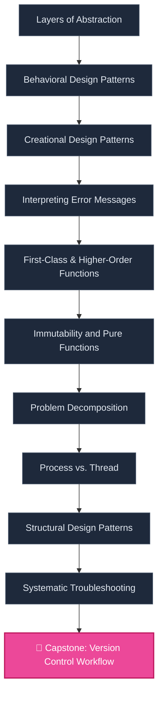

# 🛠️ PRODUCT-FIRST WATERFALL ROADMAP v4.2: Stream Chat Swift (Production Realtime Messaging)

> **Build Guide → Reverse Knowledge Mapping in `Swift, SwiftUI, Combine, URLSessionWebSocketTask, CoreData`**

## 📌 1. Learner Profile & Engineering Constraints
- **Project Code:** `PROJ-STREAM-CHAT`
- **Tech Stack:** `Swift, SwiftUI, Combine, URLSessionWebSocketTask, CoreData`
- **Age-Group:** `ADULT` (Focus: **45m/task**)
- **Outcome:** `Build MVP Product for Portfolio`
- **Velocity:** **10h/week × 8 weeks = 80h**
- **Status:** `PINNED_ACTIVE`

### ⚠️ Tech Stack Trade-offs:
- Time conflict: project needs ~90h (6w × 15h/w baseline), learner has 80h (10h/w × 8w). Deficit: 10h (11% short).
- Minor scope trim — omit integration test suite, focus on unit tests.

### 🎯 Key Deliverables:
- 🚀 **WebSocket Client & Transport Layer (URLSessionWebSocketTask)**
- 🚀 **Combine State Binding & Event Stream**
- 🚀 **Offline CoreData Caching & Persistence**
- 🚀 **Custom SwiftUI View Components & Reactions**

---

## 🌐 2. Prerequisite DAG

---

## 🏁 3. Waterfall Gates

| Gate | Phase | Action | Time | Checkpoint | Status |
| :--- | :--- | :--- | :---: | :--- | :--- |
| **GATE_0_WEBSOCKET_TRANSPORT_LAYER** | Phase 0: WebSocket Transport Layer | `Implement a WebSocket client using URLSessionWebSocketTask with automatic reconnection, ping/pong keep-alive, and message serialization/deserialization.` | **Weeks 1-1 (13h)** | Complete 'Implement a WebSocket client using URLSessionWebSocketTask with automatic reconnection, ping/pong keep-alive, and message serialization/deserialization.' and pass unit tests | `APPROVAL_REQUIRED (GATE CHECK)` |
| **GATE_1_COMBINE_STATE_BINDING___EVENT_STREAM** | Phase 1: Combine State Binding & Event Stream | `Build a Combine-based event stream that transforms raw WebSocket messages into typed chat events (new message, typing indicator, reactions) and exposes them as publishers for UI binding.` | **Weeks 2-2 (13h)** | Complete 'Build a Combine-based event stream that transforms raw WebSocket messages into typed chat events (new message, typing indicator, reactions) and exposes them as publishers for UI binding.' and pass unit tests | `APPROVAL_REQUIRED (GATE CHECK)` |
| **GATE_2_OFFLINE_COREDATA_CACHING___PERSISTENCE** | Phase 2: Offline CoreData Caching & Persistence | `Design and implement a CoreData stack for offline caching of messages and channels, including sync logic to reconcile network state with local storage and handle conflict resolution.` | **Weeks 3-3 (13h)** | Complete 'Design and implement a CoreData stack for offline caching of messages and channels, including sync logic to reconcile network state with local storage and handle conflict resolution.' and pass unit tests | `APPROVAL_REQUIRED (GATE CHECK)` |
| **GATE_3_SWIFTUI_VIEW_COMPONENTS___REACTIONS** | Phase 3: SwiftUI View Components & Reactions | `Create reusable SwiftUI views for chat bubbles, reaction overlays, typing indicators, and message input field, binding them to the Combine state stream and CoreData store.` | **Weeks 4-4 (13h)** | Complete 'Create reusable SwiftUI views for chat bubbles, reaction overlays, typing indicators, and message input field, binding them to the Combine state stream and CoreData store.' and pass unit tests | `APPROVAL_REQUIRED (GATE CHECK)` |
| **GATE_4_INTEGRATION___TESTING** | Phase 4: Integration & Testing | `Integrate all layers (transport, state, persistence, UI) into a cohesive chat client, write unit tests for Combine pipelines and CoreData operations, and UI tests for SwiftUI views.` | **Weeks 5-5 (13h)** | Complete 'Integrate all layers (transport, state, persistence, UI) into a cohesive chat client, write unit tests for Combine pipelines and CoreData operations, and UI tests for SwiftUI views.' and pass unit tests | `APPROVAL_REQUIRED (GATE CHECK)` |
| **GATE_5_PERFORMANCE___PRODUCTION_READINESS** | Phase 5: Performance & Production Readiness | `Optimize WebSocket reconnection backoff, reduce memory footprint of CoreData cache, profile Combine subscriptions, and add logging/monitoring for production deployment.` | **Weeks 6-8 (13h)** | Complete 'Optimize WebSocket reconnection backoff, reduce memory footprint of CoreData cache, profile Combine subscriptions, and add logging/monitoring for production deployment.' and pass unit tests | `APPROVAL_REQUIRED (GATE CHECK)` |

---

## 🏗️ 4. Build Guide & Reverse Knowledge Mapping

### 🚩 STEP 0: WEBSOCKET TRANSPORT LAYER
**Action:** `Implement a WebSocket client using URLSessionWebSocketTask with automatic reconnection, ping/pong keep-alive, and message serialization/deserialization.` | **Prereq:** *Swift concurrency (async/await), URLSession, WebSocket protocol basics, JSON encoding/decoding.* | **Time:** Weeks 1-1 (13h)

#### ⚙️ [PROCESS_VS_THREAD] Process vs. Thread (6h)
- **[UNIVERSAL]** `ULO-PROCESS_VS_THREAD-1` (ACADEMIC_ULO): Hiểu nguyên lý phổ quát của Process vs. Thread cho 'WebSocket Transport Layer'.
- **[CONCEPTUAL_IMPL]** `CIO-PROCESS_VS_THREAD-1` (ACADEMIC_CIO): Thiết kế quy trình xử lý cho Process vs. Thread.
- **[SPECIFIC_IMPL]** `SIO-SWIFT-PROCESS_VS_THREAD-1` (PRODUCT_SIO): Thực thi trực tiếp: 'Implement a WebSocket client using URLSessionWebSocketTask with automatic reconnection, ping/pong keep-alive, and message serialization/deserialization.' trong IDE.

#### ⚙️ [ABSTRACTION_LAYERS] Layers of Abstraction (6h)
- **[UNIVERSAL]** `ULO-ABSTRACTION_LAYERS-1` (ACADEMIC_ULO): Hiểu nguyên lý phổ quát của Layers of Abstraction cho 'WebSocket Transport Layer'.
- **[CONCEPTUAL_IMPL]** `CIO-ABSTRACTION_LAYERS-1` (ACADEMIC_CIO): Thiết kế quy trình xử lý cho Layers of Abstraction.
- **[SPECIFIC_IMPL]** `SIO-SWIFT-ABSTRACTION_LAYERS-1` (PRODUCT_SIO): Thực thi trực tiếp: 'Implement a WebSocket client using URLSessionWebSocketTask with automatic reconnection, ping/pong keep-alive, and message serialization/deserialization.' trong IDE.

**Micro-Tasks (45m each):**
- [ ] `TASK_0_1_1` (45m): Read & Understand: Swift concurrency (async/await), URLSession, WebSocket protocol basics, JSON encoding/decoding. (Process vs. Thread)
- [ ] `TASK_0_1_2` (45m): Hands-on: Implement a WebSocket client using URLSessionWebSocketTask with automatic reconnection, ping/pong keep-alive, and message serialization/deserialization.
- [ ] `TASK_0_1_3` (45m): Unit Test & Verify: WebSocket Transport Layer
- [ ] `TASK_0_2_1` (45m): Read & Understand: Swift concurrency (async/await), URLSession, WebSocket protocol basics, JSON encoding/decoding. (Layers of Abstraction)
- [ ] `TASK_0_2_2` (45m): Hands-on: Implement a WebSocket client using URLSessionWebSocketTask with automatic reconnection, ping/pong keep-alive, and message serialization/deserialization.
- [ ] `TASK_0_2_3` (45m): Unit Test & Verify: WebSocket Transport Layer

**GATE 0:** Pass tests & code review.

### 🚩 STEP 1: COMBINE STATE BINDING & EVENT STREAM
**Action:** `Build a Combine-based event stream that transforms raw WebSocket messages into typed chat events (new message, typing indicator, reactions) and exposes them as publishers for UI binding.` | **Prereq:** *Combine framework (Publishers, Subscribers, Subjects, Operators), reactive programming patterns, error handling in Combine.* | **Time:** Weeks 2-2 (13h)

#### ⚙️ [BEHAVIORAL_PATTERNS] Behavioral Design Patterns (6h)
- **[UNIVERSAL]** `ULO-BEHAVIORAL_PATTERNS-2` (ACADEMIC_ULO): Hiểu nguyên lý phổ quát của Behavioral Design Patterns cho 'Combine State Binding & Event Stream'.
- **[CONCEPTUAL_IMPL]** `CIO-BEHAVIORAL_PATTERNS-2` (ACADEMIC_CIO): Thiết kế quy trình xử lý cho Behavioral Design Patterns.
- **[SPECIFIC_IMPL]** `SIO-SWIFT-BEHAVIORAL_PATTERNS-2` (PRODUCT_SIO): Thực thi trực tiếp: 'Build a Combine-based event stream that transforms raw WebSocket messages into typed chat events (new message, typing indicator, reactions) and exposes them as publishers for UI binding.' trong IDE.

#### ⚙️ [ABSTRACTION_LAYERS] Layers of Abstraction (6h)
- **[UNIVERSAL]** `ULO-ABSTRACTION_LAYERS-2` (ACADEMIC_ULO): Hiểu nguyên lý phổ quát của Layers of Abstraction cho 'Combine State Binding & Event Stream'.
- **[CONCEPTUAL_IMPL]** `CIO-ABSTRACTION_LAYERS-2` (ACADEMIC_CIO): Thiết kế quy trình xử lý cho Layers of Abstraction.
- **[SPECIFIC_IMPL]** `SIO-SWIFT-ABSTRACTION_LAYERS-2` (PRODUCT_SIO): Thực thi trực tiếp: 'Build a Combine-based event stream that transforms raw WebSocket messages into typed chat events (new message, typing indicator, reactions) and exposes them as publishers for UI binding.' trong IDE.

**Micro-Tasks (45m each):**
- [ ] `TASK_1_1_1` (45m): Read & Understand: Combine framework (Publishers, Subscribers, Subjects, Operators), reactive programming patterns, error handling in Combine. (Behavioral Design Patterns)
- [ ] `TASK_1_1_2` (45m): Hands-on: Build a Combine-based event stream that transforms raw WebSocket messages into typed chat events (new message, typing indicator, reactions) and exposes them as publishers for UI binding.
- [ ] `TASK_1_1_3` (45m): Unit Test & Verify: Combine State Binding & Event Stream
- [ ] `TASK_1_2_1` (45m): Read & Understand: Combine framework (Publishers, Subscribers, Subjects, Operators), reactive programming patterns, error handling in Combine. (Layers of Abstraction)
- [ ] `TASK_1_2_2` (45m): Hands-on: Build a Combine-based event stream that transforms raw WebSocket messages into typed chat events (new message, typing indicator, reactions) and exposes them as publishers for UI binding.
- [ ] `TASK_1_2_3` (45m): Unit Test & Verify: Combine State Binding & Event Stream

**GATE 1:** Pass tests & code review.

### 🚩 STEP 2: OFFLINE COREDATA CACHING & PERSISTENCE
**Action:** `Design and implement a CoreData stack for offline caching of messages and channels, including sync logic to reconcile network state with local storage and handle conflict resolution.` | **Prereq:** *CoreData (NSManagedObjectModel, NSPersistentContainer, fetch requests, background contexts), offline-first data strategies, data modeling.* | **Time:** Weeks 3-3 (13h)

#### ⚙️ [STRUCTURAL_PATTERNS] Structural Design Patterns (6h)
- **[UNIVERSAL]** `ULO-STRUCTURAL_PATTERNS-3` (ACADEMIC_ULO): Hiểu nguyên lý phổ quát của Structural Design Patterns cho 'Offline CoreData Caching & Persistence'.
- **[CONCEPTUAL_IMPL]** `CIO-STRUCTURAL_PATTERNS-3` (ACADEMIC_CIO): Thiết kế quy trình xử lý cho Structural Design Patterns.
- **[SPECIFIC_IMPL]** `SIO-SWIFT-STRUCTURAL_PATTERNS-3` (PRODUCT_SIO): Thực thi trực tiếp: 'Design and implement a CoreData stack for offline caching of messages and channels, including sync logic to reconcile network state with local storage and handle conflict resolution.' trong IDE.

#### ⚙️ [ABSTRACTION_LAYERS] Layers of Abstraction (6h)
- **[UNIVERSAL]** `ULO-ABSTRACTION_LAYERS-3` (ACADEMIC_ULO): Hiểu nguyên lý phổ quát của Layers of Abstraction cho 'Offline CoreData Caching & Persistence'.
- **[CONCEPTUAL_IMPL]** `CIO-ABSTRACTION_LAYERS-3` (ACADEMIC_CIO): Thiết kế quy trình xử lý cho Layers of Abstraction.
- **[SPECIFIC_IMPL]** `SIO-SWIFT-ABSTRACTION_LAYERS-3` (PRODUCT_SIO): Thực thi trực tiếp: 'Design and implement a CoreData stack for offline caching of messages and channels, including sync logic to reconcile network state with local storage and handle conflict resolution.' trong IDE.

**Micro-Tasks (45m each):**
- [ ] `TASK_2_1_1` (45m): Read & Understand: CoreData (NSManagedObjectModel, NSPersistentContainer, fetch requests, background contexts), offline-first data strategies, data modeling. (Structural Design Patterns)
- [ ] `TASK_2_1_2` (45m): Hands-on: Design and implement a CoreData stack for offline caching of messages and channels, including sync logic to reconcile network state with local storage and handle conflict resolution.
- [ ] `TASK_2_1_3` (45m): Unit Test & Verify: Offline CoreData Caching & Persistence
- [ ] `TASK_2_2_1` (45m): Read & Understand: CoreData (NSManagedObjectModel, NSPersistentContainer, fetch requests, background contexts), offline-first data strategies, data modeling. (Layers of Abstraction)
- [ ] `TASK_2_2_2` (45m): Hands-on: Design and implement a CoreData stack for offline caching of messages and channels, including sync logic to reconcile network state with local storage and handle conflict resolution.
- [ ] `TASK_2_2_3` (45m): Unit Test & Verify: Offline CoreData Caching & Persistence

**GATE 2:** Pass tests & code review.

### 🚩 STEP 3: SWIFTUI VIEW COMPONENTS & REACTIONS
**Action:** `Create reusable SwiftUI views for chat bubbles, reaction overlays, typing indicators, and message input field, binding them to the Combine state stream and CoreData store.` | **Prereq:** *SwiftUI (View, @State, @ObservedObject, @EnvironmentObject), view composition, animation, and state-driven UI updates.* | **Time:** Weeks 4-4 (13h)

#### ⚙️ [STRUCTURAL_PATTERNS] Structural Design Patterns (6h)
- **[UNIVERSAL]** `ULO-STRUCTURAL_PATTERNS-4` (ACADEMIC_ULO): Hiểu nguyên lý phổ quát của Structural Design Patterns cho 'SwiftUI View Components & Reactions'.
- **[CONCEPTUAL_IMPL]** `CIO-STRUCTURAL_PATTERNS-4` (ACADEMIC_CIO): Thiết kế quy trình xử lý cho Structural Design Patterns.
- **[SPECIFIC_IMPL]** `SIO-SWIFT-STRUCTURAL_PATTERNS-4` (PRODUCT_SIO): Thực thi trực tiếp: 'Create reusable SwiftUI views for chat bubbles, reaction overlays, typing indicators, and message input field, binding them to the Combine state stream and CoreData store.' trong IDE.

#### ⚙️ [BEHAVIORAL_PATTERNS] Behavioral Design Patterns (6h)
- **[UNIVERSAL]** `ULO-BEHAVIORAL_PATTERNS-4` (ACADEMIC_ULO): Hiểu nguyên lý phổ quát của Behavioral Design Patterns cho 'SwiftUI View Components & Reactions'.
- **[CONCEPTUAL_IMPL]** `CIO-BEHAVIORAL_PATTERNS-4` (ACADEMIC_CIO): Thiết kế quy trình xử lý cho Behavioral Design Patterns.
- **[SPECIFIC_IMPL]** `SIO-SWIFT-BEHAVIORAL_PATTERNS-4` (PRODUCT_SIO): Thực thi trực tiếp: 'Create reusable SwiftUI views for chat bubbles, reaction overlays, typing indicators, and message input field, binding them to the Combine state stream and CoreData store.' trong IDE.

**Micro-Tasks (45m each):**
- [ ] `TASK_3_1_1` (45m): Read & Understand: SwiftUI (View, @State, @ObservedObject, @EnvironmentObject), view composition, animation, and state-driven UI updates. (Structural Design Patterns)
- [ ] `TASK_3_1_2` (45m): Hands-on: Create reusable SwiftUI views for chat bubbles, reaction overlays, typing indicators, and message input field, binding them to the Combine state stream and CoreData store.
- [ ] `TASK_3_1_3` (45m): Unit Test & Verify: SwiftUI View Components & Reactions
- [ ] `TASK_3_2_1` (45m): Read & Understand: SwiftUI (View, @State, @ObservedObject, @EnvironmentObject), view composition, animation, and state-driven UI updates. (Behavioral Design Patterns)
- [ ] `TASK_3_2_2` (45m): Hands-on: Create reusable SwiftUI views for chat bubbles, reaction overlays, typing indicators, and message input field, binding them to the Combine state stream and CoreData store.
- [ ] `TASK_3_2_3` (45m): Unit Test & Verify: SwiftUI View Components & Reactions

**GATE 3:** Pass tests & code review.

### 🚩 STEP 4: INTEGRATION & TESTING
**Action:** `Integrate all layers (transport, state, persistence, UI) into a cohesive chat client, write unit tests for Combine pipelines and CoreData operations, and UI tests for SwiftUI views.` | **Prereq:** *XCTest framework, mocking network and CoreData, testing Combine publishers, UI testing with XCUITest.* | **Time:** Weeks 5-5 (13h)

#### ⚙️ [PROCESS_VS_THREAD] Process vs. Thread (6h)
- **[UNIVERSAL]** `ULO-PROCESS_VS_THREAD-5` (ACADEMIC_ULO): Hiểu nguyên lý phổ quát của Process vs. Thread cho 'Integration & Testing'.
- **[CONCEPTUAL_IMPL]** `CIO-PROCESS_VS_THREAD-5` (ACADEMIC_CIO): Thiết kế quy trình xử lý cho Process vs. Thread.
- **[SPECIFIC_IMPL]** `SIO-SWIFT-PROCESS_VS_THREAD-5` (PRODUCT_SIO): Thực thi trực tiếp: 'Integrate all layers (transport, state, persistence, UI) into a cohesive chat client, write unit tests for Combine pipelines and CoreData operations, and UI tests for SwiftUI views.' trong IDE.

#### ⚙️ [STRUCTURAL_PATTERNS] Structural Design Patterns (6h)
- **[UNIVERSAL]** `ULO-STRUCTURAL_PATTERNS-5` (ACADEMIC_ULO): Hiểu nguyên lý phổ quát của Structural Design Patterns cho 'Integration & Testing'.
- **[CONCEPTUAL_IMPL]** `CIO-STRUCTURAL_PATTERNS-5` (ACADEMIC_CIO): Thiết kế quy trình xử lý cho Structural Design Patterns.
- **[SPECIFIC_IMPL]** `SIO-SWIFT-STRUCTURAL_PATTERNS-5` (PRODUCT_SIO): Thực thi trực tiếp: 'Integrate all layers (transport, state, persistence, UI) into a cohesive chat client, write unit tests for Combine pipelines and CoreData operations, and UI tests for SwiftUI views.' trong IDE.

**Micro-Tasks (45m each):**
- [ ] `TASK_4_1_1` (45m): Read & Understand: XCTest framework, mocking network and CoreData, testing Combine publishers, UI testing with XCUITest. (Process vs. Thread)
- [ ] `TASK_4_1_2` (45m): Hands-on: Integrate all layers (transport, state, persistence, UI) into a cohesive chat client, write unit tests for Combine pipelines and CoreData operations, and UI tests for SwiftUI views.
- [ ] `TASK_4_1_3` (45m): Unit Test & Verify: Integration & Testing
- [ ] `TASK_4_2_1` (45m): Read & Understand: XCTest framework, mocking network and CoreData, testing Combine publishers, UI testing with XCUITest. (Structural Design Patterns)
- [ ] `TASK_4_2_2` (45m): Hands-on: Integrate all layers (transport, state, persistence, UI) into a cohesive chat client, write unit tests for Combine pipelines and CoreData operations, and UI tests for SwiftUI views.
- [ ] `TASK_4_2_3` (45m): Unit Test & Verify: Integration & Testing

**GATE 4:** Pass tests & code review.

### 🚩 STEP 5: PERFORMANCE & PRODUCTION READINESS
**Action:** `Optimize WebSocket reconnection backoff, reduce memory footprint of CoreData cache, profile Combine subscriptions, and add logging/monitoring for production deployment.` | **Prereq:** *Instruments for profiling, memory management in Swift, production deployment considerations (crash reporting, analytics).* | **Time:** Weeks 6-8 (13h)

#### ⚙️ [PROCESS_VS_THREAD] Process vs. Thread (6h)
- **[UNIVERSAL]** `ULO-PROCESS_VS_THREAD-6` (ACADEMIC_ULO): Hiểu nguyên lý phổ quát của Process vs. Thread cho 'Performance & Production Readiness'.
- **[CONCEPTUAL_IMPL]** `CIO-PROCESS_VS_THREAD-6` (ACADEMIC_CIO): Thiết kế quy trình xử lý cho Process vs. Thread.
- **[SPECIFIC_IMPL]** `SIO-SWIFT-PROCESS_VS_THREAD-6` (PRODUCT_SIO): Thực thi trực tiếp: 'Optimize WebSocket reconnection backoff, reduce memory footprint of CoreData cache, profile Combine subscriptions, and add logging/monitoring for production deployment.' trong IDE.

#### ⚙️ [ABSTRACTION_LAYERS] Layers of Abstraction (6h)
- **[UNIVERSAL]** `ULO-ABSTRACTION_LAYERS-6` (ACADEMIC_ULO): Hiểu nguyên lý phổ quát của Layers of Abstraction cho 'Performance & Production Readiness'.
- **[CONCEPTUAL_IMPL]** `CIO-ABSTRACTION_LAYERS-6` (ACADEMIC_CIO): Thiết kế quy trình xử lý cho Layers of Abstraction.
- **[SPECIFIC_IMPL]** `SIO-SWIFT-ABSTRACTION_LAYERS-6` (PRODUCT_SIO): Thực thi trực tiếp: 'Optimize WebSocket reconnection backoff, reduce memory footprint of CoreData cache, profile Combine subscriptions, and add logging/monitoring for production deployment.' trong IDE.

**Micro-Tasks (45m each):**
- [ ] `TASK_5_1_1` (45m): Read & Understand: Instruments for profiling, memory management in Swift, production deployment considerations (crash reporting, analytics). (Process vs. Thread)
- [ ] `TASK_5_1_2` (45m): Hands-on: Optimize WebSocket reconnection backoff, reduce memory footprint of CoreData cache, profile Combine subscriptions, and add logging/monitoring for production deployment.
- [ ] `TASK_5_1_3` (45m): Unit Test & Verify: Performance & Production Readiness
- [ ] `TASK_5_2_1` (45m): Read & Understand: Instruments for profiling, memory management in Swift, production deployment considerations (crash reporting, analytics). (Layers of Abstraction)
- [ ] `TASK_5_2_2` (45m): Hands-on: Optimize WebSocket reconnection backoff, reduce memory footprint of CoreData cache, profile Combine subscriptions, and add logging/monitoring for production deployment.
- [ ] `TASK_5_2_3` (45m): Unit Test & Verify: Performance & Production Readiness

**GATE 5:** Pass tests & code review.

---

## 5. Alternative Proposals

- **Option 2: Firebase iOS SDK (Realtime Database & Firestore)** (Production Open-Source SDK)
- **Option 3: Socket.IO Client Swift (Realtime WebSocket Communication)** (Production Open-Source Library)