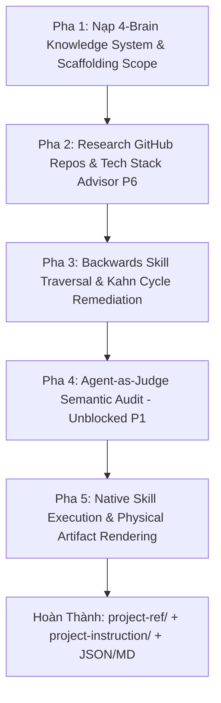

# 🛠️ Curriculum Agent OS — Execution Scripts & Pipeline CLI

> **Tài Liệu Hướng Dẫn Vận Hành Scripts & Ma Trận Tham Chiếu Kiến Trúc (v4.1 Orchable Unified)**  
> **Thư mục:** `/scripts/`  
> **Liên kết Kiến trúc Chính:**  
> - 📄 [**Product-First Adaptive Roadmap Architecture (v4.1)**](../docs/ideas/product-first-adaptive-roadmap-architecture.md)  
> - 📑 [**Gap Analysis & Engineering Execution Blueprint (v4.1)**](../docs/ideas/gap-analysis-and-product-first-blueprint.md)  
> - 🗺️ [**Adaptive Roadmap Generator Overview (v4.1)**](../docs/ideas/adaptive-roadmap-generator.md)

---

## 📌 TỔNG QUAN HỆ THỐNG SCRIPTS

Thư mục `/scripts/` chứa các công cụ CLI thực thi tất định và tự động hóa quy trình tạo Lộ trình học tập định hướng sản phẩm (Product-First Adaptive Roadmap Generator) dựa trên nền tảng **Knowledge Tree 6 tầng, Orchable 9-Step Multi-Agent Pipeline, và Prerequisite DAG**.

### 💻 Danh Mục Script Chính:

| Script File | Phiên Bản | Mô Tả Chức Năng | Output Artifacts |
| :--- | :---: | :--- | :--- |
| **`generate_project_driven_roadmap.py`** | **v4.1 Orchable Unified** | Trình tạo Lộ trình học Thích ứng Cá nhân hóa Ultimate. Chạy tự động 100% từ Bước 4 đến Bước 9, tích hợp native 31 Research Skills, kiểm tra chu trình Kahn, trace nguồn P3 và xuất dữ liệu phẳng cho `@dagrejs/dagre`. | `roadmap_graph.json`<br>`techstack_final.json`<br>`project-ref/`<br>`project-instruction/`<br>`*_roadmap.json`<br>`*_roadmap.md` |
| `generate_project_roadmap.py` | v2.0 | Script tạo lộ trình dự án phiên bản 2. | `*_roadmap.json` |
| `generate_adaptive_roadmap.py` | v1.0 | Script thử nghiệm lộ trình thích ứng ban đầu. | `*_roadmap.json` |

---

## 🚀 HƯỚNG DẪN SỬ DỤNG `generate_project_driven_roadmap.py`

### 1. Lệnh Thực Thi Cơ Bản:
```bash
# Thực thi với Mục tiêu Sản phẩm & Ngân sách thời gian
python3 scripts/generate_project_driven_roadmap.py \
  --goal "Build a Realtime iOS App with Swift" \
  --hours 10 \
  --weeks 8 \
  --level beginner \
  --age-group adult \
  --select-option 1
```

### 2. Các Tham Số CLI (`--flags`):
- `--goal` *(Bắt buộc)*: Yêu cầu sản phẩm hoặc mục tiêu học tập (ví dụ: `"Build a Realtime iOS App"`).
- `--known` *(Tùy chọn)*: Danh sách mã concept người học đã biết (dấu phẩy phân tách) để Pruning.
- `--hours` *(Mặc định: 10)*: Số giờ rảnh hàng tuần người học dành ra.
- `--weeks` *(Mặc định: 8)*: Tổng số tuần người học dự định hoàn thành.
- `--level` *(beginner | intermediate | advanced)*: Trình độ người học (Mặc định: `beginner` - tự động nối chuỗi Foundational Concepts).
- `--age-group` *(teen | young-adult | adult)*: Định cấu hình cửa sổ tập trung (Pomodoro 25m/35m/45m).
- `--select-option` *(Mặc định: 1)*: Chọn phương án dự án mẫu trong Kho Registry.

---

## 🔄 QUY TRÌNH VẬN HÀNH 5 PHA TRONG CODE (IMPLEMENTATION PIPELINE)

Script `generate_project_driven_roadmap.py` vận hành theo quy trình 5 Pha tự động hóa:



### Chi Tiết Kỹ Thuật Từng Pha:

1. **Pha 1: 4-Brain Reference Loader (`load_4brain_knowledge_references`)**  
   Nạp CSDL tri thức 6 tầng từ `mlo-knowlege-tree.tsv` và `master_tree.json` (269 Concepts, 156 LOs).
2. **Pha 2: Open-Source Project Research & Tech Stack Advisor (`research_real_world_projects`)**  
   Nạp từ kho local `curated_projects.json` (Cache-Hit 100%) hoặc gọi LLM research GitHub repo thật. Tính toán mâu thuẫn định lượng thời gian (P6) và xuất `techstack_final.json` kèm `tradeoffs_noted`.
3. **Pha 3: Backwards Skill Traversal & Kahn Cycle Remediation (`extract_project_skill_dag`)**  
   Nối chuỗi kiến thức nền tảng (Foundational Prepending). Chạy **Thuật toán Kahn BFS in-degree** để kiểm tra chu trình và tự động phá chu trình vi phạm dựa trên Quy tắc Tầng Tri thức ($ULO > CIO > SIO$).
4. **Pha 4: Agent-as-Judge Semantic Audit (`run_agent_as_judge_evaluation`)**  
   Thực thi Verifier tự động (P1). Đánh giá tính hợp lý sư phạm và chuẩn Marr T6 trong 2 giây mà không làm gián đoạn luồng người học.
5. **Pha 5: Physical Tree Scaffolding & Native Skill Execution (`generate_curriculum_os_artifacts`)**  
   Import và thực thi trực tiếp các tool scripts trong `.agents/skills/`:
   - `analyze_repo_structure.py`: Quét file tree và đếm LOC dự án.
   - `extract_dependencies.py`: Phát hiện system dependencies và ML frameworks.
   - `ref_numeric_values.py`: Kiểm định pattern trích dẫn số liệu.
   - `scan_instruction_source_tags()`: Hard Gate Scanner P3 kiểm tra 100% file `step-X.md` phải có Tag `[REF:]`.

---

## 📂 THƯ MỤC KẾT QUẢ ĐẦU RA (ARTIFACTS LAYOUT)

Mọi kết quả được xuất ra tại: `projects/swift-associate/.work/roadmaps/`

```text
projects/swift-associate/.work/roadmaps/
├── techstack_final.json                               # Chốt Tech Stack & Tradeoffs (Step 3)
├── roadmap_graph.json                                 # Graph phẳng cho @dagrejs/dagre & React Flow (Step 9)
├── stream_chat_swift__roadmap.json                    # Master System Payload (Supabase State PINNED_ACTIVE)
├── stream_chat_swift__roadmap.md                      # Waterfall Specification Document
├── project-ref/                                       # Thư mục Tài liệu Kỹ thuật Tham chiếu (Step 6)
│   ├── manifest.json                                  # Master Reference Manifest Index
│   ├── repos/stream_chat_swift.../
│   │   ├── manifest.json                              # github_research_manifest.json (Proof Tier 2)
│   │   └── notes.md                                   # Architecture Notes chi tiết (236 lines)
│   ├── docs/swift/
│   │   └── manifest.json                              # docs_research_manifest.json (Apple Official Docs)
│   └── proof-of-functionality/stream_chat_swift.../
│       └── build.log                                  # Log chạy Build & Smoke Test thật
└── project-instruction/                               # Thư mục Hướng dẫn Thi công Step-by-Step (Step 7)
    ├── phase-0/step-0.md                              # Setup Xcode & Git Repo (Tag INFRA_SETUP)
    ├── phase-1/step-1.md                              # Data Models & Codable Helpers
    ├── phase-2/step-2.md                              # WebSocket Transport Layer & Async Loop
    ├── phase-3/step-3.md                              # Combine State & CoreData Cache
    └── phase-4/step-4.md                              # SwiftUI Views & Integration Testing
```

---

## 🔗 MA TRẬN THAM CHIẾU TÀI LIỆU KIẾN TRÚC SÁT THỰC TẾ

Toàn bộ logic mã nguồn trong script này được xây dựng dựa trên 3 tài liệu kiến trúc đã được cập nhật v4.1 sát thực tế:

1. 📄 [**`docs/ideas/product-first-adaptive-roadmap-architecture.md`**](../docs/ideas/product-first-adaptive-roadmap-architecture.md)  
   - *Chương 3:* Quy trình Multi-Agent 9 Bước tự động hóa 100% từ Bước 4 đến 9.
   - *Chương 7:* Tiến trình con JIT Tree Expansion & Unblocked Step 8 Agent-as-Judge.
   - *Chương 12:* Tích hợp Thư viện 31 Agent Research Skills.
2. 📑 [**`docs/ideas/gap-analysis-and-product-first-blueprint.md`**](../docs/ideas/gap-analysis-and-product-first-blueprint.md)  
   - *Chương 1:* Tech Stack Advisor & Ghi vết `techstack_final.json`.
   - *Chương 4:* Thuật toán Kahn BFS Cycle Check & Precedence Remediation.
   - *Chương 7:* Proof of Functionality Tiers 1-3 & Fix-Loop Cap 3 attempts.
   - *Chương 10:* Schemas chuẩn cho `roadmap_graph.json` (@dagrejs/dagre layout).
3. 🗺️ [**`docs/ideas/adaptive-roadmap-generator.md`**](../docs/ideas/adaptive-roadmap-generator.md)  
   - Tổng quan triết lý sư phạm, 3 loại đồ thị (Taxonomy, Derivation, Prerequisite) và phân tầng cửa sổ tập trung theo độ tuổi.
